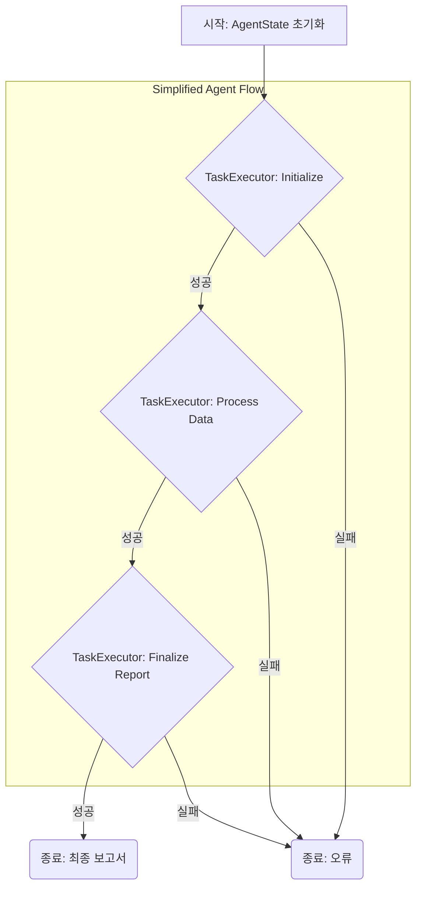

AI 에이전트 하네스(harness)는 에이전트의 로직, 상태 관리, 도구 사용을 오케스트레이션(orchestration)하는 핵심 구성 요소입니다. 그러나 LangGraph 도입 후 복잡성 증가 사례처럼, 프레임워크나 과도한 추상화는 의도치 않게 시스템을 복잡하게 만들 수 있습니다. 본 엔트리는 AI 에이전트 하네스의 설계 원칙을 재검토하고 간소화하여, 견고성과 유지보수성을 확보하는 방안을 제시합니다.

## 간소화된 AI 에이전트 하네스 설계 핵심 원칙

AI 에이전트 하네스의 불필요한 복잡성을 줄이기 위한 핵심 원칙들은 다음과 같습니다.

### 명시적인 상태 관리 (Explicit State Management)
에이전트의 현재 상태를 명확하게 정의하고, 각 단계에서 필요한 데이터를 투명하게 관리합니다. 전역 상태(global state)를 최소화하고, 특정 노드(node)나 함수(function)의 범위 내에서만 상태가 변경되도록 설계하여 예측 가능성을 높입니다.

### 단순한 흐름 제어 (Simple Flow Control)
복잡한 그래프나 체인 대신, 직관적이고 순차적인 흐름을 기본으로 합니다. 분기(branch)는 명확한 조건부 로직으로 구현하며, 불필요한 루프(loop)나 재귀(recursion)를 피합니다. 각 단계가 단일 책임 원칙(Single Responsibility Principle)을 따르도록 하여 흐름을 이해하기 쉽게 만듭니다.

### 최소한의 추상화 (Minimal Abstraction)
당장 필요하지 않은 범용적인 추상화 계층을 도입하지 않습니다. 프레임워크의 특정 기능이 아닌, 문제 해결에 직접적으로 필요한 핵심 로직에 집중합니다. 코드가 '왜' 이렇게 동작하는지 쉽게 파악할 수 있도록 가독성을 높입니다.

### 설계부터의 가시성 (Observability by Design)
각 에이전트 단계의 입력, 출력, 내부 상태 변화를 쉽게 로깅(logging)하고 모니터링할 수 있도록 설계합니다. 문제 발생 시 디버깅(debugging)이 용이하도록 하며, 에이전트의 동작 과정을 투명하게 공개합니다.

## 코드 예제: 간소화된 에이전트 태스크 실행기 (Python)

아래 Python 코드는 최소한의 추상화로 에이전트의 상태 관리와 태스크 실행 흐름을 제어하는 예시입니다.

```python
import json
import logging

logging.basicConfig(level=logging.INFO, format='%(levelname)s - %(message)s')

class AgentState:
    def __init__(self, data=None):
        self.data = data if data is not None else {}
    def get(self, key, default=None):
        return self.data.get(key, default)
    def update(self, key, value):
        self.data[key] = value
        logging.debug(f"State updated: {key}={value}")
    def to_json(self):
        return json.dumps(self.data, indent=2)

class TaskExecutor:
    def __init__(self, name, func):
        self.name = name
        self.func = func
    def execute(self, state: AgentState):
        logging.info(f"Executing task: {self.name}")
        try:
            result = self.func(state)
            if result:
                for k, v in result.items():
                    state.update(k, v)
            logging.info(f"Task '{self.name}' completed.")
            return True
        except Exception as e:
            logging.error(f"Task '{self.name}' failed: {e}")
            state.update(f"{self.name}_error", str(e))
            return False

def initialize_task(state: AgentState):
    if not state.get("initial_data"):
        state.update("initial_data", "Initial data payload")
    return {"status": "initialized"}

def process_data_task(state: AgentState):
    initial_data = state.get("initial_data")
    if initial_data:
        processed_data = f"Processed: {initial_data}"
        return {"processed_data": processed_data, "status": "processed"}
    return {"status": "skipped_processing"}

def finalize_report_task(state: AgentState):
    processed_data = state.get("processed_data")
    if processed_data:
        report = f"Final Report based on: {processed_data}"
        return {"final_report": report, "status": "report_generated"}
    return {"status": "skipped_report"}

def run_agent_flow():
    initial_state = AgentState({"request_id": "abc-123"})
    tasks = [
        TaskExecutor("Initialize", initialize_task),
        TaskExecutor("Process Data", process_data_task),
        TaskExecutor("Finalize Report", finalize_report_task)
    ]
    for task in tasks:
        if not task.execute(initial_state):
            logging.error(f"Flow aborted at '{task.name}'")
            break
        logging.info(f"State after '{task.name}': {initial_state.to_json()}")
    logging.info("Agent flow finished.")
    logging.info(f"Final State: {initial_state.to_json()}")

if __name__ == "__main__":
    run_agent_flow()
```

## 에이전트 흐름 다이어그램



## 2026년 트렌드 반영

2026년 AI 에이전트의 프로덕션 배포가 가속화되면서, 단순히 기능 구현을 넘어 **유지보수성(maintainability)**, **확장성(scalability)**, **비용 효율성(cost-efficiency)**이 더욱 중요해집니다. 간소화된 하네스 설계는 불필요한 복잡성으로 인한 디버깅 시간을 줄이고, 특정 프레임워크에 얽매이지 않아 기술 스택 변화에 유연하게 대응할 수 있게 합니다. 이는 빠른 실험(rapid experimentation)과 반복(iteration)을 가능하게 하여, 시장의 변화에 민첩하게 대응해야 하는 최신 AI 프로젝트에 필수적인 역량입니다. 또한, 각 컴포넌트의 책임을 명확히 함으로써, LLM(Large Language Model) 호출 비용 최적화(cost optimization)나 에이전트의 토큰 사용량 모니터링에도 유리한 구조를 제공합니다.

## 트레이드오프

### 개발 속도 및 디버깅 용이성
*   **언제 좋은가**: 소규모에서 중규모 프로젝트, 특정 프레임워크의 오버헤드가 부담스러운 경우, 빠른 프로토타이핑(prototyping)이 필요한 경우. 핵심 로직에 집중하여 문제 발생 시 원인 파악이 신속합니다.
*   **언제 나쁜가**: 매우 복잡하고 다양한 상태 전환 로직이 필요한 대규모 분산 에이전트 시스템에서는 boilerplate code가 증가하여 직접 관리하는 것이 더 복잡해질 수 있습니다.

### 기술 스택 유연성 및 의존성 감소
*   **언제 좋은가**: 특정 프레임워크에 락인(lock-in)되지 않아 장기적인 유지보수 및 기술 스택 전환에 유연합니다. 새로운 LLM이나 도구(tool)를 통합하기 쉽습니다.
*   **언제 나쁜가**: 프레임워크가 제공하는 '배터리 포함(batteries-included)' 기능을 포기해야 하므로, 인증(authentication), 로깅(logging), 모니터링(monitoring) 등 공통 기능에 대한 자체 구현 부담이 생길 수 있습니다.

### 성능 및 비용 효율성 제어
*   **언제 좋은가**: 불필요한 프레임워크 계층이 없어 오버헤드가 적고, 각 단계에서 LLM 호출 횟수나 컨텍스트(context) 사용량을 명확히 제어하여 비용을 최적화하기 용이합니다.
*   **언제 나쁜가**: 최적화되지 않은 직접 구현은 오히려 성능 저하를 야기할 수 있으며, 특히 병렬 처리(parallel processing)나 분산 환경에서의 최적화는 고도의 전문 지식을 요구할 수 있습니다.

## 실전 체크리스트

AI 에이전트 하네스 간소화 원칙을 프로젝트에 적용하기 위한 실전 체크리스트입니다.

*   - [ ] 현재 에이전트 하네스에 도입된 프레임워크 및 라이브러리 기능 중 실제 문제 해결에 필수적인 것만 남기고 불필요한 기능은 제거했는가?
*   - [ ] 각 에이전트 스텝의 입력과 출력이 명확하게 정의되었으며, 상태 변화가 예측 가능한가? (전역 상태 의존성 최소화)
*   - [ ] 에이전트의 주요 흐름이 시퀀셜 로직으로 이해하기 쉬우며, 복잡한 분기는 명시적인 조건문으로 처리되었는가?
*   - [ ] 에이전트 실행 중 각 스텝의 로깅(logging) 수준을 조정하여, 개발 및 프로덕션 환경에서 필요한 정보를 효율적으로 수집하는가? (가시성 확보)
*   - [ ] 신규 에이전트 스텝 추가 시, 기존 하네스 코드 수정 없이 독립적으로 추가/제거가 가능한 모듈성(modularity)을 확보했는가?
*   - [ ] 하네스의 핵심 로직이 특정 LLM 벤더(vendor)나 API에 강하게 종속되지 않도록 인터페이스(interface)가 분리되었는가?
*   - [ ] 에이전트 실패 시 재시도(retry) 로직 및 오류 처리(error handling) 메커니즘이 정의되었으며, 과도한 재시도로 인한 비용 발생을 방지하는가?