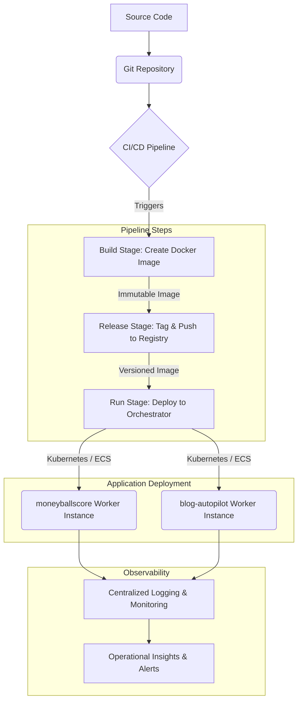

소프트웨어 개발 방법론으로서 12 Factor App 원칙은 SaaS(Software-as-a-Service) 애플리케이션을 이식성, 확장성, 지속적 배포가 용이하도록 설계하는 데 필수적인 가이드라인입니다. 2011년에 발표되었지만, 2026년 현재 클라우드 네이티브 환경과 복잡한 분산 시스템, 특히 Playbook 아키텍처 및 moneyballscore, blog-autopilot과 같은 워커(Worker) 연동 시스템에서 그 중요성이 더욱 부각되고 있습니다. 이 원칙들을 효과적으로 적용하면 개발과 운영의 격차를 줄이고, 팀의 생산성을 크게 향상시킬 수 있습니다. 특히 Configuration, Dependencies, Build/Release/Run Stages에 집중하여 이식성, 확장성, 지속적 배포 효율성을 향상시키는 방안을 모색합니다.

## 12 Factor App 핵심 원칙의 Playbook/워커 적용

### 1. 설정 (III. Configuration): 코드와 설정을 분리하라

애플리케이션의 설정(Configuration)은 코드와 엄격하게 분리되어야 합니다. Playbook 아키텍처에서 워커들은 데이터베이스 연결 문자열, API 키, 외부 서비스 엔드포인트 등 환경에 따라 달라지는 다양한 설정 값을 필요로 합니다. 이 값들을 코드 레포지토리에 직접 포함시키지 않고, 환경 변수(Environment Variables)나 중앙 집중식 Secret Management 솔루션(예: Vault, AWS Secrets Manager, GCP Secret Manager)을 통해 주입하는 것이 핵심입니다. 이를 통해 코드 변경 없이 다양한 환경(개발, 스테이징, 프로덕션)에 동일한 빌드 아티팩트를 배포할 수 있습니다.

예를 들어, moneyballscore 워커가 스포츠 데이터 API 키를 필요로 한다면, 이는 환경 변수로 주입됩니다.

```python
# moneyballscore_worker.py
import os

API_KEY = os.environ.get("SPORTS_API_KEY")
DATABASE_URL = os.environ.get("DATABASE_URL")

def fetch_data():
    if not API_KEY:
        raise ValueError("SPORTS_API_KEY environment variable not set.")
    # API 호출 로직
    print(f"Fetching data using API Key: {API_KEY[:5]}...")

def connect_db():
    if not DATABASE_URL:
        raise ValueError("DATABASE_URL environment variable not set.")
    # DB 연결 로직
    print(f"Connecting to database: {DATABASE_URL[:10]}...")

if __name__ == "__main__":
    fetch_data()
    connect_db()
```

이 접근 방식은 보안 강화에도 기여하며, 민감한 정보가 코드베이스에 노출되는 것을 방지합니다.

### 2. 의존성 (II. Dependencies): 의존성을 명시적으로 선언하고 격리하라

Playbook의 워커인 moneyballscore나 blog-autopilot은 특정 라이브러리나 패키지에 의존합니다. 모든 의존성은 `pyproject.toml` (Poetry 사용 시) 또는 `requirements.txt`와 같은 명시적인 매니페스트 파일에 선언되어야 하며, `pip install` 또는 `poetry install`과 같은 명령어를 통해 격리된 환경(예: Python `venv`, Docker 컨테이너)에 설치되어야 합니다. 이는 의존성 지옥(Dependency Hell)을 방지하고, 빌드 재현성을 보장합니다. 2026년에는 Docker와 같은 컨테이너 기술이 이러한 의존성 격리에 있어 표준 도구로 자리매김했습니다.

```toml
# pyproject.toml 예시
[tool.poetry]
name = "moneyballscore-worker"
version = "0.1.0"
description = "Moneyball Score Calculation Worker"
authors = ["Your Name <you@example.com>"]

[tool.poetry.dependencies]
python = "^3.9"
requests = "^2.28.1"
psycopg2-binary = "^2.9.3"
pydantic = "^1.10.0"

[build-system]
requires = ["poetry-core>=1.0.0"]
build-backend = "poetry.core.masonry.api"
```

### 3. 빌드, 릴리스, 실행 (V. Build, Release, Run): 빌드, 릴리스, 실행 단계를 엄격히 분리하라

이 원칙은 소프트웨어 딜리버리 파이프라인의 핵심입니다. Playbook 워커의 배포 과정은 세 가지 명확한 단계로 나뉩니다:

*   **빌드(Build) 단계**: 소스 코드와 의존성을 가져와 실행 가능한 빌드 아티팩트(예: Docker 이미지)를 생성합니다. 빌드 단계는 한 번만 수행되어야 합니다.
*   **릴리스(Release) 단계**: 빌드 단계에서 생성된 아티팩트에 특정 환경 설정을 적용하여 릴리스를 생성합니다. 각 릴리스는 고유한 ID(예: 타임스탬프, 커밋 해시)를 가지며 불변(immutable)해야 합니다. 이는 GitOps와 같은 현대적인 배포 전략과 잘 부합합니다.
*   **실행(Run) 단계**: 릴리스를 프로세스로 실행합니다. 이 단계에서는 런타임 환경에 릴리스를 배포하고 시작하는 것 외에는 어떠한 변경도 일어나지 않습니다.

이러한 분리는 CI/CD 파이프라인의 효율성과 신뢰성을 극대화합니다. 다음 Mermaid 다이어그램은 이 과정을 시각화합니다.



### 4. 프로세스 (VI. Processes): 애플리케이션을 하나 이상의 무상태(stateless) 프로세스로 실행하라

Playbook 워커(moneyballscore, blog-autopilot)는 어떠한 상태도 로컬 파일 시스템이나 메모리에 저장하지 않는 무상태(stateless) 프로세스로 설계되어야 합니다. 모든 영구적인 데이터는 데이터베이스(PostgreSQL, MongoDB), 캐시(Redis), 또는 클라우드 스토리지와 같은 백엔드 서비스에 저장되어야 합니다. 이는 워커 인스턴스의 장애 발생 시에도 데이터 손실 없이 즉시 교체될 수 있도록 하며, 수평적 확장(Horizontal Scaling)을 매우 용이하게 합니다. 예를 들어, moneyballscore 워커가 계산 결과를 로컬에 저장하는 대신, 즉시 DB에 기록해야 합니다.

### 5. 개발/운영 환경 일치 (X. Dev/Prod Parity): 개발, 스테이징, 프로덕션 환경을 최대한 비슷하게 유지하라

