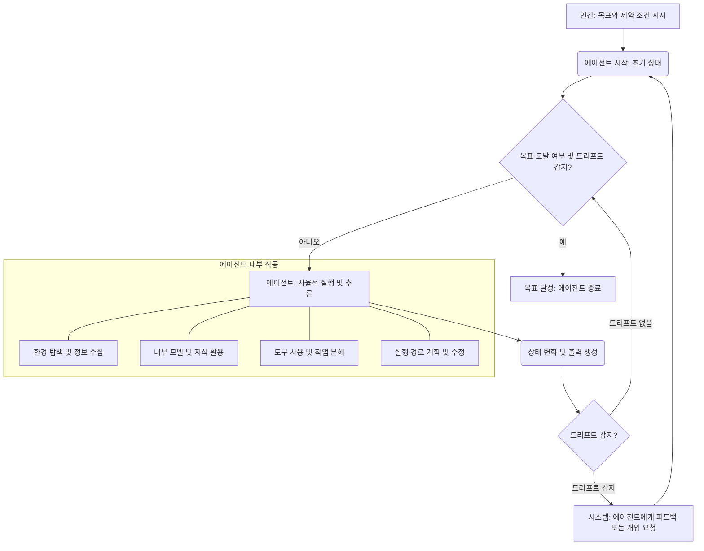

## 에이전트 자율성 강화: 계획 모드 탈피 및 목표 기반 지시

최근 LLM (Large Language Model)의 발전은 AI 에이전트 설계 패러다임에 근본적인 변화를 가져왔습니다. 과거에는 에이전트가 복잡한 작업을 수행하기 위해 인간이 상세한 단계별 '계획 (Plan)'을 수립하고 지시하는 방식이 일반적이었습니다. 하지만 2026년 현재, LLM은 코드 저장소를 탐색하고, 합리적인 가정을 세우며, 심지어 모호한 지시로부터 스스로 실행 경로를 도출하는 능력이 비약적으로 향상되었습니다. 이러한 변화는 에이전트에게 상세한 '계획' 대신 명확한 '목표'와 '제약 조건'만을 제공하고, 에이전트가 자체적으로 실행 방안을 탐색하도록 유도하는 '목표 기반 지시 (Goal-Based Directives)'의 중요성을 부각합니다.

### 목표 기반 지시의 이해

목표 기반 지시는 에이전트에게 달성해야 할 최종 상태(goal)와 그 과정에서 지켜야 할 규칙(constraints)을 명시적으로 전달하는 방식입니다. 이는 특정 단계나 도구 사용 순서를 강제하는 계획 모드와 대비됩니다. 에이전트는 부여된 목표를 달성하기 위해 내부적으로 추론하고, 사용 가능한 도구를 활용하며, 필요하다면 가정을 설정하여 최적의 경로를 찾아냅니다. 이는 에이전트의 자율성을 극대화하고, 예상치 못한 상황 변화에 유연하게 대응할 수 있게 합니다.

**핵심 요소:**

*   **명확한 목표 (Clear Goal):** 에이전트가 달성해야 할 최종 결과가 구체적이고 측정 가능해야 합니다.
*   **제약 조건 (Constraints):** 목표 달성 과정에서 허용되지 않는 행동, 반드시 지켜야 할 규칙, 자원 제한 등을 명시합니다.
*   **성공 기준 (Success Criteria):** 목표가 성공적으로 달성되었는지 판단할 명확한 기준을 제공하여 에이전트가 스스로 종료 시점을 판단하거나, 시스템이 평가할 수 있게 합니다.

### 드리프트 감지 (Drift Detection) 및 자율성 추적

에이전트에게 목표와 제약 조건을 부여하는 것만으로는 충분하지 않습니다. 에이전트가 목표에서 벗어나거나 (drift), 비효율적인 경로를 탐색할 때 이를 감지하고 개입할 수 있는 메커니즘이 필요합니다. '드리프트 감지'는 에이전트의 현재 상태, 진행 상황, 사용 중인 도구, 생성하는 출력 등을 지속적으로 모니터링하여 원래의 목표와 제약 조건으로부터 얼마나 벗어났는지를 판단하는 과정입니다.

드리프트가 감지되면, 시스템은 에이전트에게 피드백을 주어 경로를 수정하게 하거나, 더 나아가 인간의 개입을 요청할 수 있습니다. 이는 에이전트의 자율성을 보장하면서도 통제 불능 상태로 빠지는 것을 방지하는 중요한 안전 장치입니다.



### 파이썬 예제: 목표 기반 에이전트 지시 인터페이스

다음은 가상의 에이전트 시스템에서 목표와 제약 조건을 정의하고, 이를 에이전트에게 전달하는 간단한 파이썬 코드 예시입니다. `execute_goal` 함수는 내부적으로 에이전트 로직을 호출하고, `drift_detector`는 주기적으로 에이전트의 상태를 평가합니다.

```python
import time
from typing import List, Dict, Any, Callable

# 가상 에이전트 인터페이스
class AgentExecutor:
    def __init__(self, name: str):
        self.name = name
        self.current_state: Dict[str, Any] = {"status": "idle", "progress": 0, "output": None}
        self.history: List[Dict[str, Any]] = []

    def execute_step(self, instruction: str) -> bool:
        """에이전트가 한 단계 실행되는 것을 시뮬레이션합니다."""
        print(f"[{self.name}] Executing: {instruction}")
        # 실제 LLM 호출 및 도구 사용 로직이 여기에 들어갑니다.
        # 편의상 랜덤 지연 및 상태 업데이트를 사용합니다.
        time.sleep(0.5)
        
        self.current_state["progress"] += 10
        if self.current_state["progress"] >= 100:
            self.current_state["status"] = "completed"
            self.current_state["output"] = "Desired outcome achieved."
            return True
        
        self.history.append({"instruction": instruction, "state_after": self.current_state.copy()})
        return False

    def get_status(self) -> Dict[str, Any]:
        return self.current_state.copy()

def simple_drift_detector(goal: str, constraints: List[str], agent_state: Dict[str, Any]) -> bool:
    """
    주어진 목표와 제약 조건에 대해 에이전트의 현재 상태를 평가하여 드리프트 여부를 반환합니다.
    실제 구현에서는 LLM을 사용하여 semantic drift를 감지할 수 있습니다.
    """
    print(f"--- [Drift Detector] Checking agent status: {agent_state['status']}, progress: {agent_state['progress']}% ---")
    
    # 예시: 진행률이 0인데 너무 많은 단계를 거쳤거나, 특정 제약 조건을 위반했는지 확인
    if agent_state["progress"] < 10 and len(agent_state.get("history", [])) > 5:
        print("Warning: Low progress despite multiple steps. Potential drift!")
        return True
    
    # 예시: 특정 키워드가 출력에 없으면 드리프트로 간주 (실제는 LLM으로 정교하게 검사)
    if agent_state["output"] and "error" in agent_state["output"].lower():
        print("Error detected in agent output. Drift!")
        return True

    # 더 복잡한 로직: LLM에 'agent_state', 'goal', 'constraints'를 전달하여 평가
    # is_drifted = llm_judge(agent_state, goal, constraints)
    # return is_drifted
    
    return False

def execute_goal(agent: AgentExecutor, goal: str, constraints: List[str], max_steps: int = 20):
    print(f"\n--- Starting Agent: {agent.name} with Goal ---")
    print(f"Goal: {goal}")
    print(f"Constraints: {', '.join(constraints)}")

    steps_taken = 0
    while agent.get_status()["status"] != "completed" and steps_taken < max_steps:
        # 에이전트에게 다음 행동을 결정하도록 지시 (실제로는 LLM 프롬프트)
        # 이 예시에서는 단순화를 위해 임의의 "생각"을 지시로 전달합니다.
        instruction = f"Determine next best step to achieve '{goal}' considering {constraints}."
        
        if agent.execute_step(instruction):
            print(f"[{agent.name}] Goal completed!")
            break
        
        if simple_drift_detector(goal, constraints, agent.get_status()):
            print(f"[{agent.name}] Drift detected! Aborting or re-evaluating goal.")
            # 실제 시스템에서는 에이전트에게 수정 프롬프트를 보내거나,
            # 인간의 개입을 요청하는 등의 로직이 추가됩니다.
            break
        
        steps_taken += 1
        time.sleep(0.1) # 감지 주기

    print(f"--- Agent {agent.name} Finished. Final Status: {agent.get_status()} ---\n")

# 사용 예시
my_agent = AgentExecutor("Code Refactor Bot")
target_goal = "Refactor legacy authentication module to use OAuth 2.0 with minimal downtime."
strict_constraints = [
    "Do not introduce new external dependencies.",
    "Ensure all existing unit tests pass.",
    "Deployment must be blue/green, zero-downtime."
]

execute_goal(my_agent, target_goal, strict_constraints)

my_other_agent = AgentExecutor("Documentation Update Agent")
doc_goal = "Update API documentation for v2.1 to reflect new endpoint changes and add example requests."
doc_constraints = [
    "Use OpenAPI spec for examples.",
    "Maintain existing markdown formatting.",
    "Do not remove any existing documentation for v2.0."
]

execute_goal(my_other_agent, doc_goal, doc_constraints)
```

### 2026년 트렌드와 미래 전망

2026년에는 에이전트의 자체적인 지식 탐색 및 추론 능력이 더욱 고도화될 것으로 예상됩니다. 특히, 다음과 같은 트렌드가 목표 기반 지시 방식의 발전을 가속화할 것입니다.

*   **멀티모달 (Multimodal) 능력 강화:** 텍스트뿐만 아니라 이미지, 비디오, 음성 등 다양한 형태의 정보를 이해하고 활용하여 더욱 풍부한 컨텍스트에서 목표를 달성할 수 있게 됩니다.
*   **실시간 환경 적응 (Real-time Environmental Adaptation):** 동적으로 변화하는 외부 환경 정보(예: 시스템 로그, 사용자 피드백)를 실시간으로 학습하고 반영하여 실행 경로를 조정하는 능력이 중요해집니다.
*   **자율 학습 및 경험 축적 (Autonomous Learning & Experience Accumulation):** 성공 및 실패 경험을 바탕으로 내부 모델을 지속적으로 업데이트하고, 유사한 목표에 대한 성능을 향상시키는 메커니즘이 보편화될 것입니다. 이는 `agents/agent-rationale-storage-decision-learning-system`과 같은 패턴과 연결됩니다.

---

## 트레이드오프

이 목표 기반 지시 및 드리프트 감지 접근 방식은 강력하지만, 모든 상황에 최적은 아닙니다.

*   **높은 자율성 vs. 예측 불가능성:**
    *   **언제 좋음:** 복잡하고 예측 불가능한 환경에서 에이전트가 스스로 해결책을 찾아야 할 때 효율적입니다. 인간의 상세한 개입 없이도 새로운 문제에 적응하고 해결할 수 있습니다.
    *   **언제 나쁨:** 결과의 예측 가능성이 매우 중요하거나, 특정 안전 및 규제 표준을 엄격하게 준수해야 하는 미션 크리티컬한 작업에서는 에이전트의 자율적 행동이 의도치 않은 결과를 초래할 수 있습니다. 명확한 감사 추적(audit trail)이 필요한 경우에도 상세 계획이 유리합니다.

*   **낮은 인간 개입 vs. 디버깅 난이도:**
    *   **언제 좋음:** 반복적이고 루틴한 작업에서 인간의 개입을 최소화하여 생산성을 높일 수 있습니다. 에이전트 시스템 확장에 용이합니다.
    *   **언제 나쁨:** 에이전트가 실패했을 때, 그 원인을 파악하기가 어려울 수 있습니다. 에이전트의 내부 추론 과정이 불투명하여 문제 발생 시 디버깅에 더 많은 시간과 노력이 소요될 수 있습니다. `agents/autonomous-agent-reasoning-debugging-optimization`과 같은 도구가 필요합니다.

*   **유연한 적응 vs. 목표 모호성 위험:**
    *   **언제 좋음:** 목표가 추상적이고 달성 경로가 여러 가지일 수 있는 탐색적 작업에 적합합니다. 새로운 정보를 발견하고 그에 따라 전략을 변경해야 할 때 강점을 보입니다.
    *   **언제 나쁨:** 목표 정의가 모호하거나, 성공 기준이 불분명할 경우 에이전트가 의도와 다르게 작동하거나 무한 루프에 빠질 위험이 있습니다. 이 경우 `prompt-engineering/llm-prompt-optimization-role-definition-constraint-design`을 통해 목표를 명확히 해야 합니다.

*   **초기 설정 복잡성 vs. 장기적 효율성:**
    *   **언제 좋음:** 에이전트가 오랜 기간 반복적으로 유사한 문제를 해결해야 할 때, 초기 드리프트 감지 및 피드백 루프 설정에 투자하는 비용이 장기적으로 큰 효율성으로 돌아옵니다.
    *   **언제 나쁨:** 일회성 또는 단기적인 작업에는 초기 설정 및 검증에 필요한 오버헤드가 더 커서 비효율적일 수 있습니다. 간단한 스크립트나 명시적 계획이 더 빠를 수 있습니다.

---

## 실전 체크리스트

프로젝트에 에이전트의 계획 모드 탈피 및 목표 기반 지시를 적용할 때 다음 항목들을 검토해야 합니다.

*   [ ] **목표 명확성 검증:** 에이전트에게 부여될 목표가 구체적이고 측정 가능한 성공 기준을 포함하는지 확인합니다. (SMART 원칙: Specific, Measurable, Achievable, Relevant, Time-bound)
*   [ ] **제약 조건 정의:** 에이전트의 행동 범위와 안전을 위한 모든 제약 조건(예: 접근 권한, 리소스 사용량, 특정 API 호출 금지)이 명확하게 정의되어 프롬프트에 포함되었는지 확인합니다.
*   [ ] **드리프트 감지 메커니즘 구현:** 에이전트의 진행 상황을 주기적으로 모니터링하고, 목표에서 벗어나는 행동을 감지할 수 있는 시스템(예: LLM 기반 평가, 정규식 기반 로그 분석)을 구축했는지 확인합니다.
*   [ ] **피드백 및 자가 수정 루프 설계:** 드리프트 감지 시 에이전트에게 어떤 방식으로 피드백을 제공하고, 에이전트가 스스로 경로를 수정하거나 (self-correction), 필요 시 인간의 개입을 요청하는 워크플로가 마련되어 있는지 검토합니다.
*   [ ] **도구 접근성 및 사용 최적화:** 에이전트가 목표 달성에 필요한 모든 도구에 안전하고 효율적으로 접근하며, 각 도구의 사용법을 올바르게 이해하도록 프롬프트 엔지니어링이 되었는지 확인합니다.
*   [ ] **성능 및 비용 모니터링:** 에이전트의 목표 달성까지 걸리는 시간, 사용되는 토큰 수, API 호출 비용 등 핵심 성능 지표를 지속적으로 모니터링하고 최적화할 계획을 수립합니다.
*   [ ] **예외 처리 및 안전 장치:** 예상치 못한 오류, 무한 루프, 자원 고갈 등의 상황에 대비하여 에이전트가 안전하게 작업을 중단하거나 복구할 수 있는 비상 탈출 (escape hatch) 및 폴백 (fallback) 메커니즘을 설계했는지 확인합니다.