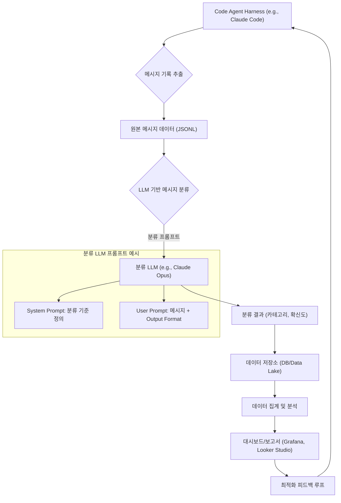

## 에이전트 메시지 분석 파이프라인 개요

AI 에이전트, 특히 코드 생성 및 디버깅을 수행하는 LLM 기반 에이전트의 활용이 증가하면서, 이들과의 상호작용 효율성을 측정하고 최적화하는 것이 중요해졌습니다. 에이전트에게 보내는 모든 메시지가 실제 가치 있는 작업으로 이어지는 것은 아니며, 상당 부분이 탐색, 디버깅, 혹은 비효율적인 시도에 소모될 수 있습니다. 본 문서는 에이전트와의 메시지 기록을 분석하여 실제 작업 기여도를 측정하고, 비효율적인 프롬프트 사용을 줄이는 파이프라인 구축 방안을 제시합니다.

### 왜 메시지 분석이 중요한가?

LLM 호출은 비용과 시간을 발생시킵니다. 에이전트가 생성하는 메시지 또는 에이전트에게 전달하는 프롬프트가 실제 문제 해결에 기여하는 정도를 파악하는 것은 다음과 같은 이점을 제공합니다:

*   **비용 최적화 (Cost Optimization)**: 불필요하거나 반복적인 호출을 줄여 LLM API 비용을 절감합니다.
*   **성능 향상 (Performance Improvement)**: 에이전트가 핵심 작업에 더 집중하도록 유도하여 전반적인 작업 속도를 높입니다.
*   **프롬프트 엔지니어링 개선 (Prompt Engineering Refinement)**: 어떤 유형의 프롬프트가 효과적인지, 어떤 프롬프트가 에이전트를 오도하는지 식별합니다.
*   **에이전트 행동 이해 (Agent Behavior Understanding)**: 에이전트가 문제에 접근하는 방식, 실패 패턴 등을 심층적으로 분석합니다.

### 분석 파이프라인 아키텍처

에이전트 메시지 분석 파이프라인은 주로 다음 단계로 구성됩니다:

1.  **메시지 기록 추출 (Message Log Extraction)**: Claude Code 하네스나 기타 에이전트 프레임워크에서 메시지 대화 기록을 추출합니다. 이는 JSON 또는 CSV 형태일 수 있습니다.
2.  **LLM 기반 분류 (LLM-based Classification)**: 추출된 메시지를 다른 LLM (예: Claude, Kimi)을 사용하여 미리 정의된 용도(예: `작업`, `디버깅`, `탐색`, `코드 생성`, `오류 처리`, `무의미`)로 분류합니다. 키워드 검색 방식보다 맥락을 이해하는 데 훨씬 효과적입니다.
3.  **데이터 저장 (Data Storage)**: 분류된 메시지와 메타데이터(타임스탬프, 에이전트 ID, 토큰 사용량 등)를 데이터베이스(예: PostgreSQL, MongoDB) 또는 데이터 레이크(예: S3, GCS)에 저장합니다.
4.  **분석 및 보고 (Analysis and Reporting)**: 저장된 데이터를 집계하여 시간 경과에 따른 작업 기여도, 비효율적인 메시지 유형, 특정 에이전트의 성능 등을 시각화하고 보고합니다.

다음은 파이프라인의 전반적인 흐름을 나타내는 Mermaid 다이어그램입니다:



### 실제 동작하는 코드 예제 (Python)

아래 Python 코드는 Claude Code 하네스에서 추출된 가상의 메시지 기록을 읽고, 다른 LLM API를 호출하여 메시지를 분류하는 과정을 보여줍니다. 실제 LLM API 호출은 `llm_classify_message` 함수 내에서 이루어집니다.

```python
import json
import os
from typing import List, Dict

# 가상의 LLM 클라이언트 (실제 구현 시 Anthropic, OpenAI 등의 SDK 사용)
class MockLLMClient:
    def __init__(self, model_name: str):
        self.model_name = model_name
        self.categories = [
            "작업", "디버깅", "탐색", "코드 생성", "오류 처리", "무의미", "피드백"
        ]
        self.category_map = {
            "code": "코드 생성",
            "debug": "디버깅",
            "error": "오류 처리",
            "explore": "탐색",
            "task": "작업",
            "useless": "무의미",
            "feedback": "피드백"
        }

    def classify(self, message_content: str) -> Dict[str, str]:
        # 실제 LLM 호출 로직 대신 모의 분류 수행
        # 실제 구현에서는 모델에 메시지 보내고 JSON 형식 응답 파싱
        # 예: Claude의 tool use, function calling과 유사한 방식
        if "import" in message_content or "def" in message_content:
            category = self.category_map["code"]
        elif "error" in message_content or "fail" in message_content:
            category = self.category_map["error"]
        elif "test" in message_content or "verify" in message_content:
            category = self.category_map["debug"]
        elif "how to" in message_content or "what is" in message_content:
            category = self.category_map["explore"]
        elif "refactor" in message_content or "implement" in message_content:
            category = self.category_map["task"]
        elif "thanks" in message_content or "good job" in message_content:
            category = self.category_map["feedback"]
        else:
            category = self.category_map["useless"]

        return {"category": category, "confidence": "high"} # 실제 LLM은 확신도도 반환 가능

def extract_messages_from_harness_log(log_filepath: str) -> List[Dict]:
    """가상의 Claude Code 하네스 로그 파일에서 메시지를 추출합니다."""
    messages = []
    try:
        with open(log_filepath, 'r', encoding='utf-8') as f:
            for line in f:
                message_data = json.loads(line.strip())
                if "message_content" in message_data:
                    messages.append({
                        "id": message_data.get("id"),
                        "timestamp": message_data.get("timestamp"),
                        "sender": message_data.get("sender"),
                        "content": message_data["message_content"],
                        "token_count": message_data.get("token_count", 0)
                    })
    except FileNotFoundError:
        print(f"Error: Log file not found at {log_filepath}")
    return messages

def run_analysis_pipeline(log_filepath: str, llm_client: MockLLMClient) -> List[Dict]:
    """메시지 분석 파이프라인을 실행합니다."""
    raw_messages = extract_messages_from_harness_log(log_filepath)
    classified_results = []

    for msg in raw_messages:
        classification = llm_client.classify(msg["content"])
        classified_msg = {
            **msg,
            "classified_category": classification["category"],
            "classification_confidence": classification["confidence"]
        }
        classified_results.append(classified_msg)
        print(f"[ID: {msg['id']}] Category: {classification['category']} - Content: {msg['content'][:50]}...")
    
    # 실제로는 이 결과를 데이터베이스에 저장하거나 후속 분석 시스템으로 전달
    # print("\n--- Analysis Results ---")
    # for res in classified_results:
    #     print(json.dumps(res, indent=2))

    return classified_results

if __name__ == "__main__":
    # 가상의 로그 파일 생성
    dummy_log_data = [
        {"id": "msg-001", "timestamp": "2026-07-20T10:00:00Z", "sender": "user", "message_content": "새로운 사용자 인증 모듈을 구현해줘.", "token_count": 15},
        {"id": "msg-002", "timestamp": "2026-07-20T10:01:00Z", "sender": "agent", "message_content": "```python\ndef authenticate(user, pass):\n  # ...\n```", "token_count": 50},
        {"id": "msg-003", "timestamp": "2026-07-20T10:02:00Z", "sender": "user", "message_content": "이 코드에 NullPointerException이 발생하는데 왜 그런지 분석해줘.", "token_count": 25},
        {"id": "msg-004", "timestamp": "2026-07-20T10:03:00Z", "sender": "agent", "message_content": "Error: Invalid input format. Please check the API documentation.", "token_count": 30},
        {"id": "msg-005", "timestamp": "2026-07-20T10:04:00Z", "sender": "user", "message_content": "Python에서 비동기 프로그래밍은 어떻게 하는 거야?", "token_count": 20},
        {"id": "msg-006", "timestamp": "2026-07-20T10:05:00Z", "sender": "agent", "message_content": "음... 알겠습니다.", "token_count": 5}
    ]
    log_filename = "agent_messages_202607.jsonl"
    with open(log_filename, 'w', encoding='utf-8') as f:
        for entry in dummy_log_data:
            f.write(json.dumps(entry) + "\n")

    # LLM 클라이언트 초기화
    llm_classifier = MockLLMClient(model_name="Claude Opus 2026")

    # 파이프라인 실행
    analysis_results = run_analysis_pipeline(log_filename, llm_classifier)

    # 생성된 가상 로그 파일 삭제
    os.remove(log_filename)
```

### 2026년 트렌드 반영

2026년의 AI 에이전트 환경에서는 다음과 같은 트렌드가 분석 파이프라인 구축에 영향을 미칩니다:

*   **멀티모달 에이전트의 부상 (Rise of Multimodal Agents)**: 텍스트 외에 이미지, 음성 등 다양한 입력/출력을 처리하는 에이전트가 증가하면서, 메시지 분석은 단순 텍스트 분류를 넘어 멀티모달 콘텐츠 분석으로 확장될 것입니다.
*   **온디바이스 LLM 및 엣지 컴퓨팅 (On-device LLMs & Edge Computing)**: 로컬에서 실행되는 소형 LLM이 늘어나면서, 메시지 분류를 위한 LLM 호출을 엣지 환경에서 수행하여 지연 시간과 비용을 줄이는 시도가 활발해질 것입니다.
*   **자동화된 피드백 루프 (Automated Feedback Loops)**: 분석 결과를 바탕으로 에이전트의 프롬프트, 도구 사용 방식, 내부 추론 로직을 자동으로 개선하는 폐쇄 루프 시스템(Closed-loop system)이 고도화될 것입니다. 이는 에이전트의 자기 개선(Self-improvement) 능력과 직결됩니다.
*   **비용 효율성 및 거버넌스 강화 (Cost Efficiency & Governance)**: LLM 사용 비용에 대한 기업의 관심이 증대하면서, 토큰 사용량, API 호출 빈도, 작업 기여도를 실시간으로 모니터링하고 보고하는 기능이 더욱 중요해질 것입니다.

## 트레이드오프

에이전트 메시지 분석 파이프라인을 구축할 때 고려해야 할 트레이드오프는 다음과 같습니다.

*   **LLM 분류 정확도 vs. 비용 및 지연 시간**
    *   **언제 좋은가 (When Good)**: 높은 정확도가 필수적인 미묘한 메시지 분류(예: 복잡한 감성 분석, 의도 파악)에는 대형/고성능 LLM을 사용하는 것이 유리합니다. 초기 에이전트 행동 탐색 단계에서 상세한 인사이트가 필요할 때도 좋습니다.
    *   **언제 나쁜가 (When Bad)**: 대량의 메시지를 실시간에 가깝게 처리해야 하거나, 분류 카테고리가 명확하여 경량 모델로도 충분한 경우, 고성능 LLM은 불필요한 비용과 지연 시간을 야기합니다.

*   **분석 세분성(Granularity) vs. 구현 복잡성**
    *   **언제 좋은가 (When Good)**: 에이전트의 미세한 행동 패턴이나 특정 버그 발생 원인을 심층적으로 파악해야 할 때(예: 디버깅 과정 분석), 매우 세분화된 분류 카테고리와 상세한 메타데이터(예: 스택 트레이스 포함 여부)를 수집하는 것이 효과적입니다.
    *   **언제 나쁜가 (When Bad)**: 초기 단계에서 전반적인 효율성 지표를 빠르게 확인하거나, 리소스가 제한적인 경우(예: POC 단계), 과도한 세분성은 파이프라인 구축 및 유지보수의 복잡성만 증가시키고 가치 대비 비용 효율이 떨어집니다.

*   **자동화된 분석 vs. 수동 검토 및 레이블링**
    *   **언제 좋은가 (When Good)**: 반복적이고 대량의 메시지 처리가 필요하며, LLM 분류 모델의 신뢰도가 충분히 높은 경우 자동화된 분석이 효율적입니다. 대시보드를 통한 상시 모니터링에 적합합니다.
    *   **언제 나쁜가 (When Bad)**: LLM 분류 모델이 초기 단계이거나, 분류하기 어려운 모호한 메시지가 많아 LLM의 판단을 신뢰하기 어려운 경우, 또는 중요한 결정에 영향을 미치는 메시지에 대해서는 인간 전문가의 수동 검토와 레이블링이 병행되어야 합니다.

*   **실시간 처리 vs. 배치 처리**
    *   **언제 좋은가 (When Good)**: 에이전트의 runaway cost를 즉시 감지하거나, 사용자 경험에 직접적인 영향을 미치는 에이전트의 오작동을 실시간으로 파악해야 할 때(예: 금융 거래 에이전트)는 실시간 스트리밍 처리가 필수적입니다.
    *   **언제 나쁜가 (When Bad)**: 주간/월간 보고서 생성 등 주기적인 분석으로 충분하거나, 대규모 과거 데이터를 효율적으로 처리해야 할 때는 배치 처리가 자원 활용 측면에서 더 유리합니다.

## 실전 체크리스트

에이전트 메시지 분석 파이프라인을 프로젝트에 적용할 때 다음 항목들을 검증하십시오.

*   [ ] **메시지 기록 추출의 완전성 확인**: 모든 에이전트와 LLM 상호작용 메시지가 누락 없이 추출되고 있는지 검증합니다. (예: `log_count` == `api_call_count`)
*   [ ] **LLM 분류 모델의 정확도 측정**: 수동으로 레이블링된 샘플 데이터셋을 사용하여 LLM 분류 모델의 F1-Score 또는 정확도를 측정하고, 최소 `85%` 이상의 목표치를 설정합니다.
*   [ ] **분류 카테고리의 실용성 검증**: 정의된 메시지 분류 카테고리가 실제 에이전트의 행동을 명확하게 설명하고, 비효율적인 부분을 식별하는 데 유용한지 이해관계자와 함께 검토합니다.
*   [ ] **토큰 사용량 및 비용 모니터링 연동**: 각 메시지 분류별 토큰 사용량과 예상 비용을 집계하고, 주간 `LLM Cost Report`에 반영하여 비용 효율성 지표를 추적합니다.
*   [ ] **분석 결과 기반의 개선 액션 항목 도출**: 파이프라인에서 생성된 비효율성 보고서가 구체적인 프롬프트 개선, 에이전트 로직 수정, 혹은 도구 활용 전략 변경 등 실행 가능한 액션 항목으로 이어지는지 확인합니다.
*   [ ] **데이터 개인정보 보호 및 보안 규정 준수**: 메시지 기록에 포함될 수 있는 민감한 정보(PII)에 대한 마스킹 또는 필터링 처리가 적절하게 이루어지고, 관련 데이터 보호 규정을 준수하는지 점검합니다.
*   [ ] **대시보드 및 알림 시스템 구축**: 주요 지표(예: `작업 기여도 하락`, `오류 처리 증가`)에 대한 시각화 대시보드를 구축하고, 이상 징후 발생 시 담당자에게 자동 알림을 전송하는 시스템을 마련합니다.