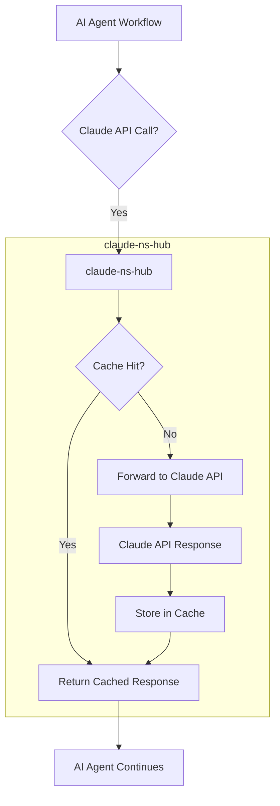

AI 코딩 에이전트의 활용이 증가함에 따라 Claude API 호출 비용이 예측 불가능하게 증가하는 문제는 많은 조직이 직면한 현실입니다. 특히, 반복적인 컨텍스트 전송이나 이미 처리된 결정을 재추론하는 과정에서 발생하는 불필요한 토큰 낭비는 월별 청구서의 상당 부분을 차지합니다. 내부 분석에 따르면 전체 토큰 사용량 중 실제 코드 생산에 기여하는 비율은 약 2%에 불과하며, 대부분의 토큰은 동일한 컨텍스트를 재적재하거나 사라진 결정을 다시 추론하는 데 소모됩니다. 이러한 비효율성을 해결하고 Claude API 비용을 최적화하기 위해 고안된 오픈 소스 솔루션이 바로 `claude-ns-hub`입니다.

## `claude-ns-hub`의 필요성 및 핵심 원리

`claude-ns-hub`는 Claude Code 하네스를 사용하는 워크플로우에 연동되어 불필요한 토큰 낭비를 줄이고 API 호출 비용을 절감하는 데 초점을 맞춥니다. 이 허브의 핵심 원리는 '네임스페이스 기반 컨텍스트 캐싱'과 '의미론적 중복 제거'입니다. AI 에이전트가 특정 작업 컨텍스트 내에서 반복적으로 유사한 정보를 요청하거나, 이전에 제공된 정보를 다시 전송하는 경우, `claude-ns-hub`는 이를 인지하고 캐시된 응답을 제공함으로써 실제 Claude API 호출을 최소화합니다.

### 컨텍스트 관리 및 캐싱 전략

`claude-ns-hub`는 API 요청과 응답 사이에서 미들웨어 역할을 수행합니다. 모든 API 호출이 허브를 통해 라우팅되며, 허브는 전송되는 프롬프트의 내용을 분석하여 기존 캐시 엔트리와 비교합니다. 만약 동일하거나 충분히 유사한 컨텍스트가 이전에 처리된 적이 있다면, 허브는 저장된 응답을 즉시 반환하여 토큰 소비를 방지하고 응답 시간을 단축합니다. 이 과정에서 각 에이전트 또는 워크플로우에 고유한 네임스페이스를 부여하여 캐시 오염을 방지하고 컨텍스트의 독립성을 유지합니다.



위 다이어그램은 `claude-ns-hub`의 기본적인 동작 흐름을 보여줍니다. AI 에이전트가 Claude API를 호출하면, 요청은 먼저 `claude-ns-hub`를 거치게 됩니다. 허브는 캐시를 확인하여 이전에 처리된 유사한 요청이 있는지 검사합니다. 캐시 히트(Cache Hit)가 발생하면 즉시 캐시된 응답을 반환하여 실제 API 호출을 생략하고 비용과 시간을 절약합니다. 캐시 미스(Cache Miss)의 경우, 요청은 Claude API로 전달되고, 응답이 돌아오면 캐시에 저장된 후 에이전트에게 전달됩니다.

### `claude-ns-hub` 연동 예시 (Python)

Claude Python SDK를 사용하는 환경에서 `claude-ns-hub`를 연동하는 기본적인 예시는 다음과 같습니다. 실제 `claude-ns-hub`의 구현 방식에 따라 프록시 설정 또는 SDK 래핑 형태로 통합될 수 있습니다. 여기서는 개념적인 연동 흐름을 보여줍니다.

```python
# pseudo-code, actual implementation may vary based on claude-ns-hub specifics
import os
from anthropic import Anthropic
from claude_ns_hub_client import ClaudeNsHubClient # Assuming a client library

# 1. Initialize Claude API Client (or your existing harness client)
#    This client would typically be configured to point to claude-ns-hub's endpoint
#    instead of the direct Claude API endpoint.
#    For demonstration, let's assume ClaudeNsHubClient wraps Anthropic client.

claude_client_direct = Anthropic(api_key=os.environ.get("ANTHROPIC_API_KEY"))

# 2. Initialize claude-ns-hub client with the direct Claude client as backend
#    The hub would manage caching and potentially rate limiting before calling the backend.
ns_hub = ClaudeNsHubClient(
    backend_client=claude_client_direct,
    cache_strategy="lru", # Example: Least Recently Used
    namespace="my-coding-agent-v1"
)

# 3. Use the ns_hub client for your API calls
def generate_code_with_hub(prompt: str, system_message: str):
    try:
        response = ns_hub.messages.create(
            model="claude-3-opus-20240229",
            max_tokens=1024,
            messages=[
                {"role": "user", "content": prompt}
            ],
            system=system_message
        )
        return response.content[0].text
    except Exception as e:
        print(f"Error generating code: {e}")
        return None

# Example usage within an agent workflow
agent_system_message = "You are an expert Python developer."

# First call - likely a cache miss, hits Claude API
code_snippet_1 = generate_code_with_hub(
    "Create a Python function to calculate Fibonacci sequence up to N.",
    agent_system_message
)
print(f"Generated Code 1:\n{code_snippet_1}\n")

# Second call with very similar prompt - potentially a cache hit
code_snippet_2 = generate_code_with_hub(
    "Write a Python function to compute the Fibonacci series until a given number N.",
    agent_system_message
)
print(f"Generated Code 2:\n{code_snippet_2}\n")

# Third call with different context - likely a cache miss
code_snippet_3 = generate_code_with_hub(
    "Implement a REST API endpoint for user registration using Flask.",
    agent_system_message
)
print(f"Generated Code 3:\n{code_snippet_3}\n")

# In a real scenario, the hub would report cache hit/miss statistics.
```

이 예시는 `claude-ns-hub`가 `Anthropic` 클라이언트를 래핑하여 프롬프트 호출을 가로채고 캐싱 로직을 적용하는 방식을 시뮬레이션합니다. 동일한 `namespace` 내에서 유사한 프롬프트가 반복될 경우, `claude-ns-hub`는 실제 API 호출 없이 캐시된 결과를 반환하여 비용을 절감합니다.

## 2026년 트렌드와 `claude-ns-hub`의 역할

2026년에는 AI 에이전트의 자율성과 복잡성이 더욱 심화될 것으로 예상됩니다. 다양한 툴을 사용하고 장기적인 목표를 수행하는 멀티 에이전트 시스템이 보편화되면서, 각 에이전트의 개별 API 호출 비용 관리의 중요성은 더욱 증대될 것입니다. `claude-ns-hub`와 같은 솔루션은 이러한 환경에서 다음과 같은 중요한 역할을 수행합니다:

*   **미세한 비용 최적화**: 에이전트의 내부 의사결정 과정에서 발생하는 미세한 컨텍스트 중복까지 잡아내어 비용을 절감합니다.
*   **성능 일관성 유지**: 캐시된 응답으로 인해 예측 가능한 응답 시간을 제공하여 에이전트 워크플로우의 안정성을 높입니다.
*   **자원 관리 추상화**: 개발자는 비용 최적화 로직에 직접 관여하지 않고, `claude-ns-hub`에 의존하여 토큰 사용량을 효율적으로 관리할 수 있습니다.
*   **개발 생산성 향상**: 비용 부담 없이 에이전트의 다양한 실험과 반복 작업을 수행할 수 있는 환경을 제공합니다.

## 트레이드오프

`claude-ns-hub` 도입은 비용 최적화에 강력한 이점을 제공하지만, 몇 가지 트레이드오프를 고려해야 합니다.

*   **초기 설정 및 관리 오버헤드**: `claude-ns-hub`를 배포하고 기존 워크플로우에 연동하는 데 초기 시간과 리소스가 소요됩니다. 캐시 전략(LRU, TTL 등)을 수립하고 모니터링 시스템을 구축하는 과정이 필요합니다. 
    *   언제 좋은가: 장기적으로 상당한 API 비용 절감이 예상되거나, 대규모 에이전트 시스템을 운영할 경우. 
    *   언제 나쁜가: 소규모, 일회성 프로젝트 또는 API 호출 빈도가 매우 낮아 비용 최적화의 효과가 미미할 경우.

*   **캐시 무효화 복잡성**: 컨텍스트가 자주 변경되거나 시간에 따라 민감한 정보를 다루는 경우, 캐시된 응답이 stale data가 될 위험이 있습니다. 적절한 캐시 무효화 전략이 없다면 에이전트의 잘못된 결정을 초래할 수 있습니다. 
    *   언제 좋은가: 컨텍스트의 대부분이 비교적 정적이거나, 최신 정보 요구사항이 낮은 에이전트 워크플로우. 
    *   언제 나쁜가: 실시간 데이터 또는 동적으로 변화하는 코드베이스를 기반으로 하는 에이전트처럼 최신 정보가 필수적인 경우.

*   **메모리/저장 공간 요구사항**: 캐시 데이터는 메모리나 영구 저장소에 저장되므로, 캐시 크기가 커질수록 더 많은 자원을 요구합니다. 이는 추가적인 인프라 비용으로 이어질 수 있습니다. 
    *   언제 좋은가: 캐시되는 컨텍스트의 평균 크기가 작고, 중복 요청이 많아 캐시 히트율이 높은 경우. 
    *   언제 나쁜가: 캐시되는 컨텍스트의 크기가 매우 크거나, 캐시 히트율이 낮아 대부분의 캐시가 낭비될 경우.

*   **추가적인 지연 시간 (Latency) 발생 가능성**: 캐시 미스 발생 시, `claude-ns-hub`의 내부 로직 처리와 실제 Claude API 호출까지의 라우팅 과정에서 미미한 지연 시간이 추가될 수 있습니다. 
    *   언제 좋은가: 캐시 히트율이 높아 전반적인 응답 시간이 단축되는 효과가 지연 시간 증가를 상회할 경우. 
    *   언제 나쁜가: 밀리초 단위의 낮은 Latency가 중요한 실시간 에이전트 애플리케이션에서 캐시 미스율이 높은 경우.

*   **단일 실패 지점 (Single Point of Failure)**: `claude-ns-hub` 자체에 문제가 발생하면, 이를 통해 라우팅되는 모든 Claude API 호출에 영향을 미쳐 에이전트 워크플로우 전체가 중단될 수 있습니다. 
    *   언제 좋은가: 허브의 고가용성(High Availability) 및 장애 복구(Disaster Recovery) 전략이 잘 구축되어 있을 경우. 
    *   언제 나쁜가: 허브가 단일 인스턴스로 운영되거나, 안정성 확보에 대한 충분한 투자가 이루어지지 않았을 경우.

## 실전 체크리스트

`claude-ns-hub`를 프로젝트에 성공적으로 도입하고 비용 최적화 효과를 극대화하기 위한 실전 체크리스트입니다.

- [ ] **API 토큰 사용량 Baseline 측정**: `claude-ns-hub` 연동 전후의 Claude API 토큰 사용량(입력/출력)을 정확히 측정하고 비교할 수 있는 모니터링 시스템을 구축했는가?
- [ ] **캐싱 전략 수립 및 적용**: 프로젝트의 특성(컨텍스트 변화 빈도, 중요도)에 맞는 캐싱 전략(예: LRU, TTL, LFU)을 수립하고 `claude-ns-hub`에 정확히 적용했는가?
- [ ] **캐시 히트율(Cache Hit Ratio) 모니터링**: `claude-ns-hub`의 캐시 히트율을 실시간으로 모니터링하고, 목표 히트율을 달성하고 있는지 주기적으로 검토하는 대시보드를 구축했는가?
- [ ] **컨텍스트 변경 감지 및 캐시 무효화**: 에이전트 워크플로우 내에서 컨텍스트가 변경되는 패턴을 식별하고, 이에 따라 캐시를 적절히 무효화하는 로직을 구현 및 테스트했는가?
- [ ] **지연 시간(Latency) 변화 분석**: `claude-ns-hub` 도입으로 인한 API 호출의 평균 및 최대 지연 시간 변화를 분석하여, 에이전트의 전반적인 성능에 미치는 영향을 평가했는가?
- [ ] **프로덕션 환경 안정성 및 확장성 검증**: 프로덕션 환경에서 `claude-ns-hub`의 고가용성, 내결함성, 그리고 부하에 따른 확장성(scaling)을 충분히 검증했는가?
- [ ] **에이전트 워크플로우 내 중복 컨텍스트 패턴 식별**: 현재 AI 에이전트 워크플로우에서 반복적으로 전송되는 불필요한 컨텍스트(코드 스니펫, 이전 대화 기록 등) 패턴을 구체적으로 식별하고, `claude-ns-hub`가 이를 효과적으로 처리할 수 있도록 설계했는가?
