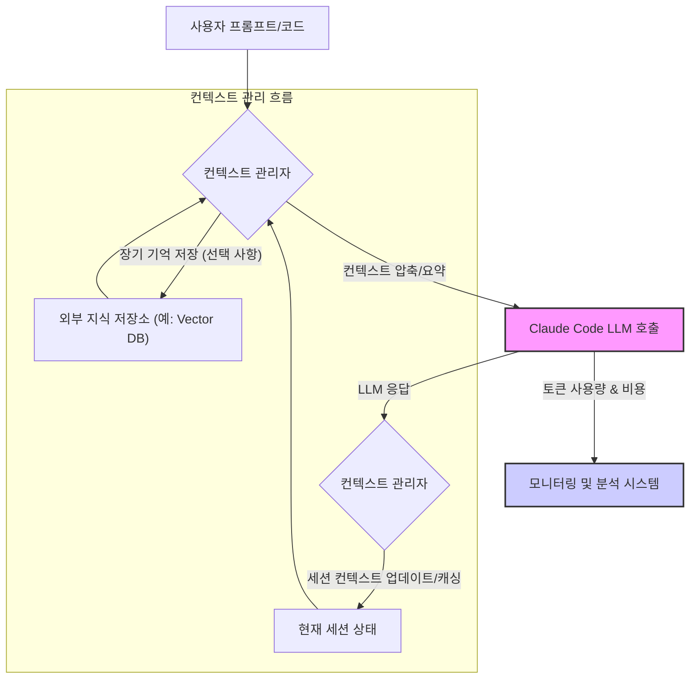

Claude Code와 같은 대규모 언어 모델(LLM) 기반의 코드 세션에서 비용 효율성과 성능을 극대화하기 위해서는 컨텍스트 최적화가 필수적입니다. Claude Code는 동일한 작업이라도 컨텍스트 크기, 유지 턴(turn) 수, 병렬 컨텍스트 수에 따라 토큰 사용량이 크게 달라지며, 이는 곧 직결되는 비용 문제로 이어집니다. 특히 출력 토큰은 입력 토큰보다 약 5배 가량 비싸기 때문에, 불필요한 정보가 세션에 누적되지 않도록 적극적으로 관리해야 합니다. 본 엔트리에서는 Claude Code 세션의 가치를 극대화하기 위한 컨텍스트 관리 전략을 제시합니다.

## Claude Code 세션 컨텍스트 이해

Claude Code 세션은 LLM과의 대화 흐름을 유지하기 위한 모든 정보를 포함합니다. 여기에는 이전 프롬프트, 모델의 응답, 코드 스니펫, 에러 메시지, 파일 내용 등이 포함될 수 있습니다. 이러한 컨텍스트는 모델이 현재 요청을 이해하고 적절한 응답을 생성하는 데 중요하지만, 과도하게 커지면 다음과 같은 문제를 야기합니다:

*   **비용 증가**: 더 많은 토큰이 사용될수록 API 호출 비용이 상승합니다.
*   **응답 시간 지연**: 컨텍스트가 길어질수록 모델의 처리 시간이 길어져 응답 대기 시간이 늘어납니다.
*   **성능 저하 및 환각(Hallucination) 위험**: 관련 없는 정보가 많아질수록 모델이 핵심을 파악하기 어려워지고, 잘못된 추론을 하거나 환각을 생성할 가능성이 높아집니다.

## 핵심 최적화 전략

### 1. 컨텍스트 컴팩션 및 요약 (Context Compaction & Summarization)

세션에 모든 대화 내용을 그대로 유지하는 대신, 중요한 정보만 남기고 불필요한 부분은 제거하거나 요약하는 전략입니다. 이는 특히 긴 코드 파일이나 복잡한 논의에서 효과적입니다.

*   **Diff 기반 컨텍스트 유지**: 코드 변경 사항을 적용할 때 전체 파일 대신 `git diff`와 유사하게 변경된 부분만 컨텍스트에 포함합니다.
*   **관련 섹션 추출**: 특정 작업에 필요한 코드 스니펫, 함수 정의, 클래스 구조 등 가장 직접적인 부분만 포함합니다.
*   **대화 요약**: 이전의 장황한 논의를 핵심 결정 사항이나 문제 정의로 압축하여 다음 턴에 전달합니다. 예를 들어, `agentic-context-compaction-commit-density-survival` 패턴을 참고하여 토큰 밀도를 최적화할 수 있습니다.

### 2. 턴(Turn) 및 병렬 컨텍스트 관리

세션의 턴 수와 병렬 컨텍스트 활용 방식도 토큰 사용량에 큰 영향을 미칩니다.

*   **에페메라(Ephemeral) 컨텍스트 활용**: 단기적인 작업에는 필요한 정보만 포함하고, 작업 완료 후 컨텍스트를 초기화하여 불필요한 누적을 방지합니다.
*   **병렬 컨텍스트 효율화**: 여러 작업을 동시에 처리할 경우, 각 병렬 컨텍스트가 독립적으로 최소한의 정보를 유지하도록 설계합니다. 이는 `ai-agent-context-window-optimization-session-longevity`와 같은 원칙과도 일맥상통합니다.
*   **세션 분리**: 완전히 독립적인 작업은 별도의 Claude Code 세션으로 분리하여 컨텍스트 오염을 방지하고 비용을 격리합니다.

### 3. 프롬프트 캐싱 (Prompt Caching)

자주 사용되는 프롬프트나 동일한 입력에 대해 이전에 생성된 결과를 캐시하여 중복 호출을 줄이는 전략입니다. 이는 `llm-prompt-caching-cost-optimization-patterns`에서 상세히 다루는 접근 방식입니다.

*   **Deterministic Outputs**: 동일한 입력에 대해 항상 동일한 또는 매우 유사한 출력을 기대할 수 있는 경우 효과적입니다.
*   **Semantic Caching**: 단순히 문자열 일치가 아닌, 의미론적으로 유사한 프롬프트에 대해서도 캐시된 결과를 활용합니다.

```python
import anthropic
import hashlib
import json

class ClaudeCodeSessionOptimizer:
    def __init__(self, api_key, cache_enabled=True):
        self.client = anthropic.Anthropic(api_key=api_key)
        self.session_context = []
        self.cache_enabled = cache_enabled
        self.prompt_cache = {}

    def _generate_cache_key(self, prompt, model):
        # 간단한 캐시 키 생성. 실제 프로덕션에서는 더 정교한 해싱 필요
        return hashlib.sha256(f"{prompt}{model}".encode('utf-8')).hexdigest()

    def _add_to_context(self, role, content, max_tokens=1000):
        # 컨텍스트에 메시지 추가 및 최대 토큰 제한 적용
        # 실제로는 토큰 수를 정확히 계산하여 자르는 로직 필요
        message_tokens = len(content.split())
        if message_tokens > max_tokens:
            content = self._summarize_content(content, max_tokens)
        self.session_context.append({"role": role, "content": content})
        self._prune_context_if_needed()

    def _summarize_content(self, content, max_tokens):
        # LLM을 사용하여 컨텍스트 요약 (재귀적 호출 위험 있으니 주의)
        # 여기서는 간단히 잘라내지만, 실제로는 요약 모델 호출
        return " ".join(content.split()[:max_tokens // 2]) + "... [Summarized]"

    def _prune_context_if_needed(self, max_context_items=5):
        # 오래된 컨텍스트 제거 로직 (가장 단순한 FIFO)
        while len(self.session_context) > max_context_items:
            self.session_context.pop(0)

    def chat(self, user_prompt, model="claude-3-opus-20240229", max_tokens=1024):
        self._add_to_context("user", user_prompt)
        
        cache_key = self._generate_cache_key(user_prompt, model)
        if self.cache_enabled and cache_key in self.prompt_cache:
            print(f"DEBUG: Cache hit for (user_prompt)")
            return self.prompt_cache[cache_key]

        try:
            messages = self.session_context # 현재 세션 컨텍스트 사용
            response = self.client.messages.create(
                model=model,
                max_tokens=max_tokens,
                messages=messages
            )
            assistant_response = response.content[0].text
            self._add_to_context("assistant", assistant_response)

            if self.cache_enabled:
                self.prompt_cache[cache_key] = assistant_response

            return assistant_response
        except anthropic.APIError as e:
            print(f"API Error: (e)")
            return "An error occurred."

# 예시 사용법
# optimizer = ClaudeCodeSessionOptimizer(api_key="YOUR_ANTHROPIC_API_KEY")
# print(optimizer.chat("코드에서 사용자 입력을 안전하게 처리하는 방법을 알려줘."))
# print(optimizer.chat("위에서 설명한 방법으로 Python 예제를 작성해줘."))
```

위 코드는 Claude Code 세션 관리를 위한 개념적인 `ClaudeCodeSessionOptimizer` 클래스를 보여줍니다. `_add_to_context` 메서드를 통해 토큰 수를 제한하고, `_prune_context_if_needed`로 오래된 컨텍스트를 제거하며, `prompt_cache`를 활용하여 비용을 절감하는 방식을 포함합니다. 실제 프로덕션 환경에서는 `_summarize_content`와 `_prune_context_if_needed` 로직을 보다 정교하게 구현해야 합니다.

## Claude Code 세션 컨텍스트 흐름



위 다이어그램은 Claude Code 세션 내에서의 컨텍스트 흐름을 시각화합니다. 사용자 입력은 컨텍스트 관리자를 통해 최적화된 형태로 LLM에 전달되며, LLM의 응답은 다시 컨텍스트 관리자를 거쳐 세션 상태를 업데이트하고 필요에 따라 장기 기억에 저장됩니다. 모든 과정에서 토큰 사용량과 비용 모니터링은 필수적입니다.

## 트레이드오프

### 1. 공격적인 컨텍스트 가지치기 (Aggressive Context Pruning)
*   **언제 좋고**: 높은 비용 효율성, 빠른 응답 시간, 불필요한 정보로 인한 모델 혼란 방지에 유리합니다. 특히 단기적이고 명확한 태스크에 적합합니다.
*   **언제 나쁜지**: 모델이 장기적인 맥락이나 미묘한 뉘앙스를 놓칠 수 있습니다. 복잡한 디버깅이나 점진적인 코드 개발처럼 이전 컨텍스트가 중요한 작업에서는 성능 저하를 초래할 수 있습니다.

### 2. 지속적인 컨텍스트 유지 (Persistent Context)
*   **언제 좋고**: 대화의 연속성을 보장하여 복잡하고 다단계적인 작업에 유리합니다. 모델이 이전 대화를 기억하고 일관된 흐름을 유지할 수 있습니다.
*   **언제 나쁜지**: 토큰 사용량 및 비용이 지속적으로 증가합니다. 오래되거나 관련 없는 정보가 컨텍스트를 오염시켜 모델 성능을 저해하고, 비효율적인 추론을 유발할 수 있습니다.

### 3. 병렬 컨텍스트 활용 (Leveraging Parallel Contexts)
*   **언제 좋고**: 여러 독립적인 작업을 동시에 처리하여 전체 처리량(throughput)을 높일 수 있습니다. 각 작업이 명확히 분리된 경우 개발 속도를 가속화할 수 있습니다.
*   **언제 나쁜지**: 각 병렬 컨텍스트가 충분히 격리되지 않으면 컨텍스트 간의 간섭(interference)이 발생할 수 있습니다. 시스템 자원 소모가 크고, 잘못 관리될 경우 비용이 예상보다 훨씬 많이 발생할 수 있습니다.

### 4. 프롬프트 캐싱 (Prompt Caching)
*   **언제 좋고**: 반복적인 프롬프트 호출에 대한 비용과 응답 시간을 크게 절감할 수 있습니다. 특히 자주 묻는 질문이나 고정된 코드 패턴 요청에 매우 효율적입니다.
*   **언제 나쁜지**: 캐시 무효화(invalidation) 전략이 복잡하며, 컨텍스트가 동적으로 변하거나 출력이 비결정적인 경우 캐시 적중률이 낮아 효과가 미미할 수 있습니다. 오래된 캐시 데이터로 인해 잘못된 정보를 제공할 위험이 있습니다.

## 실전 체크리스트

Claude Code 세션 최적화 전략을 프로젝트에 적용할 때 다음 항목들을 검증하십시오.

- [ ] **컨텍스트 토큰 사용량 모니터링 대시보드 구축 완료**: 각 세션별 입력/출력 토큰 사용량을 실시간으로 추적하고 비용 예측이 가능한가?
- [ ] **컨텍스트 압축 및 요약 로직 구현 및 테스트 완료**: 코드 diff, 중요 정보 추출, 대화 요약 기능이 의도대로 동작하며 토큰을 효과적으로 줄이는가?
- [ ] **동일 프롬프트에 대한 캐시 적중률 벤치마크 수행 완료**: 캐싱 전략 도입 후 API 호출 감소율 및 비용 절감 효과가 측정되었는가?
- [ ] **세션별 컨텍스트 유지 기간 정책 정의 및 적용 완료**: 단기/장기 작업에 따라 컨텍스트 보존 기간이 명확히 설정되고 코드에 반영되었는가?
- [ ] **병렬 컨텍스트 간 데이터 격리 및 오염 방지 메커니즘 검증 완료**: 여러 동시 작업 시 컨텍스트 간의 정보 유출이나 혼란이 발생하지 않는가?
- [ ] **LLM 응답 품질 저하 없이 토큰 절감 목표 달성 여부 확인**: 컨텍스트 최적화 후에도 Claude Code의 코드 이해 및 생성 품질이 유지되는가?
- [ ] **최적화 전략 변경 시 A/B 테스트 환경 구축 완료**: 새로운 컨텍스트 관리 전략 도입 전후의 성능 및 비용 변화를 객관적으로 비교할 수 있는가?