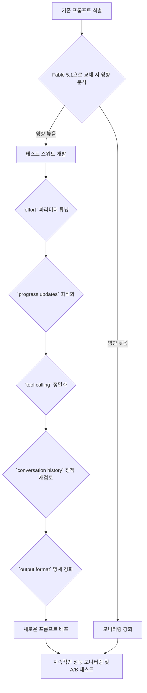

Claude Fable 5.1의 출시는 모델 동작에 중대한 변화를 가져왔습니다. 이는 기존 프롬프트의 재평가와 최적화를 필수적으로 만듭니다. Fable 5 프롬프트가 작동할 수 있지만, `effort`, `progress updates`, `tool calls`, `conversation history`, `output format` 처리 방식의 변화로 인해 직접적인 교체는 성능 저하, 비용 증가 또는 예상치 못한 결과로 이어질 수 있습니다. 본 문서는 이러한 변화를 효과적으로 관리하고 Claude Fable 5.1 통합의 효율성과 신뢰성을 극대화하기 위한 전략을 제시합니다.

## Claude Fable 5.1 핵심 변경 사항 분석

Claude Fable 5.1은 모델의 내부 아키텍처 및 추론 방식에 여러 중요한 업데이트가 이루어졌습니다. 이는 기존 Claude 모델과 비교하여 미묘하지만 결정적인 차이를 만들어냅니다.

### 1. `effort` 파라미터의 재해석
Fable 5.1에서는 `effort` 파라미터의 기본값이 `high`로 설정되어 있으며, 이는 모델이 더 많은 내부 추론 단계를 거쳐 더 심층적인 답변을 생성하려는 경향이 있음을 의미합니다. 기존 `low`, `medium` 등의 설정이 있던 Fable 5와는 다르게, Fable 5.1은 `high`에서 시작하여 `low`, `medium`, `xhigh` 등으로 조절하며 최적점을 찾아야 합니다. `effort`를 낮추면 응답 속도가 빨라지고 비용이 절감될 수 있지만, 복잡한 태스크에서는 성능 저하가 발생할 수 있습니다. 반대로 `xhigh`는 더 나은 품질을 제공하지만, 비용과 지연 시간이 증가합니다.

### 2. `progress updates`의 구조적 변화
Fable 5.1은 태스크 진행 상황을 보고하는 방식이 더 구조화되고 예측 가능하게 변경되었습니다. 이는 장기 실행(long-running) 에이전트의 투명성을 높이고 디버깅을 용이하게 하지만, 기존 프롬프트가 이 새로운 구조를 기대하지 않았다면 파싱 오류나 정보 누락을 유발할 수 있습니다. 에이전트가 중간 단계를 모니터링하거나 사용자에게 진행 상황을 보고하는 경우, 이 변경 사항을 반드시 반영해야 합니다.

### 3. `tool calling` 메커니즘 개선
도구 호출(tool calling) 기능은 Fable 5.1에서 더욱 강력하고 정확해졌습니다. 모델이 언제, 어떤 도구를 호출해야 하는지에 대한 이해도가 높아졌으며, 도구 사용 전의 추론(reasoning)과 도구 호출 후의 결과 통합 능력이 향상되었습니다. 이는 복잡한 다단계 도구 사용 시나리오에서 이점을 제공하지만, 기존 도구 사용 프롬프트는 Fable 5.1의 개선된 능력을 충분히 활용하지 못하거나, 심지어 오작동할 수도 있습니다. 명확한 도구 스펙(spec)과 사용 시나리오를 정의하는 것이 더욱 중요해졌습니다.

### 4. `conversation history` 처리 방식 최적화
대화 이력(conversation history) 관리 방식 또한 변화가 있습니다. Fable 5.1은 긴 대화에서 관련 정보를 추출하고, 불필요한 컨텍스트를 필터링하는 능력이 향상되었습니다. 그러나 이로 인해 모델이 중요하다고 판단하지 않은 정보가 누락될 가능성도 존재합니다. 특정 대화 흐름이나 이전 응답에 강하게 의존하는 프롬프트는 이 부분을 면밀히 검토하여 컨텍스트 손실이 없는지 확인해야 합니다.

### 5. `output format`의 일관성 및 유연성
출력 형식(output format)에 대한 모델의 해석이 더욱 정교해졌습니다. JSON, XML 등 특정 형식 요구사항에 대한 준수도가 높아졌지만, 동시에 모델이 유연하게 응답할 수 있는 여지도 제공합니다. 기존 프롬프트가 모호한 형식 요구사항을 포함하고 있었다면, Fable 5.1은 예상치 못한 방식으로 해석할 수 있습니다. 명확하고 구체적인 출력 형식 지시가 필수적입니다.

## 기존 프롬프트 재평가 및 최적화 전략

Fable 5.1의 변경 사항을 고려할 때, 기존 Claude 기반 에이전트 및 워크플로우에 사용되는 모든 프롬프트는 다음 단계를 통해 재평가 및 최적화되어야 합니다.

### 1. 포괄적인 테스트 스위트 구축
각 프롬프트에 대해 예상 입력과 출력을 정의하는 테스트 케이스를 광범위하게 구축합니다. 특히 `edge cases`와 `failure modes`를 포함해야 합니다. 기존 Fable 5 모델과 Fable 5.1 모델 모두에서 이 테스트 스위트를 실행하여 `regression` 및 `performance drift`를 식별합니다.

### 2. `effort` 파라미터 튜닝
`high` 기본값을 기준으로 시작하여, 각 태스크의 복잡성과 중요도에 따라 `effort` 값을 `low`, `medium`, `xhigh` 등으로 조절하며 테스트를 수행합니다. 비용과 성능 간의 최적의 균형점을 찾습니다.

### 3. 구조화된 `progress updates` 통합
에이전트가 `progress updates`를 사용하는 경우, Fable 5.1의 새로운 구조에 맞춰 프롬프트와 후처리 로직을 업데이트합니다. 예를 들어, `JSON lines` 또는 특정 마크다운 섹션을 사용하여 진행 상황을 보고하도록 명시적으로 지시할 수 있습니다.

```python
# 기존 progress update 프롬프트 (예시)
old_prompt = """
Perform task X. Report progress by saying "Step X complete".
"""

# Fable 5.1에 최적화된 progress update 프롬프트 (예시)
# 모델에게 특정 JSON 형식으로 progress를 보고하도록 지시
optimized_prompt = """
Perform task X. For each sub-step, report your progress in a structured JSON format like this:
{{
    "step_name": "...",
    "status": "...",
    "details": "...",
    "progress_percentage": <integer>
}}
Only output the JSON object when a step is completed or significant progress is made.
"""
```

### 4. 도구 호출 프롬프트 정밀화
Fable 5.1의 향상된 도구 호출 능력을 활용하기 위해, 도구 스펙을 더욱 명확하고 간결하게 정의합니다. 모델이 도구 사용을 결정하는 데 필요한 모든 컨텍스트를 제공하되, 불필요한 지시는 제거합니다. `XML tags`를 사용하여 도구 정의를 캡슐화하는 것이 좋습니다.

```python
tool_spec = """
<tool_code>
def search_database(query: str):
    # Searches the internal database for relevant information
    # Returns a JSON string of results
</tool_code>
"""

tool_prompt = f"""
You have access to the following tool:
{tool_spec}

When you need to search for information, use the `search_database` tool.
Think step-by-step:
<thinking>
1. Identify if a database search is necessary.
2. Formulate the precise query.
3. Call the tool.
4. Interpret the results and use them in your response.
</thinking>
"""
```

### 5. 대화 이력 관리 정책 재검토
긴 대화 이력의 경우, `context window` 내에서 가장 중요한 부분을 유지하기 위한 전략을 재검토합니다. Summarization, `RAG (Retrieval Augmented Generation)` 등 `context compaction` 기법을 사용하여 모델에 제공되는 이력의 품질을 높입니다.

### 6. `output format` 명세 강화
요구되는 출력 형식을 프롬프트 내에서 명시적으로 정의하고, `examples`를 제공하여 모델의 이해를 돕습니다. 예를 들어, 특정 JSON 스키마를 준수하도록 지시하거나, 마크다운 섹션 구조를 명확히 합니다.

## 재평가 워크플로우 시각화

Mermaid를 사용하여 프롬프트 재평가 및 최적화 워크플로우를 시각화할 수 있습니다.



## 트레이드오프

### 1. `effort` 파라미터 튜닝
*   **언제 좋은가**: 복잡한 추론이나 높은 품질의 응답이 필요한 태스크에서 `xhigh` 또는 `high` 설정은 성능 향상에 유리합니다. 비용과 지연 시간에 민감한 간단한 태스크에는 `low` 또는 `medium`이 효율적입니다.
*   **언제 나쁜가**: `xhigh`를 남용하면 불필요한 비용 증가와 응답 지연을 초래할 수 있으며, `low` 설정은 복잡한 문제 해결 능력을 저해하여 잘못된 결과로 이어질 수 있습니다.

### 2. 구조화된 `progress updates`
*   **언제 좋은가**: 에이전트의 내부 동작을 투명하게 파악하고 싶을 때, 디버깅을 용이하게 할 때, 사용자에게 실시간 진행 상황을 명확하게 전달해야 할 때 매우 유용합니다.
*   **언제 나쁜가**: `progress updates` 자체가 모델의 `token usage`를 증가시키고, 지나치게 상세한 업데이트는 오히려 중요한 정보의 노이즈가 될 수 있습니다. 에이전트가 단일 단계 태스크만 수행하는 경우 불필요할 수 있습니다.

### 3. 도구 호출 프롬프트 정밀화
*   **언제 좋은가**: 모델이 외부 도구를 정확하고 안정적으로 사용해야 하는 복잡한 자동화 워크플로우에서 필수적입니다. Fable 5.1의 개선된 능력을 최대한 활용하여 에러율을 줄일 수 있습니다.
*   **언제 나쁜가**: 도구 스펙이 지나치게 복잡하거나 모호하면 모델이 도구를 잘못 해석하거나 사용하지 않을 수 있습니다. 도구 사용 자체가 단순한 태스크에는 과도한 `prompt engineering`이 될 수 있습니다.

### 4. `conversation history` 최적화
*   **언제 좋은가**: `context window` 제약이 있는 환경에서 장기 대화의 일관성을 유지하고, 불필요한 `token` 소비를 줄여 비용 효율성을 높일 때 중요합니다.
*   **언제 나쁜가**: 지나친 `summarization`이나 `truncation`은 모델이 중요한 세부 정보를 놓치게 할 수 있습니다. 모든 이력이 중요하거나 대화 맥락이 자주 변경되는 시나리오에서는 신중해야 합니다.

### 5. `output format` 명세 강화
*   **언제 좋은가**: 모델의 출력을 downstream 시스템에서 자동으로 파싱해야 할 때, 일관된 데이터 구조가 필요할 때 필수적입니다. `JSON` 스키마나 `XML` 구조를 명시하면 `post-processing` 부담을 줄일 수 있습니다.
*   **언제 나쁜가**: 모델에게 유연한 텍스트 응답이 필요한 상황에서 지나치게 엄격한 형식 제약은 모델의 창의성이나 유연한 사고를 저해할 수 있습니다. 단순한 텍스트 응답에 `JSON` 스키마를 강요하는 것은 불필요한 오버헤드입니다.

## 실전 체크리스트

Claude Fable 5.1 기반 프롬프트 최적화 프로젝트를 수행할 때 다음 항목들을 점검해야 합니다.

- [ ] **기존 프롬프트 목록화**: 현재 운영 중인 모든 Claude Fable 5 기반 프롬프트 목록을 확보하고 각 프롬프트의 역할과 중요도를 매핑했는가?
- [ ] **테스트 커버리지 확인**: 각 핵심 프롬프트에 대해 최소 5개 이상의 긍정/부정/엣지 케이스 테스트 시나리오를 정의하고 자동화된 테스트 스위트를 구축했는가?
- [ ] **`effort` 파라미터 벤치마킹**: 주요 워크플로우에 대해 `effort` 파라미터 (`low`, `medium`, `high`, `xhigh`) 별로 성능(품질, 응답 시간) 및 비용 벤치마킹을 수행하고 최적값을 결정했는가?
- [ ] **`progress updates` 구조적 유효성 검증**: 에이전트의 `progress updates`가 Fable 5.1의 동작 방식에 맞춰 구조적으로 일관되게 생성되고, 다운스트림 시스템에서 정확하게 파싱되는지 검증했는가?
- [ ] **도구 호출 정확성 검토**: Fable 5.1의 향상된 도구 호출 능력을 활용하도록 도구 스펙과 프롬프트 내 도구 사용 지시가 충분히 명확하고 정확하게 정의되었으며, 오작동 사례를 최소화했는가?
- [ ] **대화 이력 요약/필터링 전략 유효성 확인**: 긴 대화 이력이 필요한 시나리오에서, Fable 5.1 모델에 제공되는 컨텍스트가 중요한 정보 손실 없이 효율적으로 관리되는지 (e.g., 요약, 필터링) 확인했는가?
- [ ] **`output format` 스키마 준수율 측정**: 프롬프트가 특정 `output format` (JSON, XML 등)을 요구하는 경우, Fable 5.1이 해당 스키마를 95% 이상 준수하는지 측정하고, 미준수 시 에러 처리 로직을 구현했는가?
- [ ] **`regression` 및 `performance drift` 모니터링 시스템 구축**: Fable 5.1 배포 후, 기존 Fable 5 대비 성능 저하 또는 `regression`이 발생하는지 지속적으로 감지하고 알림을 발생시키는 모니터링 시스템을 구축했는가?