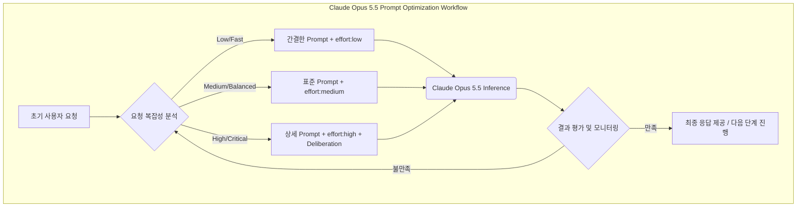

Claude Opus 5.5는 Anthropic의 최신 고성능 LLM으로, 복잡한 추론 능력과 방대한 컨텍스트 처리 능력을 제공한다. 이러한 강력한 기능을 효과적으로 활용하고, 동시에 리소스 사용의 효율성을 극대화하기 위해서는 프롬프트 최적화가 필수적이다. 특히 Opus 5.5 모델은 'effort' 개념과 '심사숙고(deliberation)' 지시문에 민감하게 반응하여, 모델의 추론 깊이와 비용 간의 트레이드오프를 정교하게 제어할 수 있다.

## Opus 5.5의 'Effort' 개념 이해

Opus 5.5에서 'effort'는 모델이 특정 작업을 수행하기 위해 내부적으로 할당하는 컴퓨팅 리소스와 추론 시간을 추상적으로 나타낸다. 긱뉴스 기사에서 언급된 바와 같이, Opus 5.5는 기존 모델의 프롬프트를 그대로 사용하면 불필요하게 높은 'effort'를 투입하여 시간과 토큰 사용량이 증가할 수 있다. 따라서 프롬프트 엔지니어링 단계에서 요구되는 추론량에 따라 이 'effort' 레벨을 명시적으로 또는 암시적으로 조정하는 것이 권장된다.

일반적으로 'effort'는 `low`, `medium`, `high` 등의 레벨로 구분될 수 있으며, 기본값은 `medium`이다. 복잡하거나 중요한 추론 작업에는 `high`를, 빠르고 간결한 답변이 필요한 경우에는 `low`를 지시하여 모델의 행동을 제어할 수 있다.

### 심사숙고(Deliberation) 지시문 추가

Opus 5.5는 시스템 프롬프트에 "답하기 전에 신중하게 생각하라" (Think carefully before answering)와 같은 명시적인 심사숙고 지시문을 포함할 때 추론 품질이 크게 향상될 수 있다. 이는 모델이 CoT(Chain-of-Thought) 프롬프팅과 유사하게 내부적으로 단계별 사고 과정을 거치도록 유도하여, 더 정확하고 포괄적인 답변을 생성하게 돕는다. 채팅 환경에서는 특히 이러한 지시문이 유용하며, 복잡한 문제 해결이나 민감한 정보 처리에 있어 모델의 '사려 깊음'을 높이는 데 기여한다.

이러한 지시문은 모델이 최종 답변을 생성하기 전에 중간 단계의 추론, 가설 설정, 검증 등의 과정을 거치도록 함으로써, 일반적인 텍스트 생성 방식보다 훨씬 신뢰성 높은 결과를 도출한다. 이는 에이전트 시스템(Agentic Systems)에서 중요한 의사결정 과정의 투명성과 정확성을 확보하는 데 특히 중요하다.

## 프롬프트 최적화 실전 가이드

Opus 5.5의 잠재력을 최대한 발휘하기 위한 프롬프트 구성 전략은 다음과 같다.

### 1. System Prompt 구조화

System Prompt는 모델의 역할과 목표를 명확히 정의하고, 여기에 'effort' 및 심사숙고 지시문을 포함한다. 예시는 다음과 같다.

```python
from anthropic import Anthropic

client = Anthropic(api_key="YOUR_ANTHROPIC_API_KEY")

def optimize_claude_opus_prompt(
    user_message: str,
    complexity_hint: str = "medium",
    deliberate: bool = True,
    tool_use_case: bool = False
):
    """
    Optimizes a Claude Opus 5.5-style prompt by hinting at desired reasoning complexity
    and explicit deliberation. Incorporates tool use considerations.
    """
    system_prefix = (
        "You are Claude Opus 5.5, a highly intelligent and capable AI assistant. "
        "Your primary goal is to provide accurate, comprehensive, and contextually relevant responses. "
    )

    if tool_use_case:
        system_prefix += (
            "You have access to various tools to gather information or perform actions. "
            "Always consider if tool use is appropriate and necessary for the current task. "
            "Carefully plan your tool usage before execution."
        )

    system_prefix += f"Focus your reasoning to match the complexity indicated: '{complexity_hint}'. "

    if complexity_hint == "low":
        system_prefix += "Provide a quick, high-level overview. Minimize detailed internal thought processes."
    elif complexity_hint == "medium":
        system_prefix += "Provide a balanced, clear, and comprehensive response. Engage in a reasonable amount of internal thought."
    elif complexity_hint == "high":
        system_prefix += "Conduct an extremely thorough and deep analysis. Explore all nuances and potential implications. Allocate significant internal thought resources. Prioritize accuracy and detail over speed."

    if deliberate:
        system_prefix += " Before generating your final response, first carefully consider the request step-by-step. Outline your thought process to ensure maximum accuracy and completeness."
    else:
        system_prefix += " Respond directly and concisely, without explicit pre-computation or extensive internal monologue, unless absolutely necessary for clarity."

    messages = [
        {"role": "user", "content": user_message}
    ]

    response = client.messages.create(
        model="claude-3-opus-20240229", # Using the current Opus model name for illustration
        max_tokens=2048, # Increased max_tokens for high complexity tasks
        messages=messages,
        system=system_prefix
    )
    return response.content[0].text

# Example Usage 1: High complexity task requiring deep thought and tool use (conceptual)
# Imagine a tool that fetches real-time market data or academic papers.
# prompt_high_complexity_tool = optimize_claude_opus_prompt(
#    "Analyze the current global semiconductor supply chain disruptions, their causes, and forecast their impact on smartphone manufacturing for the next two quarters. Use any available tools to fetch recent economic reports and supply chain data.",
#    complexity_hint="high", deliberate=True, tool_use_case=True
# )
# print(f"High Complexity + Deliberation + Tool Use Response: {prompt_high_complexity_tool[:800]}...")

# Example Usage 2: Medium complexity, direct response needed, no explicit deliberation for speed
prompt_medium_direct = optimize_claude_opus_prompt(
    "List 5 key benefits of adopting microservices architecture in enterprise software development.",
    complexity_hint="medium", deliberate=False
)
print(f"Medium Complexity + Direct Response: {prompt_medium_direct[:500]}...")

# Example Usage 3: Low complexity, quick overview, no deliberation
prompt_low_complexity = optimize_claude_opus_prompt(
    "Explain what HTTP status code 404 means in one short sentence.",
    complexity_hint="low", deliberate=False
)
print(f"Low Complexity + Direct Response: {prompt_low_complexity[:500]}...")
```

위 코드에서 `complexity_hint`는 모델에게 요구되는 추론의 깊이를 암시하며, `deliberate`는 명시적인 사고 과정을 유도한다. 특히 `tool_use_case`를 통해 에이전트 시스템에서 도구 사용 시의 사전 계획 및 신중한 실행을 강조할 수 있다. 2026년에는 LLM이 단순 텍스트 생성기를 넘어 복잡한 에이전트 역할을 수행하는 경향이 강해지므로, 이러한 지시문은 에이전트의 안정성과 효율성을 높이는 데 핵심적인 요소가 될 것이다.

### 2. 단계별 프롬프트 구성

단일 프롬프트로 모든 것을 처리하기보다, 복잡한 작업은 여러 단계로 나누어 각 단계마다 최적화된 프롬프트를 적용할 수 있다. 예를 들어, 정보 검색 -> 분석 -> 보고서 작성의 과정을 각기 다른 'effort'와 심사숙고 지시문으로 제어한다.



## 트레이드오프

Claude Opus 5.5 프롬프트 최적화에는 다음과 같은 트레이드오프가 존재한다.

*   **`effort` 조정 (비용 vs. 품질)**:
    *   **언제 좋은가**: 복잡한 문제나 고품질 답변이 필수적인 경우 `effort:high`를 사용하면 심층적인 추론을 통해 정확도를 높일 수 있다. 비용이 많이 들지만, 중요성이 높은 태스크에서는 감수할 만하다.
    *   **언제 나쁜가**: 빠르고 간결한 답변이 필요한 경우 `effort:high`는 불필요한 컴퓨팅 리소스를 소모하고 응답 시간을 지연시킨다. 간단한 질의에는 `effort:low`가 비용 효율적이다.

*   **심사숙고 지시문 (응답 시간 vs. 정확성/신뢰성)**:
    *   **언제 좋은가**: 복잡한 분석, 문제 해결, 민감한 정보 처리 등 높은 정확성과 신뢰성이 요구되는 작업에 `deliberation` 지시문을 사용하면 모델이 더 깊이 사고하여 오류를 줄이고 품질을 향상시킨다. 예를 들어, 에이전트의 코드 생성이나 금융 분석에 유용하다.
    *   **언제 나쁜가**: 실시간 상호작용이 중요하거나 지연 시간에 민감한 애플리케이션(예: 채팅 봇의 빠른 응답)에서는 심사숙고 과정이 추가적인 처리 시간을 발생시켜 사용자 경험을 저해할 수 있다. 단순 정보 제공 시에는 생략하는 것이 효율적이다.

*   **이전 모델 프롬프트 호환성 (마이그레이션 용이성 vs. 최적화 잠재력)**:
    *   **언제 좋은가**: 기존 Opus 5 또는 다른 Claude 모델 프롬프트와의 호환성을 유지하면 마이그레이션 비용과 시간을 절감할 수 있다. 기존 시스템에 큰 변경 없이 Opus 5.5로 전환할 때 유용하다.
    *   **언제 나쁜가**: 기존 프롬프트를 그대로 사용하면 Opus 5.5의 새로운 `effort` 메커니즘이나 심사숙고 지시문 같은 최적화 기회를 놓쳐, 성능 향상 없이 불필요한 비용을 지불하거나 잠재력을 충분히 활용하지 못할 수 있다. 완전한 최적화를 위해서는 프롬프트 재구성이 필요하다.

## 실전 체크리스트

Claude Opus 5.5 프롬프트 최적화 가이드를 프로젝트에 적용하기 위한 실전 체크리스트는 다음과 같다.

- [ ] 현재 Claude API를 사용하는 모든 프롬프트 리스트를 확보했는가?
- [ ] 각 프롬프트가 요구하는 추론의 복잡성과 중요도를 `low`, `medium`, `high` 중 하나로 분류하고, 이에 따른 'effort' 레벨을 매핑했는가?
- [ ] 복잡한 추론이나 높은 정확도가 필요한 프롬프트에 "답하기 전에 신중하게 생각하라"와 같은 명시적 심사숙고 지시문을 추가하는 것을 고려했는가?
- [ ] 'effort' 레벨 조정 및 심사숙고 지시문 추가 후, 토큰 사용량, 응답 지연 시간(latency), 그리고 답변 품질(accuracy) 지표를 기준으로 A/B 테스트 또는 비교 평가를 수행했는가?
- [ ] 기존 프롬프트의 불필요한 구어체나 비효율적인 표현을 제거하고, 핵심 키워드 중심의 간결한 지시문으로 정제하는 작업을 완료했는가?
- [ ] 에이전트 시스템에서 도구(Tool) 사용 전후로 모델이 신중하게 계획하고 검토하도록 유도하는 프롬프트 가이드라인을 수립했는가?
- [ ] 최적화된 프롬프트가 프로덕션 환경에서 예상치 못한 부작용(예: Hallucination 증가, 성능 저하) 없이 안정적으로 작동하는지 지속적으로 모니터링할 계획을 수립했는가?