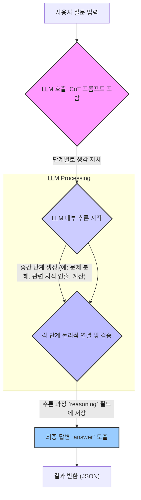

LLM(Large Language Model)은 복잡한 추론 작업을 수행할 때 종종 어려움을 겪습니다. 단순한 단일 패스(single-pass) 프롬프트로는 난이도 높은 문제나 다단계(multi-step) 분석이 필요한 상황에서 만족스러운 결과를 얻기 어렵습니다. CoT(Chain-of-Thought) 프롬프트 패턴은 이러한 LLM의 한계를 극복하고, 복잡한 문제 해결 능력을 극대화하기 위한 핵심적인 접근 방식입니다. CoT는 LLM이 최종 답변을 도출하기 전에 일련의 중간 추론 과정을 명시적으로 생성하도록 유도하여, 모델의 '생각 과정'을 외현화(externalize)하고 이를 통해 정확성과 신뢰성을 높입니다.

### CoT의 동작 원리
CoT 프롬프트는 기본적으로 LLM에게 문제 해결 과정을 단계별로 설명하도록 요청합니다. 이는 마치 사람이 복잡한 문제를 풀 때 머릿속으로 생각하는 과정을 종이에 적어 내려가는 것과 유사합니다. LLM은 이러한 중간 단계를 거치면서 각 단계의 논리적 연결성을 강화하고, 오류를 스스로 식별 및 수정할 기회를 갖게 됩니다. 이 과정에서 모델은 단순히 정답을 추측하는 것이 아니라, 추론의 근거를 마련하고 그 과정을 따라가게 됩니다.

#### 기본 CoT (Basic Chain-of-Thought)
가장 간단한 CoT는 프롬프트에 "Let's think step by step." (단계별로 생각해봅시다.) 와 같은 지시어를 추가하는 것입니다. 이 간단한 문구만으로도 LLM은 추론 모드를 활성화하고 내부적인 사고 과정을 외현화하기 시작합니다.

```
Question: A takes 2 hours to paint a fence. B takes 3 hours to paint the same fence. If they work together, how long will it take them?
Let's think step by step.
```

LLM은 이어서 다음과 같은 추론을 전개할 수 있습니다:
1.  A's rate: 1 fence / 2 hours = 0.5 fences per hour.
2.  B's rate: 1 fence / 3 hours = 0.333... fences per hour.
3.  Combined rate: 0.5 + 0.333... = 0.833... fences per hour.
4.  Time to paint 1 fence together: 1 / 0.833... = 1.2 hours.

#### 고급 CoT 패턴 (Advanced CoT Patterns)
2026년 현재, CoT 패턴은 더욱 정교하게 발전하고 있습니다.

*   **Few-shot CoT:** 몇 가지 문제-해결 과정 쌍(input-reasoning-output) 예시를 프롬프트에 포함시켜 LLM이 특정 추론 스타일을 모방하도록 유도합니다.
*   **Self-Consistency (자기 일관성):** 동일한 CoT 프롬프트를 여러 번 실행하여 다양한 추론 경로를 생성하고, 가장 일관되거나 빈번하게 나타나는 답변을 최종 결과로 선택합니다. 이는 오류를 줄이고 견고성을 높이는 데 효과적입니다.
*   **CoT with Tool Use:** LLM이 추론 과정 중 외부 도구(예: 계산기, 코드 인터프리터, 검색 엔진)를 호출하여 정보를 얻거나 계산을 수행하도록 통합하는 방식입니다. 이는 LLM의 한계를 보완하고 정확도를 비약적으로 향상시킵니다.
*   **Tree-of-Thought (ToT) / Graph-of-Thought (GoT):** 단순 선형 CoT를 넘어, LLM이 여러 추론 경로를 병렬적으로 탐색하고, 각 경로의 유효성을 평가하며, 최적의 경로를 선택하도록 하는 트리 또는 그래프 형태의 추론 구조를 활용합니다. 이는 탐색적 문제 해결에 특히 유용합니다.

### CoT 프롬프트 패턴 구현 예제
Python을 사용하여 기본적인 CoT 프롬프트를 구현하는 예시입니다. 여기서는 가상의 `llm_api_call` 함수를 사용합니다.

```python
import json

def llm_api_call(prompt: str) -> str:
    # This is a mock function for demonstration.
    # In a real scenario, this would call an actual LLM API (e.g., OpenAI, Anthropic).
    print(f"Calling LLM with prompt:\n---\n{prompt}\n---")
    
    if "단계별로 생각해봅시다" in prompt:
        if "사과 5개, 바나나 3개" in prompt:
            return json.dumps({
                "reasoning": "1. 사과의 총 개수는 5개입니다. 2. 바나나의 총 개수는 3개입니다. 3. 5 + 3 = 8입니다.",
                "answer": "8"
            })
        elif "A takes 2 hours" in prompt:
            return json.dumps({
                "reasoning": "1. A's rate: 1/2 fence/hour. 2. B's rate: 1/3 fence/hour. 3. Combined rate: 1/2 + 1/3 = 5/6 fence/hour. 4. Time = 1 / (5/6) = 6/5 hours.",
                "answer": "1.2 hours"
            })
    return json.dumps({"answer": "I don't know the exact reasoning without step-by-step instruction."})

def generate_cot_response(question: str) -> dict:
    prompt = f"Question: {question}\n단계별로 생각해봅시다. 최종 답변은 JSON 형식의 'answer' 필드에 포함하고, 추론 과정은 'reasoning' 필드에 포함하세요."
    response_raw = llm_api_call(prompt)
    try:
        response_json = json.loads(response_raw)
        return response_json
    except json.JSONDecodeError:
        return {"error": "Invalid JSON response", "raw_response": response_raw}

# Example 1: Simple arithmetic
question_1 = "제가 사과 5개와 바나나 3개를 가지고 있습니다. 총 과일 개수는 몇 개입니까?"
result_1 = generate_cot_response(question_1)
print(f"Question 1: {question_1}")
print(f"Reasoning: {result_1.get('reasoning')}")
print(f"Answer: {result_1.get('answer')}\n")

# Example 2: Work problem
question_2 = "A takes 2 hours to paint a fence. B takes 3 hours to paint the same fence. If they work together, how long will it take them?"
result_2 = generate_cot_response(question_2)
print(f"Question 2: {question_2}")
print(f"Reasoning: {result_2.get('reasoning')}")
print(f"Answer: {result_2.get('answer')}\n")
```

### CoT 프롬프트 흐름


### 2026년 CoT 트렌드 및 최적화
2026년에는 CoT 프롬프트가 에이전트(Agent) 시스템 및 자율 LLM의 핵심 구성 요소로 자리매김하고 있습니다.
*   **동적 CoT 생성:** 고정된 "단계별로 생각" 지시어를 넘어, 문제의 복잡성에 따라 동적으로 추론 패턴을 조절하거나, 특정 도메인에 최적화된 추론 지시어를 LLM 스스로 생성하여 활용하는 방식이 연구되고 있습니다.
*   **피드백 루프와의 통합:** CoT 추론 결과에 대한 외부 피드백(인간 검수, 코드 실행 결과, RAG 시스템 검증 등)을 받아 모델이 다음 추론 단계나 전체 추론 전략을 개선하는 반복적 학습(iterative learning) 루프가 중요해지고 있습니다.
*   **다중 모달 CoT:** 텍스트뿐만 아니라 이미지, 오디오 등 다양한 모달리티(modality)를 통합하여 추론하는 멀티모달 LLM에서, 각 모달리티별 정보를 CoT 형식으로 처리하고 통합하는 기법이 발전하고 있습니다.

CoT는 단순히 답변의 정확성을 높이는 것을 넘어, LLM의 동작을 투명하게 만들고 디버깅 가능성을 제공하며, 복잡한 시스템의 안정성을 향상시키는 기반 기술로 활용됩니다.

## 트레이드오프

CoT 프롬프트 패턴은 강력하지만, 모든 상황에 최적은 아니며 특정 트레이드오프를 수반합니다.

*   **정확성 vs. Latency:** CoT는 LLM이 중간 추론 단계를 생성하는 데 추가적인 토큰과 시간을 소모합니다.
    *   **언제 좋은가:** 높은 정확성과 신뢰성이 필수적인 복잡한 분석, 문제 해결, 의사 결정 과정에 유리합니다. 예를 들어, 금융 분석, 법률 자문, 의료 진단 보조와 같은 분야에서 최종 결과의 신뢰도를 높일 수 있습니다.
    *   **언제 나쁜가:** 실시간 응답이 중요하거나 단순한 팩트 조회와 같이 지연 시간에 민감한 애플리케이션에서는 사용자 경험을 저해할 수 있습니다. 예를 들어, 빠른 챗봇 응답이나 UI 인터랙션에는 비효율적일 수 있습니다.

*   **성능(정확도) vs. Cost (비용):** CoT는 더 많은 토큰을 사용하므로 API 호출 비용이 증가합니다.
    *   **언제 좋은가:** 오류의 비용이 높은 중요 애플리케이션에서, 약간의 비용 증가를 감수하더라도 더 정확하고 신뢰할 수 있는 결과를 얻고자 할 때 적합합니다.
    *   **언제 나쁜가:** 대량의 데이터를 처리하거나 비용 효율성이 최우선인 배치 처리, 저비용 챗봇 서비스 등에서는 CoT의 추가 비용이 부담될 수 있습니다.

*   **프롬프트 복잡성 vs. 유지보수성:** Few-shot CoT와 같은 고급 패턴은 프롬프트가 길고 복잡해지기 쉽습니다.
    *   **언제 좋은가:** 특정 도메인에 대한 깊은 이해와 정교한 추론이 필요한 경우, 명확한 예시와 지침을 통해 LLM의 행동을 세밀하게 제어할 수 있습니다.
    *   **언제 나쁜가:** 프롬프트 변경 시 테스트 및 검증이 어려워지며, 유지보수 비용이 증가할 수 있습니다. 간단한 작업에 과도하게 복잡한 CoT를 적용하면 불필요한 오버헤드만 발생합니다.

*   **일반화 vs. 특정 문제 해결 능력:** Few-shot CoT 예시는 특정 문제 유형에 LLM을 최적화할 수 있지만, 다른 유형의 문제에는 덜 효과적일 수 있습니다.
    *   **언제 좋은가:** 특정 유형의 복잡한 문제를 반복적으로 해결해야 하는 경우, 해당 문제에 대한 LLM의 성능을 극대화할 수 있습니다.
    *   **언제 나쁜가:** 다양한 도메인이나 예측 불가능한 문제 유형에 범용적으로 적용해야 하는 경우, 광범위한 일반화 능력이 저하될 수 있습니다.

## 실전 체크리스트

CoT 프롬프트 패턴을 프로젝트에 성공적으로 적용하기 위한 실전 체크리스트입니다.

*   - [ ] **문제 복잡성 분석:** 현재 해결하려는 문제가 CoT를 필요로 하는 다단계 추론 또는 복잡한 논리적 연결을 포함하는지 분석했는가? (예: 단순 정보 추출이 아닌, 데이터 해석 및 결론 도출)
*   - [ ] **단계별 사고 지시어 표준화:** "Let's think step by step." 외에, 특정 도메인에 최적화된 단계별 추론 지시어를 정의하고 이를 프롬프트에 일관되게 적용하고 있는가? (예: "다음 단계에 따라 재무 보고서를 분석하세요:")
*   - [ ] **Few-shot CoT 예시 설계:** 문제 유형별로 최소 `3-5개`의 고품질 문제-추론 과정-해결 예시를 준비하고, 이를 프롬프트에 포함하여 LLM의 추론 능력을 향상시키고 있는가?
*   - [ ] **추론 과정의 검증 메커니즘 구축:** LLM이 생성한 중간 추론 과정(`reasoning` 필드)을 자동으로 또는 수동으로 검증할 수 있는 시스템(예: 정규 표현식, 외부 도구 호출 결과 확인, 인간 검수)을 마련했는가?
*   - [ ] **Context Window 관리:** CoT로 인해 길어진 프롬프트 및 응답이 LLM의 Context Window 한계를 초과하지 않도록 적절히 관리하고 있는가? (예: 압축, 요약, 핵심 정보만 유지)
*   - [ ] **비용 및 Latency 모니터링:** CoT 적용 후 LLM 호출 비용과 응답 Latency를 정량적으로 측정하고, 비즈니스 요구사항과의 트레이드오프를 지속적으로 모니터링하고 있는가?
*   - [ ] **A/B 테스트 및 반복 개선:** CoT 프롬프트와 비-CoT 프롬프트의 성능(정확도, 신뢰도, 비용, Latency)을 A/B 테스트하여 최적의 패턴을 식별하고, 발견된 문제점을 기반으로 프롬프트를 반복적으로 개선하고 있는가?