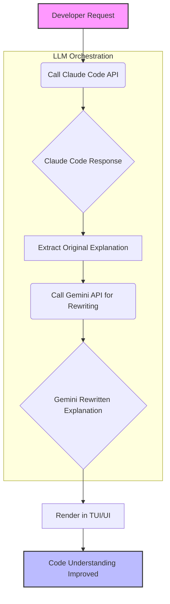

대규모 언어 모델 (LLM) 은 코드 생성에 탁월한 능력을 보여주지만, 때로는 생성된 설명이 지나치게 장황하거나 문학적인 경향을 띠어 실제 개발 작업에 필요한 핵심 정보를 파악하기 어렵게 만듭니다. 특히 Claude Code와 같이 상세한 설명을 제공하는 모델의 경우, 이러한 장황함은 개발자의 번아웃을 유발하고 생산성을 저해할 수 있습니다. 이 엔트리는 Claude Code의 코드 설명을 Google Gemini를 활용하여 간결하고 실용적인 형태로 재작성하는 통합 전략을 제시합니다.

## 문제 정의: Claude Code 설명의 장황함

Claude Code는 복잡한 코드 로직에 대한 심층적인 분석과 설명을 제공하는 데 강점이 있습니다. 그러나 때때로 이 설명은 다음과 같은 문제점을 안고 있습니다:

*   **웅장한 수사 (Grandiose Rhetoric)**: 설명이 지나치게 서사적이거나 과장된 표현을 사용하여 핵심 정보가 희석됩니다.
*   **불필요한 반복 (Unnecessary Repetition)**: 동일한 내용을 여러 방식으로 반복하여 메시지의 밀도가 낮아집니다.
*   **핵심 이탈 (Deviation from Core)**: 코드의 본질적인 기능보다는 부수적인 배경 설명이나 일반론에 치중하는 경향이 있습니다.

이러한 특성은 개발자가 코드의 동작 원리나 변경 사항을 빠르게 이해해야 할 때 큰 방해가 됩니다. 효율적인 개발 워크플로우를 위해서는 간결하고 직관적인 설명이 필수적입니다.

## 해결 전략: Gemini를 활용한 재작성 파이프라인

Gemini 모델은 뛰어난 요약 능력과 다양한 스타일의 텍스트 생성에 강점을 가지고 있습니다. 이를 Claude Code의 설명 후처리 (Post-processing) 단계에 통합하여 장황함을 제거하고 가독성을 극대화할 수 있습니다. 핵심 아이디어는 Claude로부터 원본 설명을 받은 후, 이 설명을 Gemini에게 전달하여 특정 프롬프트 가이드라인에 따라 재작성하도록 하는 것입니다.

이러한 접근 방식은 기존 Claude Code의 코드 생성 능력은 유지하면서 설명의 품질을 향상시키는 효과적인 방법입니다. 특히 TUI (Text-based User Interface) 환경에서 작업하는 개발자에게는 화면에 표시되는 정보의 밀도가 중요하므로, 간결한 설명은 사용자 경험 (UX) 을 크게 개선합니다.

### 아키텍처 및 데이터 흐름

재작성 파이프라인은 다음과 같은 단계로 구성됩니다:

1.  **Claude Code 호출**: 개발자의 요청에 따라 Claude Code가 코드 생성 및 초기 설명을 제공합니다.
2.  **원본 설명 추출**: Claude Code의 응답에서 코드 설명 부분을 추출합니다.
3.  **Gemini 재작성 요청**: 추출된 설명을 Gemini API로 전송하고, 간결하고 실용적인 스타일로 재작성하도록 지시하는 프롬프트를 함께 전달합니다.
4.  **재작성된 설명 수신**: Gemini로부터 재작성된 설명을 받습니다.
5.  **TUI/UI 렌더링**: 재작성된 설명을 개발자에게 TUI 또는 다른 UI를 통해 표시합니다. 이때 원본 설명과 재작성된 설명을 전환 (Toggle) 할 수 있는 기능을 제공하여 필요에 따라 참조할 수 있도록 합니다.



### 코드 예제: Python 기반 통합 시나리오

Python을 사용하여 Claude API와 Gemini API를 통합하는 간단한 예제는 다음과 같습니다. 이 예제는 Claude로부터 받은 설명을 Gemini로 재작성하는 핵심 로직을 보여줍니다.

```python
import anthropic
import google.generativeai as genai
import os

# API 키 설정 (실제 환경에서는 환경 변수 또는 보안 저장소 사용)
CLAUDE_API_KEY = os.getenv("CLAUDE_API_KEY")
GEMINI_API_KEY = os.getenv("GEMINI_API_KEY")

anthropic_client = anthropic.Anthropic(api_key=CLAUDE_API_KEY)
genai.configure(api_key=GEMINI_API_KEY)
gemini_model = genai.GenerativeModel('gemini-pro')

def get_claude_code_and_explanation(prompt: str) -> dict:
    """Claude Code로부터 코드와 설명을 요청합니다."""
    try:
        response = anthropic_client.messages.create(
            model="claude-3-opus-20240229",
            max_tokens=1024,
            messages=[
                {"role": "user", "content": f"Please write a Python function for {prompt} and explain it thoroughly."}
            ]
        )
        content_blocks = response.content
        code = ""
        explanation = ""
        for block in content_blocks:
            if block.type == "text":
                explanation += block.text + "\n"
            elif block.type == "tool_use": # 예시: Claude의 Tool Use Block 처리
                pass # 실제 코드에서는 tool use 블록 처리 로직 추가
            elif block.type == "code_block" and block.language == "python":
                code += block.text + "\n"
        
        # 실제 Claude의 응답 형식에 따라 code와 explanation을 정확히 파싱해야 합니다.
        # 이 예시에서는 텍스트 블록 전체를 설명으로 가정합니다.
        return {"code": code.strip(), "explanation": explanation.strip()}
    except Exception as e:
        print(f"Error calling Claude: {e}")
        return {"code": "", "explanation": ""}

def rewrite_explanation_with_gemini(original_explanation: str) -> str:
    """Gemini를 사용하여 설명을 간결하게 재작성합니다."""
    if not original_explanation:
        return ""
    
    rewrite_prompt = f"""
    다음 코드 설명을 개발자가 빠르게 이해할 수 있도록 간결하고 핵심적인 내용으로 재작성해주세요.
    장황한 표현, 반복적인 내용, 불필요한 서술은 제거하고, 코드의 기능과 중요한 구현 세부사항에 집중해주세요.
    원본 설명: """{original_explanation}"""
    """
    
    try:
        response = gemini_model.generate_content(rewrite_prompt)
        return response.text.strip()
    except Exception as e:
        print(f"Error calling Gemini: {e}")
        return original_explanation # 실패 시 원본 반환

# 사용 예시
if __name__ == "__main__":
    user_prompt = "a function to calculate the nth Fibonacci number recursively"
    claude_output = get_claude_code_and_explanation(user_prompt)
    
    if claude_output["explanation"]:
        print("\n--- Original Claude Explanation ---")
        print(claude_output["explanation"])
        
        rewritten_explanation = rewrite_explanation_with_gemini(claude_output["explanation"])
        
        print("\n--- Rewritten by Gemini ---")
        print(rewritten_explanation)
    else:
        print("Failed to get explanation from Claude.")
```

이 예제에서 `get_claude_code_and_explanation` 함수는 Claude API를 호출하여 코드와 설명을 가져옵니다. 실제 `cc-gemini-rewrite`와 같은 TUI 도구에서는 Claude Code harness의 출력을 파싱하는 로직이 필요합니다. `rewrite_explanation_with_gemini` 함수는 Gemini에 최적화된 프롬프트와 함께 Claude의 설명을 전달하여 간결한 버전을 생성합니다.

## 2026년 트렌드 반영: 멀티 LLM 오케스트레이션과 사용자 경험

2026년 LLM 활용 트렌드는 단일 모델에 의존하기보다, 각 LLM의 강점을 조합하여 특정 문제에 최적화된 솔루션을 구축하는 **멀티 LLM 오케스트레이션 (Multi-LLM Orchestration)**으로 진화하고 있습니다. Claude는 복잡한 코드 이해 및 생성에, Gemini는 요약 및 재작성에 강점을 보이므로, 이 둘을 결합하는 것은 시너지 효과를 창출합니다. 또한, 개발자의 **사용자 경험 (User Experience)** 개선은 LLM 기반 도구 채택의 핵심 요소가 되고 있으며, 장황한 출력을 간결하게 재작성하는 것은 이러한 UX 향상에 직접적으로 기여합니다.

## 트레이드오프

Gemini를 활용한 Claude Code 설명 재작성 전략은 여러 이점을 제공하지만, 몇 가지 트레이드오프를 고려해야 합니다.

*   **Latency 증가**: 추가적인 Gemini API 호출 단계가 워크플로우에 포함되므로 전체 응답 시간이 증가합니다.
    *   **언제 좋고**: 코드 설명의 즉각적인 소비보다 정확하고 간결한 정보 획득이 중요한 경우 (예: 중요한 기능의 코드 리뷰, 장기 보관될 문서 생성).
    *   **언제 나쁜지**: 실시간에 가까운 빠른 피드백이 필수적이거나, 짧은 스크립트처럼 빠르게 확인하고 넘어가는 코드 설명에는 불필요한 오버헤드가 될 수 있습니다.

*   **비용 발생**: Gemini API 호출에 따른 추가적인 비용이 발생합니다.
    *   **언제 좋고**: 개발자의 시간당 생산성 향상, 번아웃 감소, 핵심 정보 파악 시간 절약 등으로 얻는 가치가 Gemini API 사용 비용을 상회할 때.
    *   **언제 나쁜지**: 설명 재작성 빈도가 매우 높거나, 개별 설명의 가치가 낮아 추가 비용이 부담스러운 경우.

*   **의미 정확도 (Fidelity) 손실 가능성**: 재작성 과정에서 원본 설명의 미묘한 뉘앙스나 특정 세부 정보가 누락되거나 변형될 위험이 있습니다.
    *   **언제 좋고**: 코드의 동작 원리를 빠르게 파악하는 것이 중요하며, 설명의 가독성과 간결성이 최우선인 경우. 즉, '충분히 좋은' 설명이 '완벽하지만 장황한' 설명보다 유용할 때.
    *   **언제 나쁜지**: 보안 취약점 분석, 복잡한 알고리즘의 수학적 증명 등 설명의 모든 단어가 중요하고, 작은 오차도 허용되지 않는 경우.

*   **통합 복잡도 증가**: Claude Code harness에 Gemini 통합 로직과 API 키 관리, 에러 처리 등을 추가해야 하므로 시스템 복잡도가 증가합니다.
    *   **언제 좋고**: 이미 모듈화가 잘 되어 있고 확장성을 고려하여 설계된 에이전트 하네스 (Agent Harness) 또는 툴에서 새로운 기능을 추가하는 경우.
    *   **언제 나쁜지**: Monolithic 하거나 빠른 프로토타이핑이 필요한 초기 단계 프로젝트에서, 추가적인 통합 작업이 개발 속도를 저해할 때.

## 실전 체크리스트

이 전략을 프로젝트에 성공적으로 적용하기 위한 검증 항목들입니다.

*   [ ] Gemini API 연동 및 인증 정보 (API Key) 가 환경 변수, Vault, 또는 다른 보안 저장소를 통해 안전하게 관리되고 있는가?
*   [ ] Claude 응답 후 Gemini 호출까지의 Latency가 측정되었으며, 개발 워크플로우의 허용 가능한 지연 시간 범위 내에 있는가?
*   [ ] Gemini 재작성으로 인한 추가 비용이 전체 LLM 사용 예산 및 비용 효율성 (Cost-efficiency) 관점에서 평가되었는가?
*   [ ] 재작성된 설명의 원본 코드 의미 정확도 (Fidelity) 를 평가하기 위한 기준 (예: 키워드 유지율, 핵심 로직 설명 일치도) 및 모니터링 체계가 구축되었는가?
*   [ ] TUI/UI에 재작성된 설명을 표시하고, 필요시 원본 Claude 설명과 재작성된 설명 간의 전환 (Toggle) 기능을 제공하여 사용자에게 선택권을 주는가?
*   [ ] Gemini 프롬프트가 코드 설명의 특성을 반영하여 '간결성', '핵심 정보 집중', '개발자 친화적' 등의 명확한 재작성 지침을 포함하는가?
*   [ ] 특정 설명 유형 (예: 에러 메시지, API 사용 예시, 복잡한 알고리즘) 에 대한 재작성 예외 처리 또는 특화된 프롬프트 전략이 구현되어 있는가?
*   [ ] Gemini 호출 실패 시 (API 오류, Rate Limit 등) 원본 Claude 설명을 폴백 (Fallback) 으로 제공하는 에러 처리 로직이 구현되었는가?