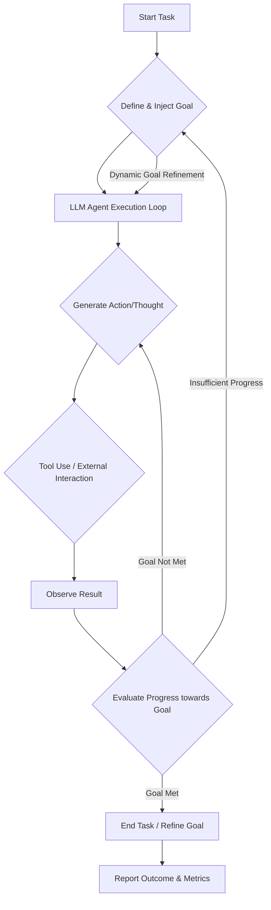

대규모 언어 모델(LLM) 기반의 에이전트 시스템은 복잡한 문제 해결을 위해 지속적으로 진화하고 있습니다. 특히 NP-난해(NP-hard) 문제와 같이 탐색 공간이 넓고 최적해 도달이 어려운 영역에서 LLM 에이전트의 효율성과 일관성은 핵심적인 과제입니다. 단순히 프롬프트의 길이를 늘리거나 더 많은 시도를 하게 하는 것을 넘어, 에이전트의 내재적인 제어 루프(Control Loop)와 탐색 경로(Exploration Path) 자체를 변화시키는 목표 지향적 프롬프트 전략(Goal-Oriented Prompting Strategy)이 주목받고 있습니다. 이는 마치 Fable 5의 `/goal` 기능이 단순한 작업 연장이 아니라 에이전트의 근본적인 행동 방식을 재구성하는 것과 유사합니다. 본 엔트리에서는 LLM 하네스(Harness)에 이러한 목표 지향적 프롬프트 엔지니어링 전략을 도입하는 방법을 탐구합니다.

## 목표 지향적 프롬프트의 필요성

기존의 프롬프트 엔지니어링은 주로 LLM에게 특정 태스크를 지시하고 원하는 형식의 출력을 얻는 데 집중했습니다. 하지만 에이전트가 여러 단계에 걸쳐 복잡한 문제를 해결해야 할 때는 단순 지시만으로는 한계가 있습니다. LLM은 '현재'의 입력에 반응하며 '지역 최적해(Local Optima)'에 갇히거나, 전체 목표와 무관한 비효율적인 탐색을 수행할 수 있습니다. 목표 지향적 프롬프트는 에이전트에게 명확한 '장기 목표(Long-term Goal)'를 제시하고, 각 스텝에서 이 목표 달성에 기여하는 방향으로 의사결정을 유도함으로써 이러한 문제를 해결합니다. 이는 에이전트의 '의도(Intent)'와 '행동(Action)'을 정렬(Align)하여 더 견고하고 일관된 성능을 끌어냅니다.

## LLM 하네스에 목표 지향 전략 도입

LLM 하네스는 에이전트의 실행 환경을 제어하고, LLM 호출, 도구 사용(Tool Use), 메모리 관리, 피드백 루프 등을 Orchestrate하는 시스템입니다. 여기에 목표 지향적 전략을 도입하려면 다음 핵심 구성 요소를 고려해야 합니다.

### 1. 목표 정의 및 주입 (Goal Definition & Injection)

명확하고 측정 가능한 목표를 정의하고, 이를 초기 프롬프트와 에이전트의 내부 상태(Internal State)에 지속적으로 주입합니다. 목표는 상위 수준의 추상적인 목표에서부터 현재 단계의 구체적인 서브 목표(Sub-goal)까지 계층적으로 관리될 수 있습니다. Claude Code와 같은 에이전트 하네스에서는 `System Prompt`나 `User Message`에 `Current Objective: [Goal Description]`과 같은 형태로 목표를 명시합니다.

### 2. 목표 기반 의사결정 (Goal-based Decision Making)

에이전트가 각 의사결정 시점에 현재 행동이 전체 목표에 어떻게 기여하는지 평가하도록 유도합니다. 이는 LLM에게 추론 과정에서 목표를 명시적으로 언급하도록 지시하거나, 하네스 레벨에서 에이전트의 출력을 파싱하여 목표 관련성을 평가하는 로직을 추가하는 방식으로 구현할 수 있습니다.

```python
# Python (Pseudocode) for Goal-Oriented Prompting in a Harness

class Goal:
    def __init__(self, objective: str, metrics: dict):
        self.objective = objective
        self.metrics = metrics # e.g., {'completion_rate': 1.0, 'cost_limit': 100}
        self.current_progress = {}

    def update_progress(self, new_data: dict):
        # Update internal progress based on agent's output/state
        pass

    def is_achieved(self) -> bool:
        # Check if objective is met based on metrics
        return all(self.current_progress.get(k, 0) >= v for k, v in self.metrics.items())

    def get_prompt_context(self) -> str:
        return f"""Your primary objective is to: {self.objective}.
Currently, your progress toward this goal is: {self.current_progress}.
Focus on actions that directly contribute to achieving this objective.
"""

class LLMAgentHarness:
    def __init__(self, llm_model, tools: list):
        self.llm = llm_model
        self.tools = tools
        self.current_goal: Goal = None
        self.chat_history = []

    def set_goal(self, goal: Goal):
        self.current_goal = goal

    def run_step(self, user_input: str):
        system_prompt = "You are an AI assistant capable of problem-solving with tools."
        if self.current_goal:
            system_prompt += self.current_goal.get_prompt_context()

        # Construct messages
        messages = [
            {"role": "system", "content": system_prompt},
            *self.chat_history,
            {"role": "user", "content": user_input}
        ]

        # Call LLM
        llm_response = self.llm.invoke(messages)
        self.chat_history.append({"role": "assistant", "content": llm_response})

        # Parse LLM response for tool calls or next actions
        # ... (Tool use logic, output parsing, etc.)

        # Update goal progress based on LLM's action/output
        if self.current_goal:
            self.current_goal.update_progress({"last_action_relevance": 0.8})

        if self.current_goal and self.current_goal.is_achieved():
            print("Goal achieved!")
            return "Goal achieved!"

        return llm_response

# Example Usage:
# my_llm = MockLLM()
# my_harness = LLMAgentHarness(my_llm, [])
# problem_goal = Goal("Optimize the fiber optic network for minimal latency and maximum throughput.", 
#                     {'latency_reduction': 0.9, 'throughput_increase': 0.8})
# my_harness.set_goal(problem_goal)
# my_harness.run_step("Begin network optimization task.")
```

### 3. 피드백 루프 및 목표 재평가 (Feedback Loop & Goal Re-evaluation)

에이전트의 행동 결과와 목표 달성도를 지속적으로 모니터링하고, 이를 바탕으로 목표의 유효성을 재평가하거나 새로운 서브 목표를 생성합니다. A/B 테스트를 통해 `goal` 프롬프트가 에이전트의 문제 해결 능력과 일관성에 미치는 영향을 정량적으로 평가할 수 있습니다. 예를 들어, `goal` 프롬프트가 주어졌을 때와 그렇지 않을 때의 최종 문제 해결 성공률, 소요 시간, 자원 소모량 등을 비교합니다.



2026년에는 LLM 에이전트의 자율성과 신뢰성이 더욱 중요해지면서, 목표 지향적 프롬프트 엔지니어링은 단순한 팁이 아닌, 에이전트 아키텍처의 핵심 요소로 자리매김할 것입니다. 이는 복잡한 코드 생성, 인프라 관리, 데이터 분석 등 다양한 영역에서 에이전트의 실제 적용 가능성을 높이는 기반이 됩니다.

## 트레이드오프

### 1. 프롬프트 복잡성 및 토큰 비용
*   **언제 좋고**: 에이전트가 수행하는 태스크의 복잡성이 높고, 명확한 장기 목표가 필요한 경우, 목표 지향 프롬프트가 탐색 효율성을 크게 개선합니다. 이는 비효율적인 탐색으로 인한 장기적인 토큰 낭비를 줄일 수 있습니다.
*   **언제 나쁜지**: 단순하거나 단일 스텝의 태스크에서는 목표 지향 프롬프트가 추가적인 오버헤드와 불필요한 토큰 소비를 유발할 수 있습니다. 이 경우, 단순하고 직접적인 지시 프롬프트가 더 효율적입니다.

### 2. 목표 설정의 정확성
*   **언제 좋고**: 목표가 명확하고 측정 가능하며, 에이전트의 능력 범위 내에 있을 때, 목표 지향 프롬프트는 에이전트의 집중력과 성공률을 극대화합니다.
*   **언제 나쁜지**: 모호하거나 비현실적인 목표는 에이전트를 혼란스럽게 하거나 잘못된 방향으로 탐색하게 하여 성능 저하를 초래할 수 있습니다. 목표 설정 단계에서의 신중한 검토와 반복적인 refinement가 필수적입니다.

### 3. 제어 루프 변경의 영향
*   **언제 좋고**: 에이전트가 장기적인 계획을 수립하고, 중간 결과를 바탕으로 전략을 유연하게 조정해야 하는 시나리오에서 목표 지향적 접근 방식은 탁월한 성능을 발휘합니다.
*   **언제 나쁜지**: 에이전트의 제어 루프를 과도하게 변경하거나, LLM의 창의성이나 비정형적인 탐색이 필요한 태스크에서는 목표 지향 프롬프트가 오히려 제약으로 작용할 수 있습니다. 적절한 '자율성'과 '목표 지향성' 사이의 균형이 중요합니다.

### 4. 상태 관리 및 피드백 복잡성
*   **언제 좋고**: 장기 실행 에이전트나 여러 서브 태스크를 포함하는 복잡한 워크플로우에서 목표와 관련된 상태를 체계적으로 관리하고 피드백을 활용하여 에이전트의 일관성을 높일 수 있습니다.
*   **언제 나쁜지**: 상태 관리 로직과 피드백 메커니즘이 복잡해질수록 하네스의 구현 및 디버깅 비용이 증가합니다. 특히 실시간 피드백이나 동적 목표 재설정이 필요한 경우, 시스템 설계 복잡도가 크게 올라갈 수 있습니다.

## 실전 체크리스트

LLM 하네스에 목표 지향적 프롬프트 엔지니어링 전략을 도입하기 위한 실전 체크리스트입니다.

- [ ] **목표 정의 명확성 검토**: 에이전트의 최종 목표가 구체적이고 측정 가능한 형태로 정의되었는지 확인합니다. (예: “네트워크 지연 시간 < 50ms”)
- [ ] **목표 주입 메커니즘 설계**: 목표가 System Prompt, User Message, 또는 Context Window에 일관되게 주입되는 메커니즘을 구현하고 검증합니다.
- [ ] **목표 달성도 평가 로직 구현**: 에이전트의 출력이나 환경 피드백을 기반으로 목표 달성도를 정량적으로 평가하는 로직을 하네스에 통합하고 테스트합니다.
- [ ] **A/B 테스트 환경 구축**: 목표 지향 프롬프트 적용 그룹과 대조군(Control Group) 간의 성능(성공률, 소요 시간, 비용)을 비교할 수 있는 A/B 테스트 환경을 구축합니다.
- [ ] **에이전트 제어 루프 분석**: 목표 지향 프롬프트가 에이전트의 내부 추론(Reasoning) 및 도구 사용(Tool Use) 결정 과정에 의도한 대로 영향을 미치는지 로그 분석을 통해 확인합니다.
- [ ] **동적 목표 재설정 고려**: 초기 목표가 달성 불가능하거나 비효율적일 경우, 하네스 또는 LLM 자체의 메타 추론을 통해 목표를 동적으로 재설정하거나 서브 목표를 생성하는 로직을 설계합니다.
- [ ] **토큰 효율성 모니터링**: 목표 지향 프롬프트 도입 후 프롬프트 길이 및 전체 토큰 사용량에 대한 모니터링을 설정하여, 성능 향상 대비 비용 증가가 합리적인지 평가합니다.