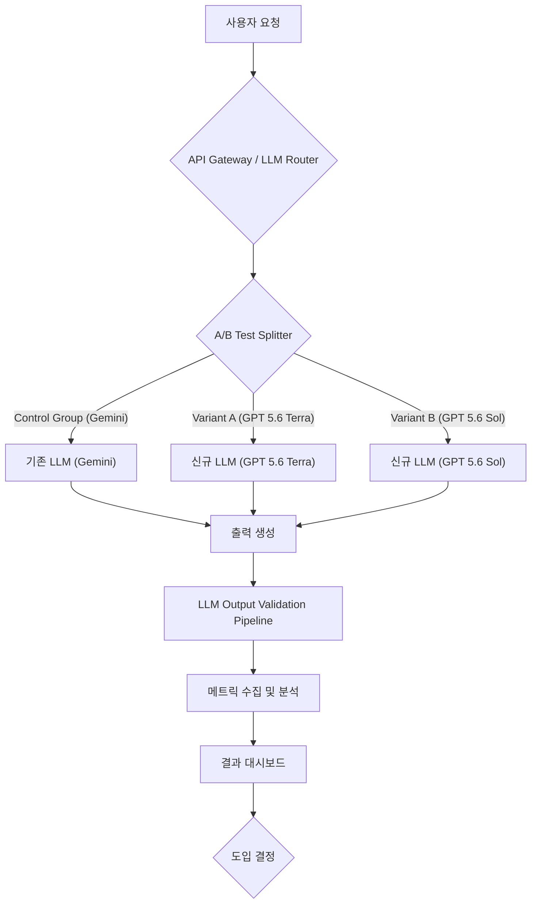

## GPT 5.6 모델 패밀리 도입 전략 및 A/B 테스트
OpenAI의 GPT 5.6 모델 패밀리는 Sol(플래그십), Terra(균형형), Luna(최저비용) 세 가지 티어로 구성되어, 다양한 성능-비용 요구사항에 최적화된 선택지를 제공합니다. 이 엔트리는 GPT 5.6 모델을 기존 LLM 인프라에 통합하거나 대체하기 위한 전략적 평가 및 A/B 테스트 방법론을 다룹니다. 특히, LLM 출력 검증 파이프라인의 효율성, 에이전트 추론 성능, 그리고 전반적인 비용 효율성을 기존 모델(예: Gemini)과 비교 분석하는 데 중점을 둡니다.

### GPT 5.6 모델 패밀리 이해
GPT 5.6은 2026년 7월에 정식 출시되었으며, 핵심적으로 "효율성 우선, 필요시 최대 성능"이라는 철학을 반영합니다.
*   **Sol**: 최고 성능을 요구하는 태스크에 적합한 플래그십 모델입니다. 복잡한 추론, 대규모 코드 생성, 정교한 데이터 분석 등 최고 품질의 출력이 필수적인 시나리오에 활용됩니다.
*   **Terra**: 성능과 비용 효율성 간의 균형을 제공하는 모델입니다. 대부분의 범용적인 LLM 애플리케이션에 적합하며, 처리량(throughput)과 응답 지연 시간(latency) 요구사항을 충족시키면서도 비용을 합리적으로 유지할 수 있습니다.
*   **Luna**: 최저 비용을 목표로 하는 모델로, 대규모 배치 처리, 간단한 질의 응답, 초기 필터링 등 비용 민감도가 높은 작업에 최적화되어 있습니다. 응답 속도나 정확도에 대한 요구사항이 상대적으로 낮은 경우 유용합니다.

이러한 티어 구조는 워크로드의 특성에 따라 최적의 모델을 선택할 수 있는 유연성을 제공하며, Multi-LLM Routing design patterns과 연계하여 특정 요청에 대한 동적 모델 라우팅 전략을 수립하는 데 핵심적인 역할을 합니다.

### LLM 출력 검증 파이프라인 구축
GPT 5.6 또는 다른 LLM 모델의 도입을 평가하기 위해서는 견고한 출력 검증 파이프라인이 필수적입니다. 이 파이프라인은 모델의 응답이 요구사항을 충족하는지, 환각(hallucination)이 발생하는지, 그리고 안전 및 품질 기준을 준수하는지를 객관적으로 측정합니다.

#### 검증 메트릭
*   **정확도 (Accuracy)**: 생성된 텍스트가 사실과 일치하는지, 주어진 프롬프트의 의도를 정확히 반영하는지 평가합니다. RAG (Retrieval-Augmented Generation) 시스템의 경우, 검색된 문서의 관련성 및 생성된 답변의 정확도가 중요합니다.
*   **관련성 (Relevance)**: 출력 내용이 프롬프트와 얼마나 밀접하게 관련되어 있는지 측정합니다.
*   **일관성 (Consistency)**: 동일 또는 유사한 프롬프트에 대해 모델이 일관된 응답을 생성하는지 확인합니다.
*   **안전성 (Safety)**: 유해하거나 편향된 콘텐츠 생성을 방지하기 위한 Guardrails 준수 여부를 검토합니다.
*   **지연 시간 (Latency)**: 응답을 생성하는 데 걸리는 시간. 사용자 경험(UX)에 직접적인 영향을 미칩니다.
*   **비용 (Cost)**: 토큰 사용량에 따른 실제 API 호출 비용을 측정합니다.

#### 검증 방법론
*   **휴먼 인 더 루프 (Human-in-the-Loop)**: 전문가가 모델의 출력을 직접 평가하고 피드백을 제공합니다. 이는 고품질의 골드 스탠다드 데이터셋 구축에 기여합니다.
*   **자동화된 평가 (Automated Evaluation)**: BLEU, ROUGE, METEOR 등과 같은 텍스트 유사도 메트릭이나, 특정 태스크를 위한 커스텀 평가 지표를 활용합니다. LLM Judgment Code Verification Separation Architecture를 통해 평가 로직의 신뢰성을 확보합니다.
*   **에이전트 기반 검증**: 다른 LLM 에이전트가 검증기로 작동하여 주 LLM의 출력을 평가합니다. 이는 Generative AI Hallucination Automated Detection Evaluation에 효과적인 접근 방식입니다.

### 에이전트 추론 성능 평가
GPT 5.6 모델 패밀리는 특히 AI Agents의 추론 능력 향상에 기여할 수 있습니다. 에이전트의 Long-Term Memory Management, Tool Use Design Patterns, 그리고 복잡한 Task Planning Execution Patterns에서 LLM의 성능은 핵심적입니다.

#### 평가 지표
*   **태스크 성공률**: 에이전트가 주어진 목표를 얼마나 성공적으로 달성하는지.
*   **추론 단계 수**: 목표 달성까지 필요한 중간 추론(reasoning) 단계의 효율성.
*   **도구 활용 정확도**: 외부 도구(External Tool Integration for AI Agents)를 호출하고 그 결과를 해석하는 능력.
*   **오류 복구 능력**: 예상치 못한 상황이나 오류 발생 시 Agent Robust Tool Error Recovery 메커니즘을 통한 자가 복구 능력.

### A/B 테스트 설계 및 실행
GPT 5.6 모델의 도입 효과를 정량적으로 측정하기 위해 A/B 테스트를 설계하고 실행합니다.



#### 테스트 설계 요소
1.  **가설 수립**: "GPT 5.6 Terra는 Gemini와 유사한 정확도를 제공하면서 비용을 X% 절감할 것이다." 또는 "GPT 5.6 Sol은 에이전트의 태스크 성공률을 Y% 향상시킬 것이다."
2.  **그룹 정의**:
    *   **Control Group**: 현재 프로덕션 환경에서 사용 중인 LLM (예: Gemini).
    *   **Variant Group(s)**: 평가 대상인 GPT 5.6 모델 티어(Sol, Terra, Luna) 중 하나 또는 복수.
3.  **트래픽 분할**: Distributed AI Model Versioning A/B Testing Harness를 활용하여 일정 비율의 사용자 요청을 각 그룹으로 라우팅합니다. 점진적 롤아웃(progressive rollout) 전략을 사용할 수 있습니다.
4.  **메트릭 정의**: LLM 출력 검증 파이프라인에서 수집된 정확도, 지연 시간, 비용, 사용자 피드백(Implicit/Explicit Feedback) 등을 핵심 메트릭으로 설정합니다.
5.  **실험 기간**: 통계적 유의미성(statistical significance)을 확보할 수 있는 충분한 기간 동안 실험을 진행합니다.
6.  **결과 분석**: 수집된 데이터를 통계적으로 분석하여 가설의 검증 여부를 판단합니다. A/B 테스트 대시보드를 통해 실시간으로 지표를 모니터링합니다.

#### 코드 예시: Multi-LLM Router를 이용한 A/B 테스트 트래픽 분할 (Python)
아래 코드는 `LLM Router`가 들어오는 요청을 기반으로 `Gemini`, `GPT 5.6 Terra`, `GPT 5.6 Sol` 중 하나로 라우팅하는 간단한 로직을 보여줍니다. 이는 `prompt-engineering/multi-llm-routing-design-patterns-cost-performance` 및 `harness-engineering/ai-model-router-cost-performance-optimization`와 밀접하게 관련됩니다.

```python
import random
from typing import Dict, Any

class LLMService:
    def generate(self, prompt: str, model_name: str) -> Dict[str, Any]:
        """Placeholder for actual LLM API call."""
        print(f"Generating with {model_name} for prompt: {prompt[:50]}...")
        # Simulate latency and cost
        latency = random.uniform(50, 500) if "Sol" not in model_name else random.uniform(100, 1000)
        cost = random.uniform(0.01, 0.1) if "Luna" in model_name else (random.uniform(0.1, 0.5) if "Terra" in model_name else random.uniform(0.5, 2.0))
        output = f"Response from {model_name}: {prompt[::-1]}" # Example output
        return {"output": output, "latency_ms": latency, "cost_usd": cost, "model_used": model_name}

class ABTestLLMRouter:
    def __init__(self, traffic_distribution: Dict[str, float]):
        self.traffic_distribution = traffic_distribution
        self.llm_service = LLMService()
        self.models = list(traffic_distribution.keys())

    def route_request(self, prompt: str) -> Dict[str, Any]:
        """Routes a request to an LLM based on traffic distribution."""
        chosen_model = random.choices(self.models, weights=list(self.traffic_distribution.values()), k=1)[0]
        return self.llm_service.generate(prompt, chosen_model)

# Define traffic distribution (e.g., 50% Gemini, 30% GPT 5.6 Terra, 20% GPT 5.6 Sol)
distribution = {
    "Gemini": 0.5,
    "GPT 5.6 Terra": 0.3,
    "GPT 5.6 Sol": 0.2,
    # "GPT 5.6 Luna": 0.0 # Could be added for specific low-cost tasks
}

router = ABTestLLMRouter(distribution)

# Simulate requests
for i in range(10):
    user_prompt = f"Analyze the market trends for Q{i+1} 2026 and provide key insights."
    result = router.route_request(user_prompt)
    print(f"Request {i+1}: Model used: {result['model_used']}, Latency: {result['latency_ms']:.2f}ms, Cost: ${result['cost_usd']:.4f}\n")

```
이 라우터는 실제 프로덕션 환경에서 AI Model Router Cost Performance Optimization 전략의 핵심 구성 요소로 기능합니다.

## 트레이드오프

*   **성능 최적화 vs. 비용 효율성**:
    *   **언제 좋고**: GPT 5.6의 다중 티어(Sol, Terra, Luna)는 워크로드에 따라 미세 조정된 모델 선택을 가능하게 하여, 고성능이 필수적인 곳에는 Sol을, 비용 절감이 중요한 곳에는 Luna를 할당할 수 있습니다. 이는 자원 낭비를 줄이고 ROI를 극대화합니다.
    *   **언제 나쁜지**: 각 티어별로 최적의 프롬프트 엔지니어링 및 미세 조정이 필요할 수 있어 초기 설정 및 유지보수 비용이 증가합니다. 잘못된 티어 선택은 성능 저하나 불필요한 비용 상승으로 이어질 수 있습니다.

*   **멀티-LLM 전략의 유연성 vs. 운영 복잡성**:
    *   **언제 좋고**: Gemini와 GPT 5.6을 혼용하는 Multi-LLM Routing Design Patterns은 특정 벤더에 대한 의존도를 줄이고, 각 모델의 강점을 활용하여 다양한 태스크에 최적화된 솔루션을 제공합니다. 특정 모델의 서비스 중단 시에도 대응할 수 있는 복원력을 제공합니다.
    *   **언제 나쁜지**: 여러 LLM을 관리하고 A/B 테스트를 실행하는 것은 시스템 아키텍처와 MLOps 파이프라인의 복잡성을 크게 증가시킵니다. 모델 게이트웨이, 메트릭 수집, 로깅, 오류 처리 등 추가적인 개발 및 운영 부담이 발생합니다.

*   **A/B 테스트의 정확성 vs. 속도/자원 소모**:
    *   **언제 좋고**: A/B 테스트는 GPT 5.6 도입의 실제적인 효과를 정량적으로 검증하여, 데이터 기반의 의사 결정을 가능하게 합니다. 이는 불확실성을 줄이고 성공적인 도입을 위한 중요한 근거를 제공합니다.
    *   **언제 나쁜지**: 통계적 유의미성을 확보하기 위한 충분한 테스트 기간과 트래픽이 요구되며, 이는 모델 평가 주기를 길게 만들고 자원(compute, API cost)을 소모합니다. 또한, A/B 테스트 환경 설정 자체가 오류의 원인이 될 수 있습니다.

*   **출력 품질 자동화 검증 vs. 휴먼 리뷰의 한계**:
    *   **언제 좋고**: LLM Output Validation Automation Failure Prevention 및 Agent-based Validation을 통해 대규모의 출력을 효율적으로 검증하고 일관된 품질을 유지할 수 있습니다. 이는 Human-in-the-Loop의 한계를 보완합니다.
    *   **언제 나쁜지**: 자동화된 메트릭만으로는 모델의 미묘한 성능 차이(뉘앙스, 창의성 등)나 사용자 경험의 질적 측면을 완전히 포착하기 어렵습니다. 자동화된 평가 시스템 자체의 바이어스(bias)나 오류 가능성도 존재합니다.

## 실전 체크리스트

- [ ] **GPT 5.6 모델 티어 매핑**: 현재 LLM 워크로드별로 요구되는 성능, 지연 시간, 비용 제약 조건을 분석하여 GPT 5.6 Sol, Terra, Luna 중 어떤 티어가 가장 적합한지 1차 매핑을 완료했는가?
- [ ] **기존 LLM 성능 벤치마킹**: 현재 사용 중인 LLM(예: Gemini)의 기준선(baseline) 성능 지표(정확도, 지연 시간, 비용)를 정량적으로 확보했는가?
- [ ] **A/B 테스트 환경 구축**: Distributed AI Model Versioning A/B Testing Harness를 활용하여 GPT 5.6 모델을 기존 LLM과 비교할 수 있는 안전한 A/B 테스트 환경을 구축했는가? (트래픽 분할, 메트릭 수집, 롤백 기능 포함)
- [ ] **평가 메트릭 및 성공 기준 정의**: LLM 출력 검증 파이프라인에서 측정할 핵심 메트릭(정확도, 관련성, 안전성, 지연 시간, 비용, 태스크 성공률 등)을 명확히 정의하고, 각 메트릭에 대한 통계적으로 유의미한 성공 기준(예: p-value < 0.05)을 설정했는가?
- [ ] **비용 모니터링 및 최적화**: LLM API Cost Optimization Harness Design Patterns을 적용하여 GPT 5.6 및 기존 LLM 사용에 따른 실제 비용을 실시간으로 모니터링하고, 예상 비용 대비 편차를 추적하는 시스템을 갖추었는가?
- [ ] **에이전트 추론 로직 호환성 검증**: 기존 AI Agents의 추론 로직과 도구 호출(Tool Use) 패턴이 GPT 5.6 모델과 호환되며, 예상대로 동작하는지 통합 테스트를 수행했는가?
- [ ] **결과 리포팅 및 의사결정 프로세스**: A/B 테스트 결과를 Reports/AI Model Performance Cost Efficiency Reporting 대시보드에서 시각화하고, 데이터 기반의 도입 또는 혼용 전략 결정을 위한 명확한 의사결정 프로세스를 수립했는가?
