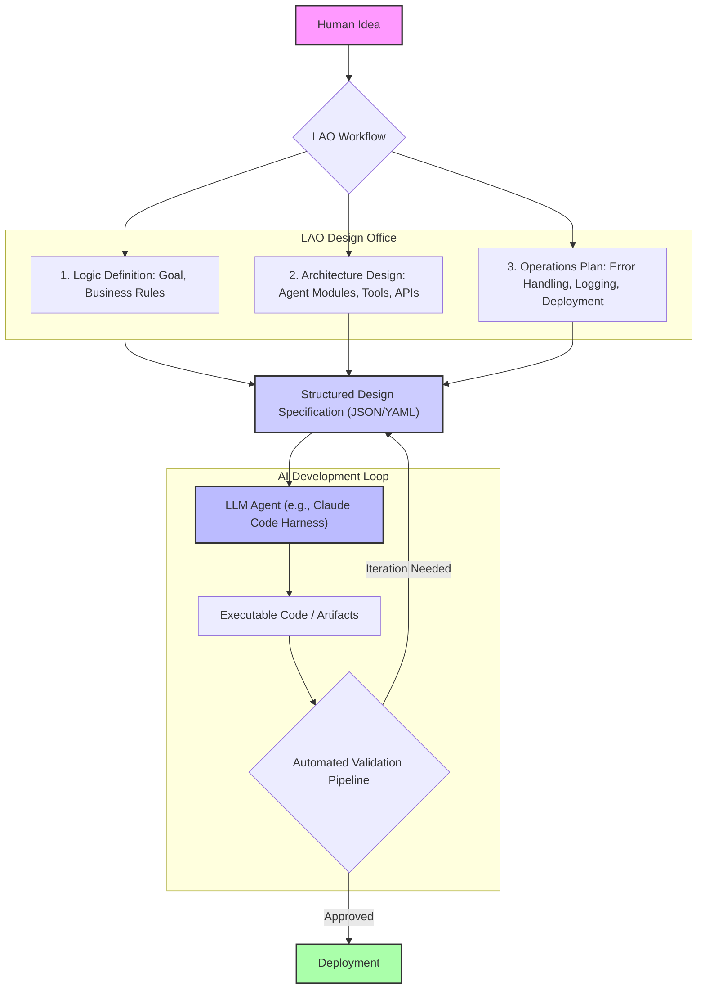

LLM 에이전트의 설계 단계에서 발생하는 비효율은 최종 출력물의 품질 저하와 개발 주기의 장기화로 이어진다. LAO (Logic, Architecture, Operations) 워크플로우는 추상적인 아이디어를 개발 AI가 즉시 실행할 수 있는 정교하고 구조화된 설계서로 변환함으로써 이러한 문제를 해결하는 방법론이다. 이는 개발 AI, 특히 Claude Code 하네스를 활용한 복잡한 자동화 작업 시 초기 입력의 품질을 극대화하여 LLM 출력 검증 파이프라인의 반복 횟수를 획기적으로 줄이는 것을 목표로 한다.

## LAO 워크플로우의 핵심 및 LLM 에이전트 설계 적용

기존의 LLM 기반 개발은 아이디어를 직접 프롬프트로 변환하여 에이전트에게 전달하는 방식이 일반적이었다. 이는 단기적으로는 빠르다고 느껴지지만, 구현 과정에서 누락된 요구사항, 불명확한 제약 조건, 모호한 인터페이스 등으로 인해 잦은 수정과 재시도를 유발한다. LAO 워크플로우는 이러한 갭을 메우는 '설계 사무소' 역할을 수행한다.

1.  **Logic (논리)**: 에이전트가 해결해야 할 문제의 핵심 비즈니스 로직을 명확히 정의한다. 이는 사용자 요구사항, 데이터 흐름, 핵심 기능 등을 포함한다. LLM 에이전트의 경우, 어떤 목표를 달성해야 하며, 어떤 조건에서 어떤 행동을 해야 하는지에 대한 의사결정 트리를 구체화하는 단계이다.
2.  **Architecture (아키텍처)**: 정의된 논리를 구현하기 위한 시스템 구성 요소를 설계한다. LLM 에이전트 관점에서는 에이전트의 내부 모듈(예: 플래너, 툴 호출기, 리액터), 외부 서비스(API), 데이터베이스 등과의 상호작용 방식과 구조를 명시한다.
3.  **Operations (운영)**: 설계된 아키텍처가 실제 환경에서 어떻게 동작하고 관리될지에 대한 세부 사항을 다룬다. 에러 처리, 로깅, 모니터링, 배포 전략, 보안 제약 조건 등이 여기에 해당한다. 이는 LLM 에이전트가 단순한 코드 생성을 넘어 실제 프로덕션 환경에서 견고하게 작동하도록 보장한다.

이러한 단계별 접근은 LLM 에이전트에게 명확하고 완전한 컨텍스트를 제공하여, '어떤 코드를 생성해야 하는가?' 뿐만 아니라 '왜 그 코드가 필요한가?', '어떻게 실행되어야 하는가?'에 대한 이해를 높인다. 특히, Hub-Worker Compounding Pattern과 같이 복잡한 에이전트 협업 시스템을 설계할 때, 각 워커(Worker) 에이전트의 역할과 책임, 입력/출력 인터페이스를 LAO 관점에서 정밀하게 정의하면 전체 시스템의 일관성과 효율성을 크게 향상시킬 수 있다.



## 구조화된 설계서 예시

LAO 워크플로우를 통해 생성된 설계서는 JSON, YAML과 같은 머신-판독 가능 (machine-readable) 형식으로 구성될 수 있다. 다음은 특정 기능을 수행하는 LLM 에이전트를 위한 설계서의 일부 예시이다.

```json
{
  "agent_name": "ProductInformationExtractorAgent",
  "version": "1.0.0",
  "description": "사용자 질의로부터 제품 정보를 추출하여 DB에 저장하거나, 관련 제품 추천을 생성하는 에이전트.",
  "logic": {
    "primary_goal": "Extract product details and generate recommendations based on user queries.",
    "input_types": ["NaturalLanguageQuery", "ProductID"],
    "output_types": ["JSONProductDetails", "RecommendedProductIDs"],
    "business_rules": [
      "If product ID is provided, prioritize direct DB lookup.",
      "If only natural language, use NLP for entity extraction.",
      "Recommendation must consider user's past purchase history (if available via API)."
    ]
  },
  "architecture": {
    "modules": [
      {"name": "QueryParser", "role": "Extract entities, intent from query"},
      {"name": "ProductDBLookup", "role": "Interact with product database"},
      {"name": "RecommendationEngine", "role": "Generate personalized recommendations"},
      {"name": "ResponseFormatter", "role": "Format output for user/system"}
    ],
    "tools": [
      {"name": "ProductDBAPI", "endpoint": "/api/products", "method": "GET", "description": "Search/fetch product data"},
      {"name": "UserHistoryAPI", "endpoint": "/api/user/{user_id}/history", "method": "GET", "description": "Fetch user purchase history"}
    ],
    "data_flow": "Query -> QueryParser -> (ProductDBLookup | RecommendationEngine) -> ResponseFormatter"
  },
  "operations": {
    "error_handling": {
      "db_api_failure": "Log error, return 'Service Unavailable' message",
      "nlp_parsing_failure": "Log warning, prompt user for clarification",
      "recommendation_failure": "Log error, return general popular products"
    },
    "logging": {
      "level": "INFO",
      "events": ["QueryReceived", "ProductFound", "RecommendationGenerated", "ErrorOccurred"]
    },
    "security": {
      "data_redaction": ["PII in queries"],
      "auth_mechanism": "OAuth2 for external APIs"
    },
    "deployment_strategy": "Serverless Function (AWS Lambda/Vercel)"
  }
}
```

2026년에는 LLM 에이전트의 자율성과 복잡성이 더욱 증가할 것이다. 단순한 코드 조각을 생성하는 것을 넘어, 전체 서비스 아키텍처를 계획하고 구현하며, 운영 환경에 배포하는 End-to-End 개발 에이전트가 보편화될 것이다. LAO 워크플로우는 이러한 고도화된 에이전트가 '대충 이해하고 시작'하는 것이 아니라, 인간 수준의 '설계 검토'를 거친 후 실행에 돌입하도록 돕는다. 이는 에이전트의 Hallucination(환각)을 줄이고, 불필요한 리소스 낭비를 방지하며, 최종 결과물의 예측 가능성과 신뢰도를 비약적으로 향상시키는 핵심 전략이 된다.

## 트레이드오프

LAO 워크플로우를 LLM 에이전트 설계에 적용하는 것은 명확한 이점을 제공하지만, 몇 가지 트레이드오프를 고려해야 한다.

*   **초기 설계 오버헤드 증가 vs. 후반 개발 및 검증 비용 감소**:
    *   **언제 좋은가**: 복잡성이 높고, 오류 발생 시 파급 효과가 큰 시스템(예: 금융 거래, 의료 시스템)을 개발할 때, 또는 LLM 에이전트의 자율성이 높아 실수 한 번이 큰 비용으로 이어질 수 있는 경우. 초기 단계에서 시간을 투자하여 상세한 설계를 마련함으로써 전체 프로젝트의 리스크를 줄이고, LLM 출력 검증 루프의 반복 횟수를 최소화한다.
    *   **언제 나쁜가**: 단순한 스크립트 작성이나 빠르게 프로토타입을 만들어야 하는 경우. LAO의 엄격한 설계 절차가 오히려 민첩성을 저해하고 불필요한 시간 소모로 이어질 수 있다. 아이디어를 즉시 LLM으로 실험하고 싶은 경우에는 부담이 될 수 있다.

*   **설계 명세의 엄격함 vs. LLM의 유연성 활용 제약**:
    *   **언제 좋은가**: 에이전트가 특정 제약 조건을 엄격히 준수해야 하거나, 예측 가능한 방식으로 작동해야 하는 경우. 명확한 설계서는 LLM이 '창의성'을 발휘하기보다는 '정확성'과 '준수'에 집중하도록 유도한다. 이는 특히 규제 준수나 보안이 중요한 애플리케이션에 필수적이다.
    *   **언제 나쁜가**: 탐색적 개발이나 창의적인 아이디어를 도출해야 하는 경우. 너무 상세한 설계서는 LLM의 문제 해결 능력이나 예상치 못한 혁신적인 솔루션을 제안하는 능력을 제한할 수 있다.

*   **설계서 버전 관리의 필요성 vs. 추가적인 관리 부담**:
    *   **언제 좋은가**: 에이전트 시스템이 지속적으로 진화하고 여러 팀이 협업하는 대규모 프로젝트. 설계서를 코드와 함께 버전 관리하면 변경 사항 추적, 롤백, 협업이 용이해진다. 이는 시스템의 장기적인 유지보수성과 확장성에 기여한다.
    *   **언제 나쁜가**: 개인 프로젝트나 단기적인 PoC(Proof of Concept). 설계서 자체를 관리하고 동기화하는 데 드는 노력이 이점보다 클 수 있다.

## 실전 체크리스트

LAO 워크플로우를 LLM 에이전트 설계에 성공적으로 적용하기 위한 실전 체크리스트이다.

*   [ ] 모든 LLM 에이전트 개발 착수 전, LAO 프레임워크에 따라 `Logic`, `Architecture`, `Operations` 섹션이 명확히 정의된 설계서(JSON 또는 YAML 형식)를 작성했는가?
*   [ ] 생성된 설계서가 LLM 에이전트(예: Claude Code Harness)가 직접 파싱하고 이해할 수 있는 구조화된 입력으로 제공되는지 확인했는가?
*   [ ] 설계서 내에 에러 처리, 로깅, 보안 등 'Operations' 관련 요구사항이 구체적으로 명시되어 있으며, 에이전트가 이를 구현하도록 유도하는 프롬프트 전략이 포함되어 있는가?
*   [ ] LLM 에이전트의 출력물(코드, 구성 파일 등)이 설계서의 명세와 일치하는지 자동으로 검증하는 파이프라인(예: Guard Test Pattern)을 구축했는가?
*   [ ] 설계서 변경 시, 해당 변경이 LLM 에이전트의 재학습 또는 재설계에 필요한 트리거 역할을 하는지, 그리고 변경 이력이 버전 관리 시스템에 추적되는가?
*   [ ] LAO 워크플로우 도입 후, LLM 에이전트의 초기 출력 품질 개선율 및 검증 루프 반복 횟수 감소 효과를 측정하는 지표를 설정하고 주기적으로 모니터링하고 있는가?
*   [ ] 복잡한 에이전트 시스템의 경우, 각 서브 에이전트(Worker) 간의 인터페이스 및 책임이 LAO 원칙에 따라 명세되어 있는지 확인했는가?