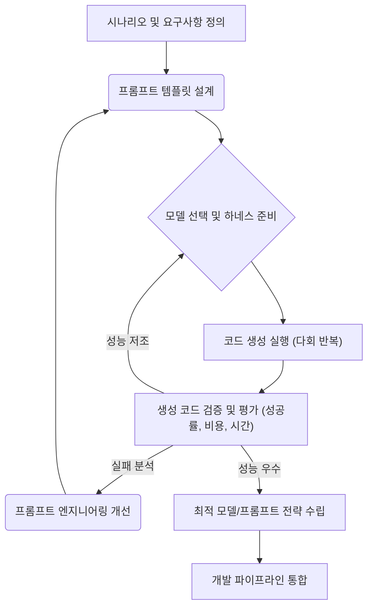

## LLM 코드 생성 비교의 중요성 및 활용
코드 생성 LLM의 빠른 발전은 개발 생산성 향상에 기여하지만, 최적의 모델 선택과 프롬프트 엔지니어링 전략 수립은 여전히 도전 과제이다. 다양한 LLM의 코드 생성 능력, 비용, 속도를 체계적으로 비교 분석하는 것은 이러한 문제 해결의 핵심이다. 특히 복잡한 애플리케이션 개발에서 모델별 강점과 약점을 파악하는 것은 자원 효율성을 극대화하고 최종 코드 품질을 보장하는 데 필수적이다. 긱뉴스에서 언급된 GPT-5.6, Grok 4.5, Claude Fable 5, Muse Spark 등의 모델 비교 사례는 특정 복잡도 및 유형의 코딩 작업에서 각 모델의 성능 편차를 명확히 보여준다.

### 모델 선택의 전략적 접근
단일 LLM이 모든 코드 생성 시나리오에 최적인 경우는 드물다. Raycaster 미로 게임이나 3D Rubik's Cube와 같은 복잡한 과제에서는 GPT-5.6 Sol과 Claude Fable 5가 선두를 다투는 반면, 단순 계산기나 Conway's Game of Life와 같은 작업에서는 다른 모델들이 비용 효율성 측면에서 우위를 보일 수 있다. 이러한 비교 결과는 특정 하위 작업(subtask)에 맞춰 최적의 모델을 선택하는 멀티-LLM 전략의 근거가 된다.

#### 성능 및 비용 분석
모델 비교 시 단순히 성공 횟수뿐만 아니라, 각 시도에 소요된 비용과 시간도 중요한 평가 지표다.
*   **성공률**: 주어진 문제 해결 능력의 직접적인 지표. 복잡도 높은 문제에서 각 모델의 실패 패턴 분석이 중요.
*   **토큰 비용**: 생성된 코드의 길이와 모델별 토큰당 가격을 고려한 총 비용. 특히 대규모 프로젝트에서 누적 비용은 무시할 수 없는 요소.
*   **응답 시간**: 코드 생성 요청부터 결과물 수신까지의 시간. 실시간 상호작용이 필요한 개발 환경에서는 latency가 중요.

### 프롬프트 엔지니어링의 정교화
모델 비교를 통해 특정 모델이 특정 유형의 오류를 자주 발생시키거나, 특정 코드 패턴을 선호한다는 인사이트를 얻을 수 있다. 이를 바탕으로 프롬프트 엔지니어링 기법을 세밀하게 조정하여 모델의 약점을 보완하고 강점을 극대화할 수 있다. 예를 들어, 특정 모델이 Boilerplate 코드에 강하지만 복잡한 알고리즘 구현에 약하다면, 해당 모델에게는 Boilerplate 코드 생성을 맡기고 알고리즘 부분에는 상세한 지시와 예시를 제공하는 방식으로 프롬프트를 구성할 수 있다.

```python
# 코드 생성 성능 비교를 위한 프롬프트 및 평가 스크립트 예시 (Pseudo-code)

# scenario_definitions.py
SCENARIOS = {
    "raycaster_maze": {
        "description": "파이썬으로 Raycaster 미로 게임을 구현하는 코드",
        "prompt_template": "Python으로 Raycaster 미로 게임을 구현하는 코드를 작성해주세요. Pygame 라이브러리를 사용하며, 기본적인 미로 구조와 플레이어 이동, 벽 렌더링을 포함해야 합니다. 화면 해상도는 800x600으로 설정하고, 텍스처는 단순한 색상으로 표현합니다.",
        "test_cases": [
            "import pygame",
            "pygame.init()",
            "def draw_map(screen, player_pos, maze):",
            "ray_casting_logic()"
        ],
        "expected_keywords": ["pygame", "raycasting", "maze", "player", "wall"]
    },
    "simple_calculator": {
        "description": "HTML, CSS, JavaScript로 간단한 웹 계산기 구현",
        "prompt_template": "HTML, CSS, JavaScript를 사용하여 사칙연산이 가능한 간단한 웹 계산기를 구현해주세요. 숫자는 0-9까지, 연산자는 +, -, *, /를 포함합니다. UI는 버튼 형태로 구성하며, 결과는 입력창에 표시됩니다.",
        "test_cases": [
            "<button id=\"add\">",
            "function calculate()",
            "document.getElementById('display').value"
        ],
        "expected_keywords": ["html", "css", "javascript", "calculator", "button"]
    }
}

# llm_code_generator.py
import openai # 예시: 실제로는 각 모델 API 호출
import anthropic # 예시: 실제로는 각 모델 API 호출

class LLMCodeGenerator:
    def __init__(self, model_name):
        self.model_name = model_name

    def generate_code(self, prompt, max_tokens=2000):
        # 실제 모델 API 호출 로직
        if "gpt" in self.model_name.lower():
            response = openai.chat.completions.create(
                model=self.model_name,
                messages=[{"role": "user", "content": prompt}],
                max_tokens=max_tokens
            )
            return response.choices[0].message.content
        elif "claude" in self.model_name.lower():
            response = anthropic.messages.create(
                model=self.model_name,
                max_tokens=max_tokens,
                messages=[{"role": "user", "content": prompt}]
            )
            return response.content[0].text
        else:
            return f"Unsupported model: {self.model_name}"

# evaluation_script.py
import time
import os

def evaluate_code(code, scenario_config):
    # 코드 유효성 검사 (정규식, 키워드 포함 여부 등)
    # 실제로는 테스트 프레임워크 (unittest, pytest 등)를 활용하여 실행 검증
    is_valid = True
    feedback = []

    for test in scenario_config["test_cases"]:
        if test not in code:
            is_valid = False
            feedback.append(f"Missing expected code snippet: {test}")

    for keyword in scenario_config["expected_keywords"]:
        if keyword not in code.lower():
            is_valid = False
            feedback.append(f"Missing expected keyword: {keyword}")

    # 추가적인 린팅, 정적 분석, 실행 테스트 로직 포함 가능
    # try:
    #     exec(code) # 실제 실행은 보안 문제로 샌드박스 환경에서
    # except Exception as e:
    #     is_valid = False
    #     feedback.append(f"Execution error: {str(e)}")

    return is_valid, feedback

def run_comparison(models, scenarios, num_trials=5):
    results = {}
    for model_name in models:
        results[model_name] = {}
        generator = LLMCodeGenerator(model_name)

        for scenario_name, config in scenarios.items():
            scenario_results = []
            for i in range(num_trials):
                start_time = time.time()
                generated_code = generator.generate_code(config["prompt_template"])
                end_time = time.time()
                duration = end_time - start_time

                # 가상의 비용 계산 (토큰 수 * 토큰당 가격)
                # 실제로는 토큰 계산 API 또는 라이브러리 사용
                dummy_tokens = len(generated_code) // 4 # 대략적인 토큰 수
                dummy_cost_per_token = 0.00001 # 예시
                cost = dummy_tokens * dummy_cost_per_token

                is_valid, feedback = evaluate_code(generated_code, config)

                scenario_results.append({
                    "trial": i + 1,
                    "code": generated_code,
                    "is_valid": is_valid,
                    "feedback": feedback,
                    "duration_sec": duration,
                    "cost_usd": cost
                })
            results[model_name][scenario_name] = scenario_results
    return results

if __name__ == "__main__":
    MODELS_TO_COMPARE = ["gpt-4o", "claude-3-opus-20240229"] # 2026년 가상의 최신 모델명으로 가정
    
    print("Starting LLM Code Generation Comparison...")
    comparison_results = run_comparison(MODELS_TO_COMPARE, SCENARIOS, num_trials=3)
    
    for model, scenarios_data in comparison_results.items():
        print(f"\n--- Model: {model} ---")
        for scenario, trials_data in scenarios_data.items():
            success_count = sum(1 for t in trials_data if t["is_valid"])
            avg_duration = sum(t["duration_sec"] for t in trials_data) / len(trials_data)
            avg_cost = sum(t["cost_usd"] for t in trials_data) / len(trials_data)
            print(f"  Scenario: {scenario}")
            print(f"    Success Rate: {success_count}/{len(trials_data)}")
            print(f"    Avg Duration: {avg_duration:.2f} sec")
            print(f"    Avg Cost: ${avg_cost:.6f}")
            # 첫 번째 실패 케이스의 피드백을 출력하여 디버깅에 도움
            for trial in trials_data:
                if not trial["is_valid"]:
                    print(f"      First failed trial feedback: {trial['feedback']}")
                    break

```

### LLM 코드 생성 비교 워크플로우
LLM 코드 생성 비교는 단순한 일회성 작업이 아니라, 지속적인 개선을 위한 반복적인 워크플로우를 따른다.



## 트레이드오프

*   **정확도 vs. 비용**: 고성능 모델(예: Claude Fable 5, GPT-5.6 Sol)은 복잡한 코드 생성에서 높은 정확도를 보이지만, 토큰 비용이 높다.
    *   **언제 좋은가**: 미션 크리티컬한 핵심 로직, 복잡한 아키텍처, 버그 발생 시 큰 비용이 수반되는 경우.
    *   **언제 나쁜가**: 단순한 유틸리티 코드, Boilerplate 생성, 빠른 프로토타이핑, 비용 제약이 강한 경우.
*   **단일 모델 vs. 멀티 모델 전략**: 모든 작업을 하나의 최상위 모델에 맡기는 것은 단순하지만 비효율적일 수 있다. 특정 하위 작업에 최적화된 여러 모델을 활용하는 멀티 모델 전략은 복잡도를 높이지만 효율성을 개선한다.
    *   **언제 좋은가**: 다양한 유형의 코드 생성 요구사항이 있고, 각 작업에 최적화된 모델을 분리하여 비용 효율성과 성능을 동시에 추구할 때.
    *   **언제 나쁜가**: 관리 오버헤드가 크거나, 통합 복잡도가 시스템 안정성을 위협할 때, 혹은 단일 모델로도 충분한 성능과 비용 효율성을 달성할 수 있을 때.
*   **프롬프트 복잡도 vs. 모델 자율성**: 매우 상세하고 구체적인 프롬프트는 모델이 의도한 대로 동작할 확률을 높이지만, 프롬프트 엔지니어링에 드는 시간과 비용이 증가한다. 반면, 추상적인 프롬프트는 모델의 자율성에 의존하게 되며 예측 불가능성이 커진다.
    *   **언제 좋은가**: 모델의 자율성만으로는 정확한 결과를 보장하기 어렵거나, 특정 라이브러리/프레임워크 사용이 필수적인 경우.
    *   **언제 나쁜가**: 모델이 이미 해당 도메인에 대한 충분한 지식을 가지고 있어 불필요한 제약이 모델의 창의성을 저해할 수 있는 경우.
*   **실시간 검증 vs. 사후 분석**: 코드 생성 즉시 유효성을 검증하고 피드백을 반영하는 실시간 검증은 개발 주기를 단축하지만, 검증 시스템 구축 및 유지보수 비용이 높다. 반면, 일정 주기마다 일괄적으로 생성된 코드를 사후 분석하는 방식은 효율적이지만 피드백 지연이 발생한다.
    *   **언제 좋은가**: CI/CD 파이프라인에 통합되어 지속적인 품질 보증이 필요한 경우, 혹은 버그가 즉시 수정되어야 하는 환경.
    *   **언제 나쁜가**: 프로토타이핑 단계, 혹은 코드의 중요도가 낮아 느린 피드백 주기가 허용될 때.

## 실전 체크리스트

*   - [ ] **모델 선택 기준 명확화**: 각 코드 생성 시나리오(예: 웹 UI, 백엔드 API, 데이터 처리 스크립트)에 대해 성공률, 토큰 비용, 응답 시간을 포함한 명확한 LLM 모델 선택 기준을 수립했는가?
*   - [ ] **하위 작업별 LLM 매핑**: 복잡한 개발 과제를 논리적인 하위 작업으로 분해하고, 각 하위 작업에 가장 적합한 LLM(모델명 및 버전)을 매핑하는 전략을 정의하고 문서화했는가?
*   - [ ] **프롬프트 템플릿 최적화 주기**: 모델 비교 결과에서 도출된 인사이트를 바탕으로, 최소 월 1회 이상 주요 프롬프트 템플릿의 성능을 검토하고 최적화하는 프로세스를 확립했는가?
*   - [ ] **코드 검증 파이프라인 통합**: 생성된 LLM 코드를 자동으로 검증(정적 분석, 린팅, 단위 테스트, 통합 테스트)하는 CI/CD 파이프라인을 구축하고, 검증 실패 시 LLM으로 피드백 루프를 연결했는가?
*   - [ ] **비용 및 성능 모니터링 시스템**: 각 LLM 호출에 대한 실제 비용과 응답 시간을 측정하고 시각화하는 모니터링 시스템을 구축하여, 예산 초과 또는 성능 저하 징후를 조기에 감지할 수 있는가?
*   - [ ] **모델 페일오버/폴백 전략**: 특정 LLM 모델의 API 지연, 오류 또는 비용 증가 시 자동으로 다른 모델로 전환하거나 폴백하는 전략(예: `llm-api-dependency-reassessment-model-diversification`)을 구현했는가?
*   - [ ] **Human-in-the-Loop 피드백**: LLM이 생성한 코드를 개발자가 검토하고 수정하는 과정에서 얻은 피드백을 수집하여 프롬프트 개선 및 모델 선택에 반영하는 체계를 마련했는가?