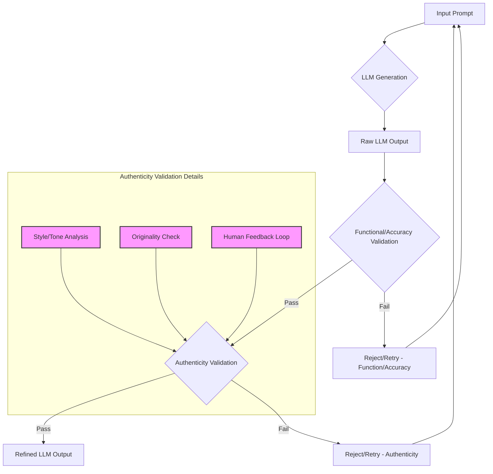

LLM (Large Language Model)이 생성한 텍스트의 양이 폭발적으로 증가하면서, 단순한 정보 전달을 넘어 독자의 공감과 신뢰를 얻는 '진정성 (Authenticity)'의 중요성이 부각되고 있습니다. 긱뉴스 기사 '독자의 반란'이 시사하듯이, AI가 대신 작성한 글은 독자가 기대하는 글쓴이의 고유한 목소리와 깊이를 훼손하여 글쓰기의 본질적인 목적을 무너뜨릴 수 있습니다. 따라서 LLM 출력 검증 파이프라인에 진정성 지표를 추가하고, 프롬프트 엔지니어링 기법을 개선하여 LLM이 더욱 자연스럽고 인간적인 글을 생성하도록 유도하는 것은 2026년 콘텐츠 전략의 핵심 과제입니다.

## 진정성 지표 도입의 필요성

기존 LLM 출력 검증은 주로 사실적 정확성, 문법적 오류, 특정 키워드 포함 여부 등 정량적인 지표에 집중했습니다. 그러나 콘텐츠의 '품질'은 이러한 요소 외에 독자와의 정서적 연결, 글쓴이의 개성, 그리고 신뢰성에서 나옵니다. LLM이 생성한 글은 종종 패턴화된 표현, 과도한 일반화, 감정 없는 톤으로 인해 'AI 냄새 (AI Smell)'를 풍기며 독자에게 거리감을 줄 수 있습니다. 진정성 지표는 이러한 인공적인 패턴을 감지하고, 글쓴이의 고유한 스타일과 가치를 반영하는 텍스트를 생성하도록 유도하는 데 필수적입니다.

### 진정성 측정 접근 방식

진정성은 추상적인 개념이지만, 여러 차원에서 정량화 및 정성화를 시도할 수 있습니다.

*   **어조 및 스타일 일관성 (Tone and Style Consistency):** 특정 저자나 브랜드의 기존 텍스트 데이터셋을 학습하여, LLM 출력이 그들의 고유한 어조, 문체, 어휘 사용 빈도 등과 얼마나 일치하는지 평가합니다. 텍스트 임베딩과 코사인 유사도, 스타일 지표 (예: 읽기 쉽기 지수, 문장 길이 분포, 특정 관용구 사용) 분석을 활용할 수 있습니다.
*   **개성 및 독창성 (Individuality and Originality):** 다른 일반적인 LLM 생성 텍스트와의 유사성을 분석하여 독창성을 측정합니다. 흔한 표현이나 클리셰 사용을 감지하고, 특정 주제에 대한 고유한 관점이나 통찰력이 포함되어 있는지 평가합니다.
*   **감정 표현의 자연스러움 (Naturalness of Emotional Expression):** 텍스트 내에서 감정적 요소가 얼마나 자연스럽게 표현되었는지 분석합니다. 기계적인 감정 주입이 아닌, 맥락에 맞는 미묘한 감정 변화를 포착하는 것이 중요합니다.
*   **휴먼 피드백 루프 (Human Feedback Loop):** 가장 직접적인 방법으로, 실제 독자나 전문 에디터가 진정성을 직접 평가하는 시스템을 통합합니다. 이 피드백은 모델 재학습 또는 프롬프트 개선을 위한 귀중한 데이터가 됩니다.

## 프롬프트 엔지니어링 개선을 통한 진정성 확보

LLM이 진정성 있는 텍스트를 생성하도록 유도하는 핵심은 섬세한 프롬프트 엔지니어링에 있습니다. 단순한 지시를 넘어, LLM이 글쓴이의 페르소나와 의도를 깊이 이해하도록 가이드해야 합니다.

### 페르소나 및 스타일 가이드라인 강화

프롬프트에 구체적인 페르소나와 스타일 가이드라인을 명시적으로 포함합니다. 예를 들어, 'Claude Code' 하네스 내 가이드라인을 강화하는 방식으로 적용할 수 있습니다.

```markdown
Your Role: Act as a seasoned software architect with 15+ years of experience, known for practical, no-nonsense advice and a slightly cynical but ultimately helpful tone.
Target Audience: Mid-level to senior developers seeking actionable insights, not academic theory.
Style Constraints:
- Use active voice predominantly.
- Avoid overly enthusiastic or marketing-speak language.
- Incorporate subtle humor or self-deprecation where appropriate.
- Reference real-world project challenges and common pitfalls.
- Prioritize clarity and conciseness. Each sentence must add value.
- Do not use phrases like "I hope this helps" or "In conclusion."
- Use specific analogies related to software development or engineering.
```

이러한 가이드라인은 LLM이 생성할 텍스트의 어조, 어휘, 문장 구조 전반에 걸쳐 일관된 '인격'을 부여합니다.

### '인공적인' 패턴 회피 지시

LLM이 흔히 사용하는 패턴을 명시적으로 피하도록 지시하는 것도 효과적입니다.

```markdown
Avoid generic opening phrases such as "In today's fast-paced world" or "It is important to note."
Minimize the use of bullet-point lists for conceptual explanations; prefer narrative paragraphs.
Do not explicitly state that you are an AI or language model.
Ensure that conclusions offer a unique, forward-looking perspective rather than summarizing.
```

### 반복적 개선을 위한 피드백 루프

진정성 있는 출력을 얻기 위해서는 지속적인 피드백과 프롬프트 수정이 필수적입니다. 초기 출력에 대한 진정성 평가 결과를 바탕으로 프롬프트를 미세 조정하고, 특히 'AI 냄새'가 감지된 부분을 구체적으로 지적하여 LLM이 학습하도록 합니다.

## LLM 출력 진정성 검증 파이프라인

다음 Mermaid 다이어그램은 LLM 출력 검증 파이프라인에 진정성 지표가 어떻게 통합되는지를 보여줍니다. 기존의 기능/정확성 검증과 병렬적으로 또는 순차적으로 진정성 검증 단계를 추가할 수 있습니다.



이 파이프라인은 LLM이 단순히 '옳은' 정보를 제공하는 것을 넘어, '진정성 있는' 방식으로 소통하도록 보장합니다. `Authenticity Validation` 단계에서 실패할 경우, 해당 오류 유형 (예: 'AI 냄새' 감지, 어조 불일치)을 기반으로 프롬프트를 동적으로 수정하여 재생성 요청을 보낼 수 있습니다.

### 코드 예제: 진정성 지표를 포함한 간이 검증

아래 Python 예제는 LLM 출력의 진정성을 평가하는 간단한 함수를 보여줍니다. 실제 시스템에서는 더 복잡한 머신러닝 모델이나 임베딩 기반 유사도 분석을 사용합니다.

```python
import re
import nltk
from nltk.corpus import stopwords
from collections import Counter

nltk.download('stopwords', quiet=True)
nltk.download('punkt', quiet=True)

def calculate_authenticity_score(llm_output: str, author_style_profile: dict) -> float:
    """
    LLM 출력의 진정성 점수를 계산합니다. (간이 예제)
    author_style_profile 에는 작가의 고유한 어휘, 문체 패턴 등이 포함됩니다.
    """
    score = 1.0 # 초기 점수 (1.0 = 100% 진정성)

    # 1. AI Smell 패턴 감지 (간단한 키워드 기반)
    ai_smells = [
        "AI language model", "as an AI", "I can help you", 
        "It is important to note that", "In today's fast-paced world"
    ]
    for smell in ai_smells:
        if smell.lower() in llm_output.lower():
            score -= 0.3 # AI 냄새 감지 시 감점
            print(f"  [DEBUG] AI Smell detected: '{smell}'")
    
    # 2. 어조 및 어휘 일관성 (예: 불용어 제외한 특정 단어 빈도)
    # 실제로는 임베딩 유사도 등을 사용하지만, 여기서는 간이 어휘 일치도를 사용
    output_words = [word.lower() for word in nltk.word_tokenize(llm_output) if word.isalpha()]
    output_words = [word for word in output_words if word not in stopwords.words('english')]
    
    author_keywords = author_style_profile.get('keywords', [])
    if author_keywords:
        matched_keywords = [word for word in output_words if word in author_keywords]
        keyword_match_ratio = len(matched_keywords) / len(author_keywords) if author_keywords else 0
        score += (keyword_match_ratio - 0.5) * 0.2 # 매칭 비율에 따라 가감점 (0.5가 기준점)
        print(f"  [DEBUG] Keyword match ratio: {keyword_match_ratio:.2f}")

    # 3. 문장 길이 다양성 (너무 일관된 문장 길이는 AI 패턴일 수 있음)
    sentences = re.split(r'[.!?]', llm_output)
    sentence_lengths = [len(s.strip().split()) for s in sentences if s.strip()]
    if sentence_lengths:
        std_dev = (sum((x - (sum(sentence_lengths) / len(sentence_lengths))) ** 2 for x in sentence_lengths) / len(sentence_lengths)) ** 0.5
        if std_dev < 3: # 문장 길이 편차가 너무 작으면 감점
            score -= 0.1
            print(f"  [DEBUG] Low sentence length std dev: {std_dev:.2f}")

    return max(0.0, min(1.0, score)) # 점수는 0.0 에서 1.0 사이

# 예시 사용법
author_profile = {
    'keywords': ['cloud-native', 'scalability', 'observability', 'devops', 'microservices'],
    'tone': 'practical, analytical'
}

llm_response_authentic = "Developing cloud-native applications demands a strong focus on observability. Scalability often hinges on a well-designed microservices architecture. DevOps principles are key to accelerating deployment cycles."
llm_response_generic = "As an AI language model, I can provide information. It is important to note that cloud-native development is crucial for modern applications. Scalability is a key factor."

print("--- Authentic-like Response ---")
authenticity_score_1 = calculate_authenticity_score(llm_response_authentic, author_profile)
print(f"Authenticity Score: {authenticity_score_1:.2f}") # 예상: 높은 점수

print("\n--- Generic AI Response ---")
authenticity_score_2 = calculate_authenticity_score(llm_response_generic, author_profile)
print(f"Authenticity Score: {authenticity_score_2:.2f}") # 예상: 낮은 점수
```

## 2026년 트렌드: 진정성 강화 기술

2026년에는 LLM의 진정성을 더욱 정교하게 다듬는 기술들이 발전할 것입니다.

*   **미세 조정 (Fine-tuning) 및 개인화:** 특정 저자의 방대한 글쓰기 데이터로 LLM을 미세 조정하여 그들의 고유한 스타일과 '목소리'를 모방하는 모델이 더욱 보편화될 것입니다. 이는 Few-shot learning과 더불어 개인화된 콘텐츠 생성의 기반이 됩니다.
*   **의미론적 진정성 분석 (Semantic Authenticity Analysis):** 단순히 키워드나 문장 구조를 넘어, 글에 담긴 심층적인 의미, 논리의 전개 방식, 특정 주제에 대한 관점 등을 분석하여 진정성을 평가하는 고급 기술이 개발될 것입니다. 지식 그래프 및 온톨로지 연동을 통해 더 깊은 맥락 이해가 가능해집니다.
*   **멀티모달 진정성 (Multimodal Authenticity):** 텍스트뿐만 아니라 이미지, 음성 등 멀티모달 출력에서도 시각적/청각적 요소의 진정성을 평가하는 시스템이 등장할 것입니다. 예를 들어, 특정 인물의 표정이나 목소리 톤 일관성 등을 분석하여 LLM 생성 미디어의 진정성을 검증합니다.
*   **설명 가능한 AI (Explainable AI, XAI) 기반 진정성 진단:** LLM이 왜 특정 부분을 '인공적으로' 또는 '진정성 있게' 생성했는지 설명할 수 있는 XAI 기술이 진정성 진단에 활용될 것입니다. 이는 프롬프트 엔지니어가 개선점을 명확히 파악하는 데 도움을 줍니다.

## 트레이드오프

### 1. 콘텐츠 품질 및 독자 참여도 향상 vs. 개발 및 운영 복잡성 증가
*   **언제 좋은가 (When Good):** 브랜드 아이덴티티가 중요하거나, 독자와의 깊은 관계 형성이 필요한 블로그, 소셜 미디어 콘텐츠, 개인화된 커뮤니케이션에 적합합니다. 진정성 있는 콘텐츠는 독자의 신뢰를 높이고 참여율을 증대시킬 수 있습니다.
*   **언제 나쁜가 (When Bad):** 단순 정보 전달, 내부 문서 요약, 빠른 초안 작성이 주 목적인 경우 진정성 지표 도입은 과도한 오버헤드가 될 수 있습니다. 복잡한 시스템 구축과 지속적인 관리는 상당한 리소스와 전문성을 요구합니다.

### 2. 고유한 목소리 유지 vs. LLM의 유연성 및 확장성 제약
*   **언제 좋은가 (When Good):** 특정 전문가나 기업의 고유한 '목소리'를 일관되게 유지해야 하는 경우에 강점을 보입니다. LLM이 다양한 주제에 걸쳐 특정 스타일을 일관적으로 적용할 수 있게 합니다.
*   **언제 나쁜가 (When Bad):** 넓은 범위의 다양한 스타일이나 전혀 새로운 주제에 대해 탐색적인 글쓰기를 해야 할 때는 오히려 LLM의 창의성과 유연성을 제한할 수 있습니다. 너무 강한 스타일 제약은 LLM의 잠재력을 완전히 활용하지 못하게 할 수 있습니다.

### 3. 'AI 냄새' 제거 및 신뢰성 확보 vs. 진정성 측정의 주관성 및 오탐 가능성
*   **언제 좋은가 (When Good):** LLM 생성 콘텐츠에 대한 독자의 거부감을 줄이고, 인간이 쓴 글과의 구분을 어렵게 만들어 신뢰도를 높입니다. 이는 LLM의 활용 범위를 넓히는 데 기여합니다.
*   **언제 나쁜가 (When Bad):** 진정성은 본질적으로 주관적인 요소가 강하여, 자동화된 측정 지표만으로는 완벽하게 포착하기 어렵습니다. 오탐 (False Positive)으로 인해 실제 진정성 있는 출력이 거부되거나, 반대로 'AI 냄새'가 충분히 제거되지 못할 수 있습니다. 특히 초기 단계에서는 휴먼 인 더 루프 (Human-in-the-Loop)의 비중이 높아 비용이 증가할 수 있습니다.

## 실전 체크리스트

LLM 출력 검증 파이프라인에 진정성 지표를 추가하고 프롬프트 엔지니어링을 개선하기 위한 실전 체크리스트입니다.

*   [ ] **핵심 페르소나 및 스타일 가이드라인 정의:** LLM이 모방해야 할 구체적인 글쓴이 페르소나 (경험, 어조, 가치관)와 스타일 가이드라인 (문체, 어휘, 문장 구조)을 최소 5가지 이상 명확히 문서화했습니다.
*   [ ] **'AI 냄새' 패턴 라이브러리 구축:** 현재까지 감지된 LLM의 인공적인 패턴 (클리셰 표현, 과도한 일반화, 특정 도입/결론 문구 등) 목록을 최소 10개 이상 수집하고, 이를 감지하는 규칙 또는 모델을 구현했습니다.
*   [ ] **스타일 일관성 평가 지표 구현:** 기존 글쓰기 데이터셋과 LLM 출력 간의 어휘 다양성, 문장 길이 분포, 특정 관용구 사용 빈도 등 최소 3가지 이상의 스타일 일관성 지표를 구현하고 측정 자동화했습니다.
*   [ ] **휴먼 피드백 시스템 통합:** LLM 출력의 진정성을 평가하는 휴먼 에디터 또는 테스터 그룹을 구성하고, 그들의 평가를 정기적으로 수집하여 프롬프트 개선에 반영하는 피드백 루프를 구축했습니다.
*   [ ] **프롬프트 내 '회피 지시' 적용:** LLM이 특정 'AI 냄새' 패턴을 피하도록 프롬프트에 명시적인 지시문 (예: "Avoid verbose introductions", "Do not use phrases like 'As an AI'")을 추가하고 그 효과를 검증했습니다.
*   [ ] **진정성 지표 기반 A/B 테스트 계획:** 새로운 진정성 프롬프트와 기존 프롬프트의 LLM 출력을 대상으로 독자 참여율, 체류 시간 등 사용자 경험 지표에 미치는 영향을 A/B 테스트로 검증할 계획을 수립했습니다.
*   [ ] **모델 미세 조정 전략 검토 (2026 트렌드 반영):** 장기적으로 특정 작가의 스타일을 학습시키기 위한 미세 조정 (Fine-tuning) 데이터셋 구축 가능성을 검토하고, 이를 통해 모델 자체의 진정성 생성 능력을 향상시킬 전략을 수립했습니다.