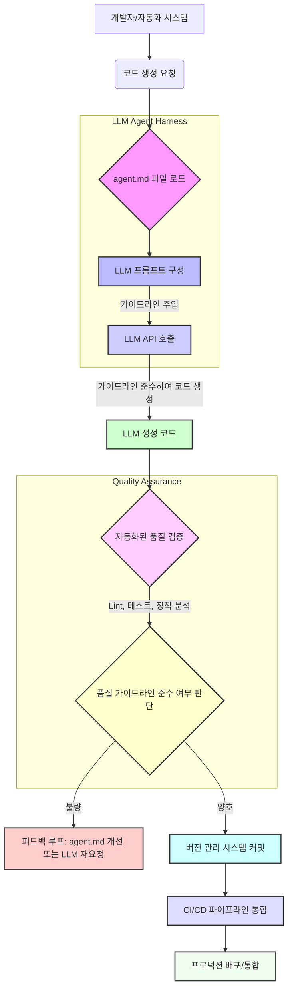

LLM이 생성하는 코드 및 텍스트의 품질은 프로덕션 환경에 직접 적용하기에 여전히 도전 과제를 안고 있습니다. 2025년에는 간단한 컴파일조차 어려웠던 LLM이 2026년에 들어서면서 복잡한 구현 및 버그 분석까지 수행할 수 있게 되었지만, 여전히 스파게티 코드, 부족한 주석, 일관성 없는 구조 등의 문제로 인해 추가적인 정제 작업이 필수적이었습니다. 기존의 수동 코드 리뷰 방식은 반복적이고 시간이 많이 소요되며, LLM 생성물 전반에 걸쳐 일관된 품질을 유지하기 어렵다는 한계가 있었습니다. 이러한 문제들을 해결하고 LLM 아웃풋의 프로덕션 레디니스(production readiness)를 높이기 위한 효과적인 전략 중 하나가 바로 `agent.md`와 같은 구조화된 품질 가이드라인을 활용하는 것입니다. 이 접근 방식은 LLM 에이전트가 보다 자율적으로 고품질의 결과물을 생성하도록 유도하며, 개발 워크플로우를 크게 개선할 수 있습니다.

## 핵심 개념: agent.md를 통한 품질 제어
`agent.md`는 특정 LLM 에이전트 또는 시스템이 준수해야 할 코드 리뷰 지침, 스타일 가이드, 아키텍처 원칙, 보안 가이드라인 등을 상세하게 정의한 마크다운 파일입니다. 이 파일의 핵심 목적은 에이전트의 "암묵적 지식"을 "명시적 규칙"으로 전환하여, LLM이 매번 생성하는 코드 및 텍스트에 일관된 품질 기준을 적용하도록 유도하는 것입니다. `agent.md`의 내용을 LLM API 호출 시 프롬프트에 자동으로 주입함으로써, 에이전트는 해당 지침을 바탕으로 결과물을 생성하게 되며, 이는 수동적인 개입 없이도 아웃풋의 일관성과 프로덕션 적합성을 획기적으로 향상시킵니다. 예를 들어, `PEP 8` 준수, 함수 docstring 포함, 특정 디자인 패턴 사용, 효율적인 데이터 구조 선택 등의 지침을 Python 코드 생성 시 포함하여 LLM이 이를 따르도록 지시할 수 있습니다. 이는 에이전트 기반 개발(Agentic Development) 패러다임에서 제어 가능성(controllability)과 예측 가능성(predictability)을 확보하는 데 필수적인 요소입니다.

## 구현 세부 사항
`agent.md` 파일은 단순한 텍스트 파일이지만, 그 내용은 시스템의 품질 목표를 반영하는 핵심적인 지식 베이스(knowledge base) 역할을 합니다. 다음은 일반적인 `agent.md`의 구성 요소와 예시입니다.

```markdown
# Agent Code Quality Guidelines - Python

## 1. Code Style and Readability
- All Python code MUST adhere to PEP 8 standards, specifically:
    - Use `snake_case` for variables, functions, and modules.
    - Use `PascalCase` for class names.
    - Use `UPPER_SNAKE_CASE` for constants.
- Line length SHOULD NOT exceed 100 characters. Use implicit line continuation (parentheses, brackets, braces) or backslashes for long lines.
- Avoid single-letter variable names unless they are loop counters (`i`, `j`, `k`) or widely recognized mathematical/physical variables.
- Maintain consistent indentation (4 spaces).

## 2. Documentation and Comments
- All public functions, methods, and classes MUST include a comprehensive docstring (NumPy or Google style preferred) explaining:
    - Its purpose and high-level functionality.
    - All arguments, their types, and descriptions.
    - Return values, their types, and descriptions.
    - Any exceptions raised.
    - Simple usage examples.
- Complex or non-obvious logic blocks SHOULD be accompanied by concise inline comments explaining the rationale behind the implementation, not just *what* the code does.
- Avoid redundant comments that merely restate the code.

## 3. Architecture and Design Patterns
- Prefer explicit over implicit.
- Favor composition over inheritance.
- Design functions to be single-responsibility principle (SRP) compliant.
- Utilize common design patterns (e.g., Factory, Singleton - sparingly, Strategy) where appropriate to improve modularity and testability.
- Avoid deep nesting (> 3 levels) of conditional statements or loops. Refactor into smaller, more manageable functions.
- Consider functional programming paradigms for data transformation where applicable.

## 4. Error Handling and Robustness
- Use `try...except` blocks for all I/O operations, external API calls, and potentially risky computations.
- Catch specific exception types. A bare `except` clause is generally discouraged unless re-raising the exception after logging.
- Log error details comprehensively, including full stack traces, timestamps, and relevant context, using a structured logging approach (e.g., `logging` module).
- Implement graceful degradation where possible, providing fallback mechanisms for external service failures.

## 5. Security Best Practices
- Avoid hardcoding sensitive credentials or API keys directly in the code. Use environment variables, a secret management service (e.g., AWS Secrets Manager, HashiCorp Vault), or secure configuration files.
- Sanitize all user-supplied inputs to prevent common vulnerabilities such as SQL injection, Cross-Site Scripting (XSS), and path traversal.
- Ensure proper resource cleanup (e.g., closing file handles, database connections, network sockets) to prevent resource leaks.
- Validate and restrict file uploads by type, size, and content to mitigate malware and other risks.
```

이 `agent.md` 파일을 LLM 프롬프트에 동적으로 삽입하는 방법은 다양합니다. Anthropic의 Claude API를 사용하는 경우, 시스템 프롬프트(system prompt)의 일부로 `agent.md`의 내용을 직접 포함시키거나, 사용자 메시지 앞에 Pre-amble 형태로 삽입할 수 있습니다. 중요한 것은 LLM이 이 가이드라인을 "최우선적으로" 고려하도록 프롬프트의 구조를 설계하는 것입니다.

### 코드 예제 (Python with Claude API)

```python
import anthropic
import os

# agent.md 파일 내용 로드
try:
    with open("agent.md", "r", encoding="utf-8") as f:
        agent_guidelines = f.read()
except FileNotFoundError:
    print("Error: agent.md not found. Please create the file.")
    exit()

# API Key는 환경 변수에서 로드하는 것이 보안상 권장됩니다.
# export ANTHROPIC_API_KEY="sk-..."
client = anthropic.Anthropic(
    api_key=os.environ.get("ANTHROPIC_API_KEY"),
)

def generate_code_with_guidelines(prompt: str, guidelines: str) -> str:
    """
    Generates Python code using an LLM, strictly incorporating specified quality guidelines.

    Args:
        prompt (str): The user's request for code generation.
        guidelines (str): The content of the agent.md file containing quality guidelines.

    Returns:
        str: The generated Python code, adhering to the guidelines.
    """
    system_prompt = f"""
    You are an expert software engineer specialized in Python development.
    Your primary directive is to generate clean, robust, and production-ready Python code.
    You MUST strictly adhere to the following comprehensive code quality guidelines provided below.
    Prioritize these guidelines over any implicit assumptions.

    <code_quality_guidelines>
    {guidelines}
    </code_quality_guidelines>

    Please provide only the executable Python code, enclosed within a markdown code block.
    Do not include any conversational text outside the code block unless explicitly requested.
    """
    
    try:
        response = client.messages.create(
            model="claude-3-5-sonnet-20240620", # Claude의 최신 고성능 모델 사용 권장
            max_tokens=2000,
            temperature=0.7, # 창의성과 일관성 사이의 균형
            system=system_prompt,
            messages=[
                {"role": "user", "content": prompt}
            ]
        )
        return response.content[0].text
    except anthropic.APIError as e:
        print(f"Anthropic API Error: {e}")
        return f"Error generating code: {e}"

user_code_request = "Implement a Python class called `UserManager` to manage user data (id, name, email). It should support adding new users, retrieving a user by ID, updating a user's email, and listing all users. Ensure proper error handling for non-existent users and data validation for email format. The code should be well-commented and follow PEP 8."
generated_code = generate_code_with_guidelines(user_code_request, agent_guidelines)
print(generated_code)
```

### Mermaid 다이어그램: `agent.md` 기반 LLM 코드 생성 및 품질 관리 워크플로우



## 2026년 최신 트렌드 반영
2026년에는 LLM 에이전트가 더욱 자율적으로 복잡한 태스크를 수행하며, 자기 개선(self-correction) 능력이 강화될 것으로 예상됩니다. `agent.md`와 같은 명시적 가이드라인은 이러한 에이전트의 행동을 제약하고 품질을 제어하는 핵심 메커니즘으로 자리 잡을 것입니다. 특히, 다중 에이전트 시스템(Multi-Agent Systems) 환경에서는 각 에이전트의 역할과 책임에 따라 맞춤형 `agent.md`를 적용하여 전체 시스템의 일관성과 신뢰성을 확보하는 데 기여할 것입니다. 이는 단순히 코드 생성뿐만 아니라, 아키텍처 설계, 문서 작성, 테스트 케이스 생성 등 다양한 LLM 아웃풋에 확장 적용될 수 있습니다.

또한, 에이전트가 생성한 코드가 CI/CD 파이프라인에 통합되기 전, `agent.md`에 명시된 규칙 기반의 자동화된 정적 분석 도구(예: SonarQube, Pylint) 및 동적 테스트 프레임워크(예: Pytest)를 통해 자동으로 검증될 것입니다. 이러한 통합은 LLM 생성 코드의 신뢰성을 더욱 높이고, 개발 워크플로우의 효율성을 극대화하며, 최종적으로 프로덕션 환경에서의 예상치 못한 문제 발생 가능성을 줄이는 데 중요한 역할을 합니다. `agent.md`는 에이전트가 학습하고 적응하는 과정에서 '도덕적 나침반' 역할을 수행하며, 장기적인 에이전트 행동 제어 및 진화에 필수적인 요소로 간주됩니다.

## 트레이드오프

### 1. 초기 설정 및 유지보수 복잡성
- **언제 좋고:** LLM 에이전트가 생성하는 코드의 품질 일관성, 보안, 특정 아키텍처 패턴 준수 등이 매우 중요한 대규모 프로젝트나 엄격한 규제 준수를 요구하는 산업(금융, 의료 등) 환경에서 강력한 이점을 제공합니다. 초기 설정 및 지속적인 유지보수 비용을 상회하는 장기적인 품질 향상 및 위험 감소 이득을 얻을 수 있습니다.
- **언제 나쁜지:** 소규모의 실험적인 프로젝트, 빠른 프로토타이핑이 주 목적인 경우, 또는 `agent.md`의 효과를 검증할 수 있는 품질 측정 지표가 명확하지 않은 경우에는 `agent.md` 작성, 통합, 그리고 지속적인 업데이트에 드는 시간과 노력이 불필요한 오버헤드가 될 수 있습니다. 이는 개발 속도를 저해할 수 있습니다.

### 2. LLM의 가이드라인 해석 능력 의존성
- **언제 좋고:** Claude 3.5 Sonnet, GPT-4o 등 복잡한 자연어 추론 능력이 뛰어난 최신 고성능 LLM을 사용하는 경우, 상세하고 명확하게 작성된 `agent.md`를 효과적으로 해석하고 코드 생성에 일관되게 적용할 수 있습니다. 이는 LLM의 능력을 최대한 활용하여 고품질 결과물을 얻는 데 기여합니다.
- **언제 나쁜지:** 구형 모델, 성능이 낮은 LLM, 또는 컨텍스트 윈도우가 제한적인 모델은 `agent.md`의 내용을 정확히 이해하거나 일관되게 적용하지 못할 수 있습니다. 모호하거나 너무 추상적으로 작성된 가이드라인은 LLM의 오해를 유발하여 의도치 않은 결과를 초래하거나, 아예 가이드라인을 무시하게 만들 위험도 있습니다.

### 3. 프롬프트 컨텍스트 길이 및 비용 증가
- **언제 좋고:** `agent.md` 파일이 간결하고 핵심적인 내용에 집중되어 LLM의 컨텍스트 윈도우 한계 내에서 효과적으로 작동하며, 이를 통해 얻는 품질 향상 대비 API 호출 비용 증가가 합리적인 수준일 때 효율적입니다. 중요한 핵심 가이드라인에 집중하여 파일 크기를 최적화할 경우, 가치 대비 비용 효율성이 높습니다.
- **언제 나쁜지:** `agent.md` 파일이 방대해져 LLM 프롬프트의 전체 컨텍스트 길이가 지나치게 길어지면, API 호출 비용이 급증하고 LLM의 추론 지연 시간(latency)이 길어질 수 있습니다. 또한, 너무 많은 정보는 LLM의 집중력을 분산시켜 핵심 가이드라인을 간과하게 만들거나, 프롬프트 엔지니어링의 효과를 감소시킬 수 있습니다.

### 4. 동적 변경 및 버전 관리의 어려움
- **언제 좋고:** `agent.md`를 Git과 같은 분산 버전 관리 시스템으로 관리하면, 가이드라인의 변경 이력을 투명하게 추적하고, 팀 내에서 변경 사항을 공유하며, 코드베이스의 진화와 함께 가이드라인을 체계적으로 발전시킬 수 있습니다. 코드와 함께 버전 관리되어 일관성이 유지될 때 효과적입니다.
- **언제 나쁜지:** `agent.md`의 내용이 너무 자주 변경되거나, 여러 에이전트 및 프로젝트에서 서로 다른 커스터마이징된 버전을 사용해야 할 경우, 동기화 및 관리 오버헤드가 발생할 수 있습니다. 특히, `agent.md` 변경 사항이 LLM의 생성 아웃풋에 미치는 영향을 정확히 예측하고 검증하는 것이 어려워질 수 있으며, 이는 예상치 못한 품질 저하로 이어질 수 있습니다.

### 5. LLM의 자율성 제약
- **언제 좋고:** 특정 형식이나 엄격한 표준 준수가 필수적인 도메인(예: 보안 감사 코드, 특정 프레임워크 템플릿)에서는 `agent.md`가 LLM의 자유도를 제한하여 예측 가능하고 신뢰할 수 있는 결과물을 얻는 데 도움을 줍니다. 이는 일관된 아웃풋이 창의성보다 중요한 경우에 적합합니다.
- **언제 나쁜지:** LLM의 창의성과 문제 해결 능력을 최대한 활용해야 하는 탐색적 개발, 아이디어 구상, 새로운 알고리즘 발명 등의 작업에서는 `agent.md`가 오히려 LLM의 유연성과 혁신적인 접근을 저해할 수 있습니다. 너무 많은 제약은 LLM의 잠재력을 억압할 수 있습니다.

## 실전 체크리스트

- [ ] **`agent.md` 내용 구체화 및 주기적 검토:** 생성할 코드/텍스트의 유형과 목표에 맞춰 코드 스타일, 주석 규칙, 에러 처리, 보안, 성능 최적화 등 핵심 품질 지침을 명확하고 구체적으로 정의하고, 분기별로 관련 팀과 함께 내용을 검토 및 업데이트하고 있는가?
- [ ] **프롬프트 주입 메커니즘 자동화:** LLM API 호출 시 `agent.md` 내용을 시스템 프롬프트 또는 사용자 프롬프트의 전처리 단계에서 자동으로 로드하고 주입하는 견고한 자동화 메커니즘을 구현했는가? (예: `Playbook Harness` 통합)
- [ ] **컨텍스트 윈도우 및 비용 최적화 전략:** `agent.md`의 길이가 LLM의 컨텍스트 윈도우 제약과 API 호출 비용에 미치는 영향을 정량적으로 분석하고, 필요한 경우 가이드라인을 모듈화하거나 중요도에 따라 동적으로 삽입하는 전략을 수립했는가?
- [ ] **생성 아웃풋 품질 자동 측정 및 평가 지표:** `agent.md` 적용 전후의 LLM 생성 코드 품질을 평가할 수 있는 구체적이고 자동화 가능한 지표 (예: Lint 점수, 정적 분석 도구 경고 수, 단위 테스트 통과율, Cyclomatic Complexity, 보안 취약점 스캔 결과)를 정의하고, CI/CD 파이프라인에 통합하여 측정하고 있는가?
- [ ] **A/B 테스트 또는 제어된 비교 실험 수행:** `agent.md`를 적용한 LLM과 적용하지 않은 LLM의 생성 아웃풋을 일정 기간 동안 비교하거나, 특정 작업에 대해 A/B 테스트를 수행하여 품질 향상 효과를 정량적 데이터로 검증했는가?
- [ ] **`agent.md` 버전 관리 및 변경 프로세스 구축:** `agent.md` 파일을 코드베이스와 함께 Git 저장소에 포함하고, Pull Request 기반의 변경 검토 및 승인, 릴리즈 노트 작성 등 명확한 버전 관리 및 변경 관리 프로세스를 수립하여 팀 내 일관성을 유지하고 있는가?
- [ ] **지속적인 피드백 루프 및 자가 개선 시스템 설계:** `agent.md`가 생성 코드 품질에 미치는 영향을 지속적으로 모니터링하고 (예: 대시보드), 개발자 피드백, 자동화된 품질 검증 결과 등을 바탕으로 `agent.md` 자체를 개선할 수 있는 피드백 루프(feedback loop) 및 자가 개선 시스템(self-improvement system)을 설계하고 운영하고 있는가?