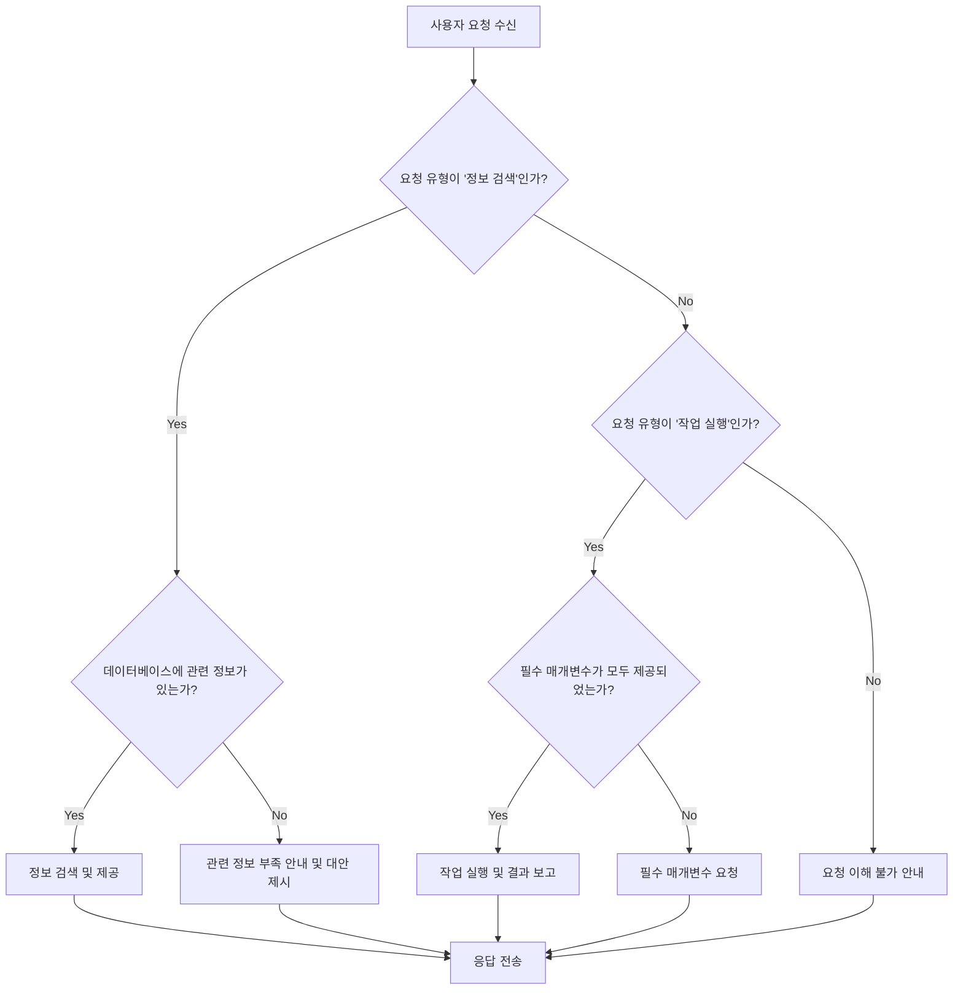

대규모 언어 모델 (LLM)의 응답은 복잡한 의사결정이나 정밀한 조건 검토가 필요한 시나리오에서 예측 불가능하거나 부정확할 수 있습니다. 이러한 문제를 해결하기 위해 LLM 프롬프트에 불리언 로직을 통합하는 것은 AI의 판단 구조를 통제하고 출력의 정확성을 극대화하는 핵심 전략입니다. 특히 법률 AI와 같이 높은 신뢰성과 일관성이 요구되는 분야에서는 단순한 키워드 매칭을 넘어선 논리적 제어가 필수적입니다.

## 핵심 개념: LLM 프롬프트와 불리언 로직
LLM은 자연어 처리 능력이 뛰어나지만, 특정 조건이나 규칙에 따라 엄격하게 추론하도록 지시하는 것은 여전히 도전 과제입니다. 불리언 로직은 AND, OR, NOT과 같은 연산자를 통해 명확한 조건부 명령을 LLM에 제공함으로써 이러한 제약을 극복합니다. 이는 LLM이 마치 프로그래밍 언어의 조건문처럼 작동하도록 유도하여, 단순한 텍스트 생성기를 넘어선 정교한 추론 도구로 활용될 수 있게 합니다.

### AND 연산자를 활용한 필수 조건 검토
`AND` 연산자는 여러 조건이 모두 충족될 때만 특정 응답이나 행동을 유도하는 데 사용됩니다. 이는 LLM이 중요한 필수 요건들을 빠짐없이 검토하고 종합적으로 판단해야 할 때 유용합니다.

예시: 특정 서비스 계약의 유효성 검토 시
```python
# 프롬프트 예시
"""
다음 서비스 계약서의 유효성을 판단하세요. 계약이 유효하려면 다음 모든 조건을 충족해야 합니다:
1. 서명자의 본인 인증이 완료되었는가? AND
2. 서비스 범위가 명확하게 명시되어 있는가? AND
3. 모든 필수 법적 고지사항이 포함되어 있는가?

각 조건에 대해 '충족' 또는 '미충족'으로 판단하고, 최종 유효성 판단과 그 이유를 설명하세요.

계약서 본문:
[여기에 계약서 내용 삽입]
"""
```
이 방식은 LLM이 각 조건을 개별적으로 확인한 후, 모든 조건이 만족될 때만 '유효'하다고 판단하도록 강제합니다.

### OR 연산자를 활용한 선택적 조건 처리
`OR` 연산자는 여러 대안 조건 중 하나라도 충족되면 특정 응답이나 행동을 유도할 때 사용됩니다. 이는 LLM이 유연하게 여러 선택지 중 하나를 만족하는지 여부를 판단해야 할 때 중요합니다.

예시: 고객 지원 요청 분류 시
```python
# 프롬프트 예시
"""
고객의 문의 내용을 다음 범주 중 하나로 분류하세요:
'제품 기능 문의' OR '결제 오류' OR '배송 지연'.
문의 내용이 어떤 범주에도 해당하지 않으면 '기타'로 분류하세요.

문의 내용: "지난주 주문한 상품이 아직 도착하지 않았습니다."
"""
```
여기서 LLM은 배송 지연이라는 조건에 부합하므로 '배송 지연'으로 분류하게 됩니다.

### NOT 연산자를 활용한 예외 및 배제 조건 정의
`NOT` 연산자는 특정 조건이 충족되지 않을 때만 특정 응답이나 행동을 유도하는 데 사용됩니다. 이는 예외 사항, 면책 사유, 또는 특정 요소의 배제가 필요한 상황에서 LLM이 잘못된 판단을 내리지 않도록 합니다.

예시: 부적절한 콘텐츠 필터링 시
```python
# 프롬프트 예시
"""
다음 텍스트가 '혐오 발언'으로 분류될 수 있는지 판단하세요. 혐오 발언으로 분류되지 않으려면:
혐오 발언 키워드를 포함하지 않아야 합니다. NOT ('욕설' OR '비하' OR '차별').

텍스트: "오늘 날씨가 정말 좋네요!"
"""
```
이 프롬프트는 LLM이 특정 부정적인 키워드가 없는 경우에만 텍스트를 안전하다고 판단하도록 지시합니다.

### 조건부 로직: IF-THEN-ELSE 구조
`IF-THEN-ELSE` 구조는 가장 강력한 불리언 로직 중 하나로, 복잡한 의사결정 흐름을 LLM에 주입할 수 있게 합니다. 이는 특정 사실관계나 증거가 부족하거나, 여러 시나리오에 따라 다른 응답이 필요한 경우에 특히 유용합니다.

Mermaid 다이어그램 예시:


프롬프트 내 IF-THEN-ELSE 구조 예시:
```python
# 프롬프트 예시
"""
다음 정책 문서를 기반으로 질문에 답변하세요. 만약 (IF) 질문이 '보안 규정'에 대한 것이라면, (THEN) '보안 정책 섹션'을 참조하여 답변하고, 그렇지 않으면 (ELSE IF) '개인정보 처리'에 대한 것이라면, (THEN) '개인정보 보호 섹션'을 참조하여 답변하세요. 그 외의 경우 (ELSE) '일반 운영 정책' 섹션을 참조하여 답변하세요.

질문: '사용자 데이터는 어떻게 암호화되나요?'
정책 문서:
[여기에 정책 문서 내용 삽입]
"""
```
이처럼 명시적인 조건부 지시는 LLM이 혼란 없이 정확한 섹션을 참조하여 답변하도록 유도합니다.

## LLM 출력 검증 파이프라인에 불리언 로직 적용
불리언 로직은 프롬프트 설계뿐만 아니라 LLM의 출력 검증 (guard test) 파이프라인에도 핵심적인 역할을 합니다. 생성된 응답이 특정 안전 기준이나 요구사항을 충족하는지 여부를 자동화된 방식으로 확인할 수 있습니다.

예를 들어, LLM이 생성한 법률 자문이 특정 필수 조항 (AND)을 포함하는지, 금지된 문구 (NOT)를 사용하지 않았는지, 또는 여러 대안적 해결책 (OR) 중 하나를 제시했는지 등을 프로그램적으로 검증할 수 있습니다. IF-THEN-ELSE 구조는 특정 응답 패턴에 따라 다른 검증 로직을 적용하는 데 사용될 수 있습니다.

## 트레이드오프

### 1. 복잡성 vs. 정밀도 (Complexity vs. Precision)
*   **언제 좋은가**: LLM의 응답에 높은 수준의 정확성과 조건부 제어가 필요한 경우, 특히 법률, 의료, 금융 등 오류가 치명적인 분야에서 매우 효과적입니다. 모호성을 줄여 예측 가능한 결과를 얻는 데 기여합니다.
*   **언제 나쁜가**: 프롬프트가 과도하게 복잡해지면 작성 및 디버깅이 어려워질 수 있습니다. 간단하고 창의적인 답변이 필요한 일반적인 대화형 AI나 브레인스토밍 도구에는 불필요한 오버헤드가 될 수 있습니다.

### 2. 과도한 명세화 vs. 유연성 (Over-specification vs. Flexibility)
*   **언제 좋은가**: 특정 기준이나 규칙을 엄격하게 준수해야 하는 경우, LLM이 '자유롭게' 해석하여 잘못된 방향으로 응답하는 것을 방지할 수 있습니다. LLM의 잠재적 할루시네이션을 줄이는 데 도움이 됩니다.
*   **언제 나쁜가**: LLM의 창의적이고 유연한 사고를 제한할 수 있습니다. 광범위한 주제에 대한 개방형 탐색이나 새로운 아이디어 생성이 필요한 경우에는 너무 많은 제약이 오히려 방해가 됩니다.

### 3. 성능 vs. 신뢰성 (Performance vs. Reliability)
*   **언제 좋은가**: 중요한 비즈니스 로직이나 안전 critical한 작업에서 응답의 신뢰성을 극대화합니다. 검증 파이프라인에 통합될 경우, 잘못된 출력을 조기에 감지하여 시스템의 전반적인 안정성을 높일 수 있습니다.
*   **언제 나쁜가**: 복잡한 불리언 로직을 포함한 프롬프트는 LLM의 추론 시간을 증가시키고, 토큰 사용량을 늘려 비용을 증가시킬 수 있습니다. 실시간 응답이 필수적인 애플리케이션에서는 성능 저하가 문제가 될 수 있습니다.

### 4. 유지보수성 vs. 제어 (Maintainability vs. Control)
*   **언제 좋은가**: 프롬프트 내에 명확한 로직을 내재화함으로써 LLM의 행동을 강력하게 제어할 수 있습니다. 이는 시스템의 예상치 못한 동작을 줄이고 디버깅을 용이하게 합니다.
*   **언제 나쁜가**: 로직이 복잡해질수록 프롬프트 자체의 유지보수가 어려워질 수 있습니다. 비즈니스 요구사항 변경 시, 프롬프트의 불리언 로직을 업데이트하는 것이 번거로울 수 있으며, 변경 사항이 전체 시스템에 미치는 영향을 예측하기 어려워질 수 있습니다.

## 실전 체크리스트

불리언 로직을 LLM 프롬프트에 적용할 때 다음 사항들을 검증하고 고려해야 합니다.

- [ ] **필수 조건 명확화**: 프롬프트 내에서 `AND` 연산자로 묶인 모든 필수 조건이 모호함 없이 명확하게 정의되었는지 확인합니다.
- [ ] **대안 조건 최적화**: `OR` 연산자를 사용하는 경우, 모든 대안적 조건이 상호 배타적이지 않거나, 의도치 않은 중복 또는 누락이 없는지 검토합니다.
- [ ] **예외 처리 정확성**: `NOT` 연산자가 올바른 예외나 배제 조건을 지정하는지, 그리고 예상치 못한 Side Effect를 유발하지 않는지 테스트합니다.
- [ ] **IF-THEN-ELSE 경로 테스트**: `IF-THEN-ELSE` 구조의 모든 조건 분기 (branch)와 해당 실행 경로에 대해 상세한 테스트 케이스를 작성하고 검증합니다.
- [ ] **토큰 효율성 평가**: 복잡한 불리언 로직이 프롬프트 길이를 과도하게 증가시켜 LLM 비용이나 지연 시간에 영향을 주는지 측정하고 최적화 방안을 모색합니다.
- [ ] **출력 일관성 모니터링**: 불리언 로직 적용 후, 다양한 입력에 대한 LLM 응답의 일관성이 향상되었는지 정량적으로 모니터링합니다.
- [ ] **자동화된 가드 테스트 통합**: 구현된 불리언 로직 기반의 프롬프트를 LLM 출력 검증 파이프라인의 가드 테스트에 통합하여, 잘못된 응답을 자동으로 필터링하고 피드백 루프를 구축합니다.