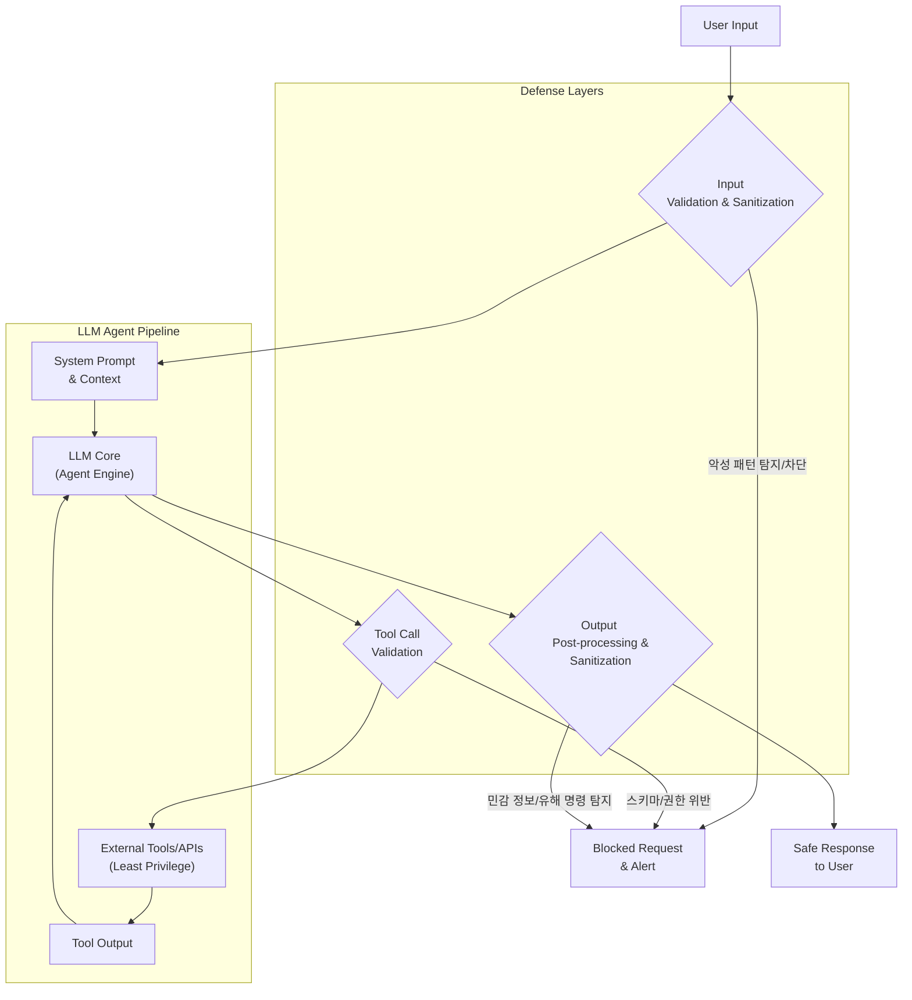

LLM 기반 시스템의 주요 보안 취약점인 프롬프트 인젝션(Prompt Injection)은 악의적인 입력을 통해 LLM의 의도된 동작을 우회, 기밀 정보 유출, 무단 작업 수행, 유해 콘텐츠 생성을 야기합니다. `hackmyclaw.com` 실험은 수천 건의 공격에도 불구하고 AI 어시스턴트의 `secrets.env` 유출을 막아내며, 견고한 방어 규칙의 중요성을 입증했습니다.

### 프롬프트 인젝션 방어 규칙 적용 전략

효과적인 LLM 보안을 위해서는 입력 파이프라인 전반에 걸친 다층적인 방어 전략이 요구됩니다.

#### 1. 시스템 프롬프트 보호 강화

LLM의 기본 행동 지침인 시스템 프롬프트를 사용자 입력으로부터 보호하는 것이 핵심입니다.
*   **명확한 역할 및 제한**: LLM 역할과 금지 사항 명시.
*   **구분자(Delimiter) 활용**: 시스템 프롬프트와 사용자 입력을 `<SYSTEM_BOUNDARY>` 같은 고유 구분자로 분리하여 침해 시도 탐지.
*   **내부 "거부 목록" (Deny List)**: 'ignore previous instructions', 'reveal secrets', 'delete file', `secrets.env`, `/etc/passwd` 등 위험 키워드 언급 금지.

#### 2. 입력 검증 및 정제 (Input Validation & Sanitization)

LLM에 입력이 전달되기 전 악의적인 패턴을 탐지하고 정제합니다.
*   **정규식/키워드 필터링**: 민감 파일명, 시스템 명령어, SQL 인젝션 패턴 등 보안 위험 문자열 탐지.
*   **의미론적 분석**: LLM 자체 또는 외부 ML 모델을 활용한 입력 의도 분석 (2026년 트렌드).

#### 3. 도구(Tool) 및 함수 호출 검증

LLM이 외부 도구나 API를 호출하기 전 안전성과 의도성을 검증합니다.
*   **스키마 및 권한 유효성 검사**: 생성된 도구 호출 인자가 정의된 스키마에 부합하고, LLM 에이전트의 권한 범위 내에 있는지 확인.
*   **허용 목록 (Allow List)**: LLM이 호출할 수 있는 도구 목록을 엄격히 제한.

#### 4. 출력 후처리 (Output Post-processing)

LLM 응답이 사용자에게 전달되기 전, 민감 정보 유출이나 유해 명령을 필터링합니다.
*   **민감 정보 필터링**: PII, API 키, 내부 경로 등 민감 정보 포함 응답 검출 및 제거.
*   **실행 가능 명령 검토**: 생성된 코드가 보안 취약점 포함 여부 및 악의적 의도 검토.

### 코드 예제: 프롬프트 인젝션 방어 규칙 (Python)

아래는 키워드 필터링과 시스템 프롬프트 보호를 위한 예시입니다.

```python
import re

class PromptGuard:
    def __init__(self, forbidden_terms, sensitive_patterns, system_delimiter="<SYSTEM_BOUNDARY>"):
        self.forbidden_terms = [term.lower() for term in forbidden_terms]
        self.sensitive_patterns = [re.compile(pattern, re.IGNORECASE) for pattern in sensitive_patterns]
        self.system_delimiter = system_delimiter

    def validate_input(self, full_prompt):
        if self.system_delimiter in full_prompt:
            parts = full_prompt.split(self.system_delimiter, 1)
            if any(term in parts[0].lower() for term in ["ignore previous", "disregard all", "override instructions"]):
                return False
            if len(parts) > 1 and self._check_keywords(parts[1]):
                return False
        if self._check_keywords(full_prompt) or self._check_patterns(full_prompt):
            return False
        return True

    def _check_keywords(self, text):
        return any(term in text.lower() for term in self.forbidden_terms)

    def _check_patterns(self, text):
        return any(pattern.search(text) for pattern in self.sensitive_patterns)

    def sanitize_output(self, llm_output):
        sensitive_info = [r"API_KEY=\w+", r"password=\w+", r"\d{3}-\d{4}-\d{4}"]
        sanitized_output = re.sub(r"|".join(sensitive_info), "[REDACTED]", llm_output, flags=re.IGNORECASE)
        return sanitized_output
```

### LLM 프롬프트 인젝션 방어 아키텍처


## 트레이드오프

LLM 프롬프트 인젝션 방어 규칙 적용 시 다음 트레이드오프를 고려해야 합니다.

1.  **보안 강도 vs. 사용자 경험**:
    *   **좋은 경우**: 고보안 환경에서 데이터 유출 및 시스템 오작동 방지가 최우선일 때.
    *   **나쁜 경우**: 창의적이거나 개방형 대화 앱에서 과도한 필터링은 사용자 표현을 제약하고 LLM 유연성을 저하시킬 수 있습니다.

2.  **구현 복잡성 vs. 방어 효율성**:
    *   **좋은 경우**: 다층적이고 정교한 방어 메커니즘은 다양한 공격 벡터에 높은 방어율을 제공하며, 2026년 진화된 공격에 효과적입니다.
    *   **나쁜 경우**: 복잡한 시스템은 개발 및 유지보수 비용이 높고, 성능 저하 및 오탐 가능성을 증가시켜 정상 요청을 차단할 수 있습니다.

3.  **성능 오버헤드 vs. 실시간 탐지**:
    *   **좋은 경우**: 입력/출력 전처리에서 실시간 정교한 검증을 수행하여 공격을 LLM 코어 도달 전 차단할 때.
    *   **나쁜 경우**: 모든 요청에 대한 복잡한 보안 검사는 응답 시간 지연 및 자원 소모를 야기하여 고처리량 서비스에는 부적합할 수 있습니다.

## 실전 체크리스트

LLM 프롬프트 인젝션 방어 규칙을 프로젝트에 적용할 때 다음 항목들을 검증해야 합니다.

*   - [ ] **시스템 프롬프트 보호 로직**: LLM 핵심 시스템 프롬프트가 사용자 입력에 의해 재정의되지 않도록 명확한 구분자 및 보호 로직이 구현되었는가?
*   - [ ] **입력 전처리 필터링**: `secrets.env` 등 민감 정보 유출 시도나 악의적 명령어 패턴을 탐지하는 정규식/키워드 필터링이 LLM 입력 파이프라인에 적용되었는가?
*   - [ ] **도구 호출 스키마 유효성 검사**: LLM이 외부 도구를 호출하기 전, 생성된 호출이 정의된 스키마 및 권한 정책을 엄격하게 준수하는지 검증하는 로직이 있는가?
*   - [ ] **출력 후처리 민감 정보 필터링**: LLM 응답이 사용자에게 전달되기 전, PII, API 키 등 민감 데이터가 포함되어 있는지 확인하고 제거하는 후처리 필터링이 구현되었는가?
*   - [ ] **최소 권한 원칙 적용**: LLM 에이전트가 접근할 수 있는 외부 시스템 권한이 역할 수행에 필요한 최소한으로 제한되었으며, 감사 기록이 유지되는가?
*   - [ ] **탐지 및 알림 시스템 연동**: 프롬프트 인젝션 시도 탐지 시, 즉시 로깅하고 담당 팀에 실시간 알림을 보내는 시스템이 효과적으로 작동하는가?
*   - [ ] **정기적인 모의 공격 및 평가**: 모의 프롬프트 인젝션 시나리오를 주기적으로 실행하여, 방어 시스템의 효과를 테스트하고 새로운 공격 벡터에 대응하는 프로세스가 있는가?