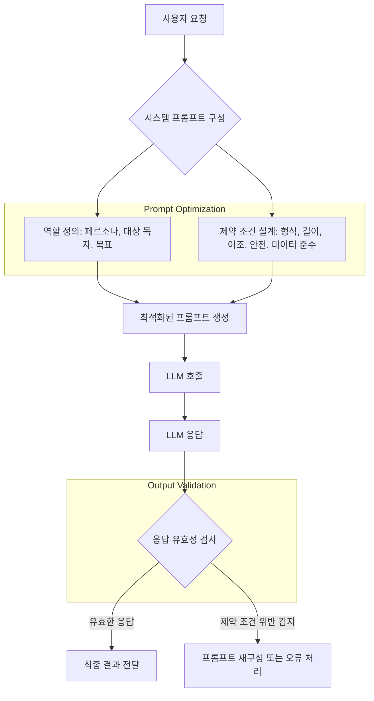

LLM 시스템의 성능과 신뢰성을 극대화하기 위한 핵심 전략 중 하나는 프롬프트 최적화입니다. 특히, 명확한 역할 정의(Role Definition)와 견고한 제약 조건 설계(Constraint Design)는 LLM이 의도한 행동을 수행하고 원치 않는 출력을 방지하는 데 필수적입니다. 단순히 "~해줘" 식의 지시를 넘어, LLM을 시스템의 한 구성 요소로 보고 그 역할을 명확히 설정하며, 응답의 형태와 내용을 미리 정의하는 것은 2026년 기준 LLM 개발의 표준 관행이 되고 있습니다.LLM 시스템의 성능과 신뢰성을 극대화하기 위한 핵심 전략 중 하나는 프롬프트 최적화입니다. 특히, 명확한 역할 정의(Role Definition)와 견고한 제약 조건 설계(Constraint Design)는 LLM이 의도한 행동을 수행하고 원치 않는 출력을 방지하는 데 필수적입니다. 단순히 "~~해줘" 식의 지시를 넘어, LLM을 시스템의 한 구성 요소로 보고 그 역할을 명확히 설정하며, 응답의 형태와 내용을 미리 정의하는 것은 2026년 기준 LLM 개발의 표준 관행이 되고 있습니다.

## LLM 시스템 프롬프트 최적화의 중요성

LLM은 방대한 데이터를 학습하여 놀라운 일반화 능력을 보여주지만, 특정 작업을 수행하도록 유도하려면 정교한 프롬프트 엔지니어링이 필요합니다. 모호한 프롬프트는 비일관적인 결과를 초래하거나, 의도치 않은 방향으로 모델이 발산하게 만들 수 있습니다. 역할 정의와 제약 조건 설계는 이러한 문제를 해결하고, 예측 가능하며 신뢰할 수 있는 LLM 응답을 얻기 위한 체계적인 접근 방식입니다.

2026년 현재, LLM 프롬프트 최적화는 더욱 고도화되고 있습니다. 단순히 텍스트 기반의 프롬프트 구성에 그치지 않고, **적응형 프롬프팅 (Adaptive Prompting)**을 통해 실시간으로 사용자 컨텍스트나 시스템 상태에 따라 프롬프트가 동적으로 변화하는 기법이 보편화되고 있습니다. 또한, **다중 모달 컨텍스트 통합 (Multi-modal Context Integration)**은 이미지, 오디오 등 다양한 형태의 입력이 프롬프트 구성에 영향을 미치며, 궁극적으로 **자율 교정 에이전트 (Self-correcting Agents)**는 스스로 응답의 품질을 평가하고 프롬프트를 수정하여 최적의 결과를 도출하려는 시도까지 이어지고 있습니다. 이러한 트렌드 속에서 역할 정의와 제약 조건은 에이전트가 자체적으로 행동을 조절하고 목표를 달성하는 데 필수적인 '내부 규율'이 됩니다.

## 역할 정의 (Role Definition)

역할 정의는 LLM에게 특정 페르소나(Persona), 대상 독자(Audience), 그리고 목표(Goal)를 부여함으로써, 모델이 해당 역할에 맞춰 사고하고 응답하도록 유도하는 기법입니다. 이는 모델의 언어 스타일, 정보 선택, 추론 방식에 큰 영향을 미칩니다.

### 페르소나 (Persona)

LLM에게 특정 직업, 전문가, 또는 캐릭터의 역할을 부여합니다. 예를 들어 "당신은 세계적인 데이터 과학자입니다" 또는 "당신은 친절한 고객 서비스 상담원입니다." 와 같이 설정할 수 있습니다. 페르소나는 모델의 지식 활용 방식과 말투를 결정하는 중요한 요소입니다.

### 대상 독자 (Audience)

모델의 응답을 받을 대상이 누구인지 명시합니다. "초등학생도 이해할 수 있도록 설명해 주세요", "고급 개발자들을 위한 기술 보고서 형식으로 작성해 주세요" 등의 지시는 모델이 정보의 깊이와 복잡도를 조절하는 데 도움을 줍니다.

### 목표 (Goal)

모델이 궁극적으로 달성해야 할 구체적인 목표를 제시합니다. "사용자의 문제를 해결하는 솔루션을 제시하세요", "주어진 정보를 요약하고 핵심 인사이트를 도출하세요" 등 목표는 모델의 집중력을 높이고 응답의 방향성을 명확히 합니다.

```python
# Python 예시: 역할 정의를 포함한 프롬프트 구성
def create_role_defined_prompt(task: str, persona: str, audience: str, goal: str) -> str:
    """
    LLM 프롬프트에 역할 정의를 포함하여 생성합니다.
    """
    system_message = f"""
    당신은 {persona}입니다.
    당신의 응답은 {audience}를 대상으로 합니다.
    당신의 목표는 {goal}입니다.
    """
    user_query = f"""
    이러한 역할과 목표를 바탕으로, 다음 과제를 수행해 주세요: {task}
    """
    return system_message + user_query

# 사용 예시
task_example = "퀀텀 컴퓨팅의 원리를 설명해주세요."
prompt_expert = create_role_defined_prompt(
    task=task_example,
    persona="세계적인 양자 물리학자",
    audience="일반 대중",
    goal="복잡한 개념을 쉽고 명확하게 설명하여 이해를 돕는 것"
)
print(prompt_expert)
# 출력 예시:
# 당신은 세계적인 양자 물리학자입니다.
# 당신의 응답은 일반 대중을 대상으로 합니다.
# 당신의 목표는 복잡한 개념을 쉽고 명확하게 설명하여 이해를 돕는 것입니다.
#
# 이러한 역할과 목표를 바탕으로, 다음 과제를 수행해 주세요: 퀀텀 컴퓨팅의 원리를 설명해주세요.
```

## 제약 조건 설계 (Constraint Design)

제약 조건은 LLM의 자유로운 생성을 통제하여, 응답이 특정 형식, 길이, 어조 및 내용 기준을 충족하도록 강제하는 중요한 메커니즘입니다. 이는 응답의 일관성과 시스템의 안정성을 보장합니다.

### 형식 제약 (Format Constraints)

응답의 구조를 정의합니다. JSON, XML, Markdown 테이블, 특정 길이의 요약 등 구체적인 출력 형식을 요구할 수 있습니다. 예를 들어, "응답은 반드시 JSON 형식이어야 하며, (key: value) 구조를 가져야 합니다." 와 같이 지정합니다.

### 길이 제약 (Length Constraints)

응답의 최소 또는 최대 길이를 설정합니다. "최소 3문장, 최대 5문장으로 요약해 주세요", "단락당 100단어 미만으로 작성해 주세요" 등은 간결하고 핵심적인 정보를 얻는 데 유용합니다.

### 어조 및 스타일 제약 (Tone and Style Constraints)

응답의 전반적인 분위기와 문체(writing style)를 지정합니다. "전문적이고 객관적인 어조로 작성해 주세요", "유머러스하지만 존중하는 태도로 답변해 주세요" 등은 브랜드 보이스를 유지하거나 특정 상황에 맞는 소통을 가능하게 합니다.

### 안전 및 윤리 제약 (Safety and Ethical Constraints)

유해하거나 편향된 콘텐츠 생성을 방지하기 위한 제약입니다. "특정 정치적 견해를 직접적으로 표현하지 마세요", "불법적이거나 위험한 활동을 조장하는 내용은 포함하지 마세요" 등은 LLM 시스템의 책임감 있는 운영에 필수적입니다. 이는 **Guard Rail** 구현의 핵심적인 부분입니다.

### 데이터 준수 제약 (Data Adherence Constraints)

제공된 컨텍스트나 데이터에 충실하도록 요구합니다. "주어진 문서 외의 정보는 포함하지 마세요", "데이터의 사실 관계를 정확히 반영하세요" 등은 환각(Hallucination) 현상을 줄이고 정보의 정확성을 높이는 데 기여합니다.

```python
# Python 예시: 제약 조건을 포함한 프롬프트 구성
def create_constrained_prompt(task: str, constraints: list[str]) -> str:
    """
    LLM 프롬프트에 제약 조건을 포함하여 생성합니다.
    """
    constraint_str = "\n".join([f"- {c}" for c in constraints])
    system_message = f"""
    당신은 다음 제약 조건을 반드시 준수해야 합니다:
    {constraint_str}
    """
    user_query = f"""
    이러한 제약 조건을 바탕으로, 다음 과제를 수행해 주세요: {task}
    """
    return system_message + user_query

# 사용 예시
task_report = "2023년 데이터 분석 트렌드에 대한 보고서를 작성해주세요."
constraints_report = [
    "응답은 반드시 마크다운 형식의 보고서여야 합니다.",
    "보고서는 3개 이상의 핵심 트렌드를 포함해야 합니다.",
    "각 트렌드는 200단어 미만으로 설명되어야 합니다.",
    "전문적이고 객관적인 어조를 사용해야 합니다.",
    "어떤 특정 상업적 제품이나 서비스를 홍보해서는 안 됩니다."
]
prompt_report = create_constrained_prompt(
    task=task_report,
    constraints=constraints_report
)
print(prompt_report)
# 출력 예시 (일부):
# 당신은 다음 제약 조건을 반드시 준수해야 합니다:
# - 응답은 반드시 마크다운 형식의 보고서여야 합니다.
# - 보고서는 3개 이상의 핵심 트렌드를 포함해야 합니다.
# ...
# 이러한 제약 조건을 바탕으로, 다음 과제를 수행해 주세요: 2023년 데이터 분석 트렌드에 대한 보고서를 작성해주세요.
```

## 최적화 전략 통합 및 흐름 (Integrating Optimization Strategies)

역할 정의와 제약 조건 설계는 독립적으로도 강력하지만, 함께 사용될 때 LLM의 행동을 더욱 세밀하게 제어할 수 있습니다. 시스템 프롬프트는 LLM이 주어진 작업에 대해 어떤 관점에서, 어떤 방식으로, 어떤 형태의 응답을 해야 하는지에 대한 명확한 청사진을 제공합니다.

다음 Mermaid 다이어그램은 LLM 시스템이 사용자 요청을 처리하는 과정에서 역할 정의와 제약 조건이 어떻게 통합되는지를 보여줍니다.



이 흐름은 초기 프롬프트 구성 단계에서부터 LLM의 응답을 평가하는 단계까지, 역할과 제약 조건이 전 과정에 걸쳐 영향을 미치는 것을 나타냅니다. 특히 `응답 유효성 검사 (Output Validation)` 단계는 설계된 제약 조건이 LLM 응답에서 실제로 준수되었는지 확인하는 중요한 부분입니다. 이를 통해 LLM 시스템의 신뢰성과 일관성을 유지할 수 있습니다.