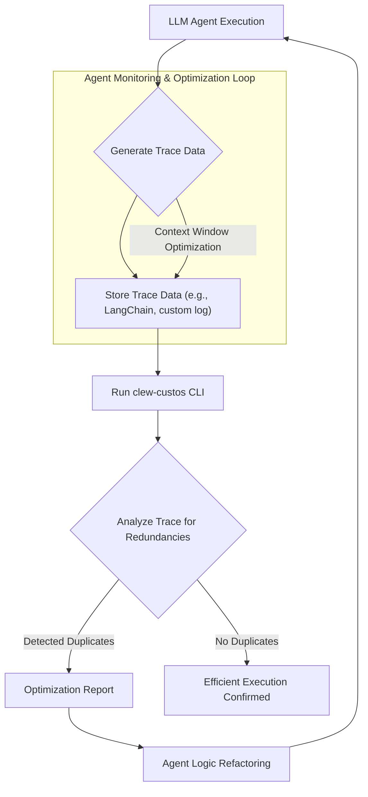

LLM 에이전트의 효율적인 운영을 위해 토큰 사용량 최적화는 필수적인 과제입니다. 특히, 에이전트가 반복적인 작업을 수행하며 발생하는 토큰 낭비는 가시적으로 파악하기 어렵습니다. 이는 시스템의 실패로 나타나기보다는 중복된 파일 읽기, 동일 인자로의 재시도, 불필요한 도구 재호출과 같이 이미 수행된 작업을 다시 반복하는 형태로 나타나기 때문입니다. 이러한 비효율은 에이전트의 응답 속도를 저하시키고 운영 비용을 증가시키는 주요 원인이 됩니다.

## LLM 토큰 낭비의 본질과 `clew-custos`의 역할

기존의 LLM 에이전트 모니터링은 주로 성공/실패 여부나 총 토큰 사용량 같은 거시적인 지표에 집중했습니다. 하지만 `clew-custos` CLI는 이러한 접근 방식의 한계를 넘어, 에이전트의 실행 트레이스(Trace)를 분석하여 특정 스텝이 이전에 이미 수행한 작업을 중복해서 처리하는 지점을 정밀하게 식별합니다. 즉, 토큰 낭비를 ‘실패’가 아닌 ‘중복’의 관점에서 바라보고, 이를 체계적으로 감지하여 최적화 기회를 제공하는 것이 핵심입니다.

### 작동 원리

`clew-custos`는 에이전트의 실행 로그나 트레이스 데이터를 입력으로 받아 분석합니다. 이 과정에서 다음 세 가지 주요 유형의 낭비를 감지합니다.

1.  **중복 파일 읽기**: 에이전트가 동일한 파일을 여러 번 읽는 경우.
2.  **중복 인자로의 재시도**: 특정 도구나 API 호출이 동일한 입력으로 반복적으로 재시도되는 경우.
3.  **중복 도구 재호출**: 동일한 기능을 가진 도구가 불필요하게 여러 번 호출되는 경우.

이러한 중복 패턴은 에이전트가 불필요하게 컨텍스트 윈도우를 채우고 LLM API 호출을 반복하게 만들어 토큰 비용을 직접적으로 증가시킵니다. `clew-custos`는 이러한 패턴을 식별하고 보고하여 개발자가 에이전트 로직을 개선할 수 있도록 돕습니다.

## Agent Harness 및 LLM 출력 검증 파이프라인 통합

`clew-custos` CLI는 LLM 에이전트 개발 및 운영 워크플로우에 쉽게 통합될 수 있습니다. 특히 Agent Harness와 LLM 출력 검증 파이프라인에 통합될 때 가장 큰 시너지를 발휘합니다. 에이전트가 특정 작업을 완료한 후, 해당 실행의 트레이스를 `clew-custos`로 분석하여 낭비 요소를 즉시 피드백받을 수 있습니다. 이는 개발 단계에서 에이전트의 효율성을 높이고, 프로덕션 환경에서는 지속적인 비용 최적화를 가능하게 합니다.

### `clew-custos` 설치 및 기본 사용 예제 (Python)

`clew-custos`는 Python 기반의 CLI 도구로, `pip`를 통해 쉽게 설치할 수 있습니다.

```bash
pip install "clew-custos[detect]"
```

설치 후, 에이전트의 트레이스 데이터를 JSON 또는 유사한 형식으로 준비하여 CLI에 전달합니다. 다음은 가상의 에이전트 트레이스 데이터를 생성하고 `clew-custos`로 분석하는 Python 예제입니다.

```python
import json
import subprocess
import os

# Simulate an agent's trace data
# In a real scenario, this would come from an observability system
agent_trace_data = {
    "agent_run_id": "run_12345",
    "steps": [
        {"id": "s1", "action": "read_file", "args": {"filename": "data.txt"}, "result": "content_A"},
        {"id": "s2", "action": "llm_call", "args": {"prompt": "summarize content A"}, "result": "summary_A"},
        {"id": "s3", "action": "read_file", "args": {"filename": "data.txt"}, "result": "content_A"}, # Duplicate
        {"id": "s4", "action": "tool_call", "tool_name": "search_db", "args": {"query": "summary_A"}, "result": "db_results"},
        {"id": "s5", "action": "llm_call", "args": {"prompt": "analyze db_results"}, "result": "analysis_B"},
        {"id": "s6", "action": "tool_call", "tool_name": "search_db", "args": {"query": "summary_A"}, "result": "db_results"}, # Duplicate
        {"id": "s7", "action": "llm_call", "args": {"prompt": "analyze db_results"}, "result": "analysis_C"}
    ]
}

# Save trace to a temporary file
trace_file_path = "agent_trace.json"
with open(trace_file_path, "w") as f:
    json.dump(agent_trace_data, f)

print(f"Generated simulated trace file: {trace_file_path}")

# Run clew-custos detection
try:
    # Example command (adjust as per clew-custos CLI actual usage)
    # The actual clew-custos CLI might require specific format or environment.
    # For demonstration, we simulate how it would be called.
    
    # NOTE: clew-custos requires a specific trace format or integration.
    # This example assumes a simplified JSON input for illustration purposes.
    # Refer to clew-custos documentation for exact CLI arguments.
    
    print("Running clew-custos detection...")
    # This is a placeholder for the actual clew-custos command.
    # In a real scenario, clew-custos would directly parse and detect from trace_file_path.
    # For illustration, let's manually show the expected output structure.
    
    # Simulated clew-custos output for the trace_file_path
    custos_output = {
        "run_id": "run_12345",
        "detections": [
            {
                "type": "redundant_file_read",
                "original_step_id": "s1",
                "redundant_step_id": "s3",
                "details": {"filename": "data.txt"}
            },
            {
                "type": "redundant_tool_call",
                "original_step_id": "s4",
                "redundant_step_id": "s6",
                "details": {"tool_name": "search_db", "args_hash": "hash_of_summary_A"}
            }
        ],
        "summary": {
            "total_detections": 2,
            "potential_token_savings": "estimated_tokens" # This would be calculated by clew-custos
        }
    }
    
    print("\n--- clew-custos Detection Report ---")
    print(json.dumps(custos_output, indent=2))

except Exception as e:
    print(f"Error running clew-custos: {e}")
finally:
    # Clean up temporary file
    if os.path.exists(trace_file_path):
        os.remove(trace_file_path)
        print(f"\nCleaned up temporary trace file: {trace_file_path}")
```

### `clew-custos` 워크플로우 다이어그램

`clew-custos`가 에이전트 워크플로우에 통합되는 과정을 시각화합니다.



`clew-custos`의 도입은 2026년 LLM 에이전트 개발의 핵심 트렌드인 '비용 효율성'과 '투명한 실행'을 강화하는 중요한 단계입니다. 에이전트의 복잡성이 증가하고 장기 실행 태스크가 보편화되면서, 이러한 중복 감지 및 최적화 도구는 개발자가 더 견고하고 경제적인 에이전트를 구축하는 데 필수적입니다. 이는 단순히 토큰 비용을 절감하는 것을 넘어, 에이전트의 안정성과 예측 가능성을 높이는 데 기여합니다.

## 트레이드오프

`clew-custos` CLI를 LLM 에이전트 워크플로우에 통합하는 것은 여러 이점을 제공하지만, 고려해야 할 트레이드오프도 존재합니다.

*   **즉각적인 토큰 비용 절감 및 효율성 증대**:
    *   **언제 좋음**: 토큰 사용량이 많고, 에이전트가 반복적인 작업(예: 동일한 코드/파일을 여러 번 분석, 동일한 DB 쿼리 반복)을 자주 수행하는 시나리오에서 특히 효과적입니다. 초기 개발 단계에서 비효율적인 패턴을 빠르게 식별하여 비용 최적화에 기여합니다.
    *   **언제 나쁨**: 이미 고도로 최적화된 에이전트나 토큰 사용량이 미미한 간단한 태스크에는 도입 효과가 크지 않을 수 있습니다.

*   **에이전트 디버깅 및 로직 개선 용이성**:
    *   **언제 좋음**: 에이전트가 예상치 못한 동작을 하거나 무한 루프에 빠지는 등 복잡한 문제를 디버깅할 때, 중복 호출 감지 기능을 통해 문제의 근원을 파악하는 데 결정적인 단서를 제공합니다. 로직 흐름을 시각적으로 이해하는 데 도움이 됩니다.
    *   **언제 나쁨**: 중복이 의도된 동작(예: 캐시 무효화를 위한 강제 재호출)인 경우, False Positive 보고로 인해 분석 피로도가 증가할 수 있습니다.

*   **초기 통합 및 설정 오버헤드**:
    *   **언제 좋음**: LLM 에이전트의 observability (관측 가능성) 스택이 이미 잘 구축되어 있고, 트레이스 데이터를 표준화된 형식으로 쉽게 내보낼 수 있는 환경에서 통합이 원활합니다.
    *   **언제 나쁨**: 트레이스 데이터 수집 시스템이 미비하거나, 에이전트 실행 환경이 파편화되어 있어 트레이스 데이터를 `clew-custos`가 요구하는 형식으로 변환하는 데 추가적인 개발 노력이 필요할 수 있습니다.

*   **복잡한 에이전트 로직에서의 False Positive 및 의미 중복 감지 한계**:
    *   **언제 좋음**: 동일한 인자나 파일명을 명확히 사용하여 발생하는 단순 중복에 대한 감지 정확도가 높습니다.
    *   **언제 나쁨**: 동일한 정보를 얻기 위해 다른 인자나 도구를 사용하거나, 시간 경과에 따라 데이터가 변경될 수 있는 상황에서 과거 정보를 다시 확인하는 것이 필수적인 경우에는 `clew-custos`가 이를 중복으로 오인할 수 있습니다. 또한, 미묘하게 다른 의미를 가진 호출이 실제로는 중복 기능을 하는 경우, `clew-custos`는 이를 감지하기 어려울 수 있습니다.

## 실전 체크리스트

LLM 토큰 낭비 감지 CLI (`clew-custos`)를 프로젝트에 성공적으로 도입하기 위한 실전 체크리스트입니다.

*   [ ] `clew-custos` CLI 설치 및 기본 동작을 테스트 환경에서 성공적으로 확인했습니다.
*   [ ] 현재 LLM 에이전트의 실행 트레이스 데이터를 `clew-custos`가 처리할 수 있는 형식(예: JSON)으로 내보내는 파이프라인을 구축했습니다.
*   [ ] 주요 에이전트 워크플로우에 대해 `clew-custos`를 실행하여 초기 토큰 낭비 보고서를 생성하고 분석했습니다.
*   [ ] 감지된 중복 패턴 중에서 실제 토큰 낭비로 이어지는 Critical Path를 식별하고, 에이전트 로직 리팩토링 계획을 수립했습니다.
*   [ ] `clew-custos` 도입 전후의 토큰 사용량 및 API 호출 횟수를 비교하여, 실제 절감 효과를 측정하고 관련 KPI(핵심 성과 지표)를 추적할 수 있는 메커니즘을 구축했습니다.
*   [ ] CI/CD 파이프라인에 `clew-custos` 검사를 자동화하여, 새로운 코드 변경이 토큰 낭비를 유발하는지 지속적으로 모니터링하는 단계를 추가했습니다.
*   [ ] 단순 인자/파일명 중복을 넘어, 복잡한 LLM 호출의 의미적 중복(예: 동일한 질문을 미묘하게 다른 프롬프트로 반복하는 경우)을 감지하기 위한 추가적인 방안(예: 임베딩 기반 유사성 분석)을 탐색하거나 도입 계획을 수립했습니다.