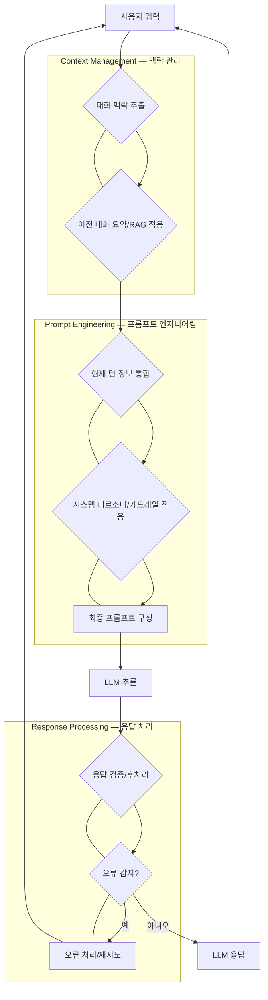

고성능 LLM 애플리케이션은 단순한 질의-응답을 넘어 사용자와의 복잡하고 심층적인 대화를 지원해야 한다. 이러한 Multi-turn Conversation 환경에서 LLM의 일관성, 관련성, 그리고 사용자 경험을 극대화하기 위한 프롬프트 디자인은 핵심적인 성공 요소이다. 단일 턴 프롬프트와 달리, Multi-turn 대화는 이전 대화의 맥락(Context)을 효과적으로 관리하고, 대화의 흐름에 따라 LLM의 행동을 동적으로 조절하는 고급 전략을 요구한다.

## 핵심 개념 및 디자인 패턴

### 1. 맥락 관리 (Context Management): 장기 기억 구현

LLM은 본질적으로 현재 프롬프트만을 처리하므로, 이전 대화를 '기억'하게 하려면 과거 대화 내용을 프롬프트에 포함해야 한다. 이 과정에서 발생하는 토큰 길이 제한 및 비용 문제를 해결하기 위한 여러 전략이 존재한다.

#### 요약 및 압축 (Summarization & Compression)
긴 대화 기록을 요약하여 LLM에 전달하는 방식이다. 이는 토큰 효율성을 높이지만, 중요한 정보가 유실될 위험이 있다.
```python
def summarize_conversation(conversation_history, llm_client):
    prompt = f"다음 대화 내용을 간결하게 요약하여 핵심 내용을 전달하세요:\n{conversation_history}\n요약:"
    response = llm_client.generate(prompt)
    return response.text

# Example usage
# current_summary = summarize_conversation(long_history, llm_client)
```

#### 검색 증강 생성 (Retrieval Augmented Generation, RAG)
사용자의 질문과 관련 있는 외부 지식 베이스(예: 문서 DB, 벡터 DB)에서 정보를 검색하여 프롬프트에 추가하는 방식이다. 이는 LLM의 지식 한계를 보완하고 최신 정보를 반영하는 데 유용하다. Multi-turn 대화에서는 이전 대화 맥락과 현재 질의를 종합하여 검색 쿼리를 생성하는 것이 중요하다.

#### 메모리 버퍼 (Memory Buffer) 및 슬라이딩 윈도우 (Sliding Window)
가장 최근 N개의 대화 턴만 프롬프트에 포함하는 방식이다. 구현이 간단하지만, N 턴 이전의 중요한 정보는 유실될 수 있다. 슬라이딩 윈도우는 N 턴을 유지하되, N 턴을 초과하면 가장 오래된 턴을 제거하는 방식이다. 복잡한 대화에서는 요약과 슬라이딩 윈도우를 결합하는 하이브리드 접근법이 효과적이다.

### 2. 역할 기반 및 페르소나 주입 (Role-based & Persona Injection)

LLM에 특정 역할(예: 전문 고객 서비스 에이전트, 창의적인 스토리 작가)을 부여하여 일관된 톤과 스타일, 그리고 전문성을 유지하게 한다. 이는 사용자 경험을 향상시키고 LLM의 응답 품질을 특정 목적에 맞게 정렬한다.

```python
SYSTEM_PROMPT_CUSTOMER_SUPPORT = """
당신은 친절하고 유능한 고객 지원 에이전트입니다. 사용자의 문의에 대해 정확하고 상세하게 답변하며, 항상 긍정적이고 도움을 주려는 태도를 유지하세요. 사용자의 감정을 이해하고 공감하는 것이 중요합니다.
"""
```

### 3. 동적 프롬프트 생성 (Dynamic Prompt Generation)

대화의 진행 상황, 사용자 입력의 특성, 또는 특정 조건(예: 사용자가 특정 정보를 요청했는지 여부)에 따라 프롬프트의 내용을 동적으로 변경하는 전략이다. 예를 들어, 사용자가 처음 질문할 때는 일반적인 답변을 제공하고, 추가 정보를 요청하면 상세한 내용을 포함하는 프롬프트를 구성할 수 있다. 이는 LLM이 대화 흐름에 더욱 유연하게 반응하도록 돕는다.

### 4. 오류 처리 및 복구 (Error Handling & Recovery)

Multi-turn 대화는 LLM이 잘못된 정보를 생성하거나(hallucination), 사용자가 불분명한 질문을 할 때 대화가 실패할 위험이 높다. 효과적인 오류 처리 전략은 다음과 같다.

*   **명확화 요청 (Clarification Prompting)**: 사용자의 질문이 모호할 경우, LLM이 추가 정보를 요청하도록 유도한다.
*   **가드레일 (Guardrails)**: LLM이 부적절하거나 안전하지 않은 내용을 생성하지 않도록 특정 규칙을 적용한다. `harness-engineering/guard-test-pattern`과 같은 접근 방식이 여기에 해당한다.
*   **대화 재조정 (Conversation Re-alignment)**: LLM이 대화의 맥락을 벗어났을 때, 이전의 특정 지점으로 돌아가 대화를 재시작하거나 핵심 주제로 다시 유도하는 프롬프트를 사용한다.

### 5. Chain-of-Thought (CoT) 및 Few-shot Prompting 활용

복잡한 추론이나 다단계 작업이 필요한 Multi-turn 대화에서 CoT 프롬프팅은 LLM이 문제 해결 과정을 단계적으로 설명하도록 유도하여 더 정확하고 투명한 결과를 얻게 한다. Few-shot 프롬프팅은 몇 가지 예시를 제공하여 LLM이 원하는 응답 형식이나 스타일을 학습하도록 돕는다. 이는 특히 복잡한 비즈니스 로직이나 특정 도메인 지식이 요구될 때 유용하다.

## Multi-turn Conversation Flow

다음 Mermaid 다이어그램은 Multi-turn Conversation에서 프롬프트가 어떻게 동적으로 구성되고 관리되는지 보여준다.



## 트레이드오프

### 1. 복잡성 vs. 성능 및 유지보수
*   **언제 좋은가**: 고성능, 높은 사용자 만족도를 요구하는 복잡한 대화 시스템에 적합하다. 동적 프롬프트, RAG, CoT 등 고급 패턴은 LLM의 정확도와 유연성을 크게 향상시킨다.
*   **언제 나쁜가**: 단순한 질의응답 시스템이나 빠른 프로토타이핑 단계에서는 과도한 설계가 될 수 있다. 구현 및 디버깅, 그리고 지속적인 유지보수 비용이 증가한다.

### 2. 토큰 비용 vs. 컨텍스트 유지
*   **언제 좋은가**: 대화의 일관성과 깊은 이해가 필수적인 경우, 충분한 컨텍스트를 유지하는 것이 중요하다. 이는 사용자 경험을 저하시키는 '기억 상실' 문제를 방지한다.
*   **언제 나쁜가**: 토큰 비용이 매우 민감하거나, 대화의 각 턴이 독립적으로 처리될 수 있는 시나리오에서는 불필요하게 많은 컨텍스트를 유지하는 것이 비용 낭비를 초래한다.

### 3. 응답 속도 vs. 정확도 및 신뢰성
*   **언제 좋은가**: 고정확도, 신뢰성 있는 답변이 비즈니스 크리티컬한 경우, RAG, 요약, CoT 등의 추가 처리 단계를 통해 응답의 품질을 높이는 것이 유리하다.
*   **언제 나쁜가**: 실시간 상호작용이 중요하고, 약간의 정확도 저하를 감수하더라도 빠른 응답이 우선시되는 애플리케이션(예: 챗봇의 초기 응대)에서는 추가 처리 단계가 지연을 유발하여 사용자 경험을 저해할 수 있다.

### 4. 일반성 vs. 특화성
*   **언제 좋은가**: 특정 도메인이나 유즈케이스에 최적화된 프롬프트 디자인은 해당 환경에서의 LLM 성능을 극대화한다.
*   **언제 나쁜가**: 다양한 시나리오에 대응해야 하는 범용적인 AI 어시스턴트의 경우, 너무 특화된 패턴은 유연성을 저해하고 다른 도메인으로의 확장을 어렵게 만든다. 초기 설계 단계에서는 유연성을 고려한 일반적인 패턴을 우선 적용하고, 필요에 따라 점진적으로 특화하는 것이 바람직하다.

## 실전 체크리스트

고성능 Multi-turn LLM 애플리케이션을 위한 프롬프트 디자인 패턴을 프로젝트에 적용할 때 다음 항목들을 검증해야 한다.

- [ ] **컨텍스트 관리 전략 선택 및 구현**: 현재 애플리케이션의 대화 길이, 정보 중요도, 토큰 비용 예산을 고려하여 요약, RAG, 슬라이딩 윈도우 중 최적의 컨텍스트 관리 전략이 구현되었는가?
- [ ] **페르소나 일관성 유지**: 정의된 LLM 페르소나(예: 시스템 프롬프트)가 대화의 모든 턴에서 일관되게 유지되며, 사용자의 기대와 일치하는 응답을 생성하는가?
- [ ] **오류 시나리오 정의 및 복구 메커니즘 설계**: LLM의 Hallucination, 불분명한 사용자 입력, 대화 이탈 등 주요 오류 시나리오를 정의하고, 이에 대한 명확화 요청 또는 대화 재조정 메커니즘이 설계 및 테스트되었는가?
- [ ] **동적 프롬프트 요소 검증**: 대화 상태, 사용자 입력 특성, 또는 특정 조건에 따라 프롬프트가 의도대로 동적으로 변경되며, 이는 LLM 응답 품질 향상에 기여하는가?
- [ ] **토큰 사용량 및 비용 모니터링**: 대화당 평균 토큰 사용량과 예상 비용을 정기적으로 모니터링하고 있으며, 과도한 비용 발생 시 컨텍스트 관리 전략을 재조정할 계획이 있는가?
- [ ] **A/B 테스트를 통한 패턴 성능 비교**: 다른 프롬프트 디자인 패턴 간의 성능(정확도, 관련성, 사용자 만족도 등)을 측정하기 위한 A/B 테스트 프레임워크가 구축되어 있으며, 실제 데이터로 검증되고 있는가?
- [ ] **사용자 피드백 루프 구축**: 대화형 LLM 애플리케이션의 사용자 피드백을 수집하고 분석하는 시스템(예: 👍/👎 버튼, 명시적 피드백 양식)이 구축되어 있으며, 이를 프롬프트 개선에 활용하고 있는가?