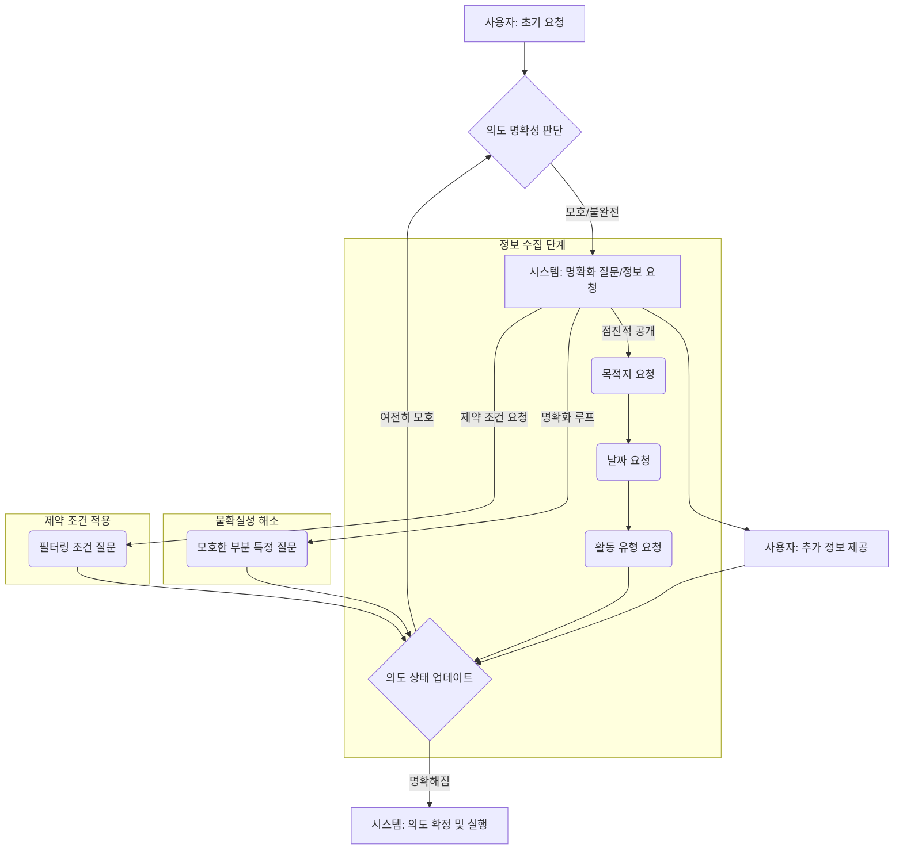

복잡한 사용자 의도를 명확히 파악하는 것은 AI 시스템, 특히 대규모 언어 모델(LLM) 기반 애플리케이션의 핵심 과제입니다. 단일 턴(single-turn) 프롬프트는 단순하거나 명시적인 요청에는 효과적이지만, 모호하거나 다층적인 사용자 요구사항 앞에서는 한계를 드러냅니다. 멀티턴 프롬프트 디자인 패턴(Multi-Turn Prompt Design Patterns)은 이러한 갭을 메우기 위해 고안되었으며, 시스템이 사용자와의 지속적인 상호작용을 통해 점진적으로 의도를 정제하고 필수 정보를 수집하도록 돕습니다. 이는 단순한 질의응답을 넘어 실제 문제 해결을 위한 협력적 대화(collaborative dialogue)를 가능하게 합니다.

2026년 트렌드에서 AI 에이전트(AI Agents)의 고도화가 가속화됨에 따라, 사용자의 추상적인 목표를 구체적인 실행 계획으로 전환하기 위한 멀티턴 상호작용의 중요성은 더욱 커지고 있습니다. 초기 프롬프트에 모든 정보를 담기 어렵거나, 사용자가 자신의 요구사항을 명확히 정의하지 못하는 상황에서 멀티턴 프롬프트는 필수적인 요소로 자리매김하고 있습니다.

### 핵심 디자인 패턴

#### 1. 점진적 정보 공개 (Progressive Disclosure)
사용자에게 한 번에 너무 많은 정보를 요구하기보다, 대화의 맥락에 따라 필요한 정보를 단계적으로 요청하는 패턴입니다. 초기에는 핵심 의도를 파악하고, 이후 관련 세부 정보를 질문하여 점진적으로 사용자 의도의 전체 그림을 완성합니다.

*   **예시**:
    *   **사용자**: "여행 계획을 세워줘."
    *   **시스템**: "어디로 떠나고 싶으신가요?" (목적지 정보 요청)
    *   **사용자**: "파리로요."
    *   **시스템**: "파리에서는 어떤 활동에 관심이 있으신가요? (예: 문화, 미식, 쇼핑 등)" (세부 의도 요청)

#### 2. 명확화 루프 (Clarification Loops)
사용자의 발화에서 모호하거나 불확실한 부분이 감지될 경우, 시스템이 특정 부분에 대해 명확한 질문을 던져 불확실성을 해소하는 패턴입니다. 이는 사용자 의도를 정확히 해석하고 오해를 방지하는 데 필수적입니다.

*   **예시**:
    *   **사용자**: "내일 회의 일정을 조정하고 싶어."
    *   **시스템**: "어떤 회의를 말씀하시는지요? 내일 예정된 회의가 여러 개 있습니다. '프로젝트 X' 관련 회의를 말씀하시는 건가요?" (모호성 해소 요청)

#### 3. 제약 조건 기반 정제 (Constraint-Based Refinement)
사용자가 제공하는 초기 의도에 추가적인 제약 조건(constraints)을 적용하여, 시스템이 솔루션 공간을 좁히고 더 적합한 결과를 도출하도록 돕는 패턴입니다. 이는 특히 검색, 추천, 일정 관리 등 특정 조건을 만족해야 하는 시나리오에서 유용합니다.

*   **예시**:
    *   **사용자**: "데이터 분석 스터디 그룹을 찾고 있어."
    *   **시스템**: "어떤 기술 스택(예: Python, R, SQL)에 관심이 있으신가요? 그리고 주중, 주말 중 언제 활동하고 싶으신가요?" (제약 조건 추가 요청)

#### 4. 선호도 도출 (Preference Elicitation)
사용자의 주관적인 선호도(preferences)를 이해하기 위해 여러 선택지를 제시하거나, 선호하는 기준을 질문하는 패턴입니다. 이는 개인화된 경험을 제공하는 데 중요합니다.

*   **예시**:
    *   **사용자**: "오늘 저녁에 영화 한 편 추천해 줘."
    *   **시스템**: "어떤 장르를 선호하시나요? (예: 액션, 코미디, 드라마) 혹은 어떤 분위기의 영화를 보고 싶으신가요?" (선호도 질문)

### 멀티턴 프롬프트 구현 예제

Python과 가상의 LLM API를 사용하여 복잡한 사용자 의도를 명확히 하는 멀티턴 상호작용의 기본적인 구조를 보여줍니다. 이 예제는 여행 계획을 수립하는 시나리오를 가정합니다.

```python
import json

class LLMService:
    def __init__(self):
        self.context_history = []

    def generate_response(self, user_input, intent_state):
        # 가상의 LLM 응답 로직
        # 실제 LLM 호출은 이곳에서 이루어집니다.

        # 의도 상태에 따라 다른 응답 및 다음 상태 제안
        if intent_state["status"] == "INITIAL":
            if "여행" in user_input and ("계획" in user_input or "일정" in user_input):
                intent_state["status"] = "COLLECTING_DESTINATION"
                return "어디로 떠나고 싶으신가요?", intent_state
            else:
                return "어떤 도움이 필요하신가요?", intent_state

        elif intent_state["status"] == "COLLECTING_DESTINATION":
            intent_state["destination"] = user_input
            intent_state["status"] = "COLLECTING_DATES"
            return f"{user_input} 좋네요! 언제쯤 여행을 계획하고 계신가요? (예: 2026년 7월 첫째 주)", intent_state

        elif intent_state["status"] == "COLLECTING_DATES":
            intent_state["dates"] = user_input
            intent_state["status"] = "COLLECTING_ACTIVITIES"
            return f"여행 기간은 {user_input}으로 확인했습니다. 그곳에서 어떤 활동(예: 문화 탐방, 휴식, 미식)에 관심이 있으신가요?", intent_state

        elif intent_state["status"] == "COLLECTING_ACTIVITIES":
            intent_state["activities"] = user_input
            intent_state["status"] = "CONFIRMATION"
            return f"알겠습니다. {intent_state['destination']}으로 {intent_state['dates']}에 {intent_state['activities']} 위주의 여행 계획을 세워드릴까요?", intent_state

        elif intent_state["status"] == "CONFIRMATION":
            if "네" in user_input or "응" in user_input:
                intent_state["status"] = "COMPLETED"
                return "여행 계획을 수립하겠습니다!", intent_state
            else:
                intent_state["status"] = "INITIAL"
                return "다시 처음부터 시작해볼까요? 어떤 도움이 필요하신가요?", intent_state

        return "이해하지 못했습니다. 다시 말씀해주시겠어요?", intent_state

def run_multi_turn_interaction():
    llm_service = LLMService()
    intent_state = {"status": "INITIAL"}
    print("시스템: 안녕하세요! 여행 계획을 도와드릴까요?")

    while intent_state["status"] != "COMPLETED":
        user_input = input("사용자: ")
        response, new_intent_state = llm_service.generate_response(user_input, intent_state)
        print(f"시스템: {response}")
        intent_state = new_intent_state

    print(f"최종 의도: {json.dumps(intent_state, ensure_ascii=False, indent=2)}")

if __name__ == "__main__":
    run_multi_turn_interaction()
```

### 멀티턴 프롬프트 흐름 다이어그램



### ## 트레이드오프 (Trade-offs)

멀티턴 프롬프트 디자인 패턴을 적용할 때는 다음과 같은 장단점을 고려해야 합니다.

*   **정확성(Accuracy) vs. 복잡성(Complexity)**
    *   **언제 좋은가**: 사용자의 복잡하고 모호한 의도를 고정밀도로 파악해야 할 때 매우 효과적입니다. 여러 번의 질의응답을 통해 오해를 줄이고 의도의 정확성을 높일 수 있습니다.
    *   **언제 나쁜가**: 대화 흐름이 지나치게 복잡해지면 시스템 설계 및 구현이 어려워지고, 유지보수 비용이 증가할 수 있습니다. 각 턴에서 상태(state) 관리가 정교하게 이루어져야 합니다.

*   **사용자 경험(User Experience) vs. 상호작용 길이(Interaction Length)**
    *   **언제 좋은가**: 사용자가 초기 요청을 명확히 정의하기 어려울 때, 시스템이 친절하게 가이드하여 원하는 결과를 얻도록 돕는 긍정적인 경험을 제공합니다. 특히 개인화된 서비스에서 만족도를 높일 수 있습니다.
    *   **언제 나쁜가**: 불필요하게 많은 턴이 발생하면 사용자가 피로감을 느끼거나, 시스템이 느리다고 인식할 수 있습니다. 즉각적인 답변을 기대하는 단순한 질의에는 오히려 역효과를 낳을 수 있습니다.

*   **개발 비용(Development Cost) vs. 견고성(Robustness)**
    *   **언제 좋은가**: 다양한 사용자 시나리오와 예외 처리에 대해 더 견고하고 유연한 시스템을 구축할 수 있습니다. 복잡한 비즈니스 로직을 대화 흐름에 통합하기 용이합니다.
    *   **언제 나쁜가**: 초기 설계 및 개발에 더 많은 시간과 자원이 소요됩니다. 각 턴의 프롬프트 엔지니어링, 상태 전이 로직, 에러 핸들링 등에 대한 깊은 고려가 필요합니다.

*   **범용성(Generalizability) vs. 특수성(Specificity)**
    *   **언제 좋은가**: 특정 도메인에 대한 깊은 이해를 바탕으로 매우 특수하고 정교한 의도를 파악하는 데 효과적입니다.
    *   **언제 나쁜가**: 광범위한 도메인에서 다양한 의도를 처리해야 할 경우, 모든 시나리오에 대한 멀티턴 대화 흐름을 미리 설계하기 어려워 범용성이 떨어질 수 있습니다. 유연한 대화 흐름 설계가 중요합니다.

*   **운영 비용(Operational Cost) vs. 출력 품질(Output Quality)**
    *   **언제 좋은가**: 여러 턴을 통해 사용자 의도가 명확해질수록 LLM이 더 정확하고 관련성 높은 출력을 생성할 확률이 높아집니다.
    *   **언제 나쁜가**: 각 턴마다 LLM 호출이 발생하므로, 전체 대화에 사용되는 토큰 수가 증가하고 이는 API 비용 상승으로 이어질 수 있습니다.

### ## 실전 체크리스트 (Practical Checklist)

멀티턴 프롬프트 디자인 패턴을 프로젝트에 적용할 때 다음 사항을 점검해야 합니다.

*   [ ] **핵심 의도 식별 및 상태 전이 정의**: 시스템이 파악해야 할 핵심 사용자 의도(core intents)를 명확히 정의하고, 각 의도 상태(intent states) 간의 전이(transition) 로직을 구체적으로 설계했는가?
*   [ ] **문맥 관리 전략 구현**: 이전 턴의 대화 내용 및 추출된 정보를 효과적으로 저장하고 다음 턴의 프롬프트에 주입하는 문맥 관리(context management) 전략(예: In-context Learning, Few-shot Learning)이 구현되었는가?
*   [ ] **명확화 질문의 품질 최적화**: 사용자의 응답이 모호하거나 불완전할 때 시스템이 던지는 명확화 질문(clarification questions)이 구체적이고 사용자 친화적인가? 불필요한 질문을 최소화하도록 최적화되었는가?
*   [ ] **대화 흐름의 유연성 확보**: 사용자가 예상치 못한 방식으로 응답하거나, 이전 단계로 돌아가기를 원할 때 이를 수용할 수 있는 유연한 대화 흐름(flexible dialogue flow) 설계가 반영되었는가? (예: "다시 처음부터 시작해줘", "이전 질문으로 돌아갈래")
*   [ ] **사용자 피드백 메커니즘 통합**: 멀티턴 상호작용 과정에서 사용자 만족도를 측정하고, 시스템의 질문이나 응답에 대한 피드백(feedback)을 수집하여 지속적으로 개선할 수 있는 메커니즘이 마련되었는가?
*   [ ] **종료 조건 및 예외 처리 설계**: 사용자 의도 파악이 완료되거나, 일정 횟수 이상의 명확화 시도에도 불구하고 의도가 불분명할 경우, 대화를 어떻게 종료하고 처리할지에 대한 명확한 종료 조건(exit conditions)과 예외 처리(exception handling) 로직이 설계되었는가?
*   [ ] **성능 및 비용 지표 모니터링**: 멀티턴 대화의 평균 턴 수(average turn count), 세션당 토큰 사용량, API 호출 횟수 등 핵심 성능 및 비용 지표를 모니터링하고 최적화할 계획이 있는가?