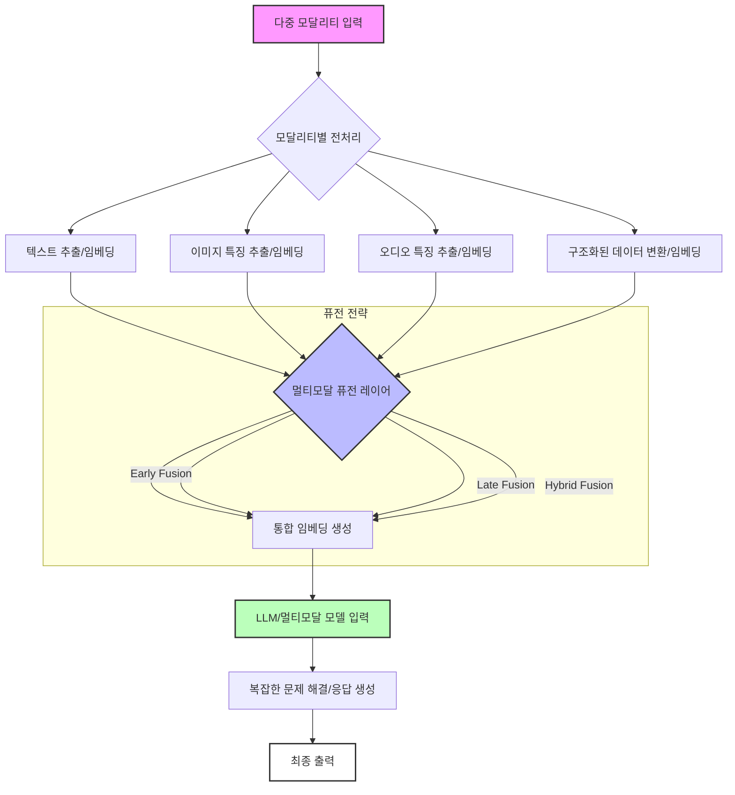

멀티모달 프롬프트 엔지니어링은 단순히 텍스트를 입력하는 것을 넘어, 이미지, 오디오, 비디오, 구조화된 데이터 등 다양한 형태의 정보(모달리티)를 AI 모델에 통합하여 복잡한 문제를 해결하는 접근 방식입니다. 2026년 현재, 대규모 언어 모델(LLM)의 발전과 함께 멀티모달 모델의 성능이 급격히 향상되면서, 현실 세계의 다면적인 문제에 대한 AI의 이해력과 추론 능력을 비약적으로 증진시키는 핵심 기술로 자리매김하고 있습니다. 전통적인 텍스트 기반 프롬프트는 맥락의 한계로 인해 모호하거나 불완전한 정보를 전달할 위험이 있었지만, 멀티모달 프롬프트는 이러한 간극을 메우고 더욱 풍부하고 정확한 정보를 제공함으로써 AI가 심층적인 분석과 정교한 의사결정을 내릴 수 있도록 돕습니다.

## 멀티모달 프롬프트의 핵심 원리

멀티모달 프롬프트는 여러 모달리티에서 정보를 추출하고 이를 통합하여 모델에 입력하는 과정을 포함합니다. 이 과정에서 핵심적인 개념들은 다음과 같습니다.

### 1. 입력 모달리티 퓨전 (Input Modality Fusion)

다양한 형태의 데이터를 하나의 일관된 표현으로 결합하는 기술입니다. 크게 세 가지 퓨전 전략을 고려할 수 있습니다.

*   **초기 퓨전 (Early Fusion)**: 각 모달리티의 원시 데이터 또는 저수준 특징(low-level features)을 추출한 후, 이를 결합하여 단일 임베딩으로 변환합니다. 이 방식은 모달리티 간의 미세한 상호작용을 초기에 포착하는 데 유리합니다.
*   **후기 퓨전 (Late Fusion)**: 각 모달리티의 데이터를 개별적으로 처리하여 고수준 특징(high-level features)을 추출한 다음, 최종 단계에서 이 특징들을 결합하여 예측 또는 결론을 도출합니다. 이는 각 모달리티별 모델의 독립성을 유지하며, 모달리티별로 최적화된 처리가 가능합니다.
*   **하이브리드 퓨전 (Hybrid Fusion)**: 초기 퓨전과 후기 퓨전의 장점을 결합한 방식으로, 특정 계층에서는 조기에 퓨전하고 다른 계층에서는 나중에 퓨전하는 전략입니다. 이는 모델의 복잡성과 특정 태스크의 요구사항에 따라 유연하게 설계될 수 있습니다.

### 2. 크로스-모달 어텐션 (Cross-Modal Attention)

서로 다른 모달리티 간의 중요한 정보에 집중하고 가중치를 부여하는 메커니즘입니다. 예를 들어, 이미지와 텍스트가 함께 주어졌을 때, 텍스트의 특정 단어가 이미지의 특정 영역과 밀접한 관련이 있음을 학습하고, 이 관계를 프롬프트 구성에 활용합니다. 이를 통해 모델은 모달리티 간의 숨겨진 상관관계를 파악하여 더욱 정확한 추론을 수행할 수 있습니다.

## 멀티모달 프롬프트 엔지니어링 실전 구현

멀티모달 프롬프트를 구성할 때는 각 모달리티의 특성을 고려한 전처리 과정이 필수적입니다. 예를 들어, 이미지는 시각적 특징을 추출하고, 오디오는 음성-텍스트 변환(STT)을 통해 텍스트로 변환하는 등의 과정이 필요합니다. 이후, 이들을 통합하여 모델에 전달합니다.

다음은 Python을 활용한 가상의 멀티모달 프롬프트 구성 예시입니다. 여기서는 이미지를 base64 인코딩된 문자열로, 오디오를 전사된 텍스트로 변환하여 텍스트 프롬프트와 결합하는 시나리오를 가정합니다. 2026년에는 대부분의 최신 LLM API가 멀티모달 입력을 직접 지원하지만, 기본적인 구성 원리는 동일합니다.

```python
import base64
import requests # For a hypothetical API call

def encode_image(image_path):
    with open(image_path, "rb") as image_file:
        return base64.b64encode(image_file.read()).decode("utf-8")

def transcribe_audio(audio_path): # Hypothetical STT service call
    # In a real scenario, this would call an STT API like Google Cloud Speech-to-Text or OpenAI Whisper
    print(f"Transcribing audio from {audio_path}...")
    return "사용자가 이 제품의 작동 방식을 설명해 달라고 요청했습니다. 제품명은 'SmartHome Hub'입니다."

def generate_multimodal_prompt(
    text_input: str,
    image_path: str = None,
    audio_path: str = None,
    structured_data: dict = None
) -> list:
    content_parts = []

    # Add main text input
    content_parts.append({"type": "text", "text": text_input})

    # Add image if provided
    if image_path:
        base64_image = encode_image(image_path)
        content_parts.append({
            "type": "image_url",
            "image_url": {"url": f"data:image/jpeg;base64,{base64_image}", "detail": "high"}
        })
    
    # Add audio transcription if provided
    if audio_path:
        transcribed_text = transcribe_audio(audio_path)
        content_parts.append({"type": "text", "text": f"[Audio Transcript]: {transcribed_text}"})

    # Add structured data if provided
    if structured_data:
        content_parts.append({"type": "text", "text": f"[Structured Data]: {structured_data}"})

    return content_parts

# Example Usage:
# Assuming you have 'product_manual.pdf' (text), 'product_image.jpg' (image), 'user_query.wav' (audio)
text_prompt = "다음 이미지를 참고하여 사용자의 질문에 답변하고, 제품 매뉴얼에서 관련 정보를 찾아 상세히 설명해주세요."
image_path = "./data/product_image.jpg"
audio_path = "./data/user_query.wav"
structured_data = {"product_id": "SH001", "category": "Smart Home"}

# Simulate creating dummy files for demonstration
import os
if not os.path.exists("data"): os.makedirs("data")
with open("./data/product_image.jpg", "wb") as f: f.write(b"dummy_image_data")
with open("./data/user_query.wav", "wb") as f: f.write(b"dummy_audio_data")

multimodal_payload = generate_multimodal_prompt(
    text_prompt,
    image_path=image_path,
    audio_path=audio_path,
    structured_data=structured_data
)

print("Generated Multimodal Payload structure:")
for part in multimodal_payload:
    print(f"  Type: {part['type']}, Content Snippet: {str(part.get('text', 'Image/URL')).strip()[:50]}...")

# Hypothetical API call (e.g., to OpenAI GPT-4 Vision or similar)
# response = requests.post(
#     "https://api.example.com/v1/chat/completions",
#     headers={
#         "Authorization": "Bearer YOUR_API_KEY",
#         "Content-Type": "application/json"
#     },
#     json={
#         "model": "gpt-4o", # or equivalent multimodal model
#         "messages": [
#             {
#                 "role": "user",
#                 "content": multimodal_payload
#             }
#         ],
#         "max_tokens": 1000
#     }
# )
# print(response.json())
```

위 예시에서는 이미지와 오디오 데이터를 전처리하여 텍스트 프롬프트와 함께 API 요청 페이로드에 포함하는 방식을 보여줍니다. 2026년의 최신 멀티모달 모델들은 이러한 이질적인 데이터를 내부적으로 더욱 정교하게 처리하며, 심지어 동영상 스트림과 같은 실시간 모달리티도 직접 입력으로 받을 수 있도록 발전하고 있습니다.

## 멀티모달 프롬프트 처리 흐름

멀티모달 프롬프트 처리의 일반적인 흐름은 다음과 같습니다.



## 트레이드오프 (Trade-offs)

멀티모달 프롬프트 엔지니어링은 강력한 이점을 제공하지만, 동시에 고려해야 할 트레이드오프가 존재합니다.

*   **장점: 맥락 이해도 및 정확성 향상**: 다양한 모달리티를 통해 풍부한 정보를 제공함으로써, AI 모델이 문제의 맥락을 훨씬 더 깊이 이해하고 모호성을 줄여 더 정확하고 신뢰할 수 있는 답변을 생성할 수 있습니다. 이는 시각적 요소가 중요한 의료 진단, 제조업 품질 관리, 복잡한 사용자 인터페이스 분석 등에 특히 유용합니다.
    *   **언제 좋은가**: 텍스트만으로는 전달하기 어려운 시각적, 청각적, 공간적 정보가 문제 해결에 필수적일 때. 예를 들어, 특정 이미지 내의 객체 위치나 오디오 톤 변화가 중요한 경우.
    *   **언제 나쁜가**: 입력 정보가 기본적으로 텍스트 기반이거나, 추가 모달리티가 문제 해결에 유의미한 정보를 제공하지 않을 때. 불필요한 복잡성만 추가될 수 있습니다.

*   **단점: 시스템 복잡성 및 개발 비용 증가**: 여러 모달리티의 데이터를 수집, 전처리, 동기화하고 통합하는 파이프라인을 구축하는 것은 텍스트 전용 시스템보다 훨씬 복잡합니다. 각 모달리티별로 전문화된 처리 모듈이 필요하며, 이는 개발 및 유지보수 비용 증가로 이어집니다.
    *   **언제 좋은가**: 시스템의 최종 목표가 고도로 정확하고 다차원적인 이해를 요구하며, 복잡성 증가를 감수할 만한 가치가 있을 때. 예를 들어, 자율 주행 차량의 환경 인식 시스템.
    *   **언제 나쁜가**: 리소스가 제한적이거나, 개발 속도가 최우선인 초기 단계 프로젝트에서. 간단한 문제에 과도한 멀티모달 아키텍처를 도입하는 것은 비효율적입니다.

*   **장점: 사용자 경험(UX) 개선**: 사용자가 텍스트뿐만 아니라 이미지, 음성 등 다양한 방식으로 정보를 입력할 수 있게 함으로써, 더욱 자연스럽고 직관적인 인터랙션을 제공합니다. 이는 접근성을 향상시키고, 더 넓은 사용자층을 포용할 수 있게 합니다.
    *   **언제 좋은가**: 모바일 앱, 스마트 스피커, 시각 보조 장치와 같이 다양한 입력 방식을 지원해야 하는 사용자 중심 애플리케이션에서.
    *   **언제 나쁜가**: 백엔드 시스템이나 개발자 도구와 같이 사용자 인터랙션이 제한적이거나 표준화된 입력만 사용하는 환경에서.

*   **단점: 컴퓨팅 리소스 및 추론 지연 시간 증가**: 멀티모달 데이터를 처리하고 통합하는 과정은 상당한 컴퓨팅 파워를 요구하며, 이는 추론 지연 시간(latency) 증가로 이어질 수 있습니다. 특히 실시간 애플리케이션에서는 이러한 지연이 치명적일 수 있습니다.
    *   **언제 좋은가**: 배치 처리(batch processing) 또는 실시간성이 덜 중요한 분석 태스크에서, 정교한 결과가 지연 시간보다 중요할 때.
    *   **언제 나쁜가**: 실시간 상호작용이 필수적인 대화형 AI, 게임, 실시간 스트리밍 분석 등에서. 성능 최적화가 매우 중요하며, 경량화된 멀티모달 모델이나 엣지 컴퓨팅 전략이 필요할 수 있습니다.

## 실전 체크리스트

멀티모달 프롬프트 엔지니어링을 프로젝트에 적용할 때 다음 체크리스트를 활용하여 성공적인 구현을 검증할 수 있습니다.

- [ ] **필요한 모달리티 식별**: 해결하려는 문제에 실제로 도움이 되는 모달리티가 무엇인지 명확히 정의되었는가? 불필요한 모달리티를 추가하여 복잡성만 높이지 않았는가?
- [ ] **데이터 전처리 파이프라인 구축**: 각 모달리티별 데이터 수집, 정규화, 특징 추출 및 임베딩 파이프라인이 안정적으로 구축되었는가? 데이터 품질 관리는 어떻게 이루어지는가?
- [ ] **모달리티 퓨전 전략 선택 및 구현**: 초기, 후기, 하이브리드 퓨전 중 어떤 전략이 현재 태스크에 가장 적합한가? 선택한 퓨전 전략이 데이터 손실 없이 정보를 효과적으로 통합하는가?
- [ ] **모델 호환성 및 API 통합**: 사용하려는 LLM 또는 멀티모달 모델이 선택한 모달리티 입력을 직접 지원하는가? 아니면, 별도의 전처리를 통해 통합 입력 형식으로 변환해야 하는가? API 연동은 효율적인가?
- [ ] **성능 및 지연 시간 벤치마킹**: 멀티모달 프롬프트 적용 후 시스템의 엔드-투-엔드(end-to-end) 지연 시간은 허용 가능한 수준인가? 단일 모달리티 대비 성능 향상 지표가 명확하게 측정되고 있는가?
- [ ] **비용 효율성 분석**: 추가된 컴퓨팅 리소스 및 API 사용량으로 인한 비용 증가가 기대되는 가치에 상응하는가? 비용 최적화 방안은 고려되었는가?
- [ ] **장애 처리 및 모니터링**: 각 모달리티 파이프라인에서 발생할 수 있는 데이터 누락, 오류, 불일치에 대한 처리 로직이 구현되었는가? 멀티모달 시스템의 전반적인 상태를 모니터링하는 체계가 갖춰져 있는가?
