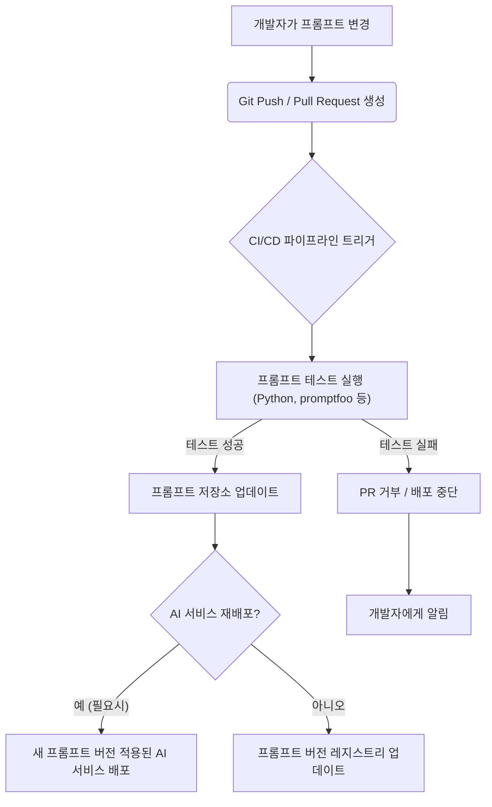
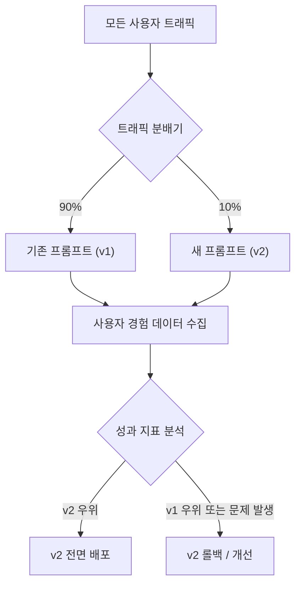

## 왜 프롬프트 버전 관리와 테스트가 중요한가?

iOS 또는 프론트엔드 개발자가 AI 기능을 애플리케이션에 통합할 때, 종종 프롬프트(Prompt)를 단순히 API 호출의 인자로만 생각하기 쉽습니다. 하지만 프롬프트는 AI 애플리케이션의 핵심 비즈니스 로직이자 사용자 경험을 좌우하는 중요한 부분입니다. 일반적인 소프트웨어 코드와 달리, 프롬프트는 몇 가지 독특한 특성 때문에 버전 관리와 테스트가 훨씬 더 중요해집니다.

첫째, **LLM(Large Language Model)의 비결정성** 때문입니다. 동일한 프롬프트를 사용하더라도 LLM은 매번 약간씩 다른 응답을 생성할 수 있습니다. 모델 업데이트, 파인튜닝, 또는 심지어 단순한 난수 시드(seed) 변화만으로도 출력의 품질과 형식이 크게 달라질 수 있습니다. 이는 개발자가 의도하지 않은 사용자 경험 저하를 초래할 수 있습니다.

둘째, **프롬프트의 민감성**입니다. 시스템 프롬프트의 작은 단어 하나, 심지어 구두점 하나의 변화도 LLM의 추론 방식과 결과에 엄청난 영향을 미칠 수 있습니다. 예를 들어, "간결하게 요약해 줘." 와 "300자 이내로 핵심만 요약해 줘."는 완전히 다른 결과물을 가져올 수 있으며, 의도치 않게 할루시네이션(hallucination)을 유발하거나 모델의 안전성 가이드라인을 우회하는 결과를 낳을 수도 있습니다.

셋째, **전통적인 소프트웨어 개발 원칙과의 괴리**입니다. 우리는 코드 변경 시 버전 관리를 하고, 단위 테스트, 통합 테스트, 회귀 테스트를 통해 기능의 안정성을 확보합니다. 그러나 프롬프트는 종종 이러한 체계적인 프로세스에서 소외되어, 수동으로 테스트되거나 심지어 테스트 없이 배포되는 경우가 많습니다. 이는 AI 애플리케이션의 품질 저하와 예측 불가능한 버그로 이어집니다. iOS/프론트엔드 개발 관점에서는, AI 백엔드에서 프롬프트 변경이 발생했을 때 클라이언트 UI가 깨지거나 예상치 못한 동작을 하는 상황을 막기 위해 프롬프트의 신뢰성을 확보하는 것이 필수적입니다.

따라서 AI를 실무에 성공적으로 적용하기 위해서는 코드처럼 프롬프트를 관리하고 테스트하는 '프롬프트 엔지니어링' 방법론이 반드시 필요합니다.

## 프롬프트 버전 관리: 변화에 대비하는 첫걸음

프롬프트 버전 관리는 Git과 같은 익숙한 도구를 사용하여 프롬프트의 변경 이력을 추적하고, 필요할 때 이전 버전으로 쉽게 되돌릴 수 있게 합니다.

### 프롬프트 저장소 구조 설계

프롬프트는 일반적인 텍스트 파일(`.txt`), Markdown 파일(`.md`), YAML 또는 JSON 파일 형태로 저장하는 것이 일반적입니다. 구조화된 데이터 포맷(YAML/JSON)은 변수 주입(prompt templating)이나 메타데이터 관리(버전, 작성자, 설명 등)에 유리합니다.

```
prompts/
├── v1/
│   ├── summarize_article.md
│   └── chat_assistant_system.json
└── v2/
    ├── summarize_article.md
    └── chat_assistant_system.json
```

위 예시처럼 `v1`, `v2` 등의 디렉토리로 메이저 버전을 구분하거나, 프롬프트 파일 자체에 버전 정보를 포함할 수 있습니다.

```json
// prompts/chat_assistant_system.json
{
  "version": "1.0.0",
  "name": "Chat Assistant System Prompt",
  "description": "사용자 질문에 답변하는 친절한 챗봇 시스템 프롬프트",
  "role": "system",
  "template": "당신은 사용자에게 유용하고 친절한 정보를 제공하는 AI 비서입니다. 다음 지시사항을 따르세요:\n1. 불필요한 서론 없이 바로 답변을 시작하세요.\n2. 항상 한국어로 답변하세요.\n3. 사용자의 질문에 대해 간결하고 명확하게 설명하세요."
}
```

이렇게 메타데이터와 함께 프롬프트 템플릿을 관리하면, 어떤 프롬프트가 어떤 의도로 만들어졌는지, 어떤 버전인지 한눈에 파악하기 쉽습니다.

### 프롬프트 변경 워크플로우

1.  **새 브랜치 생성:** `git checkout -b feature/update-summarize-prompt`
2.  **프롬프트 수정/생성:** `prompts/v2/summarize_article.md` 파일을 수정합니다.
3.  **테스트 코드 작성/업데이트:** 이 변경에 대한 테스트를 작성하거나 기존 테스트를 업데이트합니다. (다음 섹션에서 자세히 다룸)
4.  **Pull Request (PR) 생성:** 변경 사항과 테스트 결과를 포함하여 PR을 생성합니다.
5.  **동료 검토:** 다른 팀원이 프롬프트 내용, 테스트 커버리지, 예상되는 LLM 동작 변화 등을 검토합니다.
6.  **CI/CD 자동화:** PR이 병합(merge)되기 전에 프롬프트 테스트가 자동으로 실행되고, 성공 시에만 병합되도록 CI(Continuous Integration) 파이프라인을 구성합니다.
7.  **배포:** 테스트를 통과한 프롬프트는 새로운 AI 애플리케이션 버전과 함께 배포됩니다.

이 워크플로우는 기존 코드 개발 워크플로우와 동일한 방식으로 프롬프트의 품질을 보장합니다.

## 자동화된 프롬프트 테스트: AI 애플리케이션의 품질 보증

프롬프트는 그 자체로 코드와 같습니다. 따라서 코드에 단위 테스트, 통합 테스트, 회귀 테스트를 적용하듯이, 프롬프트에도 이러한 테스트를 적용해야 합니다.

### 테스트의 종류와 목표

*   **단위 테스트 (Unit Test):** 특정 프롬프트가 주어진 입력에 대해 의도된 형식과 내용의 출력을 생성하는지 검증합니다. 예를 들어, "요약 프롬프트"에 긴 기사를 입력했을 때, "300자 이내의 요약"이 나오는지 확인하는 것입니다.
*   **통합 테스트 (Integration Test):** 프롬프트가 전체 애플리케이션 흐름 내에서 다른 컴포넌트(예: 데이터 전처리, 후처리 로직)와 함께 잘 작동하는지 확인합니다.
*   **회귀 테스트 (Regression Test):** 프롬프트가 변경되었을 때, 기존에 잘 작동하던 기능들이 손상되지 않았는지 확인합니다. 이는 "골든 데이터셋"을 기반으로 이전 버전의 응답과 비교하여 변화를 감지하는 방식으로 수행됩니다.
*   **성능 테스트 (Performance Test):** 프롬프트가 LLM의 응답 속도, 토큰 사용량 등에 미치는 영향을 측정합니다. 비용 효율성과 사용자 경험에 중요한 요소입니다.
*   **안전성/편향 테스트 (Safety/Bias Test):** 프롬프트가 유해하거나 편향된 콘텐츠를 생성하지 않는지, 또는 모델의 안전 가이드라인을 우회하는 응답을 유도하지 않는지 검증합니다.

### 골든 데이터셋 (Golden Dataset) 구축

효과적인 프롬프트 테스트의 핵심은 신뢰할 수 있는 "골든 데이터셋"입니다. 골든 데이터셋은 특정 입력에 대해 LLM이 생성해야 할 "정답" 또는 "기대 응답" 쌍의 모음입니다.

```json
// golden_dataset/summarization_tests.json
[
  {
    "id": "summary-test-001",
    "input": "삼성전자가 갤럭시 언팩 행사를 개최하고 새로운 폴더블폰 갤럭시 Z 플립5와 갤럭시 Z 폴드5를 공개했다...",
    "expected_output_keywords": ["삼성전자", "갤럭시", "폴더블폰", "플립5", "폴드5"],
    "expected_length_range": [50, 100],
    "context": "기술 기사 요약"
  },
  {
    "id": "summary-test-002",
    "input": "최근 서울 아파트 시장은 급매물 소진과 매수 심리 회복으로 거래량이 증가하는 추세이다...",
    "expected_output_keywords": ["서울", "아파트", "거래량", "회복"],
    "expected_length_range": [50, 100],
    "context": "부동산 뉴스 요약"
  }
]
```
골든 데이터셋은 수동으로 작성하거나, 초기 버전의 LLM으로 생성한 후 사람이 검토하여 "정답"으로 확정하는 방식으로 구축할 수 있습니다.

### 테스트 프레임워크와 도구

Python의 `pytest`와 같은 범용 테스트 프레임워크를 사용하여 프롬프트 테스트를 구현할 수 있습니다. `langchain-testing`이나 `promptfoo`와 같은 전용 도구들도 유용합니다.

다음은 `pytest`를 활용한 간단한 프롬프트 테스트 예제입니다.

```python
# test_prompts.py
import pytest
import json
from openai import OpenAI

# OpenAI 클라이언트 초기화 (실제 사용 시 환경 변수 등으로 관리)
client = OpenAI()

# 프롬프트 로드 함수
def load_prompt(filepath: str) -> str:
    with open(filepath, 'r', encoding='utf-8') as f:
        return json.load(f)['template'] # JSON 파일에서 template 필드 로드

# 골든 데이터셋 로드 함수
def load_golden_dataset(filepath: str) -> list[dict]:
    with open(filepath, 'r', encoding='utf-8') as f:
        return json.load(f)

# 프롬프트 테스트용 픽스처
@pytest.fixture(scope="module")
def chat_assistant_prompt():
    return load_prompt("prompts/chat_assistant_system.json")

@pytest.fixture(scope="module")
def summarization_dataset():
    return load_golden_dataset("golden_dataset/summarization_tests.json")

# LLM 호출 함수 (테스트용)
def call_llm(system_prompt: str, user_input: str) -> str:
    messages = [
        {"role": "system", "content": system_prompt},
        {"role": "user", "content": user_input}
    ]
    try:
        response = client.chat.completions.create(
            model="gpt-4o-mini", # 실제 사용 모델 지정
            messages=messages,
            temperature=0.0 # 테스트 시에는 비결정성을 줄이기 위해 낮은 temperature 사용
        )
        return response.choices[0].message.content
    except Exception as e:
        pytest.fail(f"LLM 호출 실패: {e}")

# 테스트 케이스 1: 챗봇 시스템 프롬프트가 올바른 언어로 응답하는지 확인
def test_chat_assistant_korean_response(chat_assistant_prompt):
    user_input = "Hello, what is the capital of South Korea?"
    response = call_llm(chat_assistant_prompt, user_input)
    assert "서울" in response and "대한민국" in response, \
        f"기대: 한국어 응답, 실제: {response[:50]}..." # 앞 50자만 출력

# 테스트 케이스 2: 요약 프롬프트가 키워드를 포함하고 길이를 준수하는지 확인 (골든 데이터셋 활용)
@pytest.mark.parametrize("test_case", summarization_dataset())
def test_summarization_prompt_with_golden_dataset(chat_assistant_prompt, test_case):
    # 이 예시에서는 chat_assistant_prompt를 system_prompt로 재활용하지만, 실제로는 요약 프롬프트가 필요
    # 예를 들어, summarize_article.md를 불러와 사용할 수 있음
    summarization_system_prompt = f"{chat_assistant_prompt}\n다음 기사를 요약해 주세요. {test_case['expected_length_range'][0]}자 이상 {test_case['expected_length_range'][1]}자 이하로 요약해야 합니다."

    response = call_llm(summarization_system_prompt, test_case["input"])
    
    # 키워드 포함 여부 확인
    for keyword in test_case["expected_output_keywords"]:
        assert keyword in response, f"키워드 '{keyword}'가 응답에 포함되어야 합니다. 실제: {response[:100]}..."

    # 길이 범위 확인
    response_len = len(response)
    min_len, max_len = test_case["expected_length_range"]
    assert min_len <= response_len <= max_len, \
        f"응답 길이가 {min_len}~{max_len}자 범위여야 합니다. 실제: {response_len}자. 내용: {response[:100]}..."

    print(f"\nTest {test_case['id']} Passed! Response: {response[:50]}...")
```
**참고:** `pytest`를 실행하려면 `pip install pytest openai` 가 필요하며, `OPENAI_API_KEY` 환경 변수가 설정되어 있어야 합니다. 이 예제는 `chat_assistant_system.json` 프롬프트를 시스템 프롬프트로 사용하고, 요약 테스트에서는 이 시스템 프롬프트에 추가 지시를 더하는 방식으로 구성했습니다. 실제로는 각 기능별 프롬프트를 명확히 분리하여 테스트하는 것이 좋습니다.

## CI/CD 파이프라인 통합

프롬프트 테스트는 CI/CD 파이프라인에 필수적으로 통합되어야 합니다. 개발자가 프롬프트를 변경하고 Git에 푸시하면, CI 시스템(예: GitHub Actions, GitLab CI, Jenkins)이 자동으로 트리거되어 모든 프롬프트 테스트를 실행합니다.


이렇게 자동화된 파이프라인은 잘못된 프롬프트가 프로덕션 환경에 배포되는 것을 막아 AI 애플리케이션의 안정성을 크게 향상시킵니다. 특히 프론트엔드/iOS 앱의 UI가 백엔드 AI의 응답 형태에 의존하는 경우, 프롬프트 테스트가 실패하면 클라이언트 앱의 버그로 직결될 수 있으므로 배포 전 철저한 검증이 필수적입니다.

## 실무 적용 패턴 및 2026년 트렌드

2026년에는 AI 기술이 더욱 성숙해지면서 프롬프트 엔지니어링도 고도화될 것입니다.

### A/B 테스팅 및 카나리 배포 (Canary Deployment)

새로운 프롬프트 버전이 더 좋은 성능을 내는지, 아니면 예상치 못한 부작용은 없는지 확인하기 위해 실제 사용자 트래픽의 일부에만 새 프롬프트를 적용하는 방식입니다.


프론트엔드 개발자는 사용자 A/B 테스트 프레임워크와 연동하여 백엔드 AI 서비스에 어떤 프롬프트 버전을 호출할지 결정하고, 그에 따른 사용자 경험 지표를 수집하여 평가할 수 있습니다.

### LLM-as-a-Judge 기반 자동 평가

사람의 수동 평가에는 시간과 비용이 많이 소요됩니다. 2026년에는 LLM이 다른 LLM의 응답을 평가하는 "LLM-as-a-Judge" 방식이 더욱 보편화될 것입니다. 특정 프롬프트를 통해 평가 기준과 가이드라인을 제시하고, 이를 바탕으로 LLM이 응답의 품질(관련성, 정확성, 안전성 등)을 점수화하거나 순위를 매깁니다. 이는 대규모 골든 데이터셋을 구축하기 어려운 경우 특히 유용합니다.

### 합성 데이터 생성 (Synthetic Data Generation)

다양한 엣지 케이스 시나리오를 수동으로 작성하는 것은 어렵습니다. LLM을 사용하여 테스트용 "합성 데이터"를 대량으로 생성하고, 이를 프롬프트 테스트에 활용하는 방식이 트렌드가 될 것입니다. 예를 들어, 특정 도메인의 질문을 수십만 개 생성하고, 각 질문에 대한 예상 답변 패턴도 LLM으로 생성하여 테스트 커버리지를 극대화할 수 있습니다.

### Agentic Workflow의 테스트

단순히 한 번의 프롬프트로 응답을 받는 것을 넘어, LLM이 여러 도구를 사용하고 복잡한 의사결정 과정을 거쳐 목표를 달성하는 "Agentic Workflow"가 확산될 것입니다. 이러한 에이전트의 테스트는 훨씬 복잡하며, 각 단계의 프롬프트뿐만 아니라 도구 사용의 정확성, 장기적인 계획 능력, 그리고 오류 복구 능력까지 검증해야 합니다. 이에는 시뮬레이션 환경 구축이 필수적입니다.

### 프롬프트 관리 플랫폼 (Prompt Management Platforms)

점점 더 많은 기업들이 프롬프트를 중앙 집중식으로 관리하고, 협업하며, 버전별로 배포할 수 있는 전문 PromptOps(프롬프트 운영) 플랫폼을 도입할 것입니다. 이러한 플랫폼은 개발자가 프롬프트의 변경 이력을 추적하고, 테스트 결과를 시각화하며, A/B 테스트를 쉽게 설정할 수 있도록 돕습니다.

### 프롬프트 드리프트 감지 (Prompt Drift Detection)

LLM 모델 업데이트, 파인튜닝, 또는 외부 데이터 소스의 변화로 인해 기존 프롬프트의 성능이 저하되는 현상인 "프롬프트 드리프트"를 자동으로 감지하는 기술이 중요해질 것입니다. 주기적으로 프로덕션 데이터를 샘플링하여 프롬프트의 응답 품질을 모니터링하고, 사전 정의된 성능 지표(KPI)가 일정 수준 이하로 떨어지면 경고를 발생시키는 시스템이 구축될 것입니다.

## 사례: iOS 애플리케이션의 AI 비서 프롬프트 관리

사용자 요청을 기반으로 정보를 제공하는 iOS AI 비서 앱을 개발한다고 가정해봅시다.

1.  **프롬프트 저장:** 앱의 백엔드(예: Python Flask, Node.js Express) 또는 서버리스 함수(AWS Lambda, Vercel Edge Functions)에 `prompts/` 디렉토리를 만들어 프롬프트를 `.json` 파일로 저장합니다. 이 저장소는 Git으로 관리됩니다.
2.  **프롬프트 호출:** iOS 앱은 사용자의 질문을 백엔드 API로 전송합니다. 백엔드 API는 현재 활성화된 프롬프트 버전(예: `v2/assistant_prompt.json`)을 불러와 사용자 질문과 결합하여 LLM에 전송합니다.
3.  **버전 업그레이드:** AI 비서의 답변 품질을 개선하기 위해 프롬프트 `v2`를 `v3`으로 업그레이드합니다. 새로운 `v3/assistant_prompt.json` 파일을 생성하고, `test_prompts.py` 파일에 `v3`에 특화된 새로운 테스트 케이스를 추가하거나 기존 테스트를 업데이트합니다.
4.  **CI/CD 검증:** 개발자가 `v3` 프롬프트와 테스트 코드를 Git에 푸시하고 PR을 생성합니다. CI/CD 파이프라인은 이 PR에 연결된 모든 테스트를 자동으로 실행합니다. 테스트가 성공적으로 통과하면 PR이 병합됩니다.
5.  **A/B 테스트 배포:** 처음에는 사용자 트래픽의 10%에만 `v3` 프롬프트를 사용하는 AI 비서 버전을 배포합니다. iOS 앱에서 `Configuration` 또는 `Feature Flag`를 통해 어떤 프롬프트 버전을 사용할지 백엔드에 전달하거나, 백엔드에서 자체적으로 트래픽을 분배합니다. A/B 테스트 결과를 모니터링하여 `v3`이 `v2`보다 유의미하게 좋은 성과를 보이면, 전면 배포를 결정합니다.
6.  **안정성 확보:** 이 과정을 통해 iOS 앱 사용자는 프롬프트 변경으로 인한 서비스 불안정성을 겪지 않고, 지속적으로 개선된 AI 비서 경험을 제공받을 수 있습니다. 만약 `v3` 프롬프트에 문제가 발생하더라도, Git을 통해 즉시 `v2`로 롤백하고 앱에서 해당 프롬프트 버전을 다시 사용하도록 지시할 수 있습니다.

## 요약 테이블: 프롬프트 버전 관리 & 테스트 전략

| 측면             | 내용                                                      | 장점                                                                                              |
| :--------------- | :-------------------------------------------------------- | :------------------------------------------------------------------------------------------------ |
| **버전 관리**    | Git 기반 프롬프트 저장, SemVer, 변경 이력 추적              | 체계적인 협업, 롤백 용이, 변경 관리 용이                                                           |
| **테스트 종류**  | 단위, 통합, 회귀, 성능, 안전성/편향 테스트                | 다양한 관점의 품질 보증, 잠재적 문제 사전 감지                                                    |
| **골든 데이터셋**| 신뢰할 수 있는 입/출력 쌍 모음                            | 테스트의 기준점 제공, 회귀 테스트의 핵심 자료                                                     |
| **CI/CD 통합**   | 프롬프트 변경 시 자동 테스트, 배포 파이프라인 연동        | 잘못된 프롬프트 배포 방지, 개발 생산성 향상                                                       |
| **A/B 테스트**   | 새 프롬프트 버전의 점진적 롤아웃 및 성능 검증             | 실제 사용자 피드백 기반 최적화, 위험 최소화                                                       |
| **자동 평가**    | LLM-as-a-Judge, 합성 데이터 생성                          | 평가 효율성 증대, 광범위한 테스트 커버리지 확보, 대규모 데이터셋 구축 용이                       |
| **드리프트 감지**| 모델/환경 변화에 따른 프롬프트 성능 저하 자동 모니터링    | 서비스 품질 지속 유지, 예측 불가능한 성능 저하 방지                                               |