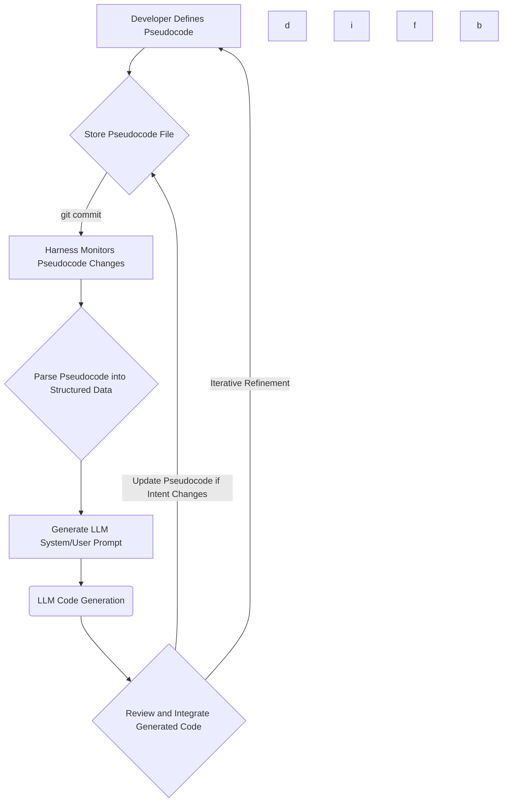

LLM 기반 코딩 에이전트는 복잡한 개발 작업을 자동화하는 데 혁신적인 잠재력을 제공하지만, 기존의 대화형 프롬프트 방식은 개발자의 의도를 지속적으로 유지하고 제어하는 데 한계가 있습니다. 프롬프트는 쉽게 폐기되고, 변경 사항을 반복해서 서술해야 하며, 이는 인간 의도의 기록을 소실시키고 토큰 사용량을 비효율적으로 만듭니다. 이러한 문제는 특히 장기 프로젝트나 복잡한 시스템 개발 시 LLM의 활용도를 저해하는 요인이 됩니다.

Huzzah와 같은 새로운 접근 방식은 개발자의 의도를 담은 선언형 의사코드를 지속적으로 저장하고, 이를 실제 코드로 변환하는 방식을 실험합니다. 이는 LLM에 대한 제어를 보다 구조화하고 예측 가능하게 만듭니다. Claude Code 하네스에 이 의사코드 기반 제어 방식을 도입함으로써, 개발자 의도의 영속성을 확보하고, 기존 프롬프트 관리 방식 대비 효율성과 출력 품질을 평가할 수 있습니다.

## 아키텍처: LLM 하네스에 의사코드 통합

의사코드 기반 제어 방식은 LLM 하네스 내에서 다음 단계를 통해 구현됩니다.

1.  **의사코드 정의 및 저장**: 개발자는 고수준의 선언형 의사코드를 `.pseudo` 파일과 같은 특정 형식으로 작성하여 코드베이스와 함께 버전 관리 시스템에 저장합니다. 이 의사코드는 특정 기능, API 엔드포인트, 데이터 구조 등 개발자의 의도를 명확하게 표현합니다.
2.  **하네스의 의사코드 모니터링**: Claude Code 하네스는 저장된 의사코드 파일의 변경 사항을 지속적으로 모니터링합니다.
3.  **의사코드 파싱 및 구조화된 데이터 변환**: 변경이 감지되면 하네스는 의사코드를 파싱하여 LLM이 이해하기 쉬운 구조화된 데이터(예: JSON 객체)로 변환합니다.
4.  **LLM 프롬프트 생성**: 구조화된 의사코드를 기반으로 LLM에 전달될 시스템 프롬프트 및 사용자 프롬프트를 동적으로 생성합니다. 이 프롬프트는 의사코드의 지시사항을 LLM이 코드 생성에 필요한 형태로 상세화합니다.
5.  **LLM 코드 생성**: LLM은 생성된 프롬프트를 바탕으로 실제 코드를 생성합니다.
6.  **코드 통합 및 검증**: 생성된 코드는 개발자에 의해 검토, 테스트 및 기존 코드베이스에 통합됩니다. 이때 의사코드와 생성된 코드 간의 일관성이 유지되도록 피드백 루프가 작동합니다.

## 코드 예제: 의사코드에서 LLM 입력으로

다음 Python 예제는 간단한 의사코드를 파싱하여 LLM 프롬프트를 생성하는 과정을 보여줍니다. 이는 `feature_todo.pseudo`라는 가상의 의사코드 파일을 기반으로 합니다.

### `feature_todo.pseudo`

```python
# Pseudocode-driven task definition
CREATE_USER_AUTH_ENDPOINT:
    METHOD: POST
    PATH: "/api/v1/auth/register"
    INPUT: { "username": "string", "email": "string", "password": "string" }
    OUTPUT: { "message": "User created successfully" }
    ERROR: { "code": 400, "message": "Invalid input" }
    DEPENDENCY: User model, Hashing utility
```

### 하네스 로직: 의사코드 파서 및 LLM 인터랙션

```python
import json

def parse_pseudocode(filepath):
    pseudocode_directives = {}
    current_directive = None
    with open(filepath, 'r') as f:
        for line in f:
            line = line.strip()
            if not line or line.startswith('#'):
                continue
            if line.endswith(':'):
                current_directive = line[:-1].strip()
                pseudocode_directives[current_directive] = {}
            elif current_directive:
                key_value = line.split(':', 1)
                if len(key_value) == 2:
                    key = key_value[0].strip()
                    value = key_value[1].strip()
                    try:
                        # Attempt to parse as JSON if it looks like one
                        pseudocode_directives[current_directive][key] = json.loads(value)
                    except json.JSONDecodeError:
                        pseudocode_directives[current_directive][key] = value
    return pseudocode_directives

def generate_llm_prompt(pseudocode_data):
    if not pseudocode_data:
        return "No pseudocode data to process."
    
    directive_name = list(pseudocode_data.keys())[0]
    details = pseudocode_data[directive_name]
    
    prompt = f"""
Based on the following declarative pseudocode, generate a Python Flask endpoint for user registration.
Ensure it handles input validation, password hashing, and returns appropriate responses.

Pseudocode Task: {directive_name}
Method: {details.get('METHOD', 'GET')}
Path: {details.get('PATH', '/')}
Input Schema: {details.get('INPUT', {})}
Output Schema: {details.get('OUTPUT', {})}
Error Schema: {details.get('ERROR', {})}
Dependencies: {details.get('DEPENDENCY', 'None')}

Please provide the full Flask application code including imports and a basic run configuration.
"""
    return prompt

# Example usage in the harness:
# pseudocode_data = parse_pseudocode("feature_todo.pseudo")
# if pseudocode_data:
#     llm_input_prompt = generate_llm_prompt(pseudocode_data)
#     # print(llm_input_prompt) # This prompt would be sent to the LLM API
```

## 워크플로우 다이어그램

이 다이어그램은 의사코드 기반 AI 코딩 제어의 전체 흐름을 시각화합니다.



## 효율성 및 품질 비교

의사코드 기반 제어 방식은 기존의 장문 채팅 명령 방식에 비해 다음과 같은 이점을 제공합니다.

*   **토큰 사용량 절감**: 개발자 의도가 영구적으로 저장되므로, 동일한 의도를 반복해서 설명할 필요가 없어 LLM API 호출 시 필요한 토큰 수를 크게 줄일 수 있습니다.
*   **출력 품질 향상**: 구조화된 의사코드는 LLM에 더 명확하고 일관된 지침을 제공하여, 생성되는 코드의 정확성과 견고성을 높입니다. 이는 LLM의 추론 오류를 줄이고 예측 가능한 결과를 도출하는 데 기여합니다.
*   **개발자 경험 개선**: 개발자는 LLM과의 대화 방식에 집중하기보다 핵심 비즈니스 로직과 아키텍처를 의사코드로 정의하는 데 집중할 수 있습니다. 이는 개발 워크플로우의 효율성을 높이고 생산성을 향상시킵니다.
*   **의도 드리프트 방지**: 개발자의 의도가 의사코드 형태로 명시적으로 기록되므로, LLM과의 상호작용 과정에서 의도가 희석되거나 잘못 해석되는 '의도 드리프트' 현상을 효과적으로 방지할 수 있습니다.

## 트레이드오프

의사코드 기반 AI 코딩 제어 방식은 여러 이점을 제공하지만, 고려해야 할 트레이드오프도 존재합니다.

*   **명확한 의도 기록 (Clear Intent Persistence)**:
    *   **언제 좋음**: 장기 프로젝트나 복잡한 기능 개발 시 LLM과의 대화가 단절되더라도 핵심 의도가 유지되어 지속적인 개발이 가능합니다. 팀 협업 환경에서 개발자 간 의도 공유를 명확하게 합니다.
    *   **언제 나쁨**: 매우 간단하고 일회성인 스크립트 작성이나 빠른 프로토타이핑에는 의사코드를 작성하는 초기 오버헤드가 더 클 수 있습니다.
*   **토큰 효율성 (Token Efficiency)**:
    *   **언제 좋음**: 반복적인 프롬프트 재작성이 필요 없으므로 LLM 호출 시 토큰 사용량을 절감하여 대규모 작업에서 비용 효율성을 높입니다.
    *   **언제 나쁨**: 의사코드 자체가 매우 복잡해지거나, LLM이 의사코드를 완전히 이해하기 위해 추가적인 추론 단계가 필요하다면, 그 과정에서 발생하는 토큰 사용량이 증가할 수 있습니다.
*   **예측 가능한 출력 (Predictable Output)**:
    *   **언제 좋음**: 구조화된 의사코드는 LLM에 명확하고 구속력 있는 지침을 제공하여 일관되고 예측 가능한 고품질 코드 생성을 유도합니다. 이는 고품질 코드와 적은 디버깅 오버헤드를 목표로 할 때 유리합니다.
    *   **언제 나쁨**: LLM의 창의적이거나 탐색적인 코드 생성 능력을 제한할 수 있습니다. 특정 시나리오에서는 LLM이 더 자유롭게 코드를 제안하는 것이 유용할 때도 있습니다.
*   **초기 설정 및 학습 곡선 (Initial Setup & Learning Curve)**:
    *   **언제 좋음**: 일관된 개발 프로세스를 구축하고 LLM 제어에 대한 표준화된 접근 방식을 도입할 때 장기적인 생산성 향상에 기여합니다.
    *   **언제 나쁨**: 새로운 의사코드 언어나 파싱 프레임워크를 정의하고 개발팀이 이를 학습하는 데 상당한 초기 시간과 노력이 필요합니다. 이는 짧은 프로젝트 주기에는 부담이 될 수 있습니다.
*   **의사코드-LLM 간의 의미론적 불일치 (Semantic Gap between Pseudocode and LLM)**:
    *   **언제 좋음**: 의사코드 정의가 명확하고 LLM의 해석 능력이 충분히 정교할 때, 의도와 코드 간의 간극을 최소화합니다.
    *   **언제 나쁨**: 의사코드의 추상적인 표현이 LLM에 의해 모호하게 해석되거나, 의사코드 정의가 불완전하여 LLM이 잘못된 가정을 할 경우 예상치 못한 결과나 오류가 발생할 수 있습니다.

## 실전 체크리스트

의사코드 기반 AI 코딩 제어 방식을 프로젝트에 성공적으로 적용하기 위한 검증 항목입니다.

*   [ ] **의사코드 스키마 정의 및 명세화**: 개발자 의도를 명확히 표현할 수 있는 선언형 의사코드 문법 및 구조를 확립하고, 이에 대한 상세한 문서가 존재하는가?
*   [ ] **의사코드 저장 및 버전 관리 시스템 통합**: 의사코드가 코드베이스와 함께 Git 등을 통해 지속적으로 저장되고 변경 이력이 효율적으로 관리되는가?
*   [ ] **LLM 하네스의 의사코드 파싱 및 프롬프트 변환 로직 구현**: 의사코드를 정확히 해석하여 LLM에 최적화된 시스템/사용자 프롬프트로 변환하는 모듈이 견고하게 작동하며, 확장 가능한가?
*   [ ] **토큰 사용량 및 비용 효율성 측정 지표 구축**: 기존 프롬프트 방식 대비 의사코드 기반 방식의 평균 토큰 사용량과 관련 비용 절감 효과를 정량적으로 추적하고, 그 결과가 기대치를 충족하는가?
*   [ ] **생성된 코드 품질 및 정확성 자동 평가 시스템 도입**: 의사코드로부터 생성된 코드의 기능적 정확성, 스타일 가이드 준수 여부 등을 자동으로 검증하는 테스트 및 평가 파이프라인이 구축되어 있는가?
*   [ ] **개발자 경험 (DX) 개선도 설문 및 피드백 루프 운영**: 의사코드 기반 제어 방식이 개발자의 의도 전달 및 코드 생성 워크플로우를 얼마나 효율적으로 개선했는지 주기적으로 평가하고, 수집된 피드백을 통해 시스템을 지속적으로 개선하는가?
*   [ ] **의사코드-LLM 의미론적 불일치 감지 및 완화 메커니즘**: 의사코드의 의도가 LLM에 의해 오해되거나 불완전하게 반영되는 사례를 식별하고, 이를 보완하는 전략(예: 추가 컨텍스트 주입, 자동 검증, 휴먼 검토 지점)이 효과적으로 작동하는가?