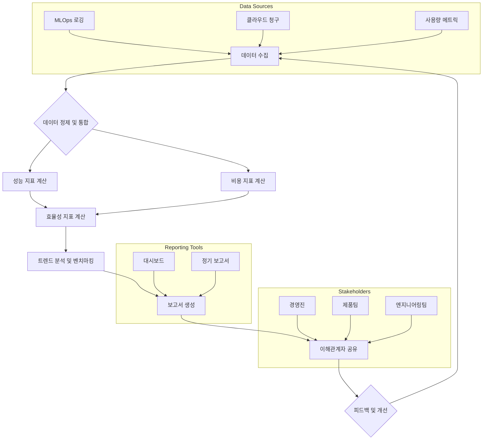

AI 프로젝트의 성공은 단순히 기술적 성능을 넘어 비즈니스 가치와 비용 효율성을 입증하는 데 달려 있습니다. 이를 위해 AI 모델의 성능과 비용 효율성을 체계적으로 분석하고 보고하는 표준화된 방법론이 필수적입니다. 이 보고서는 이해관계자들이 AI 투자의 ROI를 명확하게 이해하고, 데이터 기반의 의사결정을 내릴 수 있도록 돕습니다.

## AI 성능 및 비용 보고서의 핵심 구성 요소

효과적인 AI 성능 및 비용 보고서는 다음 핵심 요소를 포함해야 합니다.

### 1. 개요 및 요약 (Executive Summary)

보고서의 핵심 내용, 주요 결과, 권장 사항을 간략하게 요약하여 바쁜 경영진이 빠르게 핵심을 파악할 수 있도록 합니다.

### 2. 모델 및 프로젝트 개요 (Model & Project Overview)

*   **모델명 및 버전**: 현재 평가 중인 AI 모델의 고유 식별자.
*   **목표**: 모델이 해결하고자 하는 비즈니스 문제 및 목표.
*   **아키텍처 및 데이터**: 사용된 모델 아키텍처, 학습 데이터셋, 주요 특징.

### 3. 성능 지표 (Performance Metrics)

모델의 기술적 효용성을 측정합니다. 2026년 기준, 단순히 정확도를 넘어 비즈니스 문맥에서의 실제 영향력을 보여주는 지표들이 중요합니다.

*   **정확도, 정밀도, 재현율, F1-Score**: 분류 모델의 기본 지표.
*   **MAE, RMSE**: 회귀 모델의 오차 지표.
*   **ROC AUC, PR AUC**: 이진 분류 모델의 성능 평가.
*   **추론 지연 시간 (Latency)**: 단일 추론에 소요되는 시간 (밀리초).
*   **처리량 (Throughput)**: 초당 처리할 수 있는 요청 수 (Requests Per Second, RPS).
*   **모델 크기 및 메모리 사용량**: 배포 환경에 미치는 영향.

### 4. 비용 지표 (Cost Metrics)

AI 모델 운영에 필요한 재정적 투자를 측정합니다.

*   **추론 비용 (Inference Cost)**: 단일 추론 또는 특정 기간 동안의 총 추론 비용.
*   **학습 비용 (Training Cost)**: 모델 학습에 소요된 컴퓨팅 자원 (GPU 시간, 스토리지 등) 비용.
*   **인프라 비용 (Infrastructure Cost)**: 모델 배포 및 서비스 유지에 드는 고정/변동 비용 (서버, 네트워크, 스토리지).
*   **총 소유 비용 (Total Cost of Ownership, TCO)**: 모델 개발부터 운영, 유지보수까지 전 과정의 총 비용.

### 5. 효율성 지표 (Efficiency Ratios)

성능과 비용을 결합하여 모델의 효율성을 평가합니다. 이는 비즈니스 의사결정에 가장 중요한 부분입니다.

*   **성능 대비 비용 (Performance per Cost)**: 예를 들어, 1달러당 정확도 또는 1달러당 처리량.
*   **비용 대비 가치 (Cost per Value)**: 특정 비즈니스 성과 (예: 전환율 증가, 오류 감소) 단위당 비용.

### 6. 트렌드 분석 및 벤치마킹 (Trend Analysis & Benchmarking)

시간 경과에 따른 성능 및 비용 변화 추이를 보여주고, 다른 모델, 과거 버전, 또는 산업 벤치마크와 비교하여 상대적인 위치를 평가합니다.

### 7. 권장 사항 및 실행 가능한 통찰 (Recommendations & Actionable Insights)

분석 결과를 바탕으로 모델 개선, 비용 최적화, 비즈니스 전략 조정 등에 대한 구체적인 권장 사항을 제시합니다.

## 데이터 수집 및 집계 방법

효율적인 보고서 작성을 위해서는 자동화된 데이터 수집 및 집계 파이프라인이 필수적입니다. 클라우드 공급자 (AWS Cost Explorer, Google Cloud Billing, Azure Cost Management)의 청구 데이터를 연동하고, MLOps 파이프라인에서 성능 메트릭을 로깅합니다.

```python
import pandas as pd
from datetime import datetime

def generate_ai_report_data(performance_logs, cost_data):
    # Simulate performance logs
    perf_df = pd.DataFrame(performance_logs)
    perf_df['timestamp'] = pd.to_datetime(perf_df['timestamp'])
    perf_df['inference_cost'] = perf_df['inference_count'] * 0.0001 # Simulate cost per inference

    # Aggregate performance metrics
    total_inferences = perf_df['inference_count'].sum()
    avg_latency = perf_df['latency_ms'].mean()
    avg_accuracy = perf_df['accuracy'].mean()
    total_inference_cost = perf_df['inference_cost'].sum()

    # Simulate cost data (e.g., from cloud billing)
    total_training_cost = cost_data.get('training_cost', 0)
    total_infra_cost = cost_data.get('infra_cost', 0)
    total_cost = total_inference_cost + total_training_cost + total_infra_cost

    # Calculate efficiency ratios
    accuracy_per_dollar = avg_accuracy / (total_cost if total_cost > 0 else 1) * 1000 # per $1000 for visibility
    inferences_per_dollar = total_inferences / (total_cost if total_cost > 0 else 1)

    report_data = {
        "report_date": datetime.now().strftime("%Y-%m-%d %H:%M:%S"),
        "total_inferences": total_inferences,
        "average_latency_ms": f"{avg_latency:.2f}",
        "average_accuracy": f"{avg_accuracy:.4f}",
        "total_inference_cost": f"{total_inference_cost:.2f}",
        "total_training_cost": f"{total_training_cost:.2f}",
        "total_infrastructure_cost": f"{total_infra_cost:.2f}",
        "total_overall_cost": f"{total_cost:.2f}",
        "efficiency_accuracy_per_1000_dollars": f"{accuracy_per_dollar:.4f}",
        "efficiency_inferences_per_dollar": f"{inferences_per_dollar:.2f}"
    }
    return report_data

# Example Usage:
# performance_sample_logs = [
#     {"timestamp": "2026-01-01 10:00:00", "inference_count": 100, "latency_ms": 50, "accuracy": 0.92},
#     {"timestamp": "2026-01-01 10:05:00", "inference_count": 150, "latency_ms": 45, "accuracy": 0.93},
#     {"timestamp": "2026-01-01 10:10:00", "inference_count": 80, "latency_ms": 60, "accuracy": 0.91}
# ]
# cost_sample_data = {"training_cost": 200.50, "infra_cost": 150.00}
# report = generate_ai_report_data(performance_sample_logs, cost_sample_data)
# print(report)
```

## AI 모델 성능 및 비용 보고 워크플로우



## 2026년 최신 트렌드 반영

*   **자동화된 MLOps 통합**: CI/CD 파이프라인 내에서 모델 배포 후 자동으로 성능 및 비용 메트릭을 수집하고 대시보드에 시각화하는 것이 표준화됩니다.
*   **설명 가능한 AI (XAI) 지표 포함**: 모델의 결정 과정에 대한 설명 가능성(Explainability)과 공정성(Fairness) 지표를 포함하여 규제 준수 및 윤리적 고려 사항을 보고합니다.
*   **지속적인 평가 및 AIOps**: 모델이 프로덕션 환경에서 작동하는 동안 실시간으로 성능 저하 및 비용 이상 징후를 감지하고 경고하는 AIOps(AI for Operations) 시스템과의 연동이 강화됩니다.
*   **멀티모달 및 생성형 AI 비용 최적화**: 멀티모달 모델이나 대규모 생성형 AI 모델의 경우, 토큰당 비용, 이미지/비디오 처리 비용 등 세분화된 비용 분석이 필수적이며, 프롬프트 엔지니어링을 통한 비용 절감 효과도 보고에 포함될 수 있습니다.

## 트레이드오프

AI 모델 성능 및 비용 효율성 보고서 작성에는 여러 트레이드오프가 존재하며, 프로젝트의 특성과 목적에 따라 적절한 균형점을 찾아야 합니다.

*   **보고서 표준화 vs. 맞춤형 심층 분석**: 
    *   **언제 좋고**: 조직 전체의 일관된 이해와 비교 분석이 중요할 때 (예: 여러 AI 프로젝트의 ROI 비교, 거버넌스). 
    *   **언제 나쁜지**: 특정 모델의 독특한 특성이나 비즈니스 목표에 대한 심층적인 분석이 필요할 때, 표준화된 템플릿은 충분한 통찰을 제공하지 못할 수 있습니다.

*   **데이터의 세분화 (Granularity) vs. 보고서의 간결성**: 
    *   **언제 좋고**: 엔지니어링 팀이나 데이터 과학자들이 모델 개선을 위한 세부적인 원인 분석을 할 때 (예: 특정 데이터셋에서의 성능 저하, 특정 시간에 발생하는 비용 급증). 
    *   **언제 나쁜지**: 경영진이나 비즈니스 의사결정권자에게는 너무 많은 세부 정보가 핵심 메시지를 가리고 혼란을 줄 수 있어, 간결하고 요약된 정보가 더 효과적입니다.

*   **실시간 모니터링 vs. 정기 배치 보고**: 
    *   **언제 좋고**: 프로덕션 환경에서 모델의 즉각적인 이상 감지 및 빠른 대응이 필요한 경우 (예: 서비스 중단 방지, 비용 폭증 알림). 
    *   **언제 나쁜지**: 장기적인 추세 분석이나 광범위한 리소스 할당 계획과 같이 즉각적인 반응보다 주기적인 종합 검토가 더 중요한 경우, 실시간 시스템 유지 비용이 비효율적일 수 있습니다.

*   **정량적 지표 중심 vs. 정성적 비즈니스 영향 포함**: 
    *   **언제 좋고**: 모델의 기술적 성능과 직접적인 비용 효율성을 객관적으로 비교하고 측정할 때. 
    *   **언제 나쁜지**: AI 모델이 고객 경험 개선, 혁신 등 정량화하기 어려운 비즈니스 가치를 창출할 때, 정량적 지표만으로는 전체적인 ROI를 설명하기 어렵습니다.

## 실전 체크리스트

AI 모델 성능 및 비용 효율성 보고서 시스템을 구축하고 활용할 때 다음 항목들을 검증합니다.

- [ ] **이해관계자 요구사항 정의**: 모든 주요 이해관계자 (경영진, 제품, 엔지니어링)를 식별하고, 각 팀이 보고서에서 얻고자 하는 핵심 정보와 의사결정 포인트를 명확히 정의했는가?
- [ ] **자동화된 데이터 파이프라인 구축**: 모델 성능 메트릭 (정확도, 지연 시간 등) 및 클라우드 비용 데이터를 자동으로 수집, 정제, 통합하는 파이프라인이 구현되었는가?
- [ ] **기준선 및 벤치마크 설정**: 각 AI 모델에 대한 기준 성능 (Baseline Performance) 및 비용 벤치마크가 설정되었으며, 이를 바탕으로 개선 또는 악화 추이를 측정하고 있는가?
- [ ] **보고서 생성 및 배포 자동화**: 성능 및 비용 보고서가 정기적으로 (예: 주간, 월간) 자동으로 생성되어 지정된 이해관계자들에게 배포되고 있는가?
- [ ] **실행 가능한 통찰 추출 및 추적**: 보고서에서 도출된 권장 사항 (예: 모델 최적화, 인프라 조정)이 구체적인 액션 아이템으로 전환되고, 해당 액션의 결과가 추적되고 있는가?
- [ ] **실시간 모니터링 대시보드 제공**: 핵심 성능 및 비용 지표를 실시간으로 확인할 수 있는 대시보드가 구축되어, 잠재적 문제 발생 시 즉각적인 인지 및 대응이 가능한가?
- [ ] **피드백 루프 구축**: 보고서의 내용과 형식에 대한 이해관계자들의 피드백을 정기적으로 수집하고, 이를 반영하여 보고 시스템을 지속적으로 개선하는 프로세스가 있는가?
- [ ] **버전 관리 및 변경 이력 추적**: 보고서 템플릿, 사용된 메트릭 정의, 데이터 소스 등에 대한 변경 이력이 관리되어 보고서의 신뢰성과 재현성을 보장하는가?