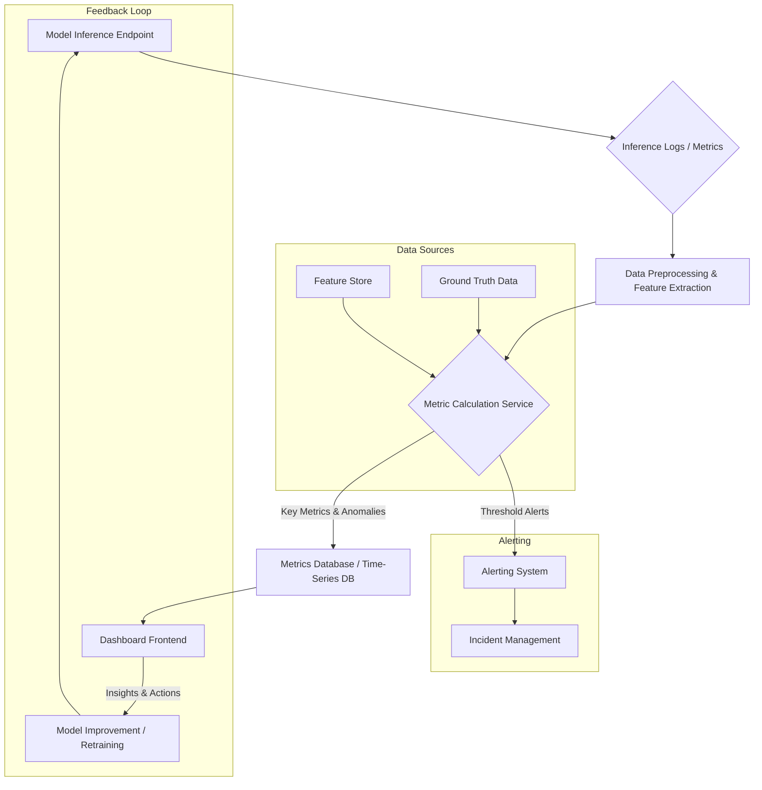

AI 프로젝트의 성공적인 운영을 위해서는 AI 모델의 성능 지표를 이해관계자에게 효과적으로 시각화하고 전달하는 대시보드 디자인이 필수적입니다. 단순히 숫자를 나열하는 것을 넘어, 비즈니스 가치와 직결되는 인사이트를 제공하여 적절한 의사결정을 유도하는 것이 핵심입니다. 이 문서는 AI 모델 성능 지표 대시보드를 구축하기 위한 핵심 원칙과 실전 가이드를 제시합니다.

## AI 모델 성능 지표 대시보드의 중요성
AI 모델은 배포 이후에도 지속적인 모니터링과 평가가 필요합니다. 모델의 성능 저하(drift), 예상치 못한 편향(bias), 비즈니스 목표와의 불일치 등 다양한 문제가 발생할 수 있기 때문입니다. 효과적인 성능 지표 대시보드는 이러한 문제를 조기에 감지하고, 이해관계자들이 모델의 상태를 투명하게 이해하며, 필요한 조치를 신속하게 취할 수 있도록 돕습니다. 이는 AI 프로젝트의 장기적인 성공과 ROI 확보에 결정적인 역할을 합니다.

## 핵심 디자인 원칙

### 1. 대상 이해 (Audience-Centricity)
대시보드는 누가 사용하는지에 따라 제공해야 할 정보의 깊이와 시각화 방식이 달라집니다.
*   **ML 엔지니어/데이터 과학자**: 모델의 기술적 성능 지표 (예: Precision, Recall, RMSE), 데이터 분포 변화(data drift), 이상치(outliers), 모델의 추론 시간(latency) 및 리소스 사용량(resource utilization) 등 상세한 지표와 진단 도구가 필요합니다.
*   **제품 관리자/비즈니스 이해관계자**: 비즈니스 KPI (예: 전환율 증가, 비용 절감, 사용자 만족도)와 모델 성능 지표의 연관성, 그리고 모델이 비즈니스 목표에 미치는 영향에 초점을 맞춥니다. 직관적이고 고수준의 요약 정보가 중요합니다.

### 2. 명확성과 간결성 (Clarity and Conciseness)
복잡한 AI 모델의 성능을 한눈에 파악할 수 있도록 명확하고 간결하게 정보를 제공해야 합니다. 불필요한 정보는 제거하고, 핵심 지표에 집중하며, 시각화는 직관적이어야 합니다. AI 용어보다는 비즈니스 맥락에 맞는 표현을 사용하여 이해를 돕습니다.

### 3. 실행 가능성 (Actionability)
대시보드는 단순히 모델 상태를 보여주는 것을 넘어, 사용자가 다음에 어떤 조치를 취해야 할지 판단하는 데 도움을 주어야 합니다. 이상 징후 감지 시 원인 분석을 위한 드릴다운(drill-down) 경로를 제공하거나, 특정 알림에 대한 추천 조치를 함께 제시하는 방식이 될 수 있습니다.

### 4. 설명 가능성 (Explainability, XAI)
모델이 특정 예측을 내린 이유나 성능 변화의 원인을 설명할 수 있는 기능은 대시보드의 신뢰도를 높입니다. Shapley values, LIME 같은 XAI 기법을 통합하여 모델의 의사결정 과정을 시각화하거나, 특정 피처(feature)의 중요도 변화를 보여주는 것이 좋습니다.

### 5. 실시간 모니터링 및 경고 (Real-time Monitoring & Alerting)
배포된 모델의 성능은 시간에 따라 변할 수 있으므로, 실시간 또는 준실시간(near real-time) 모니터링이 중요합니다. 임계값(threshold) 기반의 경고 시스템을 구축하여 성능 저하, 데이터 드리프트 등 문제가 발생했을 때 즉시 관련 팀에 알림을 전송하여 신속한 대응을 가능하게 합니다.

## 필수 AI 모델 성능 지표

### 1. 정확도 지표 (Accuracy Metrics)
*   **분류 모델 (Classification Models)**: Accuracy, Precision, Recall, F1-Score, AUC (Area Under Curve), Confusion Matrix. 다중 클래스 분류의 경우 Macro/Micro Averaging을 고려합니다.
*   **회귀 모델 (Regression Models)**: MAE (Mean Absolute Error), RMSE (Root Mean Squared Error), R-squared.
*   **생성형 AI (Generative AI)**: 특정 지표 (예: BLEU, ROUGE for text generation, FID for image generation)와 더불어 인간 평가(human evaluation)를 통한 품질, 일관성, 유용성 등이 중요합니다.

### 2. 운영 지표 (Operational Metrics)
*   **추론 시간 (Latency)**: 모델이 예측을 생성하는 데 걸리는 시간. 사용자 경험에 직접적인 영향을 미칩니다.
*   **처리량 (Throughput)**: 단위 시간당 처리할 수 있는 요청 수.
*   **에러율 (Error Rates)**: 모델 추론 과정에서의 실패율.
*   **자원 사용량 (Resource Utilization)**: CPU, GPU, 메모리 사용량. 비용 최적화와 관련이 깊습니다.

### 3. 데이터 및 모델 드리프트 지표 (Data & Model Drift Metrics)
*   **데이터 드리프트 (Data Drift)**: 입력 데이터의 통계적 특성이 시간에 따라 변하는 현상. KL-Divergence, Jensen-Shannon Distance, Feature Distribution Shifts 등으로 감지합니다.
*   **모델 드리프트 (Model Drift)**: 실제 환경에서의 모델 성능이 시간이 지남에 따라 저하되는 현상. 재학습 주기를 결정하는 중요한 지표입니다.

## 대시보드 시스템 아키텍처 예시
AI 모델 모니터링 대시보드는 일반적으로 다음과 같은 데이터 흐름을 따릅니다.



이 흐름은 모델 추론 로그, 실측 데이터(ground truth), 피처 스토어(feature store) 등 다양한 소스에서 데이터를 수집하여, Metrics Calculation Service에서 필요한 지표를 계산하고, 이를 데이터베이스에 저장한 후 대시보드 프런트엔드에서 시각화하는 과정을 보여줍니다. 또한, 경고 시스템과 모델 재학습으로 이어지는 피드백 루프도 포함됩니다.

## 코드 예시: 간단한 Python 지표 계산기
다음은 Python을 사용하여 일반적인 분류 및 회귀 모델의 성능 지표를 계산하는 간단한 클래스 예시입니다. 실제 대시보드 시스템에서는 이 로직이 메트릭 계산 서비스에 통합됩니다.

```python
import numpy as np
from sklearn.metrics import (
    accuracy_score, precision_score, recall_score, f1_score,
    mean_squared_error, roc_auc_score
)

class ModelMetricsCalculator:
    def __init__(self, model_type: str = "classification"):
        if model_type not in ["classification", "regression", "generative"]:
            raise ValueError("model_type must be 'classification', 'regression', or 'generative'")
        self.model_type = model_type

    def calculate_classification_metrics(self, y_true: list, y_pred: list, y_proba: list = None) -> dict:
        metrics = {
            "accuracy": float(accuracy_score(y_true, y_pred)),
            "precision": float(precision_score(y_true, y_pred, average='weighted', zero_division=0)),
            "recall": float(recall_score(y_true, y_pred, average='weighted', zero_division=0)),
            "f1_score": float(f1_score(y_true, y_pred, average='weighted', zero_division=0))
        }
        if y_proba is not None and len(np.unique(y_true)) == 2: # Binary classification for AUC
            try:
                metrics["roc_auc"] = float(roc_auc_score(y_true, y_proba))
            except ValueError:
                metrics["roc_auc"] = np.nan # Handle cases where AUC cannot be computed
        return metrics

    def calculate_regression_metrics(self, y_true: list, y_pred: list) -> dict:
        mse = mean_squared_error(y_true, y_pred)
        metrics = {
            "mse": float(mse),
            "rmse": float(np.sqrt(mse)),
            "mae": float(np.mean(np.abs(np.array(y_true) - np.array(y_pred)))),
            "r_squared": float(1 - (np.sum((np.array(y_true) - np.array(y_pred))**2) / np.sum((np.array(y_true) - np.mean(y_true))**2)))
        }
        return metrics

    def calculate_generative_metrics(self, generated_text: list, reference_text: list) -> dict:
        # Placeholder for generative model metrics like BLEU, ROUGE, Perplexity
        # These typically require specialized libraries (e.g., NLTK, evaluate) and specific implementations.
        # For simplicity, we return a mock value here.
        return {"human_eval_score": 4.5, "perplexity": 15.2}

    def get_metrics(self, y_true: list, y_pred: list, y_proba: list = None, **kwargs) -> dict:
        if self.model_type == "classification":
            return self.calculate_classification_metrics(y_true, y_pred, y_proba)
        elif self.model_type == "regression":
            return self.calculate_regression_metrics(y_true, y_pred)
        elif self.model_type == "generative":
            # For generative, we'd pass generated and reference text
            return self.calculate_generative_metrics(kwargs.get("generated_text"), kwargs.get("reference_text"))
        else:
            raise ValueError("Unsupported model type")

# # Example Usage for Classification
# y_true_cls = [0, 1, 0, 1, 0, 1]
# y_pred_cls = [0, 0, 0, 1, 1, 1]
# y_proba_cls = [0.1, 0.4, 0.3, 0.8, 0.7, 0.9] # Probabilities for positive class
# calculator_cls = ModelMetricsCalculator("classification")
# cls_metrics = calculator_cls.get_metrics(y_true_cls, y_pred_cls, y_proba_cls)
# print(f"Classification Metrics: {cls_metrics}")

# # Example Usage for Regression
# y_true_reg = [10, 20, 30, 40, 50]
# y_pred_reg = [12, 18, 32, 38, 51]
# calculator_reg = ModelMetricsCalculator("regression")
# reg_metrics = calculator_reg.get_metrics(y_true_reg, y_pred_reg)
# print(f"Regression Metrics: {reg_metrics}")

# # Example Usage for Generative (simplified)
# gen_calc = ModelMetricsCalculator("generative")
# gen_metrics = gen_calc.get_metrics(y_true=[], y_pred=[], generated_text=["hello"], reference_text=["hi"])
# print(f"Generative Metrics: {gen_metrics}")
```

## 트레이드오프

*   **단순성과 포괄성**: 대시보드를 너무 단순하게 만들면 중요한 세부 정보가 누락될 수 있고, 너무 포괄적으로 만들면 정보 과부하로 인해 핵심 인사이트를 얻기 어렵습니다.
    *   **언제 좋음**: 비즈니스 의사결정권자에게는 핵심 KPI 중심의 단순한 대시보드가 좋습니다.
    *   **언제 나쁨**: ML 엔지니어에게는 모델 디버깅을 위한 심층적인 정보가 부족해 문제가 발생했을 때 원인 파악이 어렵습니다.
*   **실시간 모니터링 vs. 비용 효율성**: 실시간에 가까운 데이터 업데이트는 신속한 대응을 가능하게 하지만, 데이터 수집, 처리, 저장에 더 많은 리소스와 비용이 발생합니다.
    *   **언제 좋음**: 이상 징후 감지 및 즉각적인 조치가 필수적인 고위험 AI 서비스(예: 금융 사기 탐지)에 좋습니다.
    *   **언제 나쁨**: 배치(batch) 처리나 주기적인 업데이트로도 충분한 서비스(예: 월별 보고서 생성)에는 과도한 비용이 발생할 수 있습니다.
*   **범용 대시보드 vs. 특정 모델/도메인 맞춤형**: 모든 모델에 적용 가능한 범용 대시보드는 개발 및 유지보수가 용이하지만, 특정 모델이나 도메인의 특수한 요구사항을 반영하기 어렵습니다.
    *   **언제 좋음**: 표준화된 지표와 요구사항을 가진 여러 모델을 관리할 때 효율적입니다.
    *   **언제 나쁨**: 복잡하거나 매우 특수한 AI 모델(예: 멀티모달 모델, 강화 학습)의 경우, 해당 모델의 특성을 반영한 맞춤형 대시보드가 필요합니다.
*   **설명 가능성 통합 vs. 복잡성 증가**: 대시보드에 XAI 기능을 통합하면 모델의 투명성을 높일 수 있지만, 추가적인 계산 부하와 대시보드의 복잡성을 증가시킵니다.
    *   **언제 좋음**: 규제 준수나 높은 수준의 신뢰성이 요구되는 분야(예: 의료, 법률 AI)에 좋습니다.
    *   **언제 나쁨**: 빠른 개발과 배포, 낮은 리소스 사용이 우선시되는 초기 단계의 서비스에는 과도한 오버헤드가 될 수 있습니다.

## 실전 체크리스트

AI 모델 성능 지표 대시보드를 설계하고 구현할 때 다음 체크리스트를 활용하여 누락 없이 검증하세요.

- [ ] **대상 사용자 정의**: 대시보드의 주요 사용자가 누구인지 명확히 정의하고, 각 그룹의 정보 요구사항을 문서화했는가?
- [ ] **핵심 지표 선정**: 비즈니스 목표와 AI 모델 유형에 따라 가장 중요한 성능 지표(Accuracy, Latency, Drift 등) 5~7개를 선정했는가?
- [ ] **데이터 소스 및 파이프라인**: 모델 추론 로그, 실측 데이터, 피처 스토어 등 모든 필요한 데이터 소스를 식별하고, 지표 계산을 위한 안정적인 데이터 파이프라인을 구축했는가?
- [ ] **시각화 일관성**: 대시보드 전반에 걸쳐 차트 유형, 색상 팔레트, 레이블 등 시각화 요소의 일관성을 유지하여 가독성을 높였는가?
- [ ] **경고 시스템 연동**: 핵심 지표의 임계값을 설정하고, 이를 초과할 경우 Slack, 이메일 등 적절한 채널로 알림을 전송하는 시스템을 연동했는가?
- [ ] **드릴다운 및 필터링 기능**: 사용자가 특정 시간 범위, 모델 버전, 데이터 세그먼트별로 지표를 탐색하고 상세 내용을 볼 수 있는 기능을 제공하는가?
- [ ] **성능 및 확장성**: 대시보드 로딩 속도가 빠르고, 데이터 양이 증가해도 안정적으로 작동하도록 백엔드와 프런트엔드의 성능 및 확장성을 고려했는가?
- [ ] **보안 및 접근 제어**: 민감한 AI 모델 성능 데이터에 대한 접근 권한을 적절하게 관리하고, 보안 취약점을 검토했는가?