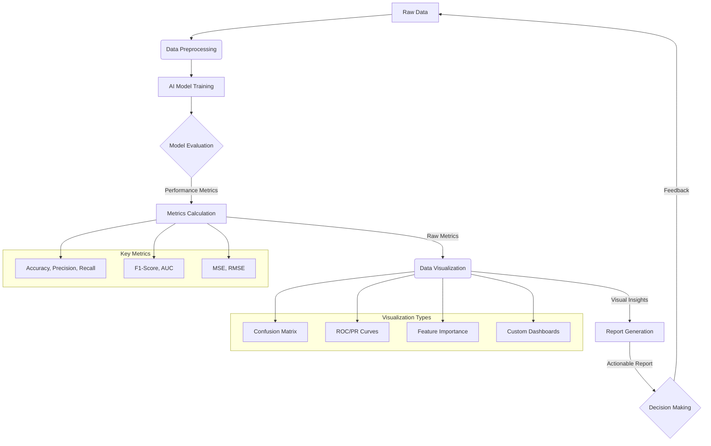

AI 프로젝트의 성공은 개발된 모델의 기술적 우수성뿐만 아니라, 그 성과를 이해관계자들에게 얼마나 명확하고 효과적으로 전달하는지에 달려 있습니다. 복잡한 AI 모델의 내부 지표를 단순한 숫자로 나열하는 것을 넘어, 비즈니스 맥락에 맞는 시각화와 통찰력 있는 리포트 작성은 의사결정의 질을 높이고 프로젝트의 가치를 극대화하는 핵심 역량입니다.

## 핵심 성능 지표 (Key Performance Indicators, KPIs)

AI 모델의 성능을 측정하는 지표는 모델의 유형과 목표에 따라 다양합니다. 각 지표는 모델의 특정 측면을 반영하며, 비즈니스 목표와 연관 지어 해석해야 합니다.

### 분류 (Classification) 모델 지표

*   **Accuracy (정확도)**: 전체 예측 중 올바르게 예측한 비율. 직관적이지만 클래스 불균형이 심할 경우 오해의 소지가 있다.
*   **Precision (정밀도)**: 양성으로 예측한 것 중 실제 양성의 비율. 거짓 양성 (False Positive)을 줄이는 것이 중요할 때 사용한다.
*   **Recall (재현율)**: 실제 양성 중 양성으로 올바르게 예측한 비율. 거짓 음성 (False Negative)을 줄이는 것이 중요할 때 사용한다.
*   **F1-Score**: Precision과 Recall의 조화 평균. 두 지표의 균형이 중요할 때 유용하다.
*   **ROC AUC (Receiver Operating Characteristic Area Under Curve)**: 이진 분류 모델의 전반적인 성능을 나타내는 지표로, 모든 가능한 분류 임계값에 대한 TPR과 FPR의 Trade-off를 시각화한다. 0.5에서 1.0 사이의 값을 가지며, 1.0에 가까울수록 성능이 우수하다.
*   **Precision-Recall (PR) Curve**: 특히 클래스 불균형이 심한 데이터셋에서 ROC Curve보다 모델 성능을 더 잘 반영할 수 있다.
*   **Confusion Matrix (혼동 행렬)**: 실제 클래스와 예측 클래스 간의 관계를 표로 나타내어 모델이 어떤 오류(FP, FN)를 범하는지 직관적으로 파악할 수 있게 돕는다.

### 회귀 (Regression) 모델 지표

*   **Mean Squared Error (MSE)**: 실제 값과 예측 값의 차이를 제곱하여 평균 낸 값. 오류가 클수록 페널티를 크게 준다.
*   **Root Mean Squared Error (RMSE)**: MSE에 제곱근을 취한 값. 원본 데이터의 단위와 같아 해석이 용이하다.
*   **Mean Absolute Error (MAE)**: 실제 값과 예측 값의 절대 차이를 평균 낸 값. 이상치에 MSE보다 덜 민감하다.
*   **R-squared (결정계수)**: 모델이 데이터의 분산을 얼마나 잘 설명하는지를 나타내는 지표. 1에 가까울수록 모델의 설명력이 높다.

### 생성형 AI (Generative AI) 지표

*   **BLEU (Bilingual Evaluation Understudy)**: 기계 번역 등 텍스트 생성 모델의 출력 품질을 평가하는 지표.
*   **ROUGE (Recall-Oriented Understudy for Gisting Evaluation)**: 요약 모델 등 텍스트 생성 모델의 재현율 기반 품질 평가 지표.
*   **Perplexity (혼란도)**: 언어 모델이 주어진 텍스트를 얼마나 잘 예측하는지 나타내는 지표. 값이 낮을수록 성능이 좋다.
*   **FID (Frechet Inception Distance)**, **Inception Score**: 이미지 생성 모델의 품질을 평가하는 지표.

## 효과적인 시각화 전략 (Effective Visualization Strategies)

복잡한 수치 지표를 이해하기 쉬운 시각적 형태로 변환하는 것은 리포트의 핵심입니다. 올바른 시각화는 즉각적인 통찰력을 제공합니다.

*   **Confusion Matrix Heatmap**: 클래스별 예측 성능을 한눈에 파악할 수 있는 히트맵은 분류 모델의 강점과 약점을 시각적으로 보여준다. 특정 클래스에서 오분류가 집중되는 경향을 쉽게 발견할 수 있다.
*   **ROC/PR Curves**: 분류 모델의 임계값 변화에 따른 성능 Trade-off를 시각화하여 최적의 임계값 선택에 도움을 준다. 특히 불균형 데이터셋에서는 PR Curve의 해석이 더 중요하다.
*   **Feature Importance Plot**: 막대 그래프로 각 특성(Feature)이 모델 예측에 미치는 상대적인 영향도를 보여준다. 이를 통해 모델의 의사결정 과정을 이해하고, 도메인 전문가와의 협업에 중요한 기반을 제공한다. SHAP (SHapley Additive exPlanations) 또는 LIME (Local Interpretable Model-agnostic Explanations) 같은 Explainable AI (XAI) 도구를 활용할 수 있다.
*   **성능 추세 대시보드 (Performance Trend Dashboards)**: 시간 경과에 따른 주요 지표(예: Accuracy, Latency, Throughput)의 변화를 선 그래프로 시각화하여 모델의 안정성과 성능 저하(Drift)를 모니터링한다. MLOps 플랫폼과 연동하여 실시간 모니터링 및 알림 시스템을 구축하는 것이 2026년 트렌드의 핵심이다.

```python
import numpy as np
import matplotlib.pyplot as plt
import seaborn as sns
from sklearn.metrics import confusion_matrix, classification_report, roc_curve, auc
from sklearn.datasets import make_classification
from sklearn.model_selection import train_test_split
from sklearn.linear_model import LogisticRegression

# Sample data for classification
X, y = make_classification(n_samples=1000, n_features=10, n_classes=2, random_state=42)
X_train, X_test, y_train, y_test = train_test_split(X, y, test_size=0.2, random_state=42)

# Train a simple model
model = LogisticRegression(random_state=42)
model.fit(X_train, y_train)
y_pred = model.predict(X_test)
y_proba = model.predict_proba(X_test)[:, 1]

# --- Classification Report ---
print("Classification Report:")
print(classification_report(y_test, y_pred))

# --- Confusion Matrix Visualization ---
cm = confusion_matrix(y_test, y_pred)
plt.figure(figsize=(6, 5))
sns.heatmap(cm, annot=True, fmt="d", cmap="Blues", cbar=False,
            xticklabels=["Predicted Negative", "Predicted Positive"],
            yticklabels=["Actual Negative", "Actual Positive"])
plt.title("Confusion Matrix")
plt.ylabel("Actual Label")
plt.xlabel("Predicted Label")
plt.show()

# --- ROC Curve Visualization ---
fpr, tpr, thresholds = roc_curve(y_test, y_proba)
roc_auc = auc(fpr, tpr)

plt.figure(figsize=(6, 5))
plt.plot(fpr, tpr, color='darkorange', lw=2, label=f'ROC curve (area = {roc_auc:.2f})')
plt.plot([0, 1], [0, 1], color='navy', lw=2, linestyle='--')
plt.xlim([0.0, 1.0])
plt.ylim([0.0, 1.05])
plt.xlabel('False Positive Rate')
plt.ylabel('True Positive Rate')
plt.title('Receiver Operating Characteristic (ROC) Curve')
plt.legend(loc="lower right")
plt.show()
```

## 리포트 작성 가이드라인 (Reporting Guidelines)

시각화된 지표를 바탕으로 한 리포트는 비즈니스 의사결정의 핵심 도구입니다. 효과적인 리포트는 단순히 데이터를 보여주는 것을 넘어, 통찰력과 실행 가능한 제안을 제공해야 합니다.

*   **청중 맞춤 (Audience-Centric)**: 리포트의 내용은 청중의 기술적 이해도와 관심사에 맞춰 조정해야 한다. 기술팀에게는 상세한 지표와 모델 분석을, 비즈니스 리더에게는 핵심 요약, 비즈니스 임팩트, 권장 사항을 중심으로 리포트를 구성한다.
*   **명확한 메시지 (Clear Messaging)**: 데이터 그 자체가 아닌, 데이터를 통해 전달하고자 하는 핵심 메시지와 인사이트를 명확히 제시한다. 숫자의 의미를 비즈니스 맥락에서 해석하여 제공한다.
*   **정기적인 자동화 (Automated & Regular)**: MLOps 파이프라인과 통합하여 모델 배포 및 모니터링 과정에서 지표 계산 및 리포트 생성을 자동화한다. Grafana, Tableau, Power BI 또는 커스텀 웹 대시보드 시스템을 활용하여 실시간 또는 주기적인 성능 현황을 공유한다.
*   **실천 가능한 인사이트 (Actionable Insights)**: 리포트가 단순 지표 나열에서 끝나지 않고, 모델 개선, 재학습 주기 조정, 데이터 수집 전략 변경 등 구체적인 다음 단계를 제시해야 한다. 예를 들어, 특정 클래스의 Recall이 낮다면, 해당 클래스의 데이터 부족 또는 특성 엔지니어링 부족을 지적하고 개선 방안을 제안한다.



## 트레이드오프

AI 모델 성능 지표 시각화 및 리포트 작성에는 여러 트레이드오프가 존재하며, 프로젝트의 상황과 목표에 따라 적절한 균형점을 찾아야 합니다.

1.  **세분화된 지표 vs. 요약된 지표**: 모델의 심층적인 동작 이해를 위한 상세 지표와 비즈니스 의사결정을 위한 요약 지표 간의 선택.
    *   **언제 좋고**: 기술팀이나 연구팀이 모델의 특정 오류 패턴이나 개선점을 찾을 때는 세분화된 Confusion Matrix, Feature Importance, 임계값별 ROC/PR Curve가 필수적입니다. 이들은 모델의 '왜'와 '어떻게'에 대한 깊은 통찰을 제공합니다.
    *   **언제 나쁜지**: 비즈니스 리더나 상위 경영진에게 지나치게 세분화된 지표를 제시하면 정보 과부하로 인해 핵심 메시지가 희석될 수 있습니다. 이들에게는 ROI, 비용 절감, 핵심 정확도 등 요약된 비즈니스 지표가 더 효과적입니다.

2.  **실시간 대시보드 vs. 정기 리포트**: 최신 상태 모니터링의 즉각성과 구조화된 분석 보고서의 장점 간의 균형.
    *   **언제 좋고**: 운영 중인 모델의 성능 저하(Drift)나 이상 징후를 즉시 감지하고 대응해야 할 때는 실시간 대시보드가 최적입니다. 빠르게 변화하는 환경에서 신속한 의사결정을 가능하게 합니다. (예: 사기 탐지 모델).
    *   **언제 나쁜지**: 모든 지표를 실시간으로 모니터링하는 것은 구축 및 유지보수 비용이 높고, 리소스 소모가 큽니다. 장기적인 추세 분석이나 전략적 검토에는 주간/월간 정기 리포트가 더 적합하며, 리소스 효율적입니다.

3.  **표준 지표 vs. 커스텀 비즈니스 지표**: 산업 표준에 따른 일반적인 지표와 특정 비즈니스 목표에 맞춘 고유 지표 간의 선택.
    *   **언제 좋고**: 표준 지표 (Accuracy, F1-Score, MSE)는 모델의 기술적 성능을 객관적으로 평가하고 다른 모델 또는 벤치마크와 비교하기에 용이합니다. 이는 기술적인 검증과 개선 방향 설정에 중요한 기준이 됩니다.
    *   **언제 나쁜지**: 표준 지표만으로는 AI 프로젝트가 비즈니스에 가져오는 실제 가치를 충분히 설명하기 어렵습니다. 예를 들어, '정확도 90%'가 '고객 이탈률 5% 감소'나 '운영 비용 1천만원 절감'으로 직접 연결되지 않으면 비즈니스 임팩트를 설득하기 어렵습니다. 이때는 커스텀 비즈니스 지표 (예: Customer Churn Reduction, Fraud Loss Prevention)가 필요합니다.

4.  **자동화된 리포트 vs. 수동 분석**: 일관성과 효율성, 심층 분석 및 유연성 간의 균형.
    *   **언제 좋고**: MLOps 파이프라인에 통합된 자동화된 리포팅 시스템은 일관된 형식으로 정기적인 데이터를 제공하며, 휴먼 에러를 줄이고 효율성을 극대화합니다. 이는 모델 배포 후 지속적인 모니터링에 필수적입니다.
    *   **언제 나쁜지**: 초기 모델 개발 단계나 예상치 못한 성능 이상 발생 시, 자동화된 리포트는 깊이 있는 원인 분석이나 새로운 통찰을 제공하기 어렵습니다. 이때는 데이터 과학자나 분석가가 수동으로 데이터를 탐색하고 심층 분석을 수행하여 문제의 근본 원인을 파악해야 합니다.

## 실전 체크리스트

AI 모델 성능 지표 시각화 및 리포트 작성 시 다음 체크리스트를 활용하여 프로젝트 성과 전달 역량을 강화하십시오.

- [ ] **이해관계자 KPI 정렬**: 주요 이해관계자(기술팀, 비즈니스팀, 경영진)별 요구사항을 수집하여 핵심 KPI를 정의하고, 각 KPI가 비즈니스 목표에 어떻게 기여하는지 명확히 연결했는가?
- [ ] **다각적 시각화 적용**: 각 AI 모델의 성능 지표가 최소 3가지 이상의 시각화 기법(예: Confusion Matrix 히트맵, ROC/PR Curve, Feature Importance Plot)으로 표현되어, 모델의 강점과 약점을 다각도로 보여주는가?
- [ ] **성능 추세 및 비교 포함**: 리포트가 모델의 현재 성능과 함께, 이전 버전, 벤치마크 모델, 또는 A/B 테스트 대상 모델 대비 성능 변화 및 추세를 포함하고 있는가?
- [ ] **자동화된 리포팅/대시보드**: 시각화 대시보드 또는 리포트가 MLOps 파이프라인에 통합되어 최소 주 1회 이상 자동으로 업데이트되고, 성능 이상 감지 시 Slack, Email 등으로 알림 시스템이 구축되어 있는가?
- [ ] **실천 가능한 인사이트 제공**: 리포트 내용이 단순 지표 나열을 넘어, 모델 개선 (재학습, 데이터 보강 등) 또는 비즈니스 전략 조정을 위한 구체적인 액션 아이디어를 제시하고 있는가?
- [ ] **XAI (Explainable AI) 시각화 통합**: SHAP/LIME과 같은 XAI 기법을 활용하여 모델의 예측 근거를 시각화하고, 이를 리포트에 포함하여 모델 투명성과 신뢰도를 높였는가?
- [ ] **성능 저하(Drift) 감지 및 보고**: 모델 배포 후 데이터 드리프트(Data Drift) 또는 모델 드리프트(Model Drift) 감지 로직을 구축하고, 이러한 현상이 발생했을 때 자동으로 리포트에 반영되거나 알림이 전송되는 시스템이 갖춰져 있는가?