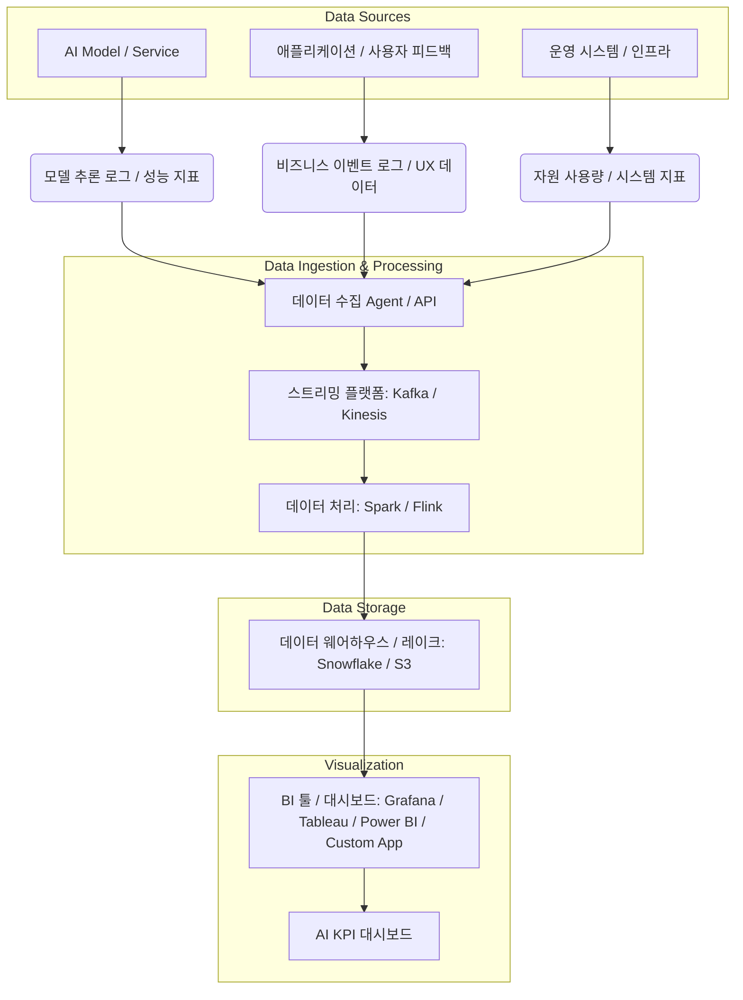

AI 프로젝트의 성공은 더 이상 직관이나 단편적인 기술 지표만으로 평가될 수 없습니다. 비즈니스 가치 창출과 지속적인 개선을 위해서는 객관적이고 체계적인 성과 측정 및 보고 체계, 즉 AI 프로젝트 KPI 대시보드가 필수적입니다. 이 대시보드는 단순히 모델의 정확도만을 보여주는 것을 넘어, 비즈니스 목표 달성 기여도, 운영 효율성, 사용자 경험에 이르는 광범위한 지표를 통합하여 의사결정권자에게 명확한 인사이트를 제공해야 합니다.

## AI 프로젝트 KPI의 중요성

많은 AI 프로젝트가 기술적 성공에도 불구하고 비즈니스 임팩트를 증명하지 못해 투자 가치를 인정받지 못하는 경우가 발생합니다. 이는 AI 모델의 성능 지표(예: Precision, Recall, F1-Score)가 비즈니스 KPI(예: 고객 전환율, 비용 절감, 생산성 향상)와 직접적으로 연결되지 않기 때문입니다. AI KPI 대시보드는 이러한 간극을 메워 프로젝트의 투자 수익률(ROI)을 명확히 하고, 이해관계자 간의 커뮤니케이션을 강화하며, 자원 배분 및 전략 수립에 필요한 데이터 기반의 근거를 마련합니다.

### 핵심 AI KPI 카테고리

AI 프로젝트의 특성과 목표에 따라 다양한 KPI가 존재할 수 있지만, 일반적으로 다음 카테고리에서 핵심 지표를 도출합니다.

1.  **모델 성능 지표 (Model Performance Metrics)**: AI 모델 자체의 예측 또는 생성 능력 평가.
    *   **분류 모델**: Accuracy, Precision, Recall, F1-Score, AUC, ROC Curve.
    *   **회귀 모델**: MAE (Mean Absolute Error), RMSE (Root Mean Squared Error), R-squared.
    *   **생성 모델**: BLEU, ROUGE, Perplexity (자연어), FID, Inception Score (이미지).
    *   **운영 지표**: Inference Latency, Throughput, GPU/CPU Utilization, Error Rate.

2.  **비즈니스 임팩트 지표 (Business Impact Metrics)**: AI 솔루션이 비즈니스 목표에 기여하는 정도.
    *   **매출/수익**: 전환율 (Conversion Rate) 증가, 평균 주문 금액 (AOV) 증가, 이탈률 (Churn Rate) 감소, 신규 고객 확보 비용 (CAC) 감소.
    *   **비용 절감**: 수동 작업 감소에 따른 인건비 절감, 에너지 효율 개선.
    *   **운영 효율성**: 프로세스 자동화율, 처리 시간 단축, 재고 최적화.
    *   **고객 만족도**: NPS (Net Promoter Score) 증가, 고객 문의 처리 시간 단축, 사용자 참여도 (Engagement Rate) 증가.

3.  **운영 및 안정성 지표 (Operational & Stability Metrics)**: AI 시스템의 지속 가능성과 신뢰성.
    *   **시스템 가용성**: Uptime, MTTR (Mean Time To Recovery).
    *   **데이터 드리프트/모델 드리프트**: 데이터 분포 변화, 모델 성능 저하 감지.
    *   **자원 사용량**: 컴퓨팅 자원 비용, 스토리지 사용량.

4.  **윤리 및 공정성 지표 (Ethical & Fairness Metrics)**: 2026년 트렌드로 부상하는 XAI (Explainable AI) 및 Responsible AI의 핵심.
    *   **편향성 측정**: Demographic Parity, Equalized Odds, Predictive Parity.
    *   **설명 가능성**: LIME, SHAP 값 분포, Feature Importance.
    *   **견고성**: Adversarial Robustness.

## AI KPI 대시보드 아키텍처 및 구현

AI KPI 대시보드는 일반적으로 데이터 수집, 저장, 처리, 시각화의 단계를 거칩니다. 실시간에 가까운 의사결정을 위해 스트리밍 데이터 파이프라인과 MLOps 통합이 중요해지고 있습니다.

### 데이터 플로우 (Mermaid)



### 코드 예제: 간단한 KPI 수집 및 전처리 (Python)

다음은 AI 모델의 추론 로그와 비즈니스 이벤트 데이터를 수집하여 KPI 계산을 위한 기본적인 데이터프레임을 구성하는 예시입니다. 실제 시스템에서는 MLflow, Prometheus, Grafana Loki 같은 전문 도구를 활용합니다.

```python
import pandas as pd
import random
from datetime import datetime, timedelta

def generate_mock_data(num_records=1000):
    data = []
    for i in range(num_records):
        timestamp = datetime.now() - timedelta(minutes=random.randint(1, 1000))
        model_id = random.choice(['model_v1.0', 'model_v1.1'])
        prediction_score = random.uniform(0.5, 0.99)
        actual_label = random.choice([0, 1])
        predicted_label = 1 if prediction_score > 0.7 else 0
        latency_ms = random.randint(20, 200)
        
        # Simulate business outcome
        is_converted = False
        if actual_label == 1 and predicted_label == 1:
            is_converted = random.random() < 0.8 # Good prediction leads to conversion
        elif actual_label == 0 and predicted_label == 0:
            is_converted = random.random() < 0.1 # No conversion expected
        
        data.append({
            'timestamp': timestamp,
            'model_id': model_id,
            'prediction_score': prediction_score,
            'actual_label': actual_label,
            'predicted_label': predicted_label,
            'latency_ms': latency_ms,
            'is_converted': is_converted,
            'user_id': f'user_{random.randint(1, 100)}'
        })
    return pd.DataFrame(data)

# Mock 데이터 생성
df = generate_mock_data()

# 기본 KPI 계산 (예시)
def calculate_kpis(df):
    total_inferences = len(df)
    accuracy = (df['actual_label'] == df['predicted_label']).mean()
    avg_latency = df['latency_ms'].mean()
    conversion_rate = df['is_converted'].sum() / total_inferences
    
    # Calculate precision and recall for actual_label = 1
    tp = ((df['actual_label'] == 1) & (df['predicted_label'] == 1)).sum()
    fp = ((df['actual_label'] == 0) & (df['predicted_label'] == 1)).sum()
    fn = ((df['actual_label'] == 1) & (df['predicted_label'] == 0)).sum()
    
    precision = tp / (tp + fp) if (tp + fp) > 0 else 0
    recall = tp / (tp + fn) if (tp + fn) > 0 else 0
    
    return {
        'total_inferences': total_inferences,
        'accuracy': accuracy,
        'avg_latency_ms': avg_latency,
        'conversion_rate': conversion_rate,
        'precision_class_1': precision,
        'recall_class_1': recall
    }

kpis = calculate_kpis(df)
print("Calculated KPIs:", kpis)

# 모델별 KPIs (예시)
model_kpis = df.groupby('model_id').apply(calculate_kpis).unstack()
print("\nKPIs by Model:", model_kpis)
```

위 코드는 로컬 환경에서 데이터를 수집하고 처리하는 매우 기본적인 예시입니다. 프로덕션 환경에서는 클라우드 기반의 로깅 서비스(AWS CloudWatch, Google Cloud Logging), 데이터 웨어하우스(Snowflake, BigQuery), 그리고 대시보드 솔루션(Grafana, Tableau)을 통합하여 자동화된 파이프라인을 구축해야 합니다.

## 2026년 AI KPI 대시보드 트렌드

AI 기술의 발전과 함께 KPI 대시보드도 진화하고 있습니다.

*   **실시간 옵저버빌리티(Real-time Observability)**: 모델 성능, 데이터 드리프트, 시스템 자원 사용량을 실시간으로 모니터링하여 이상 감지 및 즉각적인 대응을 가능하게 합니다. Grafana, Prometheus, ELK Stack과 같은 툴체인이 핵심입니다.
*   **MLOps 통합(MLOps Integration)**: 모델 배포부터 모니터링, 재학습까지 전 라이프사이클에 걸친 자동화된 지표 수집 및 대시보드 연동이 표준화됩니다. MLflow, Kubeflow, Vertex AI MLOps와 같은 플랫폼이 이 역할을 수행합니다.
*   **설명 가능한 AI (XAI) 지표 포함**: 모델의 예측에 대한 해석 가능성(Interpretability)을 KPI로 포함하여 신뢰성과 투명성을 높입니다. SHAP, LIME 값의 분포, Feature Importance 변화 등을 대시보드에서 시각화합니다.
*   **예측적 유지보수 (Predictive Maintenance) 및 이상 감지**: 단순히 지표를 보여주는 것을 넘어, KPI 추이를 분석하여 잠재적인 성능 저하 또는 시스템 장애를 미리 예측하고 경고하는 기능이 중요해집니다.
*   **맞춤형 대시보드 및 스토리텔링**: 각 이해관계자(기술팀, 비즈니스팀, 경영진)의 관점에 맞춰 최적화된 정보를 제공하며, 단순한 숫자 나열을 넘어 데이터 기반의 '스토리텔링'을 통해 의미 있는 인사이트를 전달합니다.

## 트레이드오프

AI 프로젝트 KPI 대시보드 구축에는 여러 트레이드오프가 존재하며, 이를 이해하는 것이 효과적인 대시보드를 설계하는 데 중요합니다.

*   **초기 구축 복잡성 vs. 장기적 의사결정 효율성**:
    *   **언제 좋음**: 복잡하고 다양한 데이터 소스를 통합하는 대시보드는 초기 구축에 많은 시간과 리소스가 필요하지만, 장기적으로는 데이터 기반의 빠르고 정확한 의사결정을 통해 프로젝트 성공 확률을 크게 높이고 비용을 절감합니다.
    *   **언제 나쁨**: 프로젝트 초기 단계나 소규모 PoC (Proof of Concept)에서는 과도한 대시보드 구축은 오버헤드가 될 수 있으며, MVP (Minimum Viable Product)를 늦출 수 있습니다.
*   **지표의 완벽성 vs. 실용성 및 속도**:
    *   **언제 좋음**: 모든 가능한 지표를 커버하려는 시도는 포괄적인 이해를 돕지만, 지표 수집 및 분석에 막대한 리소스가 소모될 수 있습니다. 중요한 것은 '핵심 지표'에 집중하여 가장 큰 임팩트를 주는 정보를 빠르게 얻는 것입니다.
    *   **언제 나쁨**: 너무 많은 지표는 정보 과부하를 초래하여 핵심 인사이트를 가리거나, 복잡성으로 인해 대시보드 유지보수 및 확장이 어려워질 수 있습니다.
*   **자동화된 데이터 수집 vs. 수동 검증 및 보정**:
    *   **언제 좋음**: 대부분의 KPI는 자동화된 파이프라인을 통해 수집 및 처리되어야 합니다. 이는 일관성과 확장성을 보장하고 인적 오류를 줄입니다.
    *   **언제 나쁨**: 특히 비즈니스 임팩트와 관련된 일부 복잡한 KPI나 새로운 유형의 AI 모델 (예: Generative AI)의 경우, 초기에는 수동적인 검증, 전문가의 평가, 또는 A/B 테스트와 같은 하이브리드 접근 방식이 더 신뢰성 있는 데이터를 제공할 수 있습니다. 100% 자동화는 초기에는 현실적이지 않을 수 있습니다.
*   **단순한 시각화 vs. 심층 분석 기능**:
    *   **언제 좋음**: 경영진 또는 비즈니스 이해관계자를 위한 대시보드는 핵심 지표를 한눈에 파악할 수 있도록 단순하고 직관적인 시각화에 집중해야 합니다.
    *   **언제 나쁨**: 데이터 과학자나 엔지니어는 문제가 발생했을 때 근본 원인을 파악하기 위해 드릴다운(Drill-down) 및 심층 분석 기능을 필요로 합니다. 이를 제공하지 않으면 대시보드의 활용도가 제한됩니다.

## 실전 체크리스트

AI 프로젝트에 KPI 대시보드를 성공적으로 구축하고 활용하기 위한 실전 체크리스트입니다.

- [ ] 프로젝트의 핵심 비즈니스 목표와 AI 모델의 기여도를 명확히 이해하고, 이를 측정할 수 있는 핵심 KPI 3-5개를 정의했는가?
- [ ] 각 KPI에 대한 데이터 소스(모델 추론 로그, 애플리케이션 로그, DB, 외부 API 등)를 식별하고, 안정적이고 확장 가능한 데이터 수집 파이프라인(스트리밍/배치)을 구축했는가?
- [ ] 대시보드가 실시간 또는 준실시간으로 데이터를 업데이트하며, 시각화가 직관적이고 이해관계자별 맞춤형 뷰를 제공하는가?
- [ ] 모델 성능 지표(예: 정확도, 재현율, latency)와 비즈니스 임팩트 지표(예: 전환율, 비용 절감, 사용자 만족도)를 통합하여 보고하는가?
- [ ] 데이터 및 모델 드리프트, 시스템 이상 징후 등 AI 시스템의 잠재적 문제를 감지하고 알림을 발생시키는 모니터링 체계를 포함했는가?
- [ ] AI 시스템의 윤리적 측면(예: 편향성, 공정성) 및 설명 가능성(XAI) 관련 지표를 대시보드에 포함하여 투명성을 확보했는가?
- [ ] 대시보드에 대한 접근 권한 관리, 데이터 보안, 그리고 정기적인 검토 및 개선을 위한 운영 프로세스가 명확하게 정의되어 있는가?