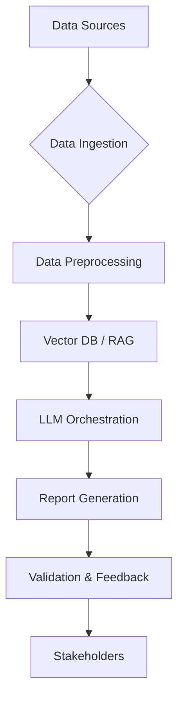

## LLM 기반 AI 프로젝트 진행 상황 보고서 자동 생성 방법

LLM(Large Language Model)을 활용한 AI 프로젝트 진행 상황 보고서 자동 생성은 수동 보고의 비효율성을 해소하고, 프로젝트 관리의 신뢰도와 의사결정 속도를 향상시킵니다. 본 문서는 LLM 기반 자동 보고서 시스템의 핵심 아키텍처, 데이터 통합, 프롬프트 전략 및 2026년 트렌드를 다룹니다.

### 핵심 아키텍처: 자동 보고서 파이프라인

1.  **데이터 수집**: Jira, Git, CI/CD 로그 등 프로젝트 데이터 수집.
2.  **RAG**: 수집 데이터 전처리 후 벡터 DB 저장, LLM이 관련 정보 검색 및 활용.
3.  **LLM 오케스트레이션**: 프롬프트와 LLM으로 데이터 분석, 인사이트 도출, 보고서 섹션 생성.
4.  **출력 및 검증**: 마크다운 등 형식 변환, 자동화된 검증 및 피드백으로 품질 확보.



### 데이터 통합 및 프롬프트 전략

*   **다중 데이터 소스**: Jira, Git, CI/CD, Confluence 등 API를 통한 정기적 데이터 수집.
*   **데이터 전처리**: LLM이 이해하기 쉬운 형태로 정규화, 요약, 임베딩.
*   **프롬프트 엔지니어링**:
    *   **역할 부여**: '전문 프로젝트 관리자' 역할 부여.
    *   **구조화된 출력**: 마크다운 형식으로 특정 섹션(`## 요약`, `## 성과`) 포함.
    *   **제약 조건**: 특정 키워드, 데이터 출처 명시로 정확성 강화.

### 2026년 트렌드: 에이전트 기반 보고서

2026년에는 자율 에이전트(Autonomous Agents)가 지표 변화 감지 시 자동으로 데이터 분석, 위험 식별, 최적화 방안을 보고서에 포함합니다. 멀티모달(Multi-modal) LLM은 텍스트 외 차트, 스크린샷 등 다양한 아티팩트를 분석하여 시각 정보를 통합, 더욱 풍부한 보고서를 생성합니다.

```python
import os
from openai import OpenAI
from dotenv import load_dotenv
load_dotenv()

def get_project_updates():
    return {"jira": [{"id": "LLM-101", "status": "Done"}], "github": {"commits": 45}}

def generate_report_with_llm(project_data):
    client = OpenAI(api_key=os.getenv("OPENAI_API_KEY"))
    prompt = f"AI 프로젝트 주간 진행 보고서 (Markdown):\n## 요약\n## 성과\n## 이슈 및 계획\n프로젝트 데이터: {project_data}"
    response = client.chat.completions.create(
        model="gpt-4o-mini", messages=[{"role": "user", "content": prompt}], max_tokens=300, temperature=0.6)
    return response.choices[0].message.content

# Example usage (not part of final output body)
# data = get_project_updates()
# report = generate_report_with_llm(data)
# print(report)
```

## 트레이드오프

1.  **일관성 vs. 유연성**: 정형 보고서에 유리하나, 비정형 통찰 및 깊이 있는 분석에 한계가 있습니다. 언제 좋냐면, 반복적이고 표준화된 보고가 필요할 때; 언제 나쁘냐면, 예상치 못한 복합적인 문제에 대한 심층 분석이 요구될 때.
2.  **효율성 vs. 신뢰성**: 반복 작업 효율화, 방대한 데이터 처리 강점이 있습니다. 하지만 LLM 환각(Hallucination) 위험으로 엄격한 검증이 필수적입니다. 언제 좋냐면, 빠른 보고서 생성 주기가 중요하고 데이터 볼륨이 클 때; 언제 나쁘냐면, 보고서의 절대적인 사실 정확성이 최우선이며 미세한 오류도 허용되지 않을 때.
3.  **구현 복잡성 vs. 맞춤화**: 다양한 데이터 소스 통합으로 맞춤형 보고서 생성이 가능하나, 초기 구축 및 유지보수 복잡성이 높습니다. 언제 좋냐면, 프로젝트별 특성에 맞는 고도로 커스터마이징된 보고서가 필요할 때; 언제 나쁘냐면, 소규모 프로젝트나 제한된 개발 리소스를 가진 팀에게는 과도한 초기 투자 및 유지보수 부담이 될 수 있을 때.

## 실전 체크리스트

- [ ] **데이터 소스 연동 검증**: 모든 프로젝트 데이터 소스(예: Jira, Git, CI/CD)가 LLM 시스템과 안정적으로 연동되고 최신 데이터가 정확히 수집되는지 주기적으로 확인합니다.
- [ ] **프롬프트 템플릿 최적화**: 다양한 프로젝트 시나리오에서 LLM이 요구되는 보고서 구조와 내용을 일관성 있게 생성하는지, 프롬프트 템플릿을 충분히 테스트하고 지속적으로 최적화합니다.
- [ ] **환각 방지 메커니즘 구축**: LLM 생성 내용의 실제 데이터 일치 여부를 자동 검증하는 RAG(Retrieval-Augmented Generation) 기반 시스템 또는 외부 검증 툴을 구현하고 그 효과를 평가합니다.
- [ ] **보고서 품질 평가 지표 정의**: 생성된 보고서의 정확성, 포괄성, 가독성, 일관성 등을 평가할 수 있는 정량적/정성적 지표를 설정하고, 정기적인 평가 프로세스를 운영합니다.
- [ ] **보안 및 접근 제어**: LLM이 민감한 프로젝트 데이터에 접근할 때 적절한 인증, 권한 부여 및 데이터 마스킹(data masking) 정책이 적용되어 있는지, 정보 유출 위험을 최소화했는지 점검합니다.
- [ ] **사용자 피드백 루프**: 보고서 소비자들이 LLM 생성 보고서에 대한 피드백을 쉽게 제공할 수 있는 채널을 마련하고, 이 피드백이 LLM 모델 또는 프롬프트 개선에 반영되는 워크플로우를 구축합니다.
- [ ] **LLM API 비용 모니터링**: LLM API 사용량 및 관련 인프라 비용을 지속적으로 모니터링하고, 토큰 사용량 최적화, 모델 선택 조정 등을 통해 비용 효율성을 관리하는 프로세스를 갖추고 있는지 확인합니다.