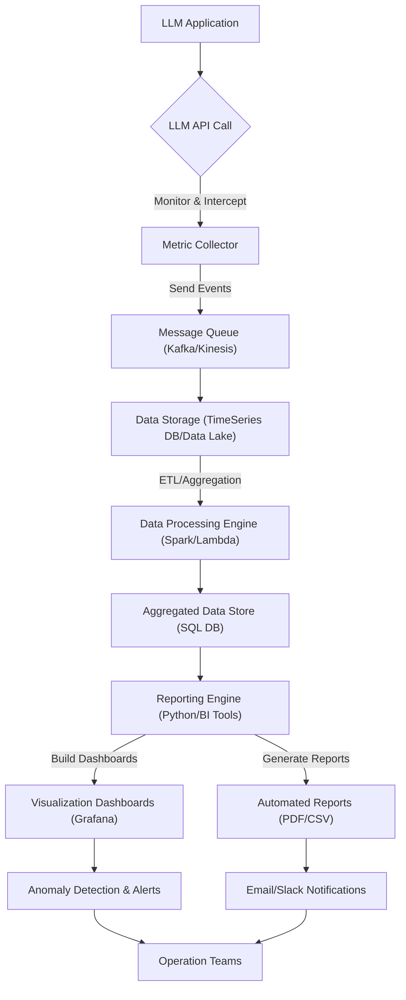

LLM (Large Language Model) 기반 애플리케이션의 성공적인 운영과 지속적인 개선을 위해서는 시스템의 성능, 비용, 그리고 품질에 대한 투명한 모니터링과 리포팅이 필수적입니다. 특히 AI 시스템의 복잡성을 고려할 때, 핵심 지표의 자동 리포트 생성은 운영의 효율성을 극대화하고, 문제 발생 시 신속한 대응을 가능하게 하며, 장기적인 최적화 로드맵을 수립하는 데 중요한 기반을 제공합니다.

## 핵심 지표 정의 및 수집 전략
LLM 애플리케이션에서 추적해야 할 주요 지표는 크게 세 가지 범주로 나눌 수 있습니다:

### 성능 지표 (Performance Metrics)
*   **Latency (응답 시간)**: LLM API 호출부터 최종 응답까지의 시간. 사용자 경험에 직접적인 영향을 미칩니다.
*   **Throughput (처리량)**: 초당 처리되는 요청 수 또는 토큰 수. 시스템의 확장성을 평가하는 데 중요합니다.
*   **Token Usage (토큰 사용량)**: 입력 및 출력으로 사용된 토큰의 총량. 비용과 직결되는 핵심 지표입니다.

### 비용 지표 (Cost Metrics)
*   **API Cost (API 호출 비용)**: 토큰 사용량 및 모델 종류에 따른 LLM API 호출 비용. 대부분의 클라우드 LLM 서비스는 토큰당 과금 방식을 채택합니다.
*   **Infrastructure Cost (인프라 비용)**: LLM 애플리케이션을 호스팅하고 데이터 파이프라인을 운영하는 데 필요한 컴퓨팅, 스토리지, 네트워크 비용.

### 품질 지표 (Quality Metrics)
*   **Relevance (응답 관련성)**: LLM 응답이 사용자의 질문이나 의도에 얼마나 부합하는지.
*   **Correctness (정확성)**: 응답 내용의 사실적 정확성.
*   **Hallucination Rate (환각 비율)**: LLM이 사실과 다른 정보를 생성하는 비율. 장기적인 모델 신뢰도에 영향을 미칩니다.

이러한 지표를 수집하기 위한 일반적인 전략은 다음과 같습니다:
*   **LLM API 콜백**: LLM 호출 전후에 실행되는 커스텀 로직을 통해 토큰 사용량, latency 등을 기록합니다.
*   **프록시 계층 (Proxy Layer)**: 모든 LLM 호출이 프록시 서버를 거치도록 하여 중앙에서 지표를 수집하고 로깅합니다. 이는 로깅 로직을 애플리케이션 코드에서 분리하여 관리하는 데 유용합니다.
*   **자체 로깅 시스템**: 애플리케이션 내에서 직접 로그를 생성하고, 이를 중앙 집중식 로깅 시스템 (예: ELK Stack, Grafana Loki)으로 전송합니다.

## 데이터 파이프라인 구축 및 리포트 자동화
수집된 원시(raw) 지표 데이터는 분석 가능한 형태로 가공되고 저장되어야 합니다. 일반적인 데이터 파이프라인은 다음과 같은 단계를 포함합니다:

1.  **데이터 수집 (Data Ingestion)**: LLM 호출 시 발생하는 로그 및 메트릭 이벤트를 Message Queue (예: Apache Kafka, AWS Kinesis)로 전송하여 비동기적이고 확장 가능한 방식으로 수집합니다.
2.  **데이터 저장 (Data Storage)**: 수집된 데이터는 시계열 데이터베이스 (예: Prometheus, InfluxDB) 또는 데이터 레이크 (예: AWS S3, Google Cloud Storage)에 저장됩니다. 상세 분석을 위해 원시 데이터와 집계(aggregated) 데이터 모두 저장하는 것이 바람직합니다.
3.  **데이터 처리 및 변환 (Data Processing & Transformation)**: ETL/ELT 파이프라인 (예: Apache Spark, Flink, AWS Lambda/Google Cloud Functions)을 사용하여 원시 데이터를 정제하고, 필요한 통계량(평균, 중앙값, 합계 등)으로 집계합니다.
4.  **자동 리포트 생성 및 시각화**: 처리된 데이터를 기반으로 리포트를 자동으로 생성하고 시각화합니다. Python 스크립트 (Pandas, Matplotlib/Seaborn)를 사용하거나, BI (Business Intelligence) 도구 (예: Grafana, Tableau, Power BI)를 연동하여 대시보드를 구축할 수 있습니다. 스케줄링 도구 (예: Cron, Apache Airflow)를 활용하여 정기적으로 리포트 생성 및 이메일/Slack 알림을 자동화합니다.

### 코드 예시: Python 기반 LLM 메트릭 로깅
아래 코드는 간단한 데코레이터를 사용하여 LLM 호출의 Latency와 토큰 사용량을 기록하는 예시입니다. 실제 시스템에서는 더 견고한 로깅 및 스토리지 메커니즘이 필요합니다.

```python
import time
import functools
from collections import defaultdict

# 가상의 메트릭 저장소
metrics_store = defaultdict(list)

def llm_metric_logger(model_name: str):
    def decorator(func):
        @functools.wraps(func)
        def wrapper(*args, **kwargs):
            start_time = time.perf_counter()
            
            # 실제 LLM 호출 실행
            result = func(*args, **kwargs)
            
            end_time = time.perf_counter()
            latency = (end_time - start_time) * 1000  # 밀리초 단위
            
            # 가상 토큰 계산 (실제 LLM API 응답에서 파싱해야 함)
            input_tokens = len(str(kwargs.get('prompt', ''))) // 4 # 예시
            output_tokens = len(result) // 4 # 예시
            total_tokens = input_tokens + output_tokens
            
            # 메트릭 저장
            metrics_store[model_name].append({
                "timestamp": time.time(),
                "latency_ms": latency,
                "input_tokens": input_tokens,
                "output_tokens": output_tokens,
                "total_tokens": total_tokens,
                "cost": total_tokens * 0.000002 # 가상 비용
            })
            
            print(f"[{model_name}] Latency: {latency:.2f}ms, Total Tokens: {total_tokens}, Cost: ${total_tokens * 0.000002:.6f}")
            return result
        return wrapper
    return decorator

@llm_metric_logger(model_name="gpt-4o-mini")
def call_llm(prompt: str, max_tokens: int = 100) -> str:
    # 실제 LLM API 호출 로직 (생략)
    time.sleep(0.5) # Simulate API call latency
    return f"Response to: {prompt[:30]}... (max {max_tokens} tokens)"

# 예시 사용
call_llm(prompt="Explain quantum computing in simple terms.", max_tokens=200)
call_llm(prompt="Write a short poem about AI.")
call_llm(prompt="Summarize the benefits of automated reporting for LLM applications.", max_tokens=150)

# 저장된 메트릭 확인 (실제로는 데이터베이스에 저장)
# print("\n--- Stored Metrics ---")
# for model, data in metrics_store.items():
#     print(f"Model: {model}, Data Points: {len(data)}")
#     for entry in data:
#         print(entry)
```

## LLM 메트릭 리포팅 워크플로우


## 2026년 최신 트렌드 반영
LLM 애플리케이션의 성능 및 비용 리포팅은 2026년에도 계속 진화하고 있습니다.

*   **실시간 옵저버빌리티 (Real-time Observability)**: 단순한 배치 리포팅을 넘어, Prometheus, Grafana, OpenTelemetry와 같은 도구를 활용하여 LLM 시스템의 모든 계층에서 발생하는 지표를 실시간으로 수집하고 대시보드를 통해 즉각적인 가시성을 확보하는 추세입니다. 이를 통해 이상 징후를 빠르게 감지하고 대응할 수 있습니다.
*   **AI 기반 이상 감지 (AI-driven Anomaly Detection)**: LLM 지표 데이터의 복잡성이 증가함에 따라, 머신러닝 모델을 활용하여 비정상적인 Latency 급증, 토큰 비용 폭증, 품질 저하 등을 자동으로 감지하고 경고하는 시스템이 중요해지고 있습니다.
*   **FinOps for LLMs**: LLM 비용이 중요한 운영 지출이 되면서, FinOps(Finance + DevOps) 원칙을 LLM 애플리케이션에 적용하여 비용 투명성을 높이고, 비용 최적화 기회를 식별하며, 재무팀과 개발팀 간의 협업을 강화하는 접근 방식이 확산되고 있습니다. 멀티-클라우드 또는 하이브리드 클라우드 환경에서의 LLM 비용 할당 및 최적화가 핵심입니다.
*   **프롬프트-지표 연동 (Prompt-to-Metric Linking)**: 특정 프롬프트 변경이 성능, 비용, 품질 지표에 미치는 영향을 직접적으로 분석할 수 있도록, 프롬프트 버전 관리 시스템과 메트릭 수집 시스템을 연동하는 기능이 강조됩니다.

## 트레이드오프

*   **자동화 수준 vs. 유연성 및 초기 구축 비용**
    *   **언제 좋음**: 완벽하게 자동화된 리포팅 시스템은 운영 오버헤드를 최소화하고 일관된 데이터를 제공하여 대규모 애플리케이션에 적합합니다.
    *   **언제 나쁨**: 초기 설정 및 통합 비용이 높으며, 비표준적인 지표나 급변하는 요구사항에 대한 유연한 대응이 어렵습니다. 커스텀 분석이 자주 필요한 초기 단계의 프로젝트에는 과도할 수 있습니다.

*   **데이터 상세도 vs. 스토리지 및 처리 비용**
    *   **언제 좋음**: 모든 LLM 호출에 대한 상세한 원시 데이터를 기록하면 미세한 문제 진단 및 심층적인 패턴 분석이 가능합니다. 규제 준수나 감사 목적에 유리합니다.
    *   **언제 나쁨**: 방대한 데이터는 스토리지 비용과 데이터 처리 로드를 급증시키며, 실시간 대시보드의 Latency를 증가시킬 수 있습니다. 비용에 민감하거나 데이터 볼륨이 매우 큰 경우 비효율적입니다.

*   **실시간 모니터링 vs. 지연 허용 리포팅**
    *   **언제 좋음**: 실시간 대시보드는 성능 저하나 비용 이상과 같은 Critical한 문제에 대한 즉각적인 감지와 대응을 가능하게 하여, SLA가 중요한 서비스에 필수적입니다.
    *   **언제 나쁨**: 실시간 데이터 파이프라인 구축은 인프라 비용과 복잡도를 크게 증가시킵니다. 분석 주기가 길거나 즉각적인 대응이 필요 없는 비즈니스 지표에는 자원 낭비일 수 있습니다.

*   **범용 모니터링 솔루션 vs. LLM 전용 커스텀 솔루션**
    *   **언제 좋음**: Grafana, Datadog와 같은 범용 모니터링 솔루션은 빠른 도입과 다양한 데이터 소스 통합, 기존 인프라와의 연동이 용이합니다.
    *   **언제 나쁨**: LLM 특유의 지표(예: 환각률, 프롬프트 복잡도)나 특정 비즈니스 로직에 특화된 분석에는 한계가 있을 수 있습니다. 심층적인 LLM 최적화를 위해서는 커스텀 개발이 필요할 수 있습니다.

## 실전 체크리스트
LLM 애플리케이션의 성능 및 비용 지표 자동 리포팅 시스템을 구축하거나 개선할 때 다음 사항을 검증합니다.

- [ ] 핵심 성능 (Latency, Throughput) 및 비용 (Token Usage, API Cost) 지표가 모든 LLM 호출에 대해 기록되고 있는가?
- [ ] LLM 응답의 품질 지표 (Relevance, Correctness, Hallucination Rate 등)를 평가하고 추적하는 자동화된 메커니즘이 존재하는가?
- [ ] 수집된 지표 데이터가 안전하고 확장 가능한 시계열 데이터베이스에 저장되고 있으며, 최소 3개월 이상의 이력 데이터가 유지되는가?
- [ ] 주간/월간 단위로 LLM 애플리케이션의 성능 및 비용 리포트가 자동으로 생성되어 관련 팀 (운영, 개발, 재무)에 배포되고 있는가?
- [ ] 정의된 임계값 초과 시 (예: Latency 급증, Cost 폭증) 자동으로 경고를 발생시키고 담당자에게 알림을 전송하는 시스템이 구축되어 있는가?
- [ ] 리포트 대시보드가 현재 모델 버전, 배포 환경, 사용자 그룹별로 지표를 필터링하고 시각화할 수 있도록 구성되어 있는가?
- [ ] 새로운 LLM 모델 또는 API 통합 시, 해당 모델의 성능 및 비용 지표 수집 파이프라인이 즉시 확장 가능한 구조로 설계되어 있고, 이를 검증하는 테스트 케이스가 마련되어 있는가?