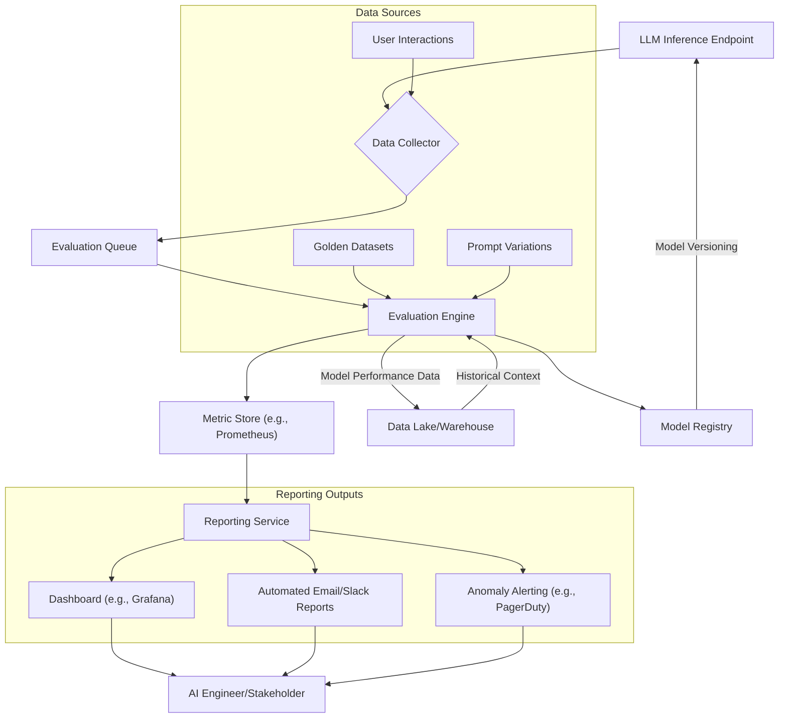

LLM 기반 AI 모델은 빠르게 발전하며 다양한 비즈니스 영역에 도입되고 있다. 그러나 모델의 성능은 새로운 데이터, 프롬프트 변화, 모델 업데이트 등에 따라 끊임없이 변동한다. 이러한 성능 변화를 정량적으로 추적하고, 그 결과를 이해하기 쉬운 형태로 자동 보고하는 시스템은 AI 시스템의 안정적인 운영과 지속적인 개선, 그리고 비즈니스 의사결정을 위한 필수 요소다. 특히 2026년 현재, LLM은 단순한 API 호출을 넘어 복잡한 에이전트 시스템에 통합되면서, 각 모듈의 성능 변화가 전체 시스템에 미치는 영향을 빠르게 감지하고 대응하는 역량이 중요해지고 있다.

## LLM 성능 측정의 핵심 지표 (Key Metrics)
LLM 성능 평가에는 다음과 같은 핵심 지표들이 활용된다:

*   **Accuracy (정확도)**: 특정 Task에 대한 모델의 정답률. RAG(Retrieval-Augmented Generation) 시스템의 경우, 검색 관련성(Retrieval Relevance)과 답변 생성 품질(Generation Quality)을 함께 고려해야 한다.
*   **Latency (응답 지연)**: 요청부터 응답까지 걸리는 시간. 사용자 경험과 시스템 처리량에 직결된다.
*   **Cost (비용)**: 토큰 사용량, GPU 사용 시간 등 모델 운영에 필요한 자원 비용.
*   **Robustness (견고성)**: 입력 변화(오타, 모호한 프롬프트)에 대한 모델의 일관된 성능 유지 능력.
*   **Bias & Fairness (편향 및 공정성)**: 특정 그룹에 대한 편향된 응답 생성 여부.
*   **Hallucination Rate (환각률)**: 사실과 다른 정보를 생성하는 비율.

### 데이터 수집 전략 (Data Collection Strategy)
성능 데이터를 수집하는 전략은 크게 세 가지로 나눌 수 있다.

1.  **Offline Evaluation Datasets**: 주기적으로 업데이트되는 벤치마크 데이터셋을 사용하여 모델의 특정 Task 성능을 평가한다. 골든셋(Golden Set) 구축 및 관리가 중요하다.
2.  **A/B Testing**: 프로덕션 환경에서 여러 모델 버전을 사용자 그룹에 나누어 배포하고, 실제 사용자 반응(클릭률, 전환율, 만족도 등)을 측정하여 성능을 비교한다.
3.  **Real-time Feedback & Monitoring**: 실시간으로 모델의 입출력 데이터를 수집하고, 오류율, 지연 시간, 사용자 피드백 등을 모니터링한다. 이상 징후 발생 시 즉각적인 경고 시스템이 필요하다.

## LLM 성능 추적 아키텍처 (Performance Tracking Architecture)
일반적인 LLM 성능 추적 및 자동 보고 시스템의 아키텍처는 다음과 같다:



## 자동 보고서 생성 (Automated Report Generation)
보고서 자동 생성은 정기적인 성능 스냅샷과 이상 감지 결과를 효과적으로 전달하는 핵심 단계이다.

*   **Templating**: Jinja2나 Handlebars 같은 템플릿 엔진을 활용하여 유연하게 보고서 형식을 정의한다.
*   **Visualization**: Matplotlib, Seaborn, Plotly 등을 이용해 시각적으로 이해하기 쉬운 그래프를 생성한다.
*   **Delivery**: 이메일, Slack 알림, 웹 대시보드 업데이트, Confluence/Wiki 페이지 자동 생성 등 다양한 채널로 보고서를 전달한다.

### 코드 예제: LLM 성능 추적 및 보고서 생성 (Python)

아래 Python 코드는 가상의 LLM 클라이언트를 사용하여 지연 시간, 토큰 비용, 정확도 등의 메트릭을 수집하고, 주기적으로 요약 보고서를 생성하는 간단한 예시이다.

```python
import time
import random
from datetime import datetime, timedelta
from collections import defaultdict

# Hypothetical LLM client
class LLMClient:
    def __init__(self, model_name):
        self.model_name = model_name

    def generate(self, prompt, max_tokens=50):
        # Simulate LLM inference with varying latency and "accuracy"
        latency = random.uniform(0.1, 0.5) # Simulated latency in seconds
        time.sleep(latency)
        
        # Simulate accuracy - 80% chance of "correct" response
        is_correct = random.random() < 0.8
        
        response = f"Simulated response for '{prompt}'. Correct: {is_correct}"
        cost_tokens = random.randint(10, 30) # Simulate token usage
        
        return {
            "response": response,
            "latency": latency,
            "cost_tokens": cost_tokens,
            "is_correct": is_correct
        }

# Metric Collector and Reporter
class LLMPerformanceTracker:
    def __init__(self, model_name, reporting_interval_seconds=30):
        self.model_name = model_name
        self.metrics = defaultdict(list)
        self.reporting_interval_seconds = reporting_interval_seconds
        self.last_report_time = datetime.now()

    def log_metric(self, metric_name, value):
        self.metrics[metric_name].append(value)

    def _calculate_summary_metrics(self):
        summary = {}
        for metric, values in self.metrics.items():
            if values:
                summary[f"{metric}_avg"] = sum(values) / len(values)
                summary[f"{metric}_min"] = min(values)
                summary[f"{metric}_max"] = max(values)
                summary[f"{metric}_count"] = len(values)
        return summary

    def generate_report(self):
        current_time = datetime.now()
        if (current_time - self.last_report_time) < timedelta(seconds=self.reporting_interval_seconds):
            return None # Not time to report yet

        summary_metrics = self._calculate_summary_metrics()
        
        if not summary_metrics: # No metrics collected in this interval
            self.last_report_time = current_time
            return None

        report_title = f"LLM Performance Report for {self.model_name} ({current_time.strftime('%Y-%m-%d %H:%M:%S')})"
        report_content = f"## {report_title}\n\n"
        report_content += "### Summary Metrics:\n"
        for key, value in summary_metrics.items():
            if "avg" in key or "min" in key or "max" in key:
                report_content += f"- **{key.replace('_', ' ').title()}**: {value:.2f}\n"
            else:
                report_content += f"- **{key.replace('_', ' ').title()}**: {value}\n"
        
        # Reset metrics for next interval
        self.metrics.clear()
        self.last_report_time = current_time
        return report_content

    def run_evaluation_loop(self, prompts, num_iterations=100):
        llm = LLMClient(self.model_name)
        for i in range(num_iterations):
            prompt = random.choice(prompts)
            result = llm.generate(prompt)
            
            self.log_metric("latency", result["latency"])
            self.log_metric("cost_tokens", result["cost_tokens"])
            self.log_metric("accuracy", 1 if result["is_correct"] else 0)

            report = self.generate_report()
            if report:
                print(report)
                print("-" * 50) # Separator for reports

# Example Usage
if __name__ == "__main__":
    prompts_to_evaluate = [
        "What is the capital of France?",
        "Explain quantum physics simply.",
        "Write a short poem about nature.",
        "Translate 'hello' to Spanish."
    ]

    tracker = LLMPerformanceTracker(model_name="GPT-4o-Mini-2026", reporting_interval_seconds=5) # Report frequently for demo
    tracker.run_evaluation_loop(prompts_to_evaluate, num_iterations=50)

```

## 트레이드오프

*   **정량적 지표의 포괄성 vs. 단순성**:
    *   **언제 좋은가**: 다양한 지표(정확도, 지연 시간, 비용, 편향 등)를 포괄적으로 추적하면 모델의 전반적인 건강 상태를 깊이 있게 이해하고, 특정 문제의 원인을 정확히 진단할 수 있다. 예를 들어, 정확도는 높으나 지연 시간이 급증하는 경우, 확장성 문제로 특정할 수 있다.
    *   **언제 나쁜가**: 너무 많은 지표를 동시에 추적하고 보고하면 데이터 수집 및 분석 오버헤드가 커지고, 핵심 문제 파악이 어려워질 수 있다. 보고서가 복잡해져 이해관계자들이 중요한 정보에 집중하지 못하게 될 위험이 있다.

*   **자동화된 보고서의 즉시성 vs. 심층 분석**:
    *   **언제 좋은가**: 자동화된 보고서는 실시간 또는 근실시간으로 모델 성능 변화를 감지하고 경고하여, 빠른 의사결정 및 대응을 가능하게 한다. 특히 비정상적인 성능 저하나 비용 급증 시 즉각적인 조치가 필수적인 경우 유용하다.
    *   **언제 나쁜가**: 자동 보고서는 주로 미리 정의된 규칙과 임계값에 기반하므로, 새로운 유형의 성능 저하 원인이나 미묘한 트렌드 변화를 포착하기 어렵다. 심층적인 원인 분석이나 새로운 패턴 발견에는 인간의 개입과 탐색적 데이터 분석(EDA)이 여전히 필요하다.

*   **벤치마크 데이터셋 기반 평가 vs. 프로덕션 데이터 기반 평가**:
    *   **언제 좋은가**: 잘 관리된 벤치마크 데이터셋은 모델 간의 공정한 비교와 성능 회귀(Regression) 방지에 효과적이다. 특정 Task에 대한 모델의 '잠재적' 능력을 정량적으로 측정할 수 있다.
    *   **언제 나쁜가**: 벤치마크 데이터셋은 실제 프로덕션 환경의 데이터 분포나 사용자 행동을 완벽하게 반영하지 못할 수 있다. 실제 사용 환경에서의 성능 저하나 예상치 못한 상호작용 문제를 놓칠 위험이 있다. 따라서 A/B 테스트나 실시간 모니터링이 병행되어야 한다.

*   **보고서의 세분화 vs. 통합**:
    *   **언제 좋은가**: 팀별, 모델별, Task별로 세분화된 보고서는 각 팀이 자신의 책임 영역에 집중하여 문제를 해결하고 성능을 개선하는 데 도움이 된다. 특정 도메인 전문가에게 필요한 상세 정보를 제공한다.
    *   **언제 나쁜가**: 지나치게 세분화된 보고서는 전체 시스템의 통합적인 관점을 약화시키고, 팀 간의 협업을 저해할 수 있다. 고위 경영진이나 비기술 직무의 이해관계자에게는 전체적인 현황을 파악하기 위한 통합된 요약 보고서가 더 효과적이다.

## 실전 체크리스트

- [ ] **핵심 성능 지표 (Key Performance Indicators, KPIs) 정의 및 측정 기준 명확화**: 현재 운영 중인 LLM 서비스의 성공을 위한 3~5가지 핵심 지표(예: 정확도, 지연 시간, 비용, 환각률)를 명확히 정의하고, 각 지표의 측정 방법론을 표준화했는가?
- [ ] **자동화된 데이터 수집 파이프라인 구축**: 모델의 입력 프롬프트, 출력 응답, 그리고 관련 메타데이터(모델 버전, 사용자 ID, 타임스탬프 등)를 자동으로 수집하고 저장하는 견고한 파이프라인을 구축했는가?
- [ ] **기준선 (Baseline) 및 임계값 (Threshold) 설정**: 모델의 '정상' 성능 범위를 정의하는 기준선을 설정하고, 성능 저하 또는 비용 급증을 감지하기 위한 경고 임계값을 설정했는가? (예: 지연 시간 95th percentile이 500ms 초과 시 경고)
- [ ] **평가 데이터셋 주기적 업데이트 및 관리**: 프로덕션 데이터 분포를 반영하도록 벤치마크 평가 데이터셋을 주기적으로 업데이트하고, 골든셋의 품질을 유지하는 프로세스를 확립했는가?
- [ ] **보고서 템플릿 표준화 및 시각화**: 이해관계자 그룹별(개발팀, 비즈니스팀, 경영진)로 필요한 정보를 담은 보고서 템플릿을 표준화하고, Matplotlib/Plotly 등을 활용하여 주요 지표를 시각적으로 명확하게 표현했는가?
- [ ] **자동 보고서 배포 채널 및 주기 설정**: 이메일, Slack, 대시보드 업데이트 등 적절한 채널을 통해 보고서가 정기적으로(일간, 주간, 월간) 배포되도록 설정하고, 이상 감지 시 즉각적인 알림 시스템을 구축했는가?
- [ ] **A/B 테스트 및 Canary Deployment 통합**: 새로운 LLM 모델 또는 프롬프트 변경 사항을 배포하기 전에 A/B 테스트 또는 Canary Deployment를 통해 실제 사용자 환경에서 성능 변화를 측정하고, 그 결과를 보고서에 통합하는 워크플로우를 마련했는가?