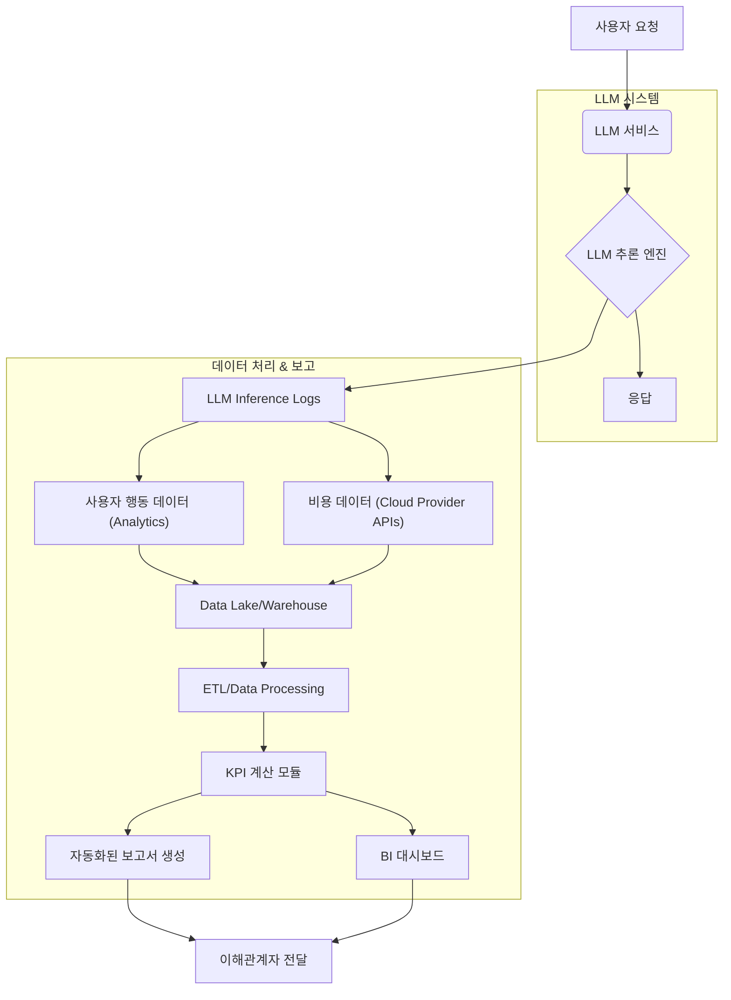

LLM (Large Language Model) 기반 서비스의 성공은 단순히 모델의 기술적 성능이나 응답 정확도를 넘어섭니다. 진정한 성공은 비즈니스 목표 달성에 기여하는 바, 즉 measurable business impact (측정 가능한 비즈니스 영향)에 달려 있습니다. 이 엔트리는 LLM 프로젝트의 비즈니스 가치를 체계적으로 평가하고, 이해관계자에게 효과적으로 보고하는 방법론을 제시합니다.

## LLM 서비스 비즈니스 가치 평가의 중요성

LLM 도입의 주요 목적은 비용 절감, 생산성 향상, 새로운 수익원 창출, 고객 경험 개선 등 다양합니다. 그러나 이러한 목표가 실제로 달성되고 있는지, 얼마나 기여하고 있는지를 명확히 보여주지 못하면 LLM 프로젝트는 지속적인 투자와 지원을 받기 어렵습니다. 특히 2026년에는 AI governance와 ROI (Return on Investment) 투명성에 대한 요구가 더욱 커지면서, 기술적 지표와 비즈니스 지표를 연계하여 종합적인 시각을 제공하는 보고서가 필수적입니다.

LLM의 비즈니스 가치 평가는 다음과 같은 질문에 답하는 것을 목표로 합니다:

*   LLM 도입 후 특정 비즈니스 프로세스의 효율이 얼마나 증가했는가?
*   LLM을 통한 고객 서비스 개선이 고객 만족도 및 유지율에 어떤 영향을 미쳤는가?
*   LLM 기반 신규 기능이 사용자 참여 (user engagement) 또는 매출 증대에 얼마나 기여하는가?
*   LLM 운영 비용 대비 창출되는 가치는 무엇인가?

## 핵심 성과 지표 (Key Performance Indicators, KPI) 정의

LLM 서비스의 비즈니스 가치를 측정하기 위해서는 적절한 KPI를 정의해야 합니다. 이 KPI는 기술적 지표와 비즈니스 지표로 구분되며, 서로 연계되어야 합니다.

### 1. 기술적/운영 지표 (Technical/Operational Metrics)

이 지표들은 LLM 자체의 성능과 안정성을 나타내며, 비즈니스 지표의 근간이 됩니다.

*   **Latency (응답 시간)**: 사용자 요청에 대한 LLM의 응답 시간. `평균 Latency`, `90/95/99%ile Latency`. (예: `latency < 2s`)
*   **Throughput (처리량)**: 단위 시간당 처리할 수 있는 요청 수. (예: `requests per second`)
*   **Accuracy (정확도)**: 모델의 응답이 얼마나 정확한지. `F1-score`, `BLEU`, `ROUGE`, `HIT@K` 등 사용 목적에 따라 다양. (예: `customer support intent accuracy > 90%`)
*   **Hallucination Rate (환각 비율)**: 모델이 사실과 다른 정보를 생성하는 비율. (예: `hallucination rate < 5%`)
*   **Cost per Inference (추론당 비용)**: LLM 사용에 드는 비용. `Token Cost`, `GPU/CPU usage cost`. (예: `cost per query < $0.001`)
*   **Availability (가용성)**: 서비스가 정상적으로 작동하는 시간 비율. (예: `99.9% uptime`)

### 2. 비즈니스 지표 (Business Metrics)

이 지표들은 LLM이 실제 비즈니스 목표에 얼마나 기여하는지를 보여줍니다.

*   **ROI (Return on Investment)**: LLM 투자 대비 수익률. `(Benefit - Cost) / Cost`.
*   **Cost Reduction (비용 절감)**: LLM 도입으로 인해 절감된 인건비, 운영비 등. (예: `customer support agent time reduced by 30%`)
*   **Productivity Improvement (생산성 향상)**: LLM을 통해 업무 처리 속도가 빨라지거나 더 많은 결과물을 생성하는 정도. (예: `developer code generation speed increased by 20%`)
*   **Customer Satisfaction (고객 만족도)**: CSAT, NPS (Net Promoter Score) 등. (예: `CSAT score increased by 5 points`)
*   **Revenue Generation (수익 증대)**: 신규 기능, 추천 시스템 등을 통한 직접적인 매출 기여. (예: `conversion rate increased by 2%`)
*   **User Engagement (사용자 참여도)**: `DAU/MAU`, `session duration`, `feature adoption rate`.

## 보고서 작성 방법론 및 구조

LLM 비즈니스 가치 보고서는 명확하고 설득력 있게 구성되어야 합니다. 다음은 일반적인 보고서 구조입니다.

### 1. 개요 (Executive Summary)

*   보고서의 핵심 내용을 요약. LLM 서비스의 현재 상태, 주요 성과, 비즈니스 가치 요약 및 다음 단계 제안.

### 2. LLM 서비스 현황 (LLM Service Status)

*   운영 중인 LLM 서비스의 간략한 소개 및 목적.
*   최신 모델 버전, 주요 기능, 사용자 규모 등.

### 3. 기술적/운영 성과 분석 (Technical/Operational Performance Analysis)

*   정의된 기술적 지표 (Latency, Accuracy, Cost per Inference 등)의 추이와 목표 달성 여부.
*   이러한 지표가 비즈니스에 미치는 영향에 대한 간략한 설명.

### 4. 비즈니스 가치 분석 (Business Value Analysis)

*   핵심 비즈니스 지표 (ROI, Cost Reduction, Productivity Improvement 등)의 상세 분석.
*   LLM 도입 전후 비교 (A/B Testing, Before & After Analysis) 데이터를 기반으로 가시적인 성과 제시.
*   정량적 데이터와 함께 정성적 피드백 (고객/직원 인터뷰) 포함.

### 5. 위험 및 과제 (Risks and Challenges)

*   현재 LLM 서비스 운영에서 직면하고 있는 문제점 (예: 특정 시나리오에서의 낮은 정확도, 예상치 못한 비용 증가).
*   이러한 문제점이 비즈니스 가치에 미치는 영향.

### 6. 권고 및 다음 단계 (Recommendations and Next Steps)

*   현재 성과를 개선하고 비즈니스 가치를 극대화하기 위한 구체적인 제안.
*   단기/장기적인 LLM 개발 및 운영 로드맵, 필요한 자원 (예: 추가 파인튜닝, 프롬프트 엔지니어링 개선, MLOps 파이프라인 강화).

## 데이터 수집 및 분석 파이프라인

효과적인 보고서를 위해서는 신뢰할 수 있는 데이터 수집 및 분석 파이프라인이 필수적입니다. MLOps (Machine Learning Operations) 원칙을 적용하여 지속적인 모니터링 및 평가 체계를 구축해야 합니다.



```python
import pandas as pd
from datetime import datetime

def calculate_llm_roi(inference_logs_path: str, business_impact_data_path: str, llm_cost_per_token: float) -> dict:
    """
    LLM 서비스의 ROI를 계산하는 예제 함수.

    Args:
        inference_logs_path: LLM 추론 로그 파일 경로 (CSV).
        business_impact_data_path: LLM으로 인한 비즈니스 영향 데이터 파일 경로 (CSV).
        llm_cost_per_token: LLM 토큰당 비용 (예: 0.000001 for $0.001/1k tokens).

    Returns:
        계산된 ROI 및 관련 지표를 포함하는 딕셔너리.
    """
    try:
        # 1. LLM 추론 로그 데이터 로드 및 전처리
        inference_df = pd.read_csv(inference_logs_path)
        inference_df['input_tokens'] = inference_df['input_text'].apply(lambda x: len(x.split())) # 예시 토큰 계산
        inference_df['output_tokens'] = inference_df['output_text'].apply(lambda x: len(x.split()))
        inference_df['total_tokens'] = inference_df['input_tokens'] + inference_df['output_tokens']

        total_llm_cost = inference_df['total_tokens'].sum() * llm_cost_per_token
        total_inferences = len(inference_df)

        # 2. 비즈니스 영향 데이터 로드 (예: 절감된 인건비, 증가한 매출)
        impact_df = pd.read_csv(business_impact_data_path)
        total_business_benefit = impact_df['monetary_value'].sum() # 'monetary_value' 칼럼에 금액 가치 저장

        # 3. ROI 계산
        roi = ((total_business_benefit - total_llm_cost) / total_llm_cost) * 100 if total_llm_cost > 0 else float('inf')

        return {
            "total_llm_cost": total_llm_cost,
            "total_business_benefit": total_business_benefit,
            "roi_percentage": roi,
            "total_inferences": total_inferences,
            "cost_per_inference": total_llm_cost / total_inferences if total_inferences > 0 else 0
        }
    except FileNotFoundError as e:
        print(f"Error: File not found - {e}")
        return {}
    except Exception as e:
        print(f"An error occurred: {e}")
        return {}

# 예시 사용법
# dummy_inference_logs.csv:
# id,input_text,output_text,timestamp
# 1,What is AI?,AI is ...,2023-01-01
# 2,Tell me a joke,Why don't...,2023-01-01

# dummy_business_impact.csv:
# id,source,monetary_value,date
# 1,cost_reduction_cs,1500,2023-01-01
# 2,revenue_increase_sales,2500,2023-01-01

# llm_cost_rate = 0.000001 # $0.001 per 1k tokens
# results = calculate_llm_roi('dummy_inference_logs.csv', 'dummy_business_impact.csv', llm_cost_rate)
# print(results)
```

## 트레이드오프

LLM 서비스의 비즈니스 가치 평가 및 보고서 작성에는 여러 트레이드오프가 존재합니다.

*   **정확도 vs. 비용**: 고도로 정확한 비즈니스 지표를 도출하려면 복잡한 데이터 수집 및 분석 인프라가 필요하며, 이는 높은 비용으로 이어질 수 있습니다. 언제 좋고: Critical Business decision (핵심 비즈니스 의사 결정)을 내려야 할 때, 규제 준수 (regulatory compliance)가 중요할 때. 언제 나쁜지: 초기 LLM 프로젝트 또는 빠르게 실험하고 반복해야 하는 상황에서 과도한 비용은 프로젝트 추진력을 저해할 수 있습니다.
*   **실시간 vs. 배치 분석**: 비즈니스 지표를 실시간으로 모니터링하면 빠른 의사 결정이 가능하지만, 구축 및 유지보수가 어렵고 비용이 많이 듭니다. 언제 좋고: 실시간으로 사용자 경험 (user experience)에 즉각적인 영향을 미치거나, 사기 탐지 (fraud detection)와 같이 즉각적인 조치가 필요한 LLM 서비스. 언제 나쁜지: 주간/월간 보고서만으로 충분한 내부 효율성 개선 LLM이나, 비용에 민감한 프로젝트에는 실시간 분석이 비효율적입니다.
*   **기술적 지표 vs. 비즈니스 지표의 균형**: 기술적 지표에만 집중하면 비즈니스 가치와 괴리가 생길 수 있고, 비즈니스 지표에만 집중하면 근본적인 기술 문제를 놓칠 수 있습니다. 언제 좋고: 초기 개발 단계에서는 기술적 지표가 모델 개선에 중요하며, 프로덕션 단계에서는 비즈니스 지표가 의사 결정의 우선순위가 됩니다. 언제 나쁜지: 한쪽에만 편향되면 전체적인 상황 인식이 어려워져, 예를 들어 기술적으로 완벽해도 비즈니스 가치가 없거나, 비즈니스 가치가 높아 보여도 기술적 부채 (technical debt)가 쌓일 수 있습니다.
*   **자동화된 보고 vs. 수동 분석**: 보고서 생성을 자동화하면 효율적이지만, 복잡한 비즈니스 맥락 (business context)을 반영하기 어렵습니다. 언제 좋고: 표준화된 지표와 대량의 데이터를 다루는 정기 보고서 (예: 월간 성능 보고서)에는 자동화가 필수적입니다. 언제 나쁜지: 복잡한 원인 분석 (root cause analysis)이나 예측하지 못한 현상에 대한 심층적인 통찰 (deep insight)이 필요할 때는 전문가의 수동 분석과 해석이 더 효과적입니다.

## 실전 체크리스트

LLM 서비스의 비즈니스 가치 평가 및 보고서 작성 방법론을 프로젝트에 적용할 때 다음 항목들을 검증합니다.

- [ ] LLM 서비스의 핵심 비즈니스 목표가 명확하게 정의되어 있고, 이에 상응하는 3~5가지의 비즈니스 KPI가 설정되었는가?
- [ ] 기술적/운영 지표 (예: Latency, Accuracy, Cost per Inference)와 비즈니스 KPI 간의 인과 관계가 분석되어 보고서에 명시될 수 있는가?
- [ ] LLM 추론 로그, 사용자 행동 데이터, 비용 데이터 등을 지속적으로 수집하고 정제하는 자동화된 데이터 파이프라인 (Data Pipeline)이 구축되었는가?
- [ ] ROI, 비용 절감, 생산성 향상과 같은 비즈니스 가치 지표를 정량적으로 계산하는 로직이 Python 스크립트 또는 BI 툴에서 구현되었는가?
- [ ] 보고서가 Executive Summary, Technical Performance, Business Value, Risks, Recommendations 섹션을 포함하는 표준화된 구조로 작성되는가?
- [ ] A/B 테스트 또는 Before & After 분석을 통해 LLM 도입의 비즈니스 영향이 통계적으로 유의미하게 검증되었는가?
- [ ] 보고서 결과에 따라 LLM 모델 재학습, 프롬프트 엔지니어링 개선, MLOps 프로세스 최적화 등의 다음 액션 플랜 (Action Plan)이 구체적으로 제시되고 추적되는가?
- [ ] 보고서는 단순히 데이터를 나열하는 것을 넘어, 비즈니스 의사 결정을 지원하기 위한 통찰 (insight)과 권고 사항을 포함하고 있는가?